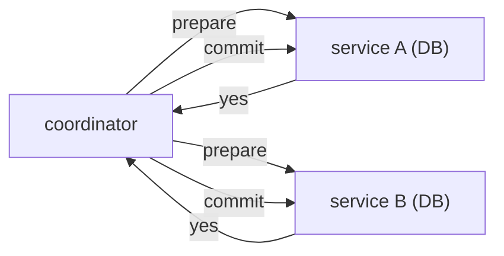

# 분산 트랜잭션

이 글은 Distributed Systems 101 시리즈의 아홉 번째 글입니다.

## 이 글에서 다룰 문제

- 단일 노드 트랜잭션과 분산 트랜잭션은 무엇이 다를까요?
- 2-phase commit은 어떻게 동작하고 어디서 약할까요?
- Saga의 핵심인 보상 트랜잭션은 무엇일까요?
- 왜 멱등성이 분산 트랜잭션의 바닥을 이루는 걸까요?
- 실제 시스템에서 outbox 패턴을 왜 그렇게 자주 볼까요?

> 분산 트랜잭션은 ACID를 흉내 내는 작업이 아니라, 결국 같은 결론에 수렴하도록 시스템을 설계하는 작업입니다.

## 왜 중요한가

마이크로서비스와 다중 저장소 구조가 늘수록 두 시스템을 하나의 비즈니스 흐름으로 묶어야 하는 장면이 많아집니다. 하지만 단일 데이터베이스에서 비교적 싸게 얻을 수 있는 ACID는 여러 노드를 넘는 순간 훨씬 비싸지거나, 아예 성립하기 어려워집니다. 분산 트랜잭션은 결국 명시적인 트레이드오프 위에서 하는 설계입니다.

> 분산 트랜잭션은 ACID의 모방이 아니라 복구 가능한 비일관성의 설계입니다.

## 한눈에 보는 개념



coordinator가 두 참가자에게 prepare를 보내고, 둘 다 yes를 보냈을 때만 commit합니다. 이것이 2PC의 핵심입니다.

## 핵심 용어

- **2PC**: prepare와 commit 두 단계로 모든 참여자의 동의를 모으는 프로토콜입니다.
- **Saga**: 여러 로컬 트랜잭션을 보상 작업으로 되돌리는 패턴입니다.
- **Compensation**: 이미 커밋된 작업을 비즈니스 의미상 되돌리는 동작입니다.
- **Outbox**: 데이터베이스 쓰기와 메시지 발행을 같은 트랜잭션 안에 묶기 위한 테이블 패턴입니다.
- **Idempotency**: 같은 요청을 여러 번 실행해도 결과가 한 번 실행한 것과 같게 유지되는 성질입니다.

## Before / After

**Before — 서비스 간 직접 호출**

```text
service A succeeds / service B fails -> data inconsistency
```

**After — Saga와 보상**

```text
service A succeeds / service B fails -> compensate A -> consistent end state
```

분산 시스템에서 롤백은 시간을 되돌리는 일이 아니라, 새로운 사건을 추가해 상태를 되돌리는 일에 가깝습니다.

## 실습: 분산 트랜잭션 패턴

### 1단계 — 단일 DB 트랜잭션

```python
# 1_single.py
import sqlite3
db = sqlite3.connect(":memory:")
db.execute("CREATE TABLE acct(id TEXT, bal INT)")
db.execute("INSERT INTO acct VALUES ('A', 100), ('B', 0)")
with db:
    db.execute("UPDATE acct SET bal=bal-30 WHERE id='A'")
    db.execute("UPDATE acct SET bal=bal+30 WHERE id='B'")
```

하나의 데이터베이스 안에서는 ACID만으로 충분합니다. 어려움은 그다음 단계부터 시작됩니다.

### 2단계 — 2PC(의사코드)

```python
# 2_2pc.py
def prepare(svc): return svc.prepare()    # yes/no
def commit(svc):  svc.commit()
def abort(svc):   svc.abort()
def two_pc(svcs):
    if all(prepare(s) for s in svcs):
        for s in svcs: commit(s)
    else:
        for s in svcs: abort(s)
```

모든 참여자가 yes라고 답했을 때만 commit합니다. coordinator가 중간에 죽으면 참가자들이 오래 잠길 수 있으므로 타임아웃과 복구 설계가 필수입니다.

### 3단계 — Saga(보상)

```python
# 3_saga.py
def book_flight():  return "F1"
def book_hotel():   raise RuntimeError("no room")
def cancel_flight(f): print(f"cancel {f}")

def saga():
    f = book_flight()
    try:
        h = book_hotel()
    except Exception:
        cancel_flight(f)
        raise
saga()
```

각 단계는 로컬에서 커밋되고, 중간에 실패하면 앞에서 성공한 단계를 의미상 되돌립니다.

### 4단계 — outbox 패턴

```python
# 4_outbox.py (pseudocode)
# Inside one transaction:
#   INSERT INTO orders ...
#   INSERT INTO outbox(event=...) VALUES (...)
# A separate worker reads outbox and publishes to the message broker.
```

데이터베이스 쓰기와 메시지 발행을 하나의 데이터베이스 트랜잭션으로 묶어 dual-write 문제를 피합니다.

### 5단계 — 멱등적 소비자

```python
# 5_idem.py
processed = set()
def apply(event):
    if event["id"] in processed: return
    processed.add(event["id"])
    # actual processing
```

분산 트랜잭션의 마지막 안전망입니다. 같은 메시지가 다시 와도 결과는 한 번만 반영됩니다.

## 이 코드에서 먼저 봐야 할 점

- 2PC는 강하지만 lock이 길고 coordinator 장애에 취약합니다.
- Saga는 장애가 흔한 현실에 잘 맞지만, 보상의 의미는 도메인이 직접 정의해야 합니다.
- outbox는 두 시스템 동시 쓰기를 한 번의 DB 쓰기로 바꾸는 우회로입니다.
- 멱등성은 거의 모든 패턴 밑바닥에 깔린 공통 기반입니다.

## 자주 하는 실수 5가지

1. **마이크로서비스에서 2PC를 기본값처럼 씁니다.** 가용성과 성능이 크게 떨어집니다.
2. **보상 설계 없이 Saga를 시작합니다.** 부분 실패가 영구 불일치가 됩니다.
3. **DB 쓰기와 메시지 발행을 dual-write로 분리합니다.** 둘이 함께 성공함을 보장할 수 없습니다.
4. **2PC 타임아웃을 너무 짧게 둡니다.** false abort가 자주 발생합니다.
5. **멱등성을 빠뜨립니다.** 재시도 한 번이 중복 결제나 중복 차감으로 이어집니다.

## 실무에서는 이렇게 드러납니다

XA와 2PC는 여전히 일부 RDBMS 클러스터와 브로커에서 쓰입니다. 그러나 마이크로서비스의 결제, 예약, 주문 흐름에서는 Saga가 사실상 표준 패턴에 가깝습니다. Kafka와 데이터베이스를 함께 쓰는 환경에서는 outbox가 가장 흔한 현실적 해법입니다. Spanner나 CockroachDB 같은 글로벌 데이터베이스는 내부적으로 합의와 2PC를 결합해 사용자에게는 ACID처럼 보이게 만듭니다.

## 시니어 엔지니어는 이렇게 생각합니다

- 이 흐름이 정말 원자적이어야 하는지부터 먼저 묻습니다.
- 가능하면 단일 DB 트랜잭션 안에 묶고, 외부 통지는 outbox로 분리합니다.
- Saga 보상이 실제 비즈니스 의미에서 가능한지 도메인 전문가와 확인합니다.
- 모든 실패 분기에는 운영 복구 절차나 자동화 스크립트를 붙입니다.
- 외부 호출에는 멱등성 키를 표준 장치로 둡니다.

## 체크리스트

- [ ] 2PC와 Saga의 차이를 한 줄로 설명할 수 있는가?
- [ ] outbox 패턴이 해결하는 문제가 무엇인지 말할 수 있는가?
- [ ] 보상 트랜잭션의 한계를 하나 설명할 수 있는가?
- [ ] 멱등성 키가 어디에 놓이는지 머릿속 그림이 있는가?
- [ ] 결제 흐름에서 어떤 패턴을 택할지 근거를 댈 수 있는가?

## 연습 문제

1. 항공권과 호텔 예약 흐름을 Saga로 설계하고 보상 단계를 적어 보세요.
2. dual-write와 outbox의 차이를 한 단락으로 설명해 보세요.
3. 멱등성 키 없이 결제를 재시도했을 때 왜 위험한지 시나리오를 만들어 보세요.

## 정리와 다음 글

분산 트랜잭션은 ACID를 그대로 복제하는 일이 아니라 결국 합의된 상태로 수렴하도록 설계하는 일입니다. 다음 마지막 글에서는 지금까지의 도구를 묶어 운영 가능한 분산 시스템 패턴으로 정리합니다.

<!-- toc:begin -->
- [분산 시스템이란 무엇인가?](./01-what-is-a-distributed-system.md)
- [failure model](./02-failure-model.md)
- [RPC와 message passing](./03-rpc-and-message-passing.md)
- [consistency와 CAP](./04-consistency-and-cap.md)
- [replication](./05-replication.md)
- [consensus와 Raft](./06-consensus-and-raft.md)
- [leader election](./07-leader-election.md)
- [message queue와 event sourcing](./08-message-queue-and-event-sourcing.md)
- **distributed transaction (현재 글)**
- 운영 가능한 분산 시스템 패턴 (예정)
<!-- toc:end -->

## 참고 자료

- [Two-phase commit — Wikipedia](https://en.wikipedia.org/wiki/Two-phase_commit_protocol)
- [Saga pattern — microservices.io](https://microservices.io/patterns/data/saga.html)
- [Transactional Outbox — microservices.io](https://microservices.io/patterns/data/transactional-outbox.html)
- [Designing Data-Intensive Applications — chapter 9](https://dataintensive.net/)

Tags: Computer Science, Distributed Systems, Transactions, TwoPhaseCommit, Saga, Idempotency
