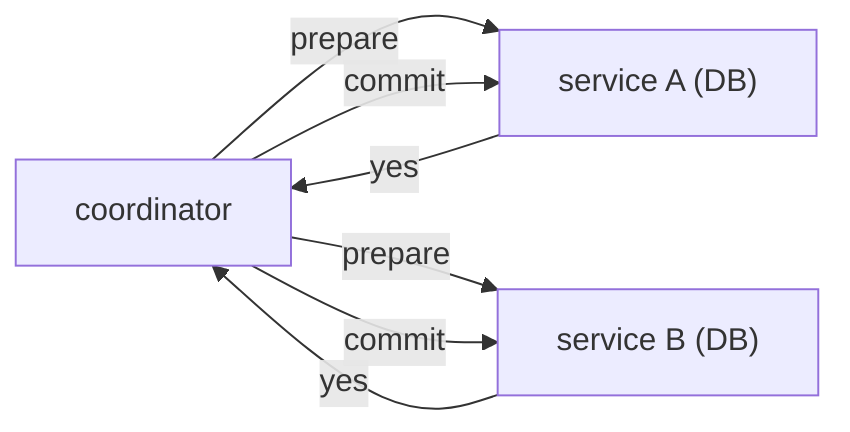

# distributed transaction

> Distributed Systems 101 시리즈 (9/10)


## 이 글에서 다룰 문제

마이크로서비스 / 다중 데이터 저장소가 늘면서 "한 트랜잭션 안에 두 시스템"이 자주 등장합니다. 단일 DB의 ACID는 여러 노드에서 더 비싸거나 불가능에 가깝습니다. 분산 트랜잭션은 트레이드오프를 의식한 설계가 본질입니다.

> 분산 트랜잭션은 ACID 모방이 아니라 "복구 가능한 비일관성"의 설계입니다.

## 전체 흐름


coordinator가 두 서비스에 prepare를 보내고, 모두 yes일 때만 commit을 보냅니다. 이것이 2PC.

## Before/After

**Before — 두 서비스 직접 호출**

```text
서비스 A 성공 / 서비스 B 실패 -> 데이터 불일치
```

**After — Saga + 보상**

```text
서비스 A 성공 / 서비스 B 실패 -> A의 보상 호출 -> 일관된 종착점
```

분산 시스템에서 "롤백"은 시간을 거슬러 가는 것이 아니라 새로운 사건을 추가하는 것입니다.

## 분산 트랜잭션 패턴

### 1단계 — 단일 DB 트랜잭션

```python
# 1_single.py
import sqlite3
db = sqlite3.connect(":memory:")
db.execute("CREATE TABLE acct(id TEXT, bal INT)")
db.execute("INSERT INTO acct VALUES ('A', 100), ('B', 0)")
with db:
    db.execute("UPDATE acct SET bal=bal-30 WHERE id='A'")
    db.execute("UPDATE acct SET bal=bal+30 WHERE id='B'")
```

같은 DB라면 ACID로 충분합니다. 다음 단계부터가 진짜 어려움.

### 2단계 — 2PC (의사코드)

```python
# 2_2pc.py
def prepare(svc): return svc.prepare()    # yes/no
def commit(svc):  svc.commit()
def abort(svc):   svc.abort()
def two_pc(svcs):
    if all(prepare(s) for s in svcs):
        for s in svcs: commit(s)
    else:
        for s in svcs: abort(s)
```

prepare에서 모두 yes여야 commit. coordinator가 죽으면 참가자가 무한 lock에 걸릴 수 있어 timeout이 필요합니다.

### 3단계 — Saga (보상 트랜잭션)

```python
# 3_saga.py
def book_flight():  return "F1"
def book_hotel():   raise RuntimeError("no room")
def cancel_flight(f): print(f"cancel {f}")

def saga():
    f = book_flight()
    try:
        h = book_hotel()
    except Exception:
        cancel_flight(f)
        raise
saga()
```

각 단계는 local commit. 실패 시 이미 한 일을 의미상 되돌립니다.

### 4단계 — outbox 패턴

```python
# 4_outbox.py (의사코드)
# 한 트랜잭션 안에서:
#   INSERT INTO orders ...
#   INSERT INTO outbox(event=...) VALUES (...)
# 별도 worker가 outbox를 읽어 message broker에 발행
```

DB 쓰기와 메시지 발행을 같은 트랜잭션에 묶어 dual-write 문제를 피합니다.

### 5단계 — idempotent consumer

```python
# 5_idem.py
processed = set()
def apply(event):
    if event["id"] in processed: return
    processed.add(event["id"])
    # 실제 처리
```

분산 트랜잭션의 마지막 안전망. 같은 메시지가 두 번 와도 결과는 한 번.

## 이 코드에서 주목할 점

- 2PC는 강하지만 lock 시간이 길고 coordinator failure에 약합니다.
- Saga는 실패가 흔한 환경에 더 적합 — 보상의 의미를 도메인이 정합니다.
- outbox는 "두 시스템에 동시에 쓰기"를 한 번의 DB 쓰기로 바꿉니다.
- idempotency는 모든 패턴의 공통 기반입니다.

## 자주 하는 실수 5가지

1. **2PC를 마이크로서비스 기본으로 쓴다.** 가용성과 성능이 크게 떨어집니다.
2. **Saga를 보상 없이 시작한다.** 부분 실패가 영구 불일치를 만듭니다.
3. **dual-write로 메시지 발행과 DB 쓰기를 분리한다.** 두 쪽이 동시에 성공함을 보장 못 합니다.
4. **timeout을 짧게 둔 2PC.** false abort가 잦아져 비즈니스 손실.
5. **idempotency를 잊는다.** 재시도 한 번이 잔액을 두 번 줄입니다.

## 실무에서는 이렇게 쓰입니다

XA/2PC는 RDBMS 클러스터, 일부 message broker에서 여전히 쓰입니다. Saga는 마이크로서비스 결제·예약 도메인에서 표준적인 패턴. outbox는 Kafka + DB 조합에서 가장 흔한 분산 트랜잭션 회피책입니다. 글로벌 cloud DB(Spanner, CockroachDB)는 내부에서 consensus + 2PC를 결합해 사용자에게 ACID처럼 보이게 합니다.

## 체크리스트

- [ ] 2PC와 Saga의 차이를 한 줄로 말할 수 있는가?
- [ ] outbox 패턴이 풀어 주는 문제를 답할 수 있는가?
- [ ] 보상 트랜잭션의 한계를 한 가지 떠올릴 수 있는가?
- [ ] idempotency key를 어디에 두는지 머릿속에 그려지는가?
- [ ] 결제 흐름에서 어떤 패턴을 고를지 근거 있게 답할 수 있는가?

## 정리 및 다음 단계

분산 트랜잭션은 ACID 모방이 아니라 "결국 합의되는 상태"의 설계입니다. 다음 마지막 글에서는 지금까지의 모든 도구를 묶어 — 운영 가능한 분산 시스템 패턴 — 으로 정리합니다.

<!-- toc:begin -->
- [분산 시스템이란 무엇인가?](./01-what-is-a-distributed-system.md)
- [failure model](./02-failure-model.md)
- [RPC와 message passing](./03-rpc-and-message-passing.md)
- [consistency와 CAP](./04-consistency-and-cap.md)
- [replication](./05-replication.md)
- [consensus와 Raft](./06-consensus-and-raft.md)
- [leader election](./07-leader-election.md)
- [message queue와 event sourcing](./08-message-queue-and-event-sourcing.md)
- **distributed transaction (현재 글)**
- 운영 가능한 분산 시스템 패턴 (예정)
<!-- toc:end -->

## 참고 자료

- [Two-phase commit (Wikipedia)](https://en.wikipedia.org/wiki/Two-phase_commit_protocol)
- [Saga pattern — microservices.io](https://microservices.io/patterns/data/saga.html)
- [Transactional Outbox — microservices.io](https://microservices.io/patterns/data/transactional-outbox.html)
- [Designing Data-Intensive Applications — chapter 9](https://dataintensive.net/)

Tags: Computer Science, Distributed Systems, Transactions, TwoPhaseCommit, Saga, Idempotency
