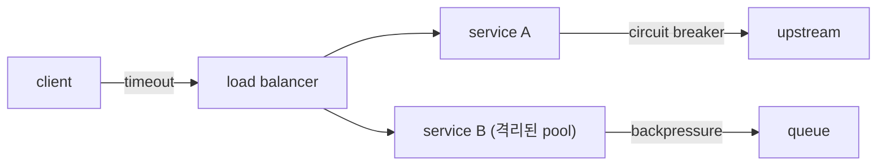

# 운영 가능한 분산 시스템 패턴

> Distributed Systems 101 시리즈 (10/10)

<!-- a-grade-intro:begin -->

**핵심 질문**: 시스템을 죽지 않게 만들 수 없다면, 어떻게 죽음을 견디게 만들 수 있을까요?

> 운영 가능한 분산 시스템은 실패가 없는 시스템이 아니라, 실패가 일부에 머물고 빠르게 복구되는 시스템입니다.

<!-- a-grade-intro:end -->

## 이 글에서 배울 것

- bulkhead(격벽)로 실패를 격리하는 방법
- circuit breaker로 연쇄 장애를 끊는 방법
- backpressure로 부하를 안전하게 거절하는 방법
- timeout / retry / jitter의 올바른 조합
- 관측성(metric, log, trace)이 운영의 일부인 이유

## 왜 중요한가

지금까지 다룬 도구들 — replication, consensus, queue, transaction — 은 시스템을 만드는 재료였습니다. 운영 패턴은 그 재료를 "장애가 흔한 현실"에서도 유지하게 하는 운영자의 도구함입니다.

> 좋은 운영 패턴은 "예상한 실패"를 평범한 일로 만듭니다.

## 개념 한눈에 보기



호출 경로마다 timeout, breaker, bulkhead, backpressure를 조합해 한 곳의 실패가 전체로 번지지 않게 합니다.

## 핵심 용어 정리

- **Bulkhead**: 자원(스레드, 커넥션 풀)을 분리해 한 곳의 폭발이 옆으로 번지지 않게 하는 격벽.
- **Circuit breaker**: 연속 실패를 감지하면 잠시 호출 자체를 차단하는 회로.
- **Backpressure**: 처리 한계를 넘는 요청을 큐 길이/거절로 알리는 메커니즘.
- **Jitter**: 재시도 간격에 무작위성을 더해 thundering herd를 막는 기법.
- **Observability**: 시스템 내부를 외부에서 추론할 수 있게 하는 신호의 합 (metric, log, trace).

## Before/After

**Before — 무한 retry, 공유 pool**

```text
한 upstream이 느려짐 -> 모든 호출이 retry 폭주 -> 전체 마비
```

**After — breaker + bulkhead + backpressure**

```text
한 upstream이 느려짐 -> breaker open -> 일부만 거절 -> 다른 경로 정상
```

운영 패턴은 "한 곳의 죽음이 다음 곳으로 번지지 않는다"의 약속입니다.

## 실습: 운영 패턴 짧은 코드

### 1단계 — timeout

```python
# 1_timeout.py
import requests
def call():
    return requests.get("https://api.example.com/x", timeout=2.0)
```

timeout 없는 호출은 운영 사고의 가장 흔한 원인입니다.

### 2단계 — exponential backoff + jitter

```python
# 2_backoff.py
import time, random
def with_retry(fn, retries=4):
    for i in range(retries):
        try: return fn()
        except Exception:
            time.sleep(min(2**i, 10) + random.random())
    raise
```

jitter가 없으면 모든 클라이언트가 같은 시점에 재시도해 upstream을 두 번 죽입니다.

### 3단계 — circuit breaker (간단)

```python
# 3_breaker.py
import time
class Breaker:
    def __init__(self, threshold=5, cool=10):
        self.fails = 0; self.until = 0
        self.threshold, self.cool = threshold, cool
    def call(self, fn):
        if time.time() < self.until:
            raise RuntimeError("breaker open")
        try:
            r = fn(); self.fails = 0; return r
        except Exception:
            self.fails += 1
            if self.fails >= self.threshold:
                self.until = time.time() + self.cool
            raise
```

연속 실패가 threshold를 넘으면 cool down 동안 호출 자체를 거부합니다.

### 4단계 — bulkhead (커넥션 풀 분리)

```python
# 4_bulkhead.py (의사코드)
pool_payment = ConnectionPool(size=10)
pool_search  = ConnectionPool(size=10)
# payment가 폭주해도 search 풀은 영향 없음
```

같은 프로세스 안에서도 자원 풀을 나누는 것만으로 격리가 생깁니다.

### 5단계 — backpressure

```python
# 5_backpressure.py
from collections import deque
q, MAX = deque(), 100
def enqueue(msg):
    if len(q) >= MAX:
        return "rejected"   # 거절이 침묵보다 안전
    q.append(msg); return "ok"
```

큐가 가득 차면 거절합니다. 침묵하는 시스템보다 빠르게 거절하는 시스템이 안전합니다.

## 이 코드에서 주목할 점

- timeout < retry budget < 사용자 응답 시간 — 이 부등식이 깨지면 운영이 무너집니다.
- breaker는 회복도 자동이어야 합니다 (half-open).
- bulkhead는 코드가 아니라 자원의 경계입니다.
- backpressure는 "친절한 거절"입니다 — 실패를 빨리 알립니다.

## 자주 하는 실수 5가지

1. **timeout 없는 외부 호출.** 한 upstream이 느려지면 전체가 멈춥니다.
2. **jitter 없는 retry.** thundering herd로 upstream을 두 번 죽입니다.
3. **breaker 없는 무한 retry.** 사용자 대기 시간만 늘어납니다.
4. **공유 pool 하나로 모든 의존성 처리.** 한 곳의 폭주가 모두에게 번집니다.
5. **관측성 없이 패턴만 도입.** 효과를 측정 못 하면 다음 사고를 막을 수 없습니다.

## 실무에서는 이렇게 쓰입니다

Netflix Hystrix(과거), resilience4j, Envoy/Istio의 retry/circuit breaker, AWS App Mesh, Kubernetes의 HPA + PDB, 큐 기반 백프레셔(SQS, Kafka의 lag) 등에서 같은 패턴이 반복됩니다. SRE 조직은 이 패턴들을 SLO와 묶어 자동화 알람으로 바꿉니다.

## 시니어 엔지니어는 이렇게 생각합니다

- 모든 외부 호출에는 timeout과 retry budget을 명시합니다.
- breaker / bulkhead의 임계값을 부하 테스트 결과로 정합니다.
- 관측성(metric, log, trace) 없이는 패턴을 추가하지 않습니다.
- chaos test로 평소에 실패를 흉내내 둡니다.
- 사용자 대기 시간을 SLI로 두고 SLO 위반 시 자동 페이지를 보냅니다.

## 체크리스트

- [ ] 모든 외부 호출에 timeout이 명시되어 있는가?
- [ ] retry에 jitter가 있는가?
- [ ] 핵심 의존성에 breaker가 걸려 있는가?
- [ ] 자원 풀이 도메인별로 분리되어 있는가?
- [ ] metric / log / trace가 한 trace ID로 묶이는가?

## 연습 문제

1. timeout, retry, breaker가 함께 동작하는 한 호출의 의사코드를 적어 보세요.
2. backpressure를 도입할지 판단하는 기준 두 가지를 적어 보세요.
3. 평소에 chaos test로 검증할 시나리오 세 가지를 골라 보세요.

## 정리 및 다음 단계

분산 시스템의 모든 도구는 결국 운영 가능성으로 수렴합니다. 시리즈 전체를 한 줄로 묶으면 — "실패는 흔하고, 좋은 시스템은 실패를 평범하게 다룬다"입니다. 다음 학습으로는 secure-by-design, observability, SRE 시리즈를 권합니다.

<!-- toc:begin -->
- [분산 시스템이란 무엇인가?](./01-what-is-a-distributed-system.md)
- [failure model](./02-failure-model.md)
- [RPC와 message passing](./03-rpc-and-message-passing.md)
- [consistency와 CAP](./04-consistency-and-cap.md)
- [replication](./05-replication.md)
- [consensus와 Raft](./06-consensus-and-raft.md)
- [leader election](./07-leader-election.md)
- [message queue와 event sourcing](./08-message-queue-and-event-sourcing.md)
- [distributed transaction](./09-distributed-transaction.md)
- **운영 가능한 분산 시스템 패턴 (현재 글)**
<!-- toc:end -->

## 참고 자료

- [Release It! — Michael Nygard](https://pragprog.com/titles/mnee2/release-it-second-edition/)
- [Circuit Breaker — Martin Fowler](https://martinfowler.com/bliki/CircuitBreaker.html)
- [Google SRE Book](https://sre.google/sre-book/table-of-contents/)
- [AWS Well-Architected — Reliability Pillar](https://docs.aws.amazon.com/wellarchitected/latest/reliability-pillar/welcome.html)

Tags: Computer Science, Distributed Systems, Resilience, CircuitBreaker, Backpressure, Observability
