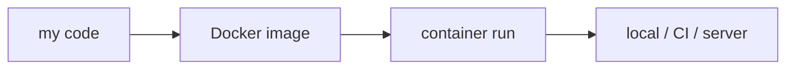

# What Is Docker?

> Docker 101 series (1/10)

<!-- a-grade-intro:begin -->

**Core question**: What does Docker do to *eliminate* "*it works on my machine*"?

> *Docker bundles your *application + dependencies + runtime* into *one unit* so it runs *the same everywhere*.*

<!-- a-grade-intro:end -->

## What You Will Learn

- The difference between *containers* and *virtual machines*
- The *environment-drift* problem Docker solves
- The big picture of *image / container / registry*
- Run your first container
- Five common pitfalls

## Why It Matters

*Environment differences* are the most demoralizing thing for newcomers. *One Docker line* gives the *whole team the same environment*, cutting half of the debugging time.

> *Environment problems are not a *skill issue*; they are a *design issue*.*

## Concept at a Glance



## Key Terms

- **Image**: an *executable package* (code + libraries + OS layers).
- **Container**: a *running instance* of an image.
- **Registry**: an image storage backend (Docker Hub, GHCR).
- **Daemon**: the background process that *creates and manages* containers.
- **Layer**: the *unit of change* inside an image.

## Before/After

**Before**: "It runs on my laptop." New-hire setup takes *half a day*.

**After**: `docker run myapp`. *Same environment in five minutes*.

## Hands-on: Your First Container in 5 Steps

### Step 1 — Verify install

```bash
docker --version
# Docker version 25.x.x
docker run hello-world
```

### Step 2 — Run an official image

```bash
docker run -it --rm python:3.12-slim python -c "print('hi')"
```

### Step 3 — Run in the background

```bash
docker run -d --name web -p 8080:80 nginx
curl http://localhost:8080
```

### Step 4 — Inspect

```bash
docker ps              # running
docker logs web        # logs
docker stop web && docker rm web
```

### Step 5 — Search and pull images

```bash
docker pull redis:7-alpine
docker images
```

## What to Notice in This Code

- An *image* is a *snapshot just before run*; a *container* is a *live process*.
- *`-p 8080:80`* maps *host:container* ports.
- *`--rm`* cleans up after exit.

## Five Common Mistakes

1. **Treating Docker like a VM.** Containers *share the host kernel*.
2. **Using the `latest` tag in *production*.** It will *break silently* one day.
3. **Letting containers pile up without `docker rm`.** Your disk *fills up*.
4. **Forgetting `-p` and being puzzled it is "down".** Port mapping is required.
5. **Running as root, then promoting to *production*.** A security incident waiting to happen.

## How This Shows Up in Production

Most organizations operate on the assumption that *a service equals a container*. Local dev, CI, staging, and production all run the *same image*.

## How a Senior Engineer Thinks

- *Environments are code*, not wiki pages.
- *Images are *immutable*; containers are *disposable*.
- *latest* is for demos; production uses *pinned tags*.
- *A container is a process*; mind PID 1.
- *Sharing the host kernel* is where security starts.

## Checklist

- [ ] `docker run hello-world` works.
- [ ] You can explain *image* vs *container*.
- [ ] You understand *port mapping*.
- [ ] You can *clean up* containers.

## Practice Problems

1. Run `nginx` and access it on *host port 8080*.
2. Open an *interactive shell* with `python:3.12-slim`.
3. Inspect a running container's *logs* and *status*.

## Wrap-up and Next Steps

Docker is the fastest way to kill *environment drift*. Next we look deeper into *images and containers*.

<!-- toc:begin -->
- **What Is Docker? (current)**
- Images and Containers (upcoming)
- Writing a Dockerfile (upcoming)
- Volumes and Networks (upcoming)
- Docker Compose (upcoming)
- Environment Variables and Configuration (upcoming)
- Containerizing a Python App (upcoming)
- Running with a Database (upcoming)
- Image Optimization (upcoming)
- Production-Ready Docker (upcoming)
<!-- toc:end -->

## References

- [Docker overview](https://docs.docker.com/get-started/overview/)
- [Get Docker](https://docs.docker.com/get-docker/)
- [Docker Hub](https://hub.docker.com/)
- [What is a container?](https://www.docker.com/resources/what-container/)

Tags: Docker, Container, DevOps, Linux, Virtualization
