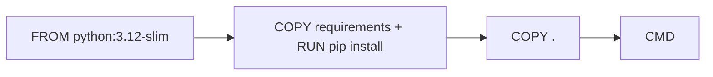

# Writing a Dockerfile

This is post 3 in the Docker 101 series.

> Docker 101 series (3/10)

<!-- a-grade-intro:begin -->

**Core question**: To make images *reproducible*, *which commands* go in *what order*?

> *A Dockerfile is both a *build recipe* and *documentation*. The *order of instructions* drives both *cache efficiency* and *debugging difficulty*.*

<!-- a-grade-intro:end -->

## What You Will Learn

- What *FROM / RUN / COPY / CMD* mean
- An *ordering strategy* for the *layer cache*
- The importance of *.dockerignore*
- Running as a *non-root user*
- Five common pitfalls

## Why It Matters

*One ordering choice* turns a build from *5 minutes into 30 seconds*. A good Dockerfile *visibly* changes team productivity.

> *Slow builds are a *quiet cost*. At 50 builds a day, you lose *hundreds of hours per year*.*

## Concept at a Glance



## Key Terms

- **FROM**: pick a *base image*.
- **RUN**: execute a *command at build time*.
- **COPY**: copy files in.
- **CMD**: the *default command* when a container starts.
- **ENTRYPOINT**: a *fixed entry point* always invoked.

## Before/After

**Before**: `COPY .` sits at the top, so *one code change* triggers a *full rebuild*.

**After**: *low-change steps* up top, *high-change steps* below. *Cache hit rate above 90%*.

## Hands-on: Dockerfile in 5 Steps

### Step 1 — Minimal Dockerfile

```dockerfile
FROM python:3.12-slim
WORKDIR /app
COPY . .
RUN pip install -r requirements.txt
CMD ["python", "app.py"]
```

### Step 2 — Optimize layer order

```dockerfile
FROM python:3.12-slim
WORKDIR /app

# 1) low change frequency
COPY requirements.txt .
RUN pip install --no-cache-dir -r requirements.txt

# 2) high change frequency
COPY . .

CMD ["python", "app.py"]
```

### Step 3 — `.dockerignore`

```text
__pycache__/
.venv/
.git/
*.log
.env
node_modules/
```

### Step 4 — Non-root user

```dockerfile
RUN useradd -m -u 1000 appuser
USER appuser
```

### Step 5 — Build and run

```bash
docker build -t myapp:1.0 .
docker run --rm myapp:1.0
docker history myapp:1.0
```

## What to Notice in This Code

- *Requirements copied first* -> the *deps layer caches*.
- Without `.dockerignore`, *.git* is copied wholesale.
- Skipping `USER` means *running as root*.

## Five Common Mistakes

1. **`COPY .` at the *top*.** Every change triggers a *full rebuild*.
2. **Splitting `apt update` and `install` across *separate RUN*s.** Caches give you *stale packages*.
3. **Forgetting to *clear caches* after `pip install`.** Image *doubles in size*.
4. **No `.dockerignore`.** `.git` and `.env` end up *inside the image*.
5. **Running as *root*.** A security incident waiting to happen.

## How This Shows Up in Production

Mature teams use *multi-stage builds* and *BuildKit cache mounts* to cut build times to *one tenth* (covered in episode 9).

## How a Senior Engineer Thinks

- *Dockerfiles are also documentation*.
- *Low to high change frequency, top to bottom*.
- *.dockerignore is also a security control*.
- *Be deliberate* about CMD vs ENTRYPOINT.
- *Non-root* is the *default*.

## Checklist

- [ ] *Layer order* follows *change frequency*.
- [ ] A `.dockerignore` exists.
- [ ] Container runs as *non-root*.
- [ ] *Deps and code* are in separate steps.

## Practice Problems

1. Edit only code (not requirements) and confirm a *cache hit*.
2. Add a `.dockerignore` to shrink your image.
3. Build a Dockerfile that runs as a *non-root user*.

## Wrap-up and Next Steps

A good Dockerfile *saves your team time every day*. Next, *volumes and networks* for data and communication.

<!-- toc:begin -->
- [What Is Docker?](./01-what-is-docker.md)
- [Images and Containers](./02-image-and-container.md)
- **Writing a Dockerfile (current)**
- Volumes and Networks (upcoming)
- Docker Compose (upcoming)
- Environment Variables and Configuration (upcoming)
- Containerizing a Python App (upcoming)
- Running with a Database (upcoming)
- Image Optimization (upcoming)
- Production-Ready Docker (upcoming)
<!-- toc:end -->

## References

- [Dockerfile reference](https://docs.docker.com/engine/reference/builder/)
- [Best practices for writing Dockerfiles](https://docs.docker.com/develop/develop-images/dockerfile_best-practices/)
- [Use a .dockerignore file](https://docs.docker.com/engine/reference/builder/#dockerignore-file)
- [BuildKit](https://docs.docker.com/build/buildkit/)

Tags: Docker, Dockerfile, Build, Layer, Cache
