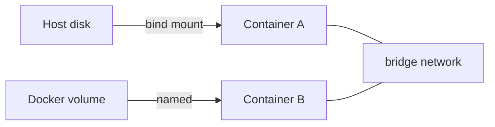

# Volumes and Networks

This is post 4 in the Docker 101 series.

> Docker 101 series (4/10)

<!-- a-grade-intro:begin -->

**Core question**: How do you keep *data alive across restarts* and let containers *talk to each other*?

> *Volumes decide *data lifetime*; networks decide *paths between containers*.*

<!-- a-grade-intro:end -->

## What You Will Learn

- The difference between *volume / bind mount / tmpfs*
- *Bridge / host / none* network modes
- Communicating *by container name*
- A *backup pattern* for volumes
- Five common pitfalls

## Why It Matters

*Data loss* and *broken communication* are the *most common incidents* in container ops. The right *volume/network model* prevents both.

> *The moment *state leaks* into a stateless container, an incident begins.*

## Concept at a Glance



## Key Terms

- **Volume**: a *persistent store* managed by Docker.
- **Bind mount**: a *host path* mounted directly.
- **tmpfs**: memory-backed *ephemeral* storage.
- **Bridge network**: the default *virtual network* on one host.
- **Service discovery**: *DNS resolution* by container name.

## Before/After

**Before**: DB data *disappears* on restart. Containers cannot reach each other on `localhost`.

**After**: *named volumes* persist data. *User-defined bridges* let containers talk *by name*.

## Hands-on: Volumes and Networks in 5 Steps

### Step 1 — Named volume

```bash
docker volume create app-data
docker run -d --name api -v app-data:/var/lib/data myapp
docker volume inspect app-data
```

### Step 2 — Bind mount (for dev)

```bash
docker run --rm -v "$PWD":/app -w /app python:3.12-slim python app.py
```

### Step 3 — User-defined bridge

```bash
docker network create app-net
docker run -d --network app-net --name db postgres:16
docker run -d --network app-net --name api -e DB_HOST=db myapp
# api can reach the host 'db'
```

### Step 4 — Verify communication

```bash
docker exec api ping -c 1 db
docker exec api curl http://db:5432
```

### Step 5 — Back up a volume

```bash
docker run --rm \
  -v app-data:/data \
  -v "$PWD":/backup \
  alpine tar czf /backup/data.tgz -C /data .
```

## What to Notice in This Code

- A *named volume* lives *independent of containers*.
- *User-defined bridges* provide *DNS* automatically.
- *Bind mounts* often have *permission issues*.

## Five Common Mistakes

1. **Saving directly to *paths inside* the container.** Lost on restart.
2. **Using the *default bridge*.** *No name resolution*.
3. **Bind mount owned by *root only*.** Cannot edit from the host.
4. **Volumes that are *never backed up*.** Unrecoverable on incident.
5. **Abusing `--network host`.** Security and port-conflict risks.

## How This Shows Up in Production

Orchestrators (e.g., Kubernetes) extend the same ideas with *PersistentVolume* and *Service DNS*. Learning them here makes the transition natural.

## How a Senior Engineer Thinks

- *State is a volume; communication is a network*.
- *User-defined bridges* are the *default*.
- *A volume without a backup is one incident away*.
- *Bind mounts* are for dev; production uses *named volumes*.
- *Expose ports minimally*.

## Checklist

- [ ] Data persists in a *named volume*.
- [ ] Containers run on a *user-defined bridge*.
- [ ] They communicate *by name*.
- [ ] A *backup procedure* exists.

## Practice Problems

1. Persist PostgreSQL data with a *named volume*.
2. Make two containers talk by *name* on a *user-defined bridge*.
3. Back up a volume's contents with *tar*.

## Wrap-up and Next Steps

Data and networking are the *pillars* of container ops. Next, *Docker Compose* runs many containers *at once*.

<!-- toc:begin -->
- [What Is Docker?](./01-what-is-docker.md)
- [Images and Containers](./02-image-and-container.md)
- [Writing a Dockerfile](./03-dockerfile.md)
- **Volumes and Networks (current)**
- Docker Compose (upcoming)
- Environment Variables and Configuration (upcoming)
- Containerizing a Python App (upcoming)
- Running with a Database (upcoming)
- Image Optimization (upcoming)
- Production-Ready Docker (upcoming)
<!-- toc:end -->

## References

- [Volumes](https://docs.docker.com/storage/volumes/)
- [Bind mounts](https://docs.docker.com/storage/bind-mounts/)
- [Networking overview](https://docs.docker.com/network/)
- [Use bridge networks](https://docs.docker.com/network/bridge/)

Tags: Docker, Volume, Network, BindMount, Bridge
