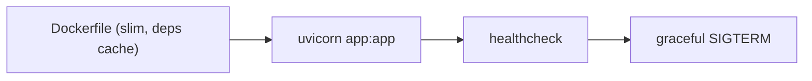

# Containerizing a Python App

> Docker 101 series (7/10)

<!-- a-grade-intro:begin -->

**Core question**: What do you actually have to handle to containerize a *FastAPI app* at *production grade*?

> *Python containerization becomes *real* the moment you handle *PID 1, signals, healthcheck, and non-root*.*

<!-- a-grade-intro:end -->

## What You Will Learn

- Containerizing *FastAPI + uvicorn*
- *Signal handling at PID 1* (SIGTERM)
- Adding a *healthcheck*
- *Non-root user* and permissions
- Five common pitfalls

## Why It Matters

*Python in a container* often *fails to receive SIGTERM*, breaking *graceful shutdown*. This is a common cause of *deploy incidents*.

> *PID 1 in a container needs to be a *small init* or a process with *correct signal handling*.*

## Concept at a Glance



## Key Terms

- **PID 1**: the *first process* in a container.
- **SIGTERM**: the *graceful* termination signal.
- **Graceful shutdown**: finishing *in-flight requests* before exit.
- **Healthcheck**: container reports its *health*.
- **Tini**: a *tiny init* process.

## Before/After

**Before**: `python app.py` runs directly. SIGTERM is ignored, then the process is *killed*.

**After**: `uvicorn` + `tini` deliver *graceful shutdown*. The healthcheck reports *readiness*.

## Hands-on: Python Container in 5 Steps

### Step 1 — App code (`app.py`)

```python
from fastapi import FastAPI

app = FastAPI()

@app.get("/healthz")
def healthz() -> dict[str, str]:
    return {"status": "ok"}

@app.get("/")
def root() -> dict[str, str]:
    return {"hello": "world"}
```

### Step 2 — Dockerfile

```dockerfile
FROM python:3.12-slim

ENV PYTHONDONTWRITEBYTECODE=1 \
    PYTHONUNBUFFERED=1

WORKDIR /app

# deps layer
COPY requirements.txt .
RUN pip install --no-cache-dir -r requirements.txt

# app layer
COPY . .

RUN useradd -m -u 1000 appuser
USER appuser

EXPOSE 8000
HEALTHCHECK --interval=10s --timeout=3s --retries=3 \
  CMD python -c "import urllib.request; urllib.request.urlopen('http://127.0.0.1:8000/healthz').read()" || exit 1

# tini at PID 1 forwards SIGTERM
ENTRYPOINT ["tini", "--"]
CMD ["uvicorn", "app:app", "--host", "0.0.0.0", "--port", "8000"]
```

### Step 3 — `requirements.txt`

```text
fastapi==0.115.*
uvicorn[standard]==0.30.*
```

### Step 4 — Build and run

```bash
docker build -t myapi:1.0 .
docker run -d --name api -p 8000:8000 myapi:1.0
curl http://localhost:8000/healthz
```

### Step 5 — Verify graceful shutdown

```bash
docker stop api    # sends SIGTERM, uvicorn drains in-flight requests
docker logs api | tail
```

## What to Notice in This Code

- *Deps -> code* ordering for *cache efficiency*.
- *tini* forwards *signals correctly*.
- The *healthcheck* cooperates with the orchestrator.

## Five Common Mistakes

1. **Running `python app.py` *directly*.** SIGTERM is *ignored*.
2. **Setting `workers` to *4x cores*.** *Memory blow-up*.
3. **`pip install` running *on every code change*.** Minutes of build cost.
4. **Running as *root*.** Security incident.
5. **Healthcheck *also probes the DB*.** *False negatives* skyrocket.

## How This Shows Up in Production

In real deployments, *Gunicorn + Uvicorn worker*, *prometheus-fastapi-instrumentator* for metrics, and *OpenTelemetry* for traces are standard.

## How a Senior Engineer Thinks

- *Be aware of PID 1*.
- *Graceful shutdown* is *user trust*.
- *Healthcheck must be light*; check dependencies on *another endpoint*.
- *Non-root* is the *default*.
- Pick *worker count* after *measuring load*.

## Checklist

- [ ] *tini* or equivalent init is used.
- [ ] *Healthcheck* is light and accurate.
- [ ] Container runs as *non-root*.
- [ ] *Graceful shutdown* verified.

## Practice Problems

1. Containerize a FastAPI app and verify `/healthz`.
2. Confirm `docker stop` lets *in-flight requests* complete *before exit*.
3. Add `USER` to run as *non-root*.

## Wrap-up and Next Steps

The real difficulty of Python containers is *signals and healthcheck*. Next, we run *with a database*.

<!-- toc:begin -->
- [What Is Docker?](./01-what-is-docker.md)
- [Images and Containers](./02-image-and-container.md)
- [Writing a Dockerfile](./03-dockerfile.md)
- [Volumes and Networks](./04-volume-and-network.md)
- [Docker Compose](./05-docker-compose.md)
- [Environment Variables and Configuration](./06-env-and-config.md)
- **Containerizing a Python App (current)**
- Running with a Database (upcoming)
- Image Optimization (upcoming)
- Production-Ready Docker (upcoming)
<!-- toc:end -->

## References

- [FastAPI in containers](https://fastapi.tiangolo.com/deployment/docker/)
- [Uvicorn deployment](https://www.uvicorn.org/deployment/)
- [tini - a tiny init for containers](https://github.com/krallin/tini)
- [Dockerfile HEALTHCHECK](https://docs.docker.com/engine/reference/builder/#healthcheck)

Tags: Docker, Python, FastAPI, Uvicorn, PID1
