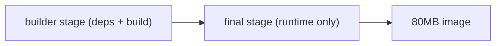

# Image Optimization

This is post 9 in the Docker 101 series.

> Docker 101 series (9/10)

<!-- a-grade-intro:begin -->

**Core question**: Same app, *1.2 GB vs 80 MB*. *What changed*?

> *Image optimization is the sum of *base choice, multi-stage, and cache mounts*. Apply *all three together* for big wins.*

<!-- a-grade-intro:end -->

## What You Will Learn

- *Multi-stage builds* to split *build vs runtime*
- *BuildKit cache mounts* to *speed rebuilds*
- Comparing *slim / alpine / distroless*
- *Combining layers* and *cleanup*
- Five common pitfalls

## Why It Matters

Smaller images shorten *pull time = deploy time*. Cleaner images also reduce the *attack surface*.

> *A 1 GB image costs *one minute per deploy* and *100 points of security score*.*

## Concept at a Glance



## Key Terms

- **Multistage**: multiple *FROM* statements with only the *final image* shipped.
- **Cache mount**: a BuildKit *cache directory* mounted at build time.
- **Distroless**: a minimal image *without a shell*.
- **Layer squash**: merge layers into *one*.
- **`.dockerignore`**: shrink the *build context*.

## Before/After

**Before**: 1.2 GB image. 6-min build. 30-sec pull.

**After**: 80 MB image. 40-sec build (5 sec on cache hit). 3-sec pull.

## Hands-on: Optimization in 5 Steps

### Step 1 — Multistage Dockerfile

```dockerfile
# syntax=docker/dockerfile:1.7
FROM python:3.12-slim AS builder
WORKDIR /app
COPY requirements.txt .
RUN --mount=type=cache,target=/root/.cache/pip \
    pip wheel --wheel-dir /wheels -r requirements.txt

FROM python:3.12-slim AS runtime
WORKDIR /app
COPY --from=builder /wheels /wheels
RUN pip install --no-index --find-links=/wheels /wheels/*.whl && rm -rf /wheels
COPY . .
RUN useradd -m -u 1000 appuser
USER appuser
CMD ["uvicorn", "app:app", "--host", "0.0.0.0", "--port", "8000"]
```

### Step 2 — Enable BuildKit

```bash
DOCKER_BUILDKIT=1 docker build -t myapp:opt .
docker images myapp
```

### Step 3 — Compare bases

```text
python:3.12          ~1.0 GB
python:3.12-slim     ~150 MB
python:3.12-alpine   ~50 MB   (watch for musl compat)
gcr.io/distroless/python3-debian12  ~50 MB (no shell)
```

### Step 4 — Combine into one RUN

```dockerfile
RUN apt-get update \
 && apt-get install -y --no-install-recommends curl \
 && rm -rf /var/lib/apt/lists/*
```

### Step 5 — Squash and dive

```bash
docker history myapp:opt
# Use 'dive' to analyze per-layer size
# https://github.com/wagoodman/dive
```

## What to Notice in This Code

- A *wheels stage* keeps only the *compiled artifacts* in runtime.
- *Cache mount* reuses the pip cache.
- *Distroless* has *no shell*, so debugging is harder (trade-off).

## Five Common Mistakes

1. **Reaching for alpine *unconditionally*.** *musl* incompatibility causes *runtime errors*.
2. **Forgetting `--no-install-recommends`.** Image bloats by *tens of MB*.
3. **No cache cleanup after `apt-get install`.** Same problem.
4. **Build tools (`gcc`) left in *runtime*.** Larger attack surface.
5. **`COPY .` pulling in *gigabytes of context*.** Missing `.dockerignore`.

## How This Shows Up in Production

Build systems combine *BuildKit* with *registry caches* (e.g., GHA cache) to keep *PR builds under 30 seconds*. Security teams recommend *distroless / Chainguard*.

## How a Senior Engineer Thinks

- *Small images are not a virtue; they are a KPI*.
- *Multistage is the default*; single-stage is for demos.
- *Base image* is a *team-level decision*.
- *Unknown layers* are *attack surface*.
- *Audit periodically with dive*.

## Checklist

- [ ] *Multistage* splits build vs runtime.
- [ ] *BuildKit cache mounts* are used.
- [ ] Image < 200 MB.
- [ ] *.dockerignore* shrinks the build context.

## Practice Problems

1. Convert a Dockerfile to *multistage* and *halve* the image size.
2. Use a *cache mount* to drop build time to *one-fifth*.
3. Try a *distroless* base.

## Wrap-up and Next Steps

Small images lift *team velocity* and *security* at once. Next, the full *production deploy* configuration.

<!-- toc:begin -->
- [What Is Docker?](./01-what-is-docker.md)
- [Images and Containers](./02-image-and-container.md)
- [Writing a Dockerfile](./03-dockerfile.md)
- [Volumes and Networks](./04-volume-and-network.md)
- [Docker Compose](./05-docker-compose.md)
- [Environment Variables and Configuration](./06-env-and-config.md)
- [Containerizing a Python App](./07-python-app-containerize.md)
- [Running with a Database](./08-database-with-app.md)
- **Image Optimization (current)**
- Production-Ready Docker (upcoming)
<!-- toc:end -->

## References

- [Multi-stage builds](https://docs.docker.com/build/building/multi-stage/)
- [BuildKit cache mounts](https://docs.docker.com/build/cache/optimize/)
- [Distroless images](https://github.com/GoogleContainerTools/distroless)
- [dive - layer analysis](https://github.com/wagoodman/dive)

Tags: Docker, Multistage, BuildKit, Alpine, Distroless
