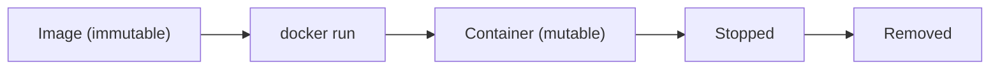

# Image와 Container

이 글은 Docker 101 시리즈의 두 번째 글입니다.

Docker를 조금만 써 보면 가장 먼저 헷갈리는 지점이 image와 container입니다. 이미지를 받았는데 왜 실행해야 하는지, 컨테이너 안에서 파일을 만들었는데 왜 다시 없어지는지, 삭제한 것은 이미지인지 컨테이너인지가 섞이기 시작합니다. 이 구분이 흐려지면 디버깅도 같이 흐려집니다.

실무에서 발생하는 많은 컨테이너 문제는 복잡한 기술보다 기본 오해에서 출발합니다. 컨테이너 내부에서 뭔가를 바꿔 놓고 "왜 재시작했더니 사라졌지?"라고 묻는 장면이 대표적입니다. 이미지는 불변이고, 컨테이너의 변경은 일시적이라는 감각을 잡아야 Docker를 제대로 다룰 수 있습니다.

## 이 글에서 다룰 문제

- image와 container는 정확히 무엇이 다를까요?
- layer와 copy-on-write는 왜 중요한 개념일까요?
- 컨테이너의 수명 주기는 어떤 흐름으로 흘러갈까요?
- 컨테이너 내부 변경은 왜 재시작 뒤 사라질까요?
- 매일 실제로 쓰는 기본 명령은 무엇일까요?

> image는 배포 가능한 불변 산출물이고, container는 그 산출물을 실행한 가변 인스턴스입니다. 이 둘을 명확히 분리해야 상태가 어디에 생기고 어디서 사라지는지 설명할 수 있습니다.

## 왜 이 글이 중요한가

컨테이너의 동작 방식을 모르면 디버깅이 운에 가까워집니다. 파일이 사라진 이유, 변경이 남지 않는 이유, 어떤 명령은 이미지에 작용하고 어떤 명령은 컨테이너에 작용하는 이유를 설명하지 못하면 운영 이슈를 재현하기가 어려워집니다.

반대로 lifecycle과 layer 개념을 이해하면 문제의 대부분이 예측 가능해집니다. "이건 컨테이너 상태가 날아간 문제다", "이건 이미지가 다시 빌드되어야 하는 문제다"처럼 원인을 훨씬 빨리 분리할 수 있습니다.

## 한눈에 보는 개념



## 핵심 용어

- **Layer**: 이미지 내부를 구성하는 읽기 전용 파일시스템 조각입니다.
- **Writable layer**: 컨테이너가 실행되면서 맨 위에 추가되는 쓰기 가능한 레이어입니다.
- **Lifecycle**: created → running → stopped → removed로 이어지는 수명 주기입니다.
- **Tag**: `nginx:1.27`처럼 이미지를 식별하는 버전 라벨입니다.
- **Digest**: 이미지 내용을 고정하는 불변 SHA256 식별자입니다.

여기서 특히 중요한 것은 writable layer입니다. 컨테이너 내부에서 여러분이 만드는 모든 변경은 보통 이 쓰기 레이어에 쌓입니다. 그래서 컨테이너를 지우면 그 변경도 함께 사라집니다.

## Before / After

**Before**: 컨테이너 안에서 `apt install`을 하고 재시작 뒤 변경이 사라져 당황합니다.

**After**: 변경은 Dockerfile에 코드로 남기고, 컨테이너는 언제든 버릴 수 있는 실행 단위로 다룹니다.

이 차이는 단순히 습관의 문제가 아닙니다. 재현 가능한 운영을 만들 수 있느냐의 문제입니다. 손으로 바꾼 컨테이너는 설명하기 어렵고, 다시 만들기도 어렵습니다.

## 실습: image와 container를 5단계로 구분해 보기

### 1단계 — 이미지 살펴보기

```bash
docker pull nginx:1.27
docker image inspect nginx:1.27 | jq '.[0].RootFS.Layers'
docker history nginx:1.27
```

`docker history`는 이미지가 어떤 레이어로 쌓였는지 보여 줍니다. 처음에는 단순한 정보처럼 보이지만, 이미지 크기와 빌드 시간을 이해하는 데 아주 중요한 단서가 됩니다.

### 2단계 — 컨테이너 생성과 실행

```bash
docker create --name web nginx:1.27   # create only
docker start web                       # then start
docker ps
```

이 단계는 create와 start가 분리될 수 있다는 점을 보여 줍니다. 즉, 이미지는 실행 준비물이고, 컨테이너는 실제 실행 상태라는 구분이 명령 수준에서도 드러납니다.

### 3단계 — 내부로 들어가 보기

```bash
docker exec -it web bash
# inside the container
ls /etc/nginx
exit
```

컨테이너 안으로 직접 들어가 보면 파일시스템이 진짜 서버처럼 보입니다. 많은 입문자가 여기서 착각합니다. 눈에 보인다고 해서 영구적이라는 뜻은 아닙니다. 이 감각을 다음 단계에서 바로 확인하게 됩니다.

### 4단계 — 변경은 일시적입니다

```bash
docker exec web touch /tmp/hello
docker stop web && docker rm web
docker run --name web2 nginx:1.27
docker exec web2 ls /tmp/hello   # No such file
```

이 단계가 핵심입니다. 컨테이너 내부에 만든 파일이 다음 컨테이너에서는 보이지 않는 이유는 변경이 이미지에 반영된 것이 아니라, 이전 컨테이너의 writable layer에만 있었기 때문입니다.

### 5단계 — 이미지 정리

```bash
docker image prune -f          # remove dangling
docker image rm nginx:1.27
```

정리 명령도 구분해서 이해해야 합니다. 컨테이너 정리와 이미지 정리는 다른 작업입니다. 이 차이를 혼동하면 디스크 정리가 잘 안 되거나, 필요한 이미지를 실수로 지웠다고 오해하기 쉽습니다.

## 이 코드에서 먼저 봐야 할 점

- `docker history`는 각 레이어 뒤에 있는 빌드 단계를 보여 줍니다.
- 컨테이너 내부 변경은 commit하지 않는 한 다음 실행으로 이어지지 않습니다.
- 태그보다 digest가 훨씬 더 강한 재현성 기준입니다.

특히 운영 환경에서는 "어떤 이미지를 띄웠는가"를 태그보다 digest 기준으로 추적하는 경우가 많습니다. 태그는 가리키는 대상이 바뀔 수 있지만, digest는 내용 자체를 고정하기 때문입니다.

## 자주 하는 실수 다섯 가지

1. **컨테이너 안에 파일을 영구 저장하려고 합니다.** 재시작이나 재생성 시 사라집니다.
2. **`docker commit`으로 이미지를 만듭니다.** 재현하기 어려운 산출물이 됩니다.
3. **멈춘 컨테이너를 계속 쌓아 둡니다.** `docker ps -a`가 금방 관리하기 어려워집니다.
4. **`latest`만 믿습니다.** 어느 날 다른 이미지가 같은 태그를 가리킬 수 있습니다.
5. **레이어가 지나치게 많은 이미지를 만듭니다.** 빌드와 pull이 느려집니다.

이 실수들은 모두 "실행 상태"와 "배포 산출물"을 섞어 보는 데서 나옵니다. 이미지는 만들고, 컨테이너는 실행하고, 상태는 외부에 둔다는 원칙이 중요합니다.

## 실무에서는 이렇게 이어집니다

CI 파이프라인은 이미지 빌드 결과를 digest 기준으로 고정하고, 운영에서는 어떤 digest가 배포되었는지 로그와 메트릭 시스템과 연결해 추적합니다. 사고 분석에서도 "어떤 코드가 배포됐나"만큼이나 "어떤 이미지가 실제로 실행됐나"가 중요합니다.

결국 image와 container를 분리해서 보는 습관은 단순한 개념 학습이 아니라 변경 이력을 추적할 수 있는 운영 습관으로 이어집니다.

## 시니어 엔지니어는 이렇게 생각합니다

- 이미지는 빌드하는 것이고, 컨테이너는 실행하는 것입니다.
- 변경은 코드와 Dockerfile로 남겨야지, 실행 중인 컨테이너에 손으로 남기면 안 됩니다.
- 프로덕션의 기본 식별자는 태그보다 digest에 가깝습니다.
- 레이어 캐시는 빌드 속도와 직결됩니다.
- 컨테이너는 언제든 버릴 수 있게 설계해야 합니다.

이 관점을 잡고 나면 다음 글의 Dockerfile도 훨씬 잘 읽힙니다. 왜 명령 순서가 중요한지, 왜 layer cache를 의식해야 하는지가 자연스럽게 이어지기 때문입니다.

## 체크리스트

- [ ] image와 container의 차이를 설명할 수 있습니다.
- [ ] 컨테이너 내부 변경이 휘발된다는 점을 이해했습니다.
- [ ] layer와 digest가 왜 중요한지 설명할 수 있습니다.
- [ ] 멈춘 컨테이너를 정리할 수 있습니다.

## 연습 문제

1. `nginx:1.27`의 레이어 개수를 확인해 보세요.
2. 컨테이너 안에 파일을 만든 뒤 다시 실행해서 파일이 사라지는지 확인해 보세요.
3. `docker image prune`으로 사용하지 않는 이미지를 정리해 보세요.

## 정리 및 다음 단계

Docker의 기본기는 image와 container를 분리해서 이해하는 데서 시작합니다. image는 불변 산출물이고, container는 그 위에 잠깐 올라가는 실행 상태입니다. 이 관점을 놓치지 않으면 상태 손실, 재현성, 디버깅 문제 대부분을 훨씬 빨리 설명할 수 있습니다.

다음 글에서는 Dockerfile을 직접 작성하면서 이 불변 산출물을 어떻게 만드는지 살펴보겠습니다. 결국 컨테이너 운영의 품질은 이미지를 얼마나 재현 가능하게 빌드하느냐에서 시작합니다.

<!-- toc:begin -->
- [Docker란 무엇인가?](./01-what-is-docker.md)
- **Image와 Container (현재 글)**
- Dockerfile 작성하기 (예정)
- Volume과 Network (예정)
- Docker Compose (예정)
- 환경변수와 설정 (예정)
- Python 앱 컨테이너화 (예정)
- 데이터베이스와 함께 실행하기 (예정)
- Image 최적화 (예정)
- 배포용 Docker 구성 (예정)
<!-- toc:end -->

## 참고 자료

- [Docker images](https://docs.docker.com/engine/reference/commandline/image/)
- [Docker container lifecycle](https://docs.docker.com/engine/reference/commandline/container/)
- [Storage drivers and layers](https://docs.docker.com/storage/storagedriver/)
- [Image digests](https://docs.docker.com/engine/reference/commandline/pull/#pull-an-image-by-digest-immutable-identifier)

Tags: Docker, Image, Container, Layer, Lifecycle
