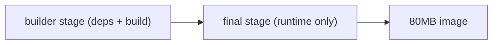

# Image 최적화

> Docker 101 시리즈 (9/10)


## 이 글에서 다룰 문제

작은 image 는 *풀 시간 = 배포 시간* 을 짧게 합니다. 깨끗한 image 는 *공격 표면* 도 줄입니다.

> *image 1GB 는 *배포 1분, 보안 100점 차감*.*

## 전체 흐름


## Before/After

**Before**: image 1.2GB. 빌드 6분. 풀 30초.

**After**: image 80MB. 빌드 40초 (캐시 적중 5초). 풀 3초.

## 최적화 5단계

### 1단계 — Multistage Dockerfile

```dockerfile
# syntax=docker/dockerfile:1.7
FROM python:3.12-slim AS builder
WORKDIR /app
COPY requirements.txt .
RUN --mount=type=cache,target=/root/.cache/pip \
    pip wheel --wheel-dir /wheels -r requirements.txt

FROM python:3.12-slim AS runtime
WORKDIR /app
COPY --from=builder /wheels /wheels
RUN pip install --no-index --find-links=/wheels /wheels/*.whl && rm -rf /wheels
COPY . .
RUN useradd -m -u 1000 appuser
USER appuser
CMD ["uvicorn", "app:app", "--host", "0.0.0.0", "--port", "8000"]
```

### 2단계 — BuildKit 활성화

```bash
DOCKER_BUILDKIT=1 docker build -t myapp:opt .
docker images myapp
```

### 3단계 — 베이스 비교

```text
python:3.12          ~1.0GB
python:3.12-slim     ~150MB
python:3.12-alpine   ~50MB  (musl 호환성 주의)
gcr.io/distroless/python3-debian12  ~50MB (셸 없음)
```

### 4단계 — RUN 한 줄로 합치기

```dockerfile
RUN apt-get update \
 && apt-get install -y --no-install-recommends curl \
 && rm -rf /var/lib/apt/lists/*
```

### 5단계 — Squash + dive

```bash
docker history myapp:opt
# 'dive' 도구로 layer 별 크기 분석
# https://github.com/wagoodman/dive
```

## 이 코드에서 주목할 점

- *wheels 단계 분리* 로 *컴파일 결과물* 만 런타임에.
- *cache mount* 로 pip 캐시 *재사용*.
- *distroless* 는 *셸이 없어 디버깅 어려움* (trade-off).

## 자주 하는 실수 5가지

1. **alpine 으로 *무조건* 작게.** *musl* 비호환으로 *런타임 에러*.
2. **`--no-install-recommends` 빼먹음.** image 가 *수십 MB 부풀음*.
3. **`apt-get install` 후 *cache 미정리*.** 마찬가지.
4. **빌드 도구 (`gcc`) 가 *runtime* 에 남음.** 공격 표면 증가.
5. **`COPY .` 가 *빌드 컨텍스트 GB* 를 끌어옴.** `.dockerignore` 누락.

## 실무에서는 이렇게 쓰입니다

빌드 시스템은 *BuildKit* + *registry cache* (GHA cache 등) 로 *PR 빌드 30초 이내* 를 목표로 합니다. 보안 팀은 *distroless / Chainguard* 를 권장합니다.

## 체크리스트

- [ ] *multistage* 로 빌드/런타임 분리.
- [ ] *BuildKit cache mount* 사용.
- [ ] image < 200MB.
- [ ] *.dockerignore* 가 빌드 컨텍스트를 줄인다.

## 정리 및 다음 단계

작은 image 는 *팀 속도* 와 *보안* 을 동시에 끌어올립니다. 다음 글에서는 *프로덕션 배포* 의 종합 구성을 다룹니다.

<!-- toc:begin -->
- [Docker란 무엇인가?](./01-what-is-docker.md)
- [Image와 Container](./02-image-and-container.md)
- [Dockerfile 작성하기](./03-dockerfile.md)
- [Volume과 Network](./04-volume-and-network.md)
- [Docker Compose](./05-docker-compose.md)
- [환경변수와 설정](./06-env-and-config.md)
- [Python 앱 컨테이너화](./07-python-app-containerize.md)
- [데이터베이스와 함께 실행하기](./08-database-with-app.md)
- **Image 최적화 (현재 글)**
- 배포용 Docker 구성 (예정)
<!-- toc:end -->

## 참고 자료

- [Multi-stage builds](https://docs.docker.com/build/building/multi-stage/)
- [BuildKit cache mounts](https://docs.docker.com/build/cache/optimize/)
- [Distroless images](https://github.com/GoogleContainerTools/distroless)
- [dive - layer analysis](https://github.com/wagoodman/dive)

Tags: Docker, Multistage, BuildKit, Alpine, Distroless
