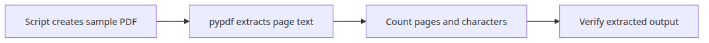
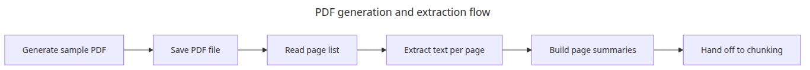
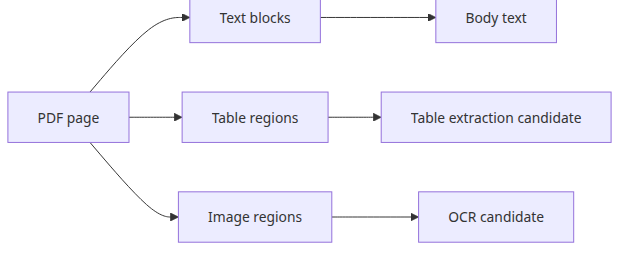
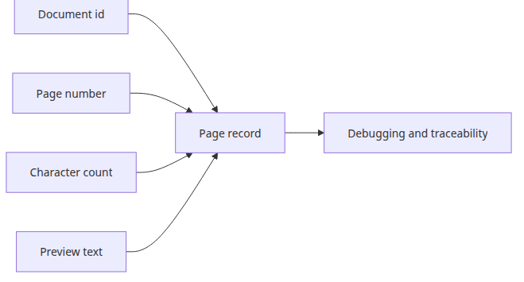
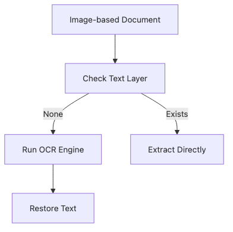

# PDF parsing and text extraction

Most document ingestion pipelines fail earlier than people expect. If the very first extraction step is hard to reproduce or hard to inspect, every later chunking and indexing discussion rests on shaky ground.

This is the first post in the Document Ingestion 101 series. Here, we start with a reproducible PDF sample and inspect what useful text and page-level metadata come out of it.

## Questions this post answers

- How do you make a PDF extraction demo reproducible when no sample file exists?
- How do you inspect page-level text and character counts with pypdf?
- Which metadata is worth keeping at the very first ingestion step?

> The first goal of PDF parsing is to turn a visual document into a verifiable list of strings.

Example code: `en/01-pdf-parsing/main.py`



*Questions this post answers*
The first practical problem in a PDF parsing tutorial is usually the sample file. If readers cannot reproduce the example from scratch, the pipeline story starts with friction.

This example generates its own PDF with `reportlab`, then reads it back with `pypdf` and prints page-level text summaries. That is exactly the shape you want for the first ingestion step.

## PDF parsing flow



*PDF generation and extraction flow*
Keeping generation and extraction in one script makes the demo reproducible and the output easy to verify.

## Page structure and extraction points



*Page structure and table detection path*
A real PDF often mixes plain text, tables, and images, so extraction quality depends on which branch each page element takes.

## Runnable example

```python
# pyright: reportMissingImports=false, reportMissingModuleSource=false
from __future__ import annotations

from pathlib import Path
from typing import TypedDict

from pypdf import PdfReader
from reportlab.lib.pagesizes import A4
from reportlab.pdfgen import canvas

BASE_DIR = Path(__file__).resolve().parent
DATA_DIR = BASE_DIR / 'data'
DATA_DIR.mkdir(exist_ok=True)
PDF_PATH = DATA_DIR / 'sample.pdf'

def create_sample_pdf(pdf_path: Path) -> None:
    c = canvas.Canvas(str(pdf_path), pagesize=A4)
    _, height = A4
    pages = [
        [
            'Document ingestion notes',
            '',
            '1. PDF text extraction is the first pipeline step.',
            '2. pypdf is reliable when the layout is simple.',
            '3. Keeping page numbers in metadata makes debugging easier.',
        ],
        [
            'Operational checks',
            '',
            '1. The script creates its own sample PDF.',
            '2. Re-reading the file should stay reproducible.',
            '3. Verify both page count and extracted character count.',
        ],
    ]
    for page_index, lines in enumerate(pages, start=1):
        y = height - 72
        c.setFont('Helvetica-Bold', 16)
        c.drawString(72, y, f'Page {page_index}')
        y -= 36
        c.setFont('Helvetica', 12)
        for line in lines:
            c.drawString(72, y, line)
            y -= 20
        c.showPage()
    c.save()

class PageSummary(TypedDict):
    page: int
    chars: int
    preview: str

def extract_pages(pdf_path: Path) -> list[PageSummary]:
    reader = PdfReader(str(pdf_path))
    pages: list[PageSummary] = []
    for index, page in enumerate(reader.pages, start=1):
        text = (page.extract_text() or '').strip()
        pages.append(
            {
                'page': index,
                'chars': len(text),
                'preview': text.replace('
', ' ')[:100],
            }
        )
    return pages

def main() -> None:
    create_sample_pdf(PDF_PATH)
    pages = extract_pages(PDF_PATH)
    print(f'created: {PDF_PATH.name}')
    print(f'page_count: {len(pages)}')
    total_chars = sum(int(page['chars']) for page in pages)
    print(f'total_chars: {total_chars}')
    for page in pages:
        print(f"page={page['page']} chars={page['chars']} preview={page['preview']}")

if __name__ == '__main__':
    main()
```

## How to run it

```bash
python main.py
```

## Verified run output

```text
created: sample.pdf
page_count: 2
total_chars: 363
page=1 chars=190 preview=Page 1 Document ingestion notes ...
page=2 chars=173 preview=Page 2 Operational checks ...
```

## What to notice in this code

### How page metadata carries forward



*Page metadata fields per document*
Once page number and character count are preserved together, later chunking and debugging steps stay much easier to reason about.

- `create_sample_pdf()` creates the input data, so the example has no hidden file dependency.
- `extract_pages()` returns page number, character count, and preview together, which maps cleanly to later metadata work.
- The output stays human-readable, so layout failures are easy to catch by inspection.

## Where engineers get confused

### When OCR becomes the fallback



*Text-layer check and OCR fallback flow*
OCR is safer as a fallback path after a text-layer check, not as the default path for every PDF.

- PDF parsing is not the same as OCR. If the PDF already has a text layer, verify plain extraction first.
- A high character count does not automatically mean high quality. Reading order and repeated headers still matter.
- Complex layouts do require library comparison, but the first tutorial should start with a reproducible simple sample.

## Checklist

- [ ] The script creates its own PDF.
- [ ] It prints both page count and character count.
- [ ] The page preview is enough to verify extraction order by eye.
- [ ] You identified which metadata should flow into the next stage.

<!-- toc:begin -->
## In this series

- **PDF parsing and text extraction (current)**
- Chunking strategies — optimizing by document type (upcoming)
- Metadata design and filtering (upcoming)
- Incremental indexing — updating only changed documents (upcoming)
- Multi-format document pipeline (upcoming)
- Completing the document ingestion pipeline (upcoming)

<!-- toc:end -->

## References

### Official docs

- [pypdf user guide](https://pypdf.readthedocs.io/)
- [ReportLab User Guide - Getting Started](https://docs.reportlab.com/reportlab/userguide/ch1_intro/)

### Verification-friendly sources

- [pypdf extract-text guide](https://pypdf.readthedocs.io/en/stable/user/extract-text.html)
- [PDF 32000-1:2008 overview (Adobe-hosted index)](https://opensource.adobe.com/dc-acrobat-sdk-docs/standards/pdfstandards/pdf/PDF32000_2008.pdf)

Tags: RAG, Document Processing, LangChain, Python
