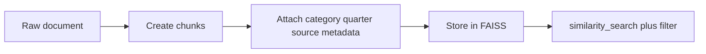

# Metadata design and filtering

## Questions this post answers

- Which retrieval conditions cannot be solved by embedding similarity alone?
- How should you design LangChain Document metadata for later filtering?
- What does the `filter` parameter look like in a FAISS search flow?

> Metadata is not decoration around the text; it is the first index that shrinks the candidate set.

Example code: `/root/Github/document-ingestion-101/en/03-metadata-filtering/main.py`



One of the most common RAG mistakes is mixing “similar meaning” with “allowed scope.” Quarter, source, and category usually need structured filtering, not just vector similarity.

This example loads three tiny documents into FAISS and changes the `filter` parameter by category and quarter so the retrieval behavior is explicit.

## Runnable example

```python
from __future__ import annotations

import hashlib
from dataclasses import dataclass

from langchain_community.vectorstores import FAISS
from langchain_core.documents import Document
from langchain_core.embeddings import Embeddings

class SimpleHashEmbeddings(Embeddings):
    def __init__(self, size: int = 32):
        self.size = size

    def _embed(self, text: str) -> list[float]:
        vector = [0.0] * self.size
        for token in text.lower().split():
            digest = hashlib.sha256(token.encode('utf-8')).digest()
            for index in range(self.size):
                vector[index] += digest[index] / 255.0
        return vector

    def embed_documents(self, texts: list[str]) -> list[list[float]]:
        return [self._embed(text) for text in texts]

    def embed_query(self, text: str) -> list[float]:
        return self._embed(text)

@dataclass
class ChunkSpec:
    title: str
    text: str
    category: str
    quarter: str
    source: str

    def to_document(self) -> Document:
        metadata = {
            'title': self.title,
            'category': self.category,
            'quarter': self.quarter,
            'source': self.source,
        }
        return Document(page_content=self.text, metadata=metadata)

def build_vectorstore() -> FAISS:
    docs = [
        ChunkSpec(
            title='Q4 marketing budget',
            text='The 2024 Q4 marketing budget focuses on campaign spend and partner events.',
            category='marketing',
            quarter='2024Q4',
            source='q4-report.pdf',
        ).to_document(),
        ChunkSpec(
            title='Q4 infrastructure cost',
            text='The 2024 Q4 infrastructure budget focuses on storage migration and backup cost.',
            category='engineering',
            quarter='2024Q4',
            source='q4-report.pdf',
        ).to_document(),
        ChunkSpec(
            title='Q3 marketing review',
            text='The 2024 Q3 marketing review summarizes webinar leads and conversion rate.',
            category='marketing',
            quarter='2024Q3',
            source='q3-review.md',
        ).to_document(),
    ]
    return FAISS.from_documents(docs, SimpleHashEmbeddings())

def main() -> None:
    vectorstore = build_vectorstore()
    query = 'marketing budget'

    print('[filter=category:marketing]')
    for doc in vectorstore.similarity_search(query, k=3, filter={'category': 'marketing'}):
        print(doc.metadata['title'], doc.metadata['quarter'], '-', doc.page_content)

    print('
[filter=quarter:2024Q4]')
    for doc in vectorstore.similarity_search(query, k=3, filter={'quarter': '2024Q4'}):
        print(doc.metadata['title'], doc.metadata['category'], '-', doc.page_content)

if __name__ == '__main__':
    main()
```

## How to run it

```bash
python main.py
```

## Verified run output

```text
[filter=category:marketing]
Q3 marketing review 2024Q3 - ...
Q4 marketing budget 2024Q4 - ...

[filter=quarter:2024Q4]
Q4 marketing budget marketing - ...
Q4 infrastructure cost engineering - ...
```

## What to notice in this code

- `ChunkSpec` keeps text and metadata together, so the retrieval schema is visible in one place.
- `SimpleHashEmbeddings` keeps the demo offline while still exercising the real `filter` path.
- The key observation is that the same query yields different result sets once the filter changes.

## Where engineers get confused

- More metadata is not automatically better. Keep the fields you will actually filter on.
- When retrieval looks wrong, the issue may be the candidate set rather than the embedding model.
- FAISS is not a relational database, so richer conditions still need application-level design around it.

## Checklist

- [ ] Your chunk metadata includes at least category, quarter, and source.
- [ ] You compared different filter results against the same query.
- [ ] Field names stay consistent between document creation and retrieval.
- [ ] You trimmed the schema to fields that are operationally useful.

<!-- blog-only:start -->

## Summary

Once the metadata schema is explicit, embedding search starts to behave like operational search.

The next post turns those chunks into an incremental indexing flow so you do not rebuild everything every run.

<!-- blog-only:end -->

<!-- toc:begin -->
## In this series

- [PDF parsing and text extraction](./01-pdf-parsing.md)
- [Chunking strategies — optimizing by document type](./02-chunking-strategies.md)
- **Metadata design and filtering (current)**
- Incremental indexing — updating only changed documents (upcoming)
- Multi-format document pipeline (upcoming)
- Completing the document ingestion pipeline (upcoming)

<!-- toc:end -->

## References

- https://python.langchain.com/docs/integrations/vectorstores/faiss/

Tags: RAG, Document Processing, LangChain, Python
