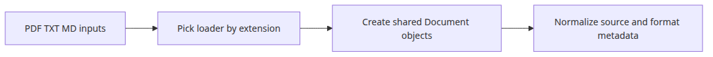

# Multi-format document pipeline

## Questions this post answers

- How do you combine PDF, TXT, and MD into one pipeline?
- Why is a shared `Document` shape important even when loaders differ by format?
- Where should format branching and metadata normalization happen?

> The essence of a multi-format pipeline is forcing varied inputs into one shared `Document` contract.

Example code: `/root/Github/document-ingestion-101/en/05-multi-format-pipeline/main.py`


Real ingestion systems rarely deal with PDFs alone. Operational notes may be TXT, team runbooks may be Markdown, and external reports may be PDF.

This example reads three formats separately but emits the same `Document` structure for all of them. That keeps later chunking and indexing stages format-agnostic.

## Runnable example

```python
# pyright: reportMissingImports=false, reportMissingModuleSource=false
from __future__ import annotations

from pathlib import Path

from langchain_core.documents import Document
from pypdf import PdfReader
from reportlab.lib.pagesizes import A4
from reportlab.pdfgen import canvas

BASE_DIR = Path(__file__).resolve().parent
DATA_DIR = BASE_DIR / 'data'
DATA_DIR.mkdir(exist_ok=True)

def create_pdf(path: Path) -> None:
    c = canvas.Canvas(str(path), pagesize=A4)
    c.setFont('Helvetica', 12)
    c.drawString(72, 780, 'PDF source: incident review and remediation steps.')
    c.drawString(72, 760, 'Store the source format in metadata so later stages stay uniform.')
    c.save()

def seed_files() -> list[Path]:
    pdf_path = DATA_DIR / 'incident.pdf'
    txt_path = DATA_DIR / 'notes.txt'
    md_path = DATA_DIR / 'runbook.md'
    create_pdf(pdf_path)
    txt_path.write_text('TXT source: queue backlog grew overnight. Scale-out reduced latency.
', encoding='utf-8')
    md_path.write_text('# Runbook

MD source: restart the worker only after checking the dead-letter queue.
', encoding='utf-8')
    return [pdf_path, txt_path, md_path]

def load_pdf(path: Path) -> list[Document]:
    reader = PdfReader(str(path))
    text = '
'.join((page.extract_text() or '').strip() for page in reader.pages)
    return [Document(page_content=text, metadata={'source': path.name, 'format': 'pdf'})]

def load_text_like(path: Path, fmt: str) -> list[Document]:
    return [Document(page_content=path.read_text(encoding='utf-8'), metadata={'source': path.name, 'format': fmt})]

def load_document(path: Path) -> list[Document]:
    suffix = path.suffix.lower()
    if suffix == '.pdf':
        return load_pdf(path)
    if suffix == '.txt':
        return load_text_like(path, 'txt')
    if suffix in {'.md', '.markdown'}:
        return load_text_like(path, 'md')
    raise ValueError(f'unsupported format: {suffix}')

def main() -> None:
    for path in seed_files():
        docs = load_document(path)
        for doc in docs:
            preview = doc.page_content.replace('
', ' ')[:90]
            print(f"source={doc.metadata['source']} format={doc.metadata['format']} preview={preview}")

if __name__ == '__main__':
    main()
```

## How to run it

```bash
python main.py
```

## Verified run output

```text
source=incident.pdf format=pdf preview=PDF source: incident review and remediation steps. ...
source=notes.txt format=txt preview=TXT source: queue backlog grew overnight. ...
source=runbook.md format=md preview=# Runbook MD source: restart the worker ...
```

## What to notice in this code

- `load_document()` centralizes extension routing in one place.
- Every loader normalizes `source` and `format`, so later code does not branch again.
- PDF uses `pypdf` while TXT and MD use plain file reads, but the output contract is identical.

## Where engineers get confused

- Supporting many formats is less about adding loaders and more about standardizing metadata keys.
- Markdown can be read like plain text, but heading-aware chunking may still need a separate policy later.
- PDF loaders and text loaders may return different granularities, so decide early whether your contract is per-page or per-file.

## Checklist

- [ ] You processed PDF, TXT, and MD in one run.
- [ ] Every output document includes source and format metadata.
- [ ] Extension routing lives in one function.
- [ ] You confirmed later stages can run without format-specific branching.

<!-- blog-only:start -->

## Summary

Once every loader converges on one `Document` contract, the rest of the pipeline gets dramatically simpler.

The next post combines all of those steps into a full pipeline that saves to and reloads from FAISS.

<!-- blog-only:end -->

<!-- toc:begin -->
## In this series

- [PDF parsing and text extraction](./01-pdf-parsing.md)
- [Chunking strategies — optimizing by document type](./02-chunking-strategies.md)
- [Metadata design and filtering](./03-metadata-filtering.md)
- [Incremental indexing — updating only changed documents](./04-incremental-indexing.md)
- **Multi-format document pipeline (current)**
- Completing the document ingestion pipeline (upcoming)

<!-- toc:end -->

## References

- https://python.langchain.com/docs/concepts/document_loaders/

Tags: RAG, Document Processing, LangChain, Python
