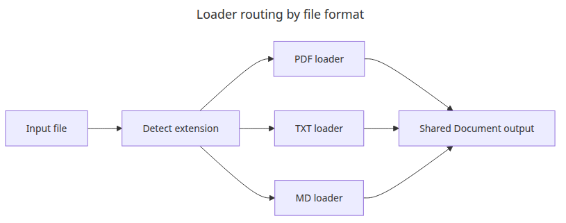
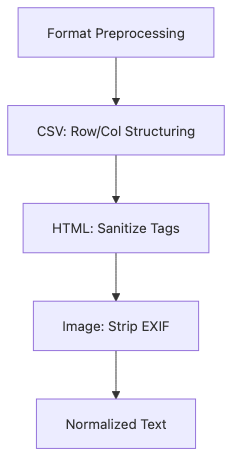
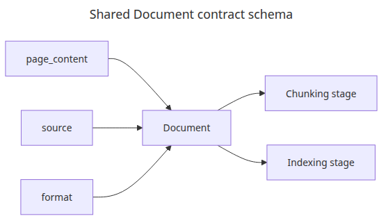
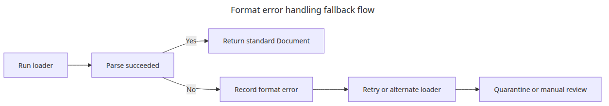

# Multi-format document pipeline

Real ingestion work rarely stays inside one file format. Teams usually need to mix PDFs, plain text notes, and Markdown documents without forcing every later stage to care about those differences.

This is the fifth post in the Document Ingestion 101 series. Here, we route multiple formats through separate loaders and normalize them into one shared `Document` contract.

## Questions this post answers

- How do you combine PDF, TXT, and MD into one pipeline?
- Why is a shared `Document` shape important even when loaders differ by format?
- Where should format branching and metadata normalization happen?

> The essence of a multi-format pipeline is forcing varied inputs into one shared `Document` contract.

Example code: `en/05-multi-format-pipeline/main.py`


*Questions this post answers*
Real ingestion systems rarely deal with PDFs alone. Operational notes may be TXT, team runbooks may be Markdown, and external reports may be PDF.

This example reads three formats separately but emits the same `Document` structure for all of them. That keeps later chunking and indexing stages format-agnostic.

## Loader routing by file format



*Loader routing by file format*
The first step in a multi-format pipeline is centralizing routing so later stages do not need to rediscover file type.

## Format-specific preprocessing



*Format-specific preprocessing branches*
Preprocessing can differ by source format as long as the final output converges on one body-text contract.

## Runnable example

```python
# pyright: reportMissingImports=false, reportMissingModuleSource=false
from __future__ import annotations

from pathlib import Path

from langchain_core.documents import Document
from pypdf import PdfReader
from reportlab.lib.pagesizes import A4
from reportlab.pdfgen import canvas

BASE_DIR = Path(__file__).resolve().parent
DATA_DIR = BASE_DIR / 'data'
DATA_DIR.mkdir(exist_ok=True)

def create_pdf(path: Path) -> None:
    c = canvas.Canvas(str(path), pagesize=A4)
    c.setFont('Helvetica', 12)
    c.drawString(72, 780, 'PDF source: incident review and remediation steps.')
    c.drawString(72, 760, 'Store the source format in metadata so later stages stay uniform.')
    c.save()

def seed_files() -> list[Path]:
    pdf_path = DATA_DIR / 'incident.pdf'
    txt_path = DATA_DIR / 'notes.txt'
    md_path = DATA_DIR / 'runbook.md'
    create_pdf(pdf_path)
    txt_path.write_text('TXT source: queue backlog grew overnight. Scale-out reduced latency.\n', encoding='utf-8')
    md_path.write_text('# Runbook\n\nMD source: restart the worker only after checking the dead-letter queue.\n', encoding='utf-8')
    return [pdf_path, txt_path, md_path]

def load_pdf(path: Path) -> list[Document]:
    reader = PdfReader(str(path))
    text = '\n'.join((page.extract_text() or '').strip() for page in reader.pages)
    return [Document(page_content=text, metadata={'source': path.name, 'format': 'pdf'})]

def load_text_like(path: Path, fmt: str) -> list[Document]:
    return [Document(page_content=path.read_text(encoding='utf-8'), metadata={'source': path.name, 'format': fmt})]

def load_document(path: Path) -> list[Document]:
    suffix = path.suffix.lower()
    if suffix == '.pdf':
        return load_pdf(path)
    if suffix == '.txt':
        return load_text_like(path, 'txt')
    if suffix in {'.md', '.markdown'}:
        return load_text_like(path, 'md')
    raise ValueError(f'unsupported format: {suffix}')

def main() -> None:
    for path in seed_files():
        docs = load_document(path)
        for doc in docs:
            preview = doc.page_content.replace('\n', ' ')[:90]
            print(f"source={doc.metadata['source']} format={doc.metadata['format']} preview={preview}")

if __name__ == '__main__':
    main()
```

## How to run it

```bash
python main.py
```

## Verified run output

```text
source=incident.pdf format=pdf preview=PDF source: incident review and remediation steps. ...
source=notes.txt format=txt preview=TXT source: queue backlog grew overnight. ...
source=runbook.md format=md preview=# Runbook MD source: restart the worker ...
```

The important thing in that output is not the three lines themselves. It is that all three collapse into the same shape. Later stages can stay format-agnostic only because the pipeline emits a **normalized handoff contract**.

## Why the shared contract comes first

In a multi-format pipeline, adding more loaders is usually easier than keeping downstream stages stable. That is why it is safer to lock the contract first — `page_content`, `source`, `format`, and `loader_name` — and only then expand format coverage.

| Field | Why it exists | Where downstream uses it |
| --- | --- | --- |
| `page_content` | Body text for chunking and embedding | chunking, embedding |
| `source` | Trace back to the original file | debugging, result rendering |
| `format` | Apply type-specific policy | chunk presets, error handling |
| `loader_name` | Show which path produced the text | operations logs, failure analysis |

Once that contract is fixed, later additions like HTML or DOCX do not force downstream rewrites. Without it, chunking and indexing code quickly fills with format-specific branching.

## Example normalization layer

```python
from __future__ import annotations

from langchain_core.documents import Document

def normalize_document(doc: Document, *, source: str, fmt: str, loader_name: str) -> Document:
    metadata = dict(doc.metadata)
    metadata.update(
        {
            'source': source,
            'format': fmt,
            'loader_name': loader_name,
        }
    )
    return Document(page_content=doc.page_content.strip(), metadata=metadata)

def normalize_batch(docs: list[Document], *, source: str, fmt: str, loader_name: str) -> list[Document]:
    return [normalize_document(doc, source=source, fmt=fmt, loader_name=loader_name) for doc in docs]
```

This layer is small, but it gives the pipeline a clean seam. Rather than passing raw loader differences downstream, you flatten them once at the handoff point.

## Record failures by format, not as one generic error

As the number of supported formats grows, so do the failure modes. PDFs fail differently from Markdown, and Markdown fails differently from plain text. It is worth logging those failures separately instead of collapsing everything into one generic exception.

```python
from __future__ import annotations

from pathlib import Path

def safe_load_document(path: Path) -> tuple[list[Document], dict[str, str] | None]:
    try:
        docs = load_document(path)
    except ValueError as exc:
        return [], {'source': path.name, 'status': 'unsupported', 'reason': str(exc)}
    except Exception as exc:  # tutorial logging path
        return [], {'source': path.name, 'status': 'failed', 'reason': str(exc)}
    return docs, None
```

That makes operations much easier to explain. An unsupported DOCX file and a broken PDF extraction are both failures, but they are not the same failure.

## Operations-style output example

```text
source=incident.pdf format=pdf loader=pypdf status=loaded
source=notes.txt format=txt loader=text status=loaded
source=runbook.md format=md loader=text status=loaded
source=diagram.docx format=docx status=unsupported reason=unsupported format: .docx
```

One short block like this tells you what the pipeline read, what it skipped, and why. That is where multi-format ingestion starts to feel operable instead of merely feature-complete.

## What to notice in this code

### Shared Document contract schema



*Shared Document contract schema*
Once `page_content`, `source`, and `format` are normalized, later stages can stay format-agnostic much longer.

- `load_document()` centralizes extension routing in one place.
- Every loader normalizes `source` and `format`, so later code does not branch again.
- PDF uses `pypdf` while TXT and MD use plain file reads, but the output contract is identical.

## Where engineers get confused

### Error handling across file formats



*Format error handling fallback flow*
As the format count grows, explicit fallback paths matter more than pretending every loader fails the same way.

- Supporting many formats is less about adding loaders and more about standardizing metadata keys.
- Markdown can be read like plain text, but heading-aware chunking may still need a separate policy later.
- PDF loaders and text loaders may return different granularities, so decide early whether your contract is per-page or per-file.

## Checklist

- [ ] You processed PDF, TXT, and MD in one run.
- [ ] Every output document includes source and format metadata.
- [ ] Extension routing lives in one function.
- [ ] You confirmed later stages can run without format-specific branching.

## How this looks in production thinking

Early on, it is better to be strict about the handoff contract than ambitious about format count. If the `Document` contract stays stable, chunking and indexing survive much longer. If the contract is vague, every new loader leaks its quirks into the rest of the system.

It is also worth resisting the urge to treat every format as equally mature on day one. PDFs need text-layer verification first. Markdown needs structure preservation first. TXT often needs encoding and newline normalization first. The pipeline is shared, but the first good failure check is still format-specific.

<!-- toc:begin -->
## In this series

- [PDF parsing and text extraction](./01-pdf-parsing.md)
- [Chunking strategies — optimizing by document type](./02-chunking-strategies.md)
- [Metadata design and filtering](./03-metadata-filtering.md)
- [Incremental indexing — updating only changed documents](./04-incremental-indexing.md)
- **Multi-format document pipeline (current)**
- Completing the document ingestion pipeline (upcoming)

<!-- toc:end -->

## References

### Official docs

- [LangChain document loaders concepts](https://python.langchain.com/docs/concepts/document_loaders/)
- [pypdf user guide](https://pypdf.readthedocs.io/)

### Verification-friendly sources

- [Python pathlib documentation](https://docs.python.org/3/library/pathlib.html)
- [Markdown Guide - Basic Syntax](https://www.markdownguide.org/basic-syntax/)

Tags: RAG, Document Processing, LangChain, Python
