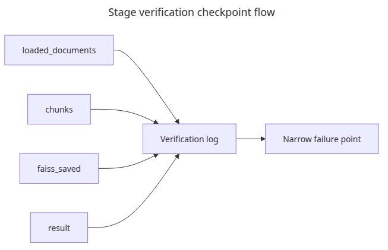
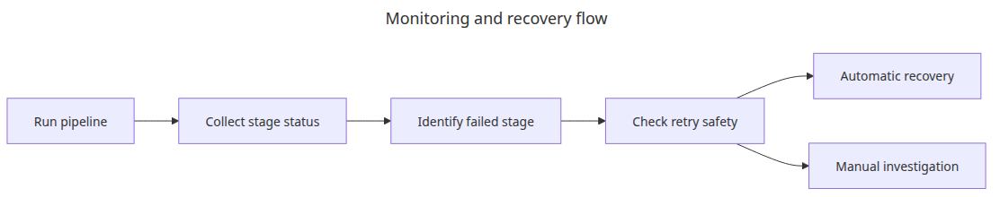
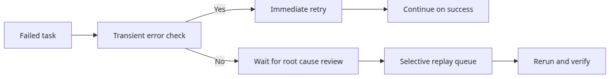

# Completing the document ingestion pipeline

The value of an ingestion pipeline appears only when the handoff between stages is real. It is not enough to understand loading, chunking, and indexing separately if they do not survive an end-to-end run together.

This is the final post in the Document Ingestion 101 series. Here, we connect the earlier pieces into one reproducible flow and verify that the index can be saved, reloaded, and queried.

## Questions this post answers

- How do you connect loading, chunking, embedding, and FAISS save-reload in one flow?
- Which outputs are the minimum proof that the whole pipeline actually worked?
- How do you keep the retrieval flow reproducible offline?

> A complete ingestion pipeline is not defined by how many stages exist but by whether each stage hands off cleanly to the next.

Example code: `en/06-pipeline-completion/main.py`


*Questions this post answers*
The final post assembles the earlier isolated examples into one real flow. At this point the important question is whether the stage boundaries still line up.

This example loads three formats, chunks them, stores embeddings in FAISS, reloads the saved index, and runs a search against it. That is enough to prove an ingestion MVP works end to end.

## End-to-end ingestion pipeline


*End-to-end ingestion pipeline flow*
The final post is mostly about clean handoffs between stages rather than deeper logic inside any single function.

## Stage verification checkpoints



*Stage verification checkpoint flow*
A small set of stage-level checkpoints is often enough to localize where the pipeline broke.

## Runnable example

```python
# pyright: reportMissingImports=false, reportMissingModuleSource=false
from __future__ import annotations

import hashlib
import shutil
from pathlib import Path

from langchain_community.vectorstores import FAISS
from langchain_core.documents import Document
from langchain_core.embeddings import Embeddings
from langchain_text_splitters import RecursiveCharacterTextSplitter
from pypdf import PdfReader
from reportlab.lib.pagesizes import A4
from reportlab.pdfgen import canvas

BASE_DIR = Path(__file__).resolve().parent
DATA_DIR = BASE_DIR / 'data'
INDEX_DIR = BASE_DIR / 'faiss_store'
DATA_DIR.mkdir(exist_ok=True)

class SimpleHashEmbeddings(Embeddings):
    def __init__(self, size: int = 32):
        self.size = size

    def _embed(self, text: str) -> list[float]:
        vector = [0.0] * self.size
        for token in text.lower().split():
            digest = hashlib.sha256(token.encode('utf-8')).digest()
            for index in range(self.size):
                vector[index] += digest[index] / 255.0
        return vector

    def embed_documents(self, texts: list[str]) -> list[list[float]]:
        return [self._embed(text) for text in texts]

    def embed_query(self, text: str) -> list[float]:
        return self._embed(text)

def create_pdf(path: Path) -> None:
    c = canvas.Canvas(str(path), pagesize=A4)
    c.setFont('Helvetica', 12)
    c.drawString(72, 780, 'PDF source: access policy and retention rules.')
    c.drawString(72, 760, 'Chunk metadata should preserve the original file name and format.')
    c.save()

def seed_files() -> list[Path]:
    pdf_path = DATA_DIR / 'policy.pdf'
    txt_path = DATA_DIR / 'ops.txt'
    md_path = DATA_DIR / 'faq.md'
    create_pdf(pdf_path)
    txt_path.write_text('TXT source: nightly ingestion runs at 02:00 and retries failed files first.
', encoding='utf-8')
    md_path.write_text('# FAQ

MD source: metadata filters reduce the candidate set before answer generation.
', encoding='utf-8')
    return [pdf_path, txt_path, md_path]

def load_file(path: Path) -> list[Document]:
    suffix = path.suffix.lower()
    if suffix == '.pdf':
        reader = PdfReader(str(path))
        text = '
'.join((page.extract_text() or '').strip() for page in reader.pages)
        return [Document(page_content=text, metadata={'source': path.name, 'format': 'pdf'})]
    if suffix == '.txt':
        return [Document(page_content=path.read_text(encoding='utf-8'), metadata={'source': path.name, 'format': 'txt'})]
    if suffix in {'.md', '.markdown'}:
        return [Document(page_content=path.read_text(encoding='utf-8'), metadata={'source': path.name, 'format': 'md'})]
    raise ValueError(f'unsupported format: {suffix}')

def chunk_documents(documents: list[Document]) -> list[Document]:
    splitter = RecursiveCharacterTextSplitter(
        chunk_size=90,
        chunk_overlap=20,
        separators=['

', '
', '. ', ' '],
    )
    chunks = splitter.split_documents(documents)
    for index, chunk in enumerate(chunks):
        chunk.metadata['chunk_id'] = f'chunk-{index:02d}'
    return chunks

def main() -> None:
    files = seed_files()
    loaded = [doc for path in files for doc in load_file(path)]
    chunks = chunk_documents(loaded)
    if INDEX_DIR.exists():
        shutil.rmtree(INDEX_DIR)
    vectorstore = FAISS.from_documents(chunks, SimpleHashEmbeddings())
    vectorstore.save_local(str(INDEX_DIR))
    reloaded = FAISS.load_local(
        str(INDEX_DIR),
        SimpleHashEmbeddings(),
        allow_dangerous_deserialization=True,
    )
    results = reloaded.similarity_search('metadata filters and retention', k=2)

    print(f'loaded_documents: {len(loaded)}')
    print(f'chunks: {len(chunks)}')
    print(f'faiss_saved: {INDEX_DIR}')
    for doc in results:
        preview = doc.page_content.replace('
', ' ')[:90]
        print(f"result={doc.metadata['source']} chunk_id={doc.metadata['chunk_id']} preview={preview}")

if __name__ == '__main__':
    main()
```

## How to run it

```bash
python main.py
```

## Verified run output

```text
loaded_documents: 3
chunks: 4
faiss_saved: en/06-pipeline-completion/faiss_store
result=policy.pdf chunk_id=chunk-00 preview=PDF source: access policy and retention rules.
result=policy.pdf chunk_id=chunk-01 preview=Chunk metadata should preserve the original file name and format.
```

## What to notice in this code

### Monitoring and recovery path



*Monitoring and recovery flow*
Production ingestion needs a visible recovery path, not only a happy-path diagram.

- `load_file()` absorbs format differences, and `chunk_documents()` creates the shared chunk contract.
- `SimpleHashEmbeddings` lets the example verify FAISS save-reload behavior without depending on a network model download.
- The log keeps four tight checkpoints: `loaded_documents`, `chunks`, `faiss_saved`, and `result`.

## Where engineers get confused

### Retry and replay control



*Retry and replay control flow*
Retrying and replaying are different control paths, and collapsing them into one action usually wastes time and compute.

- An end-to-end demo does not need an LLM call on day one. Verifying index save and reload is more important first.
- Embedding quality and pipeline correctness are different concerns. Reproducibility wins at the demo stage.
- If you skip the reload step, deployment-time path and serialization issues stay hidden until later.

## Checklist

- [ ] You loaded all three formats.
- [ ] You checked that the chunk count was plausible.
- [ ] You saved the FAISS index and loaded it back.
- [ ] You verified retrieval against the reloaded index.

<!-- toc:begin -->
## In this series

- [PDF parsing and text extraction](./01-pdf-parsing.md)
- [Chunking strategies — optimizing by document type](./02-chunking-strategies.md)
- [Metadata design and filtering](./03-metadata-filtering.md)
- [Incremental indexing — updating only changed documents](./04-incremental-indexing.md)
- [Multi-format document pipeline](./05-multi-format-pipeline.md)
- **Completing the document ingestion pipeline (current)**

<!-- toc:end -->

## References

### Official docs

- [LangChain FAISS integration guide](https://python.langchain.com/docs/integrations/vectorstores/faiss/)
- [FAISS documentation](https://faiss.ai/)

### Verification-friendly sources

- [FAISS GitHub repository](https://github.com/facebookresearch/faiss)
- [LangChain text splitters integration package](https://docs.langchain.com/oss/python/integrations/splitters/index)

Tags: RAG, Document Processing, LangChain, Python
