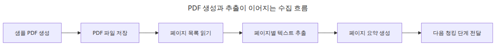
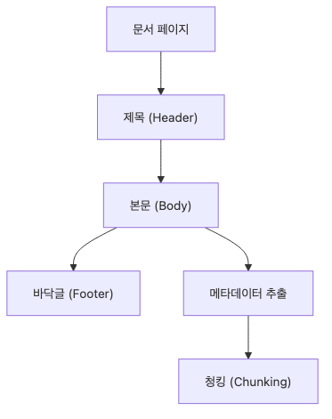
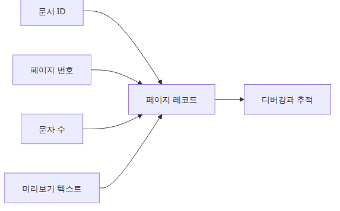
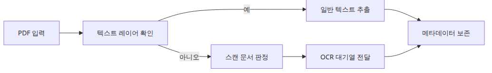

# PDF 파싱과 텍스트 추출

## 이 글에서 답할 질문

- 샘플 PDF가 없어도 텍스트 추출 예제를 어떻게 재현할 수 있을까요?
- pypdf로 페이지별 텍스트와 문자 수를 어떻게 확인할까요?
- 문서 수집 첫 단계에서 꼭 남겨야 할 메타데이터는 무엇일까요?

> PDF 파싱의 첫 목표는 “보이는 문서”를 “검증 가능한 문자열 목록”으로 바꾸는 것입니다.

예제 코드: `/root/Github/document-ingestion-101/ko/01-pdf-parsing/main.py`


실무에서 PDF 파싱 예제를 설명할 때 가장 먼저 막히는 부분은 샘플 파일입니다. 저장소에 PDF를 커밋하지 않아도 글만 보고 바로 실행할 수 있어야 재현성이 생깁니다.

이번 예제는 `reportlab`으로 PDF를 스크립트 안에서 만들고, `pypdf`로 다시 읽어서 페이지별 텍스트와 문자 수를 출력합니다. 문서 수집 파이프라인의 출발점으로 딱 맞는 구조입니다.

## PDF 파싱 흐름


입문 예제에서는 생성과 추출을 한 스크립트에 넣어 두면 입력 재현성과 출력 검증이 동시에 잡힙니다.

## 페이지 구조와 추출 포인트


같은 PDF라도 텍스트, 표, 이미지가 섞여 있으므로 추출 전략을 한 가지로 고정하면 품질 차이를 놓치기 쉽습니다.

## 실행 예제

```python
# pyright: reportMissingImports=false, reportMissingModuleSource=false
from __future__ import annotations

from pathlib import Path
from typing import TypedDict

from pypdf import PdfReader
from reportlab.lib.pagesizes import A4
from reportlab.pdfgen import canvas

BASE_DIR = Path(__file__).resolve().parent
DATA_DIR = BASE_DIR / 'data'
DATA_DIR.mkdir(exist_ok=True)
PDF_PATH = DATA_DIR / 'sample.pdf'

def create_sample_pdf(pdf_path: Path) -> None:
    c = canvas.Canvas(str(pdf_path), pagesize=A4)
    _, height = A4
    pages = [
        [
            'Document ingestion notes',
            '',
            '1. PDF text extraction is the first pipeline step.',
            '2. pypdf is reliable when the layout is simple.',
            '3. Keeping page numbers in metadata makes debugging easier.',
        ],
        [
            'Operational checks',
            '',
            '1. The script creates its own sample PDF.',
            '2. Re-reading the file should stay reproducible.',
            '3. Verify both page count and extracted character count.',
        ],
    ]
    for page_index, lines in enumerate(pages, start=1):
        y = height - 72
        c.setFont('Helvetica-Bold', 16)
        c.drawString(72, y, f'Page {page_index}')
        y -= 36
        c.setFont('Helvetica', 12)
        for line in lines:
            c.drawString(72, y, line)
            y -= 20
        c.showPage()
    c.save()

class PageSummary(TypedDict):
    page: int
    chars: int
    preview: str

def extract_pages(pdf_path: Path) -> list[PageSummary]:
    reader = PdfReader(str(pdf_path))
    pages: list[PageSummary] = []
    for index, page in enumerate(reader.pages, start=1):
        text = (page.extract_text() or '').strip()
        pages.append(
            {
                'page': index,
                'chars': len(text),
                'preview': text.replace('
', ' ')[:100],
            }
        )
    return pages

def main() -> None:
    create_sample_pdf(PDF_PATH)
    pages = extract_pages(PDF_PATH)
    print(f'created: {PDF_PATH.name}')
    print(f'page_count: {len(pages)}')
    total_chars = sum(int(page['chars']) for page in pages)
    print(f'total_chars: {total_chars}')
    for page in pages:
        print(f"page={page['page']} chars={page['chars']} preview={page['preview']}")

if __name__ == '__main__':
    main()
```

## 실행 방법

```bash
python main.py
```

## 검증된 실행 결과

```text
created: sample.pdf
page_count: 2
total_chars: 363
page=1 chars=190 preview=Page 1 Document ingestion notes ...
page=2 chars=173 preview=Page 2 Operational checks ...
```

## 이 코드에서 봐야 할 것

### 페이지 메타데이터가 이어지는 방식


페이지 번호와 문자 수를 같이 남기면 추출 품질 문제를 나중에 청킹 단계까지 끌고 가지 않고 앞단에서 잡을 수 있습니다.

- `create_sample_pdf()`가 입력 데이터를 직접 만들기 때문에 외부 의존 파일이 없습니다.
- `extract_pages()`가 페이지 번호, 문자 수, 미리보기를 함께 반환해서 이후 메타데이터 설계로 자연스럽게 이어집니다.
- 출력은 사람이 바로 읽을 수 있는 형태라서 파싱이 깨졌을 때 눈으로 검증하기 쉽습니다.

## 실무에서 헷갈리는 지점

### 텍스트 레이어와 OCR 대체 기준


OCR은 첫 선택지가 아니라 텍스트 레이어가 없거나 품질이 너무 낮을 때 들어가는 우회 경로로 보는 편이 안전합니다.

- PDF 파싱은 OCR과 다릅니다. 텍스트 레이어가 이미 있는 PDF라면 먼저 텍스트 추출부터 확인해야 합니다.
- 문자 수가 많이 나온다고 품질이 좋은 것은 아닙니다. 줄바꿈, 순서, 머리글 반복도 같이 봐야 합니다.
- 복잡한 레이아웃 문서는 라이브러리 비교가 필요하지만, 입문 단계에서는 재현 가능한 단순 샘플부터 검증하는 편이 낫습니다.

## 체크리스트

- [ ] 스크립트가 PDF를 직접 생성한다.
- [ ] 페이지 수와 문자 수를 함께 출력한다.
- [ ] 페이지 미리보기로 추출 순서를 눈으로 확인했다.
- [ ] 다음 단계에서 쓸 메타데이터 후보를 정리했다.

<!-- toc:begin -->
## 시리즈 목차

- **PDF 파싱과 텍스트 추출 (현재 글)**
- 청킹 전략 — 문서 유형별 최적화 (예정)
- 메타데이터 설계와 필터링 (예정)
- 증분 인덱싱 — 변경된 문서만 업데이트 (예정)
- 다중 포맷 문서 파이프라인 (예정)
- 문서 수집 파이프라인 완성 (예정)

<!-- toc:end -->

## 참고 자료

- https://pypdf.readthedocs.io/
- https://docs.reportlab.com/reportlab/userguide/ch1_intro/

Tags: RAG, Document Processing, LangChain, Python
