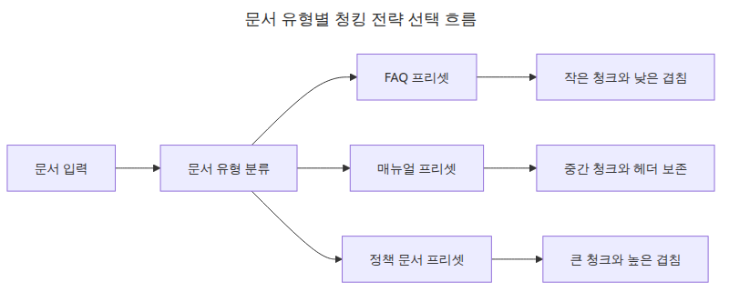
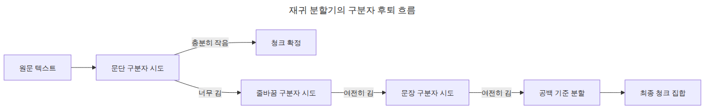
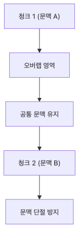
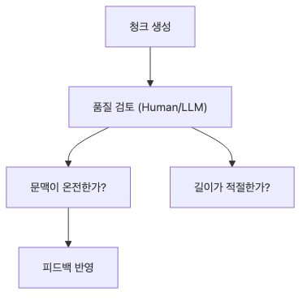

# 청킹 전략 — 문서 유형별 최적화

청킹은 검색 품질이 조용히 무너지는 지점이기도 합니다. FAQ에서 잘 맞던 분할 기준이 매뉴얼이나 정책 문서에서는 문맥을 쉽게 끊어 버리기 때문입니다.

이 글은 문서 수집과 인덱싱 101 시리즈의 두 번째 글입니다. 여기서는 문서 유형별 청킹 프리셋을 비교하고, 분할 결과를 빠르게 점검하는 기준을 정리합니다.

> 청킹은 텍스트를 잘게 자르는 일이 아니라 검색이 여전히 신뢰할 수 있는 가장 작은 문맥 단위를 설계하는 일입니다.

## 이 글에서 다룰 문제

- FAQ, 매뉴얼, 정책 문서는 같은 청크 크기를 써도 괜찮을까요?
- `RecursiveCharacterTextSplitter`는 어디에서 자를지 어떻게 결정할까요?
- 청크를 임베딩하기 전에 어떤 빠른 통계를 먼저 확인해야 할까요?

## 문서 유형별 청킹 전략 흐름



*문서 유형별 청킹 전략 선택 흐름*
같은 분할기를 쓰더라도 문서 유형마다 경계와 겹침의 기본값을 다르게 잡아야 검색 잡음을 줄일 수 있습니다.

## 재귀 분할기 구분자 후퇴 순서



*재귀 분할기의 구분자 후퇴 흐름*
재귀 분할기의 장점은 의미 있는 큰 경계를 먼저 살려 보고, 안 되면 더 작은 경계로 천천히 내려간다는 점입니다.

## 실행 예제

```python
from __future__ import annotations

from statistics import mean

from langchain_text_splitters import RecursiveCharacterTextSplitter

SAMPLES = {
    'faq': 'Question: what is the upload limit? Answer: the default limit is 20MB and can be tuned. '
    'Question: how do we reprocess failed files? Answer: rerun only the failed documents in the incremental job. ' * 4,
    'manual': '# Deployment guide

1. Review the config file.
2. Validate sample documents before rollout.
3. Check logs and chunk counts after deployment.

'
    'When the structure is explicit, larger chunks can stay readable. ' * 4,
    'policy': 'Policy documents use long paragraphs and repeated definitions. They describe access control, retention, and deletion '
    'rules together, so context breaks if the overlap is too small. ' * 5,
}

CONFIGS = {
    'faq': {'chunk_size': 120, 'chunk_overlap': 20},
    'manual': {'chunk_size': 220, 'chunk_overlap': 40},
    'policy': {'chunk_size': 320, 'chunk_overlap': 60},
}

def summarize(name: str, text: str, chunk_size: int, chunk_overlap: int) -> None:
    splitter = RecursiveCharacterTextSplitter(
        chunk_size=chunk_size,
        chunk_overlap=chunk_overlap,
        separators=['

', '
', '. ', ' '],
    )
    chunks = splitter.split_text(text)
    sizes = [len(chunk) for chunk in chunks]
    print(f'[{name}] chunks={len(chunks)} avg={mean(sizes):.1f} min={min(sizes)} max={max(sizes)}')
    print(f'  first_chunk={chunks[0][:90]!r}')

def main() -> None:
    for name, text in SAMPLES.items():
        summarize(name, text, **CONFIGS[name])

if __name__ == '__main__':
    main()
```

## 실행 방법

```bash
python main.py
```

## 검증된 실행 결과

```text
[faq] chunks=8 avg=97.9 min=86 max=109
[manual] chunks=5 avg=163.8 min=64 max=205
[policy] chunks=4 avg=224.8 min=118 max=297
```

## 이 코드에서 봐야 할 것

### 청크 경계와 overlap 구조



*청크 경계와 겹침이 이어지는 구조*
겹침은 중복 저장이 아니라 앞 청크의 문맥 실마리를 다음 청크로 이어 주는 안전장치입니다.

- 예제는 `chunk_size`, `chunk_overlap`, `separators`만 바꿔도 결과가 크게 달라진다는 점을 보여줍니다.
- 평균 길이뿐 아니라 최소/최대 길이도 함께 출력해서 불균형한 청크를 바로 찾을 수 있습니다.
- 첫 번째 청크 미리보기를 같이 찍으면 헤더나 번호 목록이 예상대로 보존되는지 확인할 수 있습니다.

## 실무에서 헷갈리는 지점

### 청크 품질 점검 흐름



*청크 품질 지표를 확인하는 점검 흐름*
청크 수만 보는 것으로는 부족하고 길이 분포와 첫 청크 미리보기까지 같이 봐야 경계 품질을 빠르게 판단할 수 있습니다.

- 좋은 청킹은 무조건 작은 청킹이 아닙니다. 검색 품질은 경계와 겹침이 함께 결정합니다.
- 문서 유형별 프리셋은 고정 규칙이 아니라 출발점입니다. 실제 운영에서는 검색 로그로 다시 조정해야 합니다.
- 문장 기준 분할이 항상 최고는 아닙니다. 매뉴얼처럼 구조가 뚜렷한 문서는 헤더 보존이 더 중요할 수 있습니다.

## 체크리스트

- [ ] 문서 유형별 프리셋을 최소 세 가지로 나눴다.
- [ ] 청크 수와 길이 분포를 숫자로 확인했다.
- [ ] 첫 번째 청크 미리보기로 구조 보존 여부를 확인했다.
- [ ] 임베딩 전에 너무 긴 청크와 너무 짧은 청크를 걸러낼 기준을 정했다.

<!-- toc:begin -->
## 시리즈 목차

- [PDF 파싱과 텍스트 추출](./01-pdf-parsing.md)
- **청킹 전략 — 문서 유형별 최적화 (현재 글)**
- 메타데이터 설계와 필터링 (예정)
- 증분 인덱싱 — 변경된 문서만 업데이트 (예정)
- 다중 포맷 문서 파이프라인 (예정)
- 문서 수집 파이프라인 완성 (예정)

<!-- toc:end -->

## 참고 자료

- https://python.langchain.com/docs/how_to/recursive_text_splitter/

Tags: RAG, Document Processing, LangChain, Python
