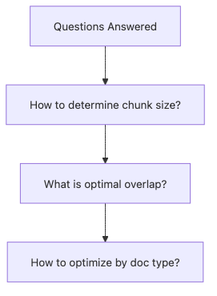
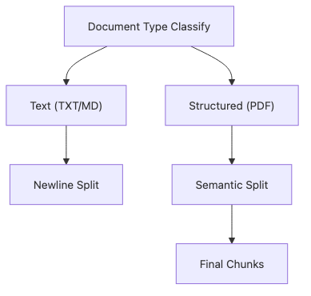
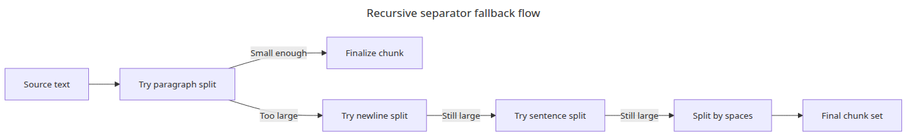
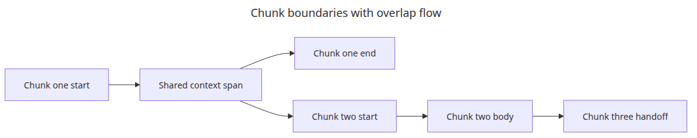
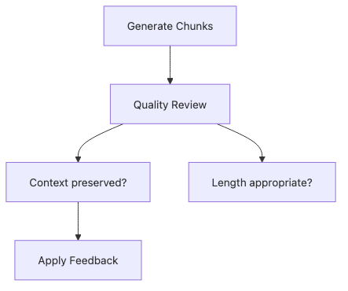

# 청킹 전략 — 문서 유형별 최적화

청킹은 많은 검색 시스템이 조용히 품질을 잃는 지점입니다. FAQ에 잘 맞는 분할기가 매뉴얼이나 정책 문서의 구조를 그대로 망가뜨리는 일은 흔합니다.

이 글은 Document Ingestion 101 시리즈의 2번째 글입니다. 여기서는 문서 형태별 청킹 프리셋을 비교하고, 분할 결과를 신뢰해도 되는지 빠르게 판단할 수 있는 신호를 살펴봅니다.

## 이 글에서 다룰 문제

- FAQ 페이지, 매뉴얼, 정책 문서에 같은 청크 크기를 써도 될까요?
- `RecursiveCharacterTextSplitter`는 어디에서 잘라야 할지 어떻게 결정할까요?
- 청크를 임베딩하기 전에 어떤 빠른 통계를 먼저 확인해야 할까요?

> 청킹은 텍스트를 작게 자르는 일이 아니라 검색이 아직 신뢰할 수 있는 최소 문맥 단위를 설계하는 일입니다.

예제 코드: `/root/Github/document-ingestion-101/en/02-chunking-strategies/main.py`



*Questions this post answers*

나쁜 청킹 선택은 뒤의 모든 단계에 흔적을 남깁니다. 너무 작으면 문맥이 끊기고, 너무 크면 검색 잡음이 커집니다.

이 예제는 FAQ, 매뉴얼, 정책 문서처럼 보이는 텍스트를 같은 분할기에 넣고, 왜 문서별 프리셋이 필요한지 숫자로 보여 줍니다.

## 문서 유형별 청킹 흐름



*Chunking strategy selection flow*

분할기가 하나여도, 시작하는 `chunk_size`와 `chunk_overlap`은 문서 형태에 맞춰 달라져야 합니다.

## 재귀 분할기의 후퇴 순서



*Recursive separator fallback flow*

재귀 분할의 강점은 더 큰 의미 경계를 먼저 지키고, 정말 필요할 때만 더 작은 경계로 내려간다는 점입니다.

## 실행 예제

```python
from __future__ import annotations

from statistics import mean

from langchain_text_splitters import RecursiveCharacterTextSplitter

SAMPLES = {
    'faq': 'Question: what is the upload limit? Answer: the default limit is 20MB and can be tuned. '
    'Question: how do we reprocess failed files? Answer: rerun only the failed documents in the incremental job. ' * 4,
    'manual': '# Deployment guide\n\n1. Review the config file.\n2. Validate sample documents before rollout.\n3. Check logs and chunk counts after deployment.\n\n'
    'When the structure is explicit, larger chunks can stay readable. ' * 4,
    'policy': 'Policy documents use long paragraphs and repeated definitions. They describe access control, retention, and deletion '
    'rules together, so context breaks if the overlap is too small. ' * 5,
}

CONFIGS = {
    'faq': {'chunk_size': 120, 'chunk_overlap': 20},
    'manual': {'chunk_size': 220, 'chunk_overlap': 40},
    'policy': {'chunk_size': 320, 'chunk_overlap': 60},
}

def summarize(name: str, text: str, chunk_size: int, chunk_overlap: int) -> None:
    splitter = RecursiveCharacterTextSplitter(
        chunk_size=chunk_size,
        chunk_overlap=chunk_overlap,
        separators=['\n\n', '\n', '. ', ' '],
    )
    chunks = splitter.split_text(text)
    sizes = [len(chunk) for chunk in chunks]
    print(f'[{name}] chunks={len(chunks)} avg={mean(sizes):.1f} min={min(sizes)} max={max(sizes)}')
    print(f'  first_chunk={chunks[0][:90]!r}')

def main() -> None:
    for name, text in SAMPLES.items():
        summarize(name, text, **CONFIGS[name])

if __name__ == '__main__':
    main()
```

## 실행 방법

```bash
python main.py
```

## 검증된 실행 결과

```text
[faq] chunks=8 avg=97.9 min=86 max=109
[manual] chunks=5 avg=163.8 min=64 max=205
[policy] chunks=4 avg=224.8 min=118 max=297
```

## 이 코드에서 먼저 봐야 할 점

### 청크 겹침이 문맥을 이어 주는 방식



*Chunk boundaries with overlap flow*

겹침은 단순 중복이 아니라, 인접한 청크 사이에 앞선 문맥 일부를 이어 주는 handoff 장치입니다.

- 이 예제는 `chunk_size`, `chunk_overlap`, `separators`를 조금만 바꿔도 결과가 크게 달라진다는 점을 바로 보여 줍니다.
- 평균 길이뿐 아니라 최소와 최대 길이도 함께 출력해서 불균형한 청크를 바로 찾게 해 줍니다.
- 첫 번째 청크 미리보기는 제목과 번호 목록이 살아남았는지 확인하는 가장 싼 검증 방법입니다.

## 실무에서 자주 헷갈리는 지점

### 청크 품질을 검토하는 방법



*Chunk quality review flow*

청크 개수만으로는 부족합니다. 길이 분포와 미리보기까지 같이 봐야 분할이 구조를 존중했는지 판단할 수 있습니다.

- 더 좋은 청킹이 항상 더 작은 청크를 뜻하는 것은 아닙니다. 품질은 경계 선택과 겹침이 함께 결정합니다.
- 문서 유형별 프리셋은 시작점일 뿐입니다. 나중에는 검색 로그를 보고 다시 조정해야 합니다.
- 문장 경계가 항상 최선은 아닙니다. 매뉴얼에서는 구조 보존이 더 중요할 수 있습니다.

## 체크리스트

- [ ] 최소 세 가지 문서 유형으로 프리셋을 나눴습니다.
- [ ] 청크 수와 길이 분포를 숫자로 확인했습니다.
- [ ] 첫 번째 청크 미리보기로 구조 보존 여부를 검증했습니다.
- [ ] 임베딩 전에 너무 길거나 너무 짧은 청크의 기준을 정했습니다.

## 정리

청킹은 텍스트를 잘게 쪼개는 기계적 단계가 아닙니다. 검색이 다시 회수해야 할 최소 문맥 단위를 어디에 둘지 정하는 설계 단계입니다.

그래서 문서 유형별 기본값을 다르게 잡고, 청크 수만이 아니라 길이 분포와 미리보기를 함께 점검해야 합니다. 다음 단계에서는 이렇게 만든 청크에 어떤 메타데이터를 붙여야 검색 후보군을 더 안정적으로 줄일 수 있는지 보겠습니다.

<!-- toc:begin -->
## 시리즈 목차

- [PDF 파싱과 텍스트 추출](./01-pdf-parsing.md)
- **청킹 전략 — 문서 유형별 최적화 (현재 글)**
- 메타데이터 설계와 필터링 (예정)
- 증분 인덱싱 — 변경된 문서만 업데이트 (예정)
- 다중 포맷 문서 파이프라인 (예정)
- 문서 수집 파이프라인 완성 (예정)

<!-- toc:end -->

## 참고 자료

- https://python.langchain.com/docs/how_to/recursive_text_splitter/

Tags: RAG, Document Processing, LangChain, Python
