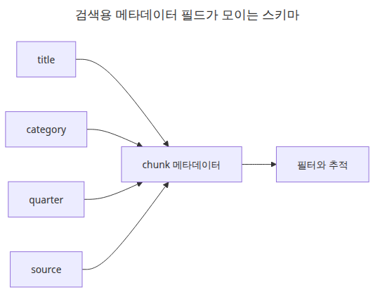
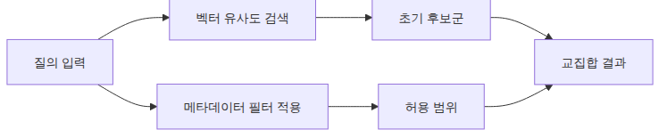
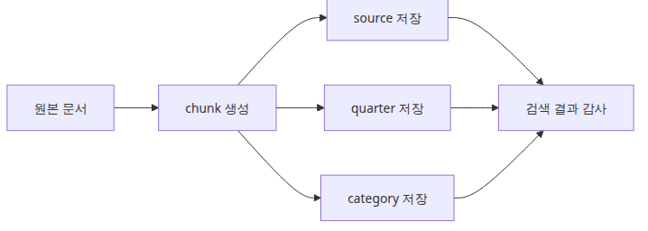

# 메타데이터 설계와 필터링

좋은 검색은 의미 유사도만으로 완성되지 않습니다. 운영 환경에서는 범위, 출처, 시간 구간처럼 랭킹 전에 먼저 좁혀야 하는 조건이 분명히 생깁니다.

이 글은 Document Ingestion 101 시리즈의 3번째 글입니다. 여기서는 실무에서 바로 쓸 수 있는 메타데이터 형태를 설계하고, 필터가 검색 동작을 어떻게 바꾸는지 눈에 보이게 확인합니다.

## 이 글에서 다룰 문제

- 어떤 검색 조건은 임베딩 유사도만으로 해결할 수 없을까요?
- 나중에 필터링하기 쉽도록 LangChain `Document` 메타데이터를 어떻게 설계해야 할까요?
- FAISS 검색 흐름에서 `filter` 파라미터는 어떤 모양으로 들어갈까요?

> 메타데이터는 본문 옆의 장식이 아니라 검색 후보군을 줄이는 첫 번째 인덱스입니다.

예제 코드: `en/03-metadata-filtering/main.py`


*Questions this post answers*

RAG에서 가장 흔한 실수 중 하나는 "의미가 비슷하다"와 "허용된 범위 안이다"를 섞어 생각하는 것입니다. 분기, 출처, 카테고리 같은 조건은 대개 벡터 유사도만으로 처리되지 않고, 구조화된 필터가 필요합니다.

이 예제는 작은 문서 세 개를 FAISS에 넣고 `category`와 `quarter` 기준으로 `filter`를 바꿔 보면서 검색 동작이 어떻게 달라지는지 분명하게 보여 줍니다.

## 메타데이터 스키마 설계



*Retrieval metadata schema flow*

좋은 스키마는 필드를 많이 모으는 데 있지 않습니다. 실제로 후보군을 줄이는 몇 개의 키를 남기는 데 있습니다.

## 필터가 후보군을 좁히는 방식



*Filtered retrieval candidate flow*

여러 청크가 의미상 비슷해도, 필터는 랭킹 전에 범위를 먼저 줄여서 검색 결과를 안정시킵니다.

## 실행 예제

```python
from __future__ import annotations

import hashlib
from dataclasses import dataclass

from langchain_community.vectorstores import FAISS
from langchain_core.documents import Document
from langchain_core.embeddings import Embeddings

class SimpleHashEmbeddings(Embeddings):
    def __init__(self, size: int = 32):
        self.size = size

    def _embed(self, text: str) -> list[float]:
        vector = [0.0] * self.size
        for token in text.lower().split():
            digest = hashlib.sha256(token.encode('utf-8')).digest()
            for index in range(self.size):
                vector[index] += digest[index] / 255.0
        return vector

    def embed_documents(self, texts: list[str]) -> list[list[float]]:
        return [self._embed(text) for text in texts]

    def embed_query(self, text: str) -> list[float]:
        return self._embed(text)

@dataclass
class ChunkSpec:
    title: str
    text: str
    category: str
    quarter: str
    source: str

    def to_document(self) -> Document:
        metadata = {
            'title': self.title,
            'category': self.category,
            'quarter': self.quarter,
            'source': self.source,
        }
        return Document(page_content=self.text, metadata=metadata)

def build_vectorstore() -> FAISS:
    docs = [
        ChunkSpec(
            title='Q4 marketing budget',
            text='The 2024 Q4 marketing budget focuses on campaign spend and partner events.',
            category='marketing',
            quarter='2024Q4',
            source='q4-report.pdf',
        ).to_document(),
        ChunkSpec(
            title='Q4 infrastructure cost',
            text='The 2024 Q4 infrastructure budget focuses on storage migration and backup cost.',
            category='engineering',
            quarter='2024Q4',
            source='q4-report.pdf',
        ).to_document(),
        ChunkSpec(
            title='Q3 marketing review',
            text='The 2024 Q3 marketing review summarizes webinar leads and conversion rate.',
            category='marketing',
            quarter='2024Q3',
            source='q3-review.md',
        ).to_document(),
    ]
    return FAISS.from_documents(docs, SimpleHashEmbeddings())

def main() -> None:
    vectorstore = build_vectorstore()
    query = 'marketing budget'

    print('[filter=category:marketing]')
    for doc in vectorstore.similarity_search(query, k=3, filter={'category': 'marketing'}):
        print(doc.metadata['title'], doc.metadata['quarter'], '-', doc.page_content)

    print('\n[filter=quarter:2024Q4]')
    for doc in vectorstore.similarity_search(query, k=3, filter={'quarter': '2024Q4'}):
        print(doc.metadata['title'], doc.metadata['category'], '-', doc.page_content)

if __name__ == '__main__':
    main()
```

## 실행 방법

```bash
python main.py
```

## 검증된 실행 결과

```text
[filter=category:marketing]
Q3 marketing review 2024Q3 - ...
Q4 marketing budget 2024Q4 - ...

[filter=quarter:2024Q4]
Q4 marketing budget marketing - ...
Q4 infrastructure cost engineering - ...
```

## 이 코드에서 먼저 봐야 할 점

### 유사도와 필터가 결합되는 순서


*Similarity and filter processing flow*

유사도와 필터는 하나의 불투명한 검색 단계가 아니라, 순서가 보이는 별도 단계로 다룰 때 해석이 쉬워집니다.

- `ChunkSpec`은 본문과 메타데이터를 함께 두어 검색 스키마를 한곳에서 보이게 합니다.
- `SimpleHashEmbeddings`는 네트워크 없이도 실제 `filter` 경로를 그대로 재현하게 해 줍니다.
- 핵심은 같은 질의라도 필터가 바뀌면 결과 집합이 달라진다는 점입니다.

## 실무에서 자주 헷갈리는 지점

### 출처 추적이 감사를 돕는 방식



*Source tracking and audit path*

응답이 이상해 보일 때는 청크 본문만 들여다보는 것보다, source와 scope 메타데이터가 실패 원인을 더 빨리 설명하는 경우가 많습니다.

- 메타데이터가 많다고 항상 좋은 것은 아닙니다. 실제로 필터링할 필드만 남겨야 합니다.
- 검색 결과가 이상하면 임베딩 모델보다 후보군 설계가 먼저 문제일 수 있습니다.
- FAISS는 관계형 데이터베이스가 아니므로, 더 복잡한 조건은 애플리케이션 레벨 설계가 함께 필요합니다.

## 체크리스트

- [ ] 청크 메타데이터에 최소한 `category`, `quarter`, `source`가 들어 있습니다.
- [ ] 같은 질의에 대해 서로 다른 필터 결과를 비교했습니다.
- [ ] 필드 이름이 문서 생성과 검색 단계에서 일관됩니다.
- [ ] 운영상 유용한 필드만 남기도록 스키마를 다듬었습니다.

## 정리

메타데이터는 본문을 설명하는 부가 정보가 아니라, 검색 전에 후보군을 줄이는 첫 번째 인덱스입니다. 그래서 어떤 필드를 저장할지보다, 어떤 필드가 실제로 검색 범위를 줄이는지부터 따져야 합니다.

이 글에서 본 `category`, `quarter`, `source` 같은 키는 단순하지만 강력합니다. 다음 글에서는 이런 메타데이터 계약을 유지한 채, 변경된 문서만 다시 처리하는 증분 인덱싱 흐름으로 넘어가겠습니다.

<!-- toc:begin -->
## 시리즈 목차

- [PDF 파싱과 텍스트 추출](./01-pdf-parsing.md)
- [청킹 전략 — 문서 유형별 최적화](./02-chunking-strategies.md)
- **메타데이터 설계와 필터링 (현재 글)**
- 증분 인덱싱 — 변경된 문서만 업데이트 (예정)
- 다중 포맷 문서 파이프라인 (예정)
- 문서 수집 파이프라인 완성 (예정)

<!-- toc:end -->

## 참고 자료

### 공식 문서

- [LangChain FAISS integration guide](https://python.langchain.com/docs/integrations/vectorstores/faiss/)
- [LangChain Document object concepts](https://python.langchain.com/docs/concepts/documents/)

### 검증에 도움 되는 자료

- [FAISS GitHub repository](https://github.com/facebookresearch/faiss)
- [FAISS documentation](https://faiss.ai/)

Tags: RAG, Document Processing, LangChain, Python
