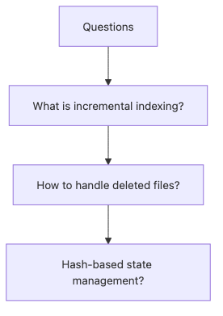
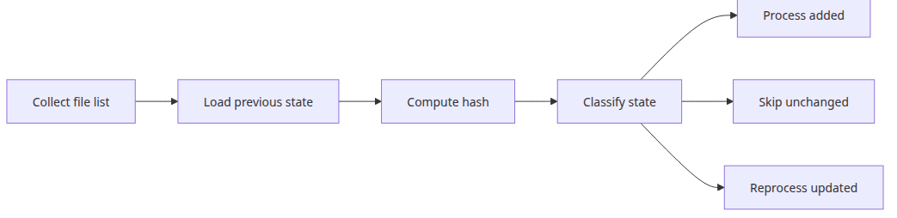
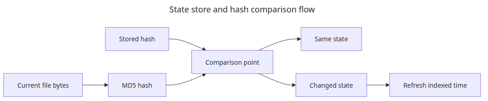
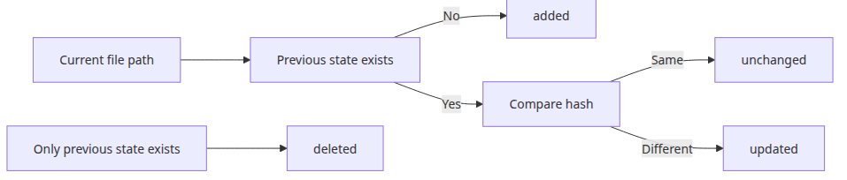
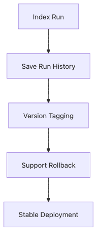

# 증분 인덱싱 — 변경된 문서만 업데이트

전체 인덱스를 다시 만드는 방식은 단순합니다. 하지만 코퍼스가 커지면 생각보다 빨리 한계가 옵니다. 그 시점부터 중요한 질문은 무엇이 바뀌었는지 기억하고, 나머지는 안전하게 건너뛰는 방법입니다.

이 글은 Document Ingestion 101 시리즈의 4번째 글입니다. 여기서는 파일 해시와 작은 상태 저장소를 이용해 추가된 문서, 변경 없는 문서, 수정된 문서를 구분합니다.

## 이 글에서 다룰 문제

- 전체를 다시 만들지 않고 변경된 문서만 처리하려면 무엇이 필요할까요?
- 해시 기반 상태 저장소의 가장 단순한 형태는 무엇일까요?
- 실행 로그에서 변경 없음, 수정됨, 신규 파일을 어떻게 구분할 수 있을까요?

> 증분 인덱싱은 벡터 저장소 트릭이라기보다 무엇을 기억할지 정하는 운영 문제에 더 가깝습니다.

예제 코드: `en/04-incremental-indexing/main.py`



*Questions this post answers*

파일 수가 수십 개일 때는 전체 재색인도 감당할 수 있습니다. 하지만 수천 개로 커지면 전체 재실행은 금방 낭비가 됩니다.

이 예제는 파일 해시와 JSON 상태 파일만으로 `added`, `unchanged`, `updated`를 구분합니다. 이 단순한 분류기가 이후 모든 벡터 저장소 업데이트 흐름의 기초가 됩니다.

## 증분 스캔과 변경 감지



*Incremental scan and change detection flow*

증분 인덱싱의 첫 이득은 비싼 후속 처리를 시작하기 전에 작업 집합을 먼저 줄이는 데 있습니다.

## 상태 저장소와 해시 비교



*State store and hash comparison flow*

타임스탬프 옆에 내용 해시까지 두면, 변경 감지기는 mtime만 보는 방식보다 훨씬 믿을 만해집니다.

## 실행 예제

```python
from __future__ import annotations

import hashlib
import json
from datetime import datetime
from pathlib import Path

BASE_DIR = Path(__file__).resolve().parent
WORK_DIR = BASE_DIR / 'workspace'
WORK_DIR.mkdir(exist_ok=True)
STATE_FILE = BASE_DIR / 'index_state.json'

class IndexStateStore:
    def __init__(self, state_file: Path):
        self.state_file = state_file
        self.state = json.loads(state_file.read_text(encoding='utf-8')) if state_file.exists() else {}

    def save(self) -> None:
        self.state_file.write_text(json.dumps(self.state, ensure_ascii=False, indent=2), encoding='utf-8')

    def file_hash(self, file_path: Path) -> str:
        return hashlib.md5(file_path.read_bytes()).hexdigest()

    def classify(self, file_path: Path) -> str:
        record = self.state.get(str(file_path))
        if record is None:
            return 'added'
        current_hash = self.file_hash(file_path)
        if record['hash'] != current_hash:
            return 'updated'
        return 'unchanged'

    def mark_indexed(self, file_path: Path) -> None:
        self.state[str(file_path)] = {
            'hash': self.file_hash(file_path),
            'mtime': file_path.stat().st_mtime,
            'indexed_at': datetime.now().isoformat(timespec='seconds'),
        }

def reset_demo_state() -> None:
    if STATE_FILE.exists():
        STATE_FILE.unlink()
    for file_path in WORK_DIR.glob('*'):
        if file_path.is_file():
            file_path.unlink()

def seed_files() -> list[Path]:
    files = {
        'alpha.txt': 'This is the first document. It acts as the baseline for incremental indexing.\n',
        'beta.txt': 'This is the second document. We will revise it later.\n',
    }
    paths = []
    for name, content in files.items():
        path = WORK_DIR / name
        if not path.exists():
            path.write_text(content, encoding='utf-8')
        paths.append(path)
    return paths

def scan(store: IndexStateStore, files: list[Path], label: str) -> None:
    print(f'[{label}]')
    for file_path in files:
        state = store.classify(file_path)
        print(f'  {file_path.name}: {state}')
        if state in {'added', 'updated'}:
            store.mark_indexed(file_path)
    store.save()

def main() -> None:
    reset_demo_state()
    files = seed_files()
    store = IndexStateStore(STATE_FILE)
    scan(store, files, 'first run')
    scan(store, files, 'second run without changes')
    files[1].write_text('This is the second document. Its contents changed, so it must be reprocessed.\n', encoding='utf-8')
    scan(store, files, 'third run after beta update')

if __name__ == '__main__':
    main()
```

## 실행 방법

```bash
python main.py
```

## 검증된 실행 결과

```text
[first run]
  alpha.txt: added
  beta.txt: added
[second run without changes]
  alpha.txt: unchanged
  beta.txt: unchanged
[third run after beta update]
  alpha.txt: unchanged
  beta.txt: updated
```

## 이 코드에서 먼저 봐야 할 점

### 추가 수정 삭제 경로



*Added updated and deleted decision flow*

삭제를 별도 경로로 모델링해 두면, 인덱스 정리 역시 같은 상태 기계의 확장으로 다룰 수 있습니다.

- `IndexStateStore`는 해시, mtime, indexed_at을 함께 저장해 디버깅을 쉽게 만듭니다.
- 스크립트는 의도적으로 세 번 실행되어 `added → unchanged → updated` 수명 주기를 다시 보여 줍니다.
- 처음에는 JSON을 써서 로직을 투명하게 만들고, 같은 패턴을 나중에 데이터베이스로 옮기면 됩니다.

## 실무에서 자주 헷갈리는 지점

### 인덱스 버전과 실행 이력



*Index version and run history flow*

규모가 커지면 무엇이 바뀌었는지 아는 것만큼, 어떤 실행이 어떤 인덱스 버전을 만들었는지 아는 일도 중요해집니다.

- mtime만 보는 체크는 빠르지만 변경을 과하게 잡을 수 있습니다. 그래서 내용 해시가 여전히 중요합니다.
- 증분 인덱싱에는 변경을 감지하는 단계와 변경을 반영하는 단계, 두 가지 관심사가 있습니다.
- 삭제 처리는 현재 파일 목록과 저장된 상태를 비교하는 추가 패스를 필요로 합니다.

## 체크리스트

- [ ] 상태 저장소에 해시와 타임스탬프를 함께 기록합니다.
- [ ] 수정 없는 두 번째 실행이 `unchanged`로 떨어집니다.
- [ ] 나중의 파일 수정이 `updated`로 분류됩니다.
- [ ] 삭제 처리를 어디에 끼워 넣을지 정했습니다.

## 정리

증분 인덱싱의 본질은 벡터 저장소보다 먼저 상태 기억에 있습니다. 무엇이 새 파일인지, 무엇이 바뀌지 않았는지, 무엇이 다시 처리되어야 하는지를 안정적으로 구분해야 뒤의 임베딩 비용을 아낄 수 있습니다.

해시와 작은 상태 저장소만으로도 그 출발점은 충분히 만들 수 있습니다. 다음 글에서는 이렇게 구분된 문서를 여러 파일 형식에서 공통 `Document` 계약으로 모으는 다중 포맷 파이프라인을 보겠습니다.

<!-- toc:begin -->
## 시리즈 목차

- [PDF 파싱과 텍스트 추출](./01-pdf-parsing.md)
- [청킹 전략 — 문서 유형별 최적화](./02-chunking-strategies.md)
- [메타데이터 설계와 필터링](./03-metadata-filtering.md)
- **증분 인덱싱 — 변경된 문서만 업데이트 (현재 글)**
- 다중 포맷 문서 파이프라인 (예정)
- 문서 수집 파이프라인 완성 (예정)

<!-- toc:end -->

## 참고 자료

- https://docs.python.org/3/library/hashlib.html

Tags: RAG, Document Processing, LangChain, Python
