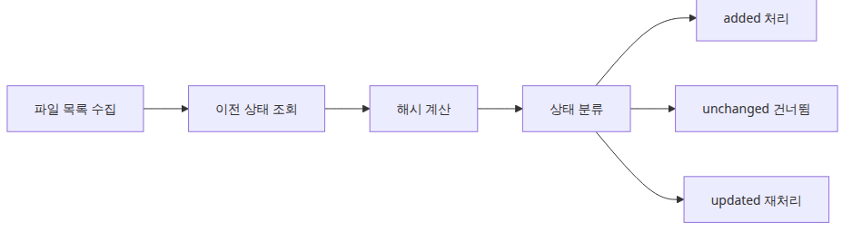
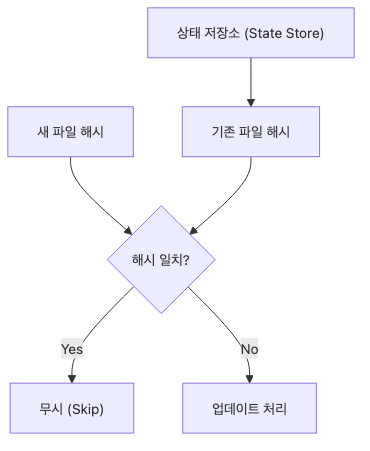
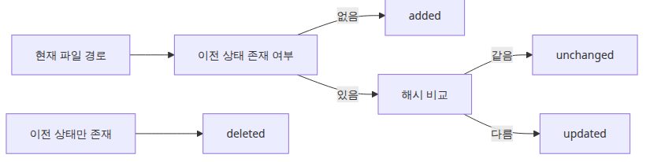
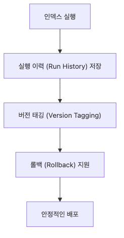

# 증분 인덱싱 — 변경된 문서만 업데이트

문서 수가 적을 때는 전체 재색인도 버틸 만합니다. 하지만 코퍼스가 커지기 시작하면 무엇이 바뀌었는지를 기억하고 나머지는 건너뛰는 운영 감각이 더 중요해집니다.

이 글은 문서 수집과 인덱싱 101 시리즈의 네 번째 글입니다. 여기서는 파일 해시와 작은 상태 저장소만으로 added, unchanged, updated를 구분하는 방법을 다룹니다.

> 증분 인덱싱은 벡터 저장소 기술이라기보다 운영에서 무엇을 기억할지에 관한 문제에 더 가깝습니다.

## 이 글에서 다룰 문제

- 전체를 다시 빌드하지 않고 변경된 문서만 처리하려면 무엇이 필요할까요?
- 해시 기반 상태 저장소는 가장 단순하게 어떤 모양이면 충분할까요?
- 실행 로그에서 변경 없음, 수정됨, 신규 파일을 어떻게 구분할 수 있을까요?

## 증분 스캔과 변경 감지 흐름



*증분 스캔과 변경 감지가 이어지는 흐름*
증분 인덱싱의 핵심은 파일을 읽는 비용보다 먼저 어떤 파일이 다시 처리 대상인지 좁히는 데 있습니다.

## 상태 저장소와 해시 비교 구조



*상태 저장소와 해시 비교가 맞물리는 구조*
mtime만 보는 방식보다 해시 비교를 같이 넣으면 운영에서 오탐과 누락을 줄이기 쉽습니다.

## 실행 예제

```python
from __future__ import annotations

import hashlib
import json
from datetime import datetime
from pathlib import Path

BASE_DIR = Path(__file__).resolve().parent
WORK_DIR = BASE_DIR / 'workspace'
WORK_DIR.mkdir(exist_ok=True)
STATE_FILE = BASE_DIR / 'index_state.json'

class IndexStateStore:
    def __init__(self, state_file: Path):
        self.state_file = state_file
        self.state = json.loads(state_file.read_text(encoding='utf-8')) if state_file.exists() else {}

    def save(self) -> None:
        self.state_file.write_text(json.dumps(self.state, ensure_ascii=False, indent=2), encoding='utf-8')

    def file_hash(self, file_path: Path) -> str:
        return hashlib.md5(file_path.read_bytes()).hexdigest()

    def classify(self, file_path: Path) -> str:
        record = self.state.get(str(file_path))
        if record is None:
            return 'added'
        current_hash = self.file_hash(file_path)
        if record['hash'] != current_hash:
            return 'updated'
        return 'unchanged'

    def mark_indexed(self, file_path: Path) -> None:
        self.state[str(file_path)] = {
            'hash': self.file_hash(file_path),
            'mtime': file_path.stat().st_mtime,
            'indexed_at': datetime.now().isoformat(timespec='seconds'),
        }

def reset_demo_state() -> None:
    if STATE_FILE.exists():
        STATE_FILE.unlink()
    for file_path in WORK_DIR.glob('*'):
        if file_path.is_file():
            file_path.unlink()

def seed_files() -> list[Path]:
    files = {
        'alpha.txt': 'This is the first document. It acts as the baseline for incremental indexing.
',
        'beta.txt': 'This is the second document. We will revise it later.
',
    }
    paths = []
    for name, content in files.items():
        path = WORK_DIR / name
        if not path.exists():
            path.write_text(content, encoding='utf-8')
        paths.append(path)
    return paths

def scan(store: IndexStateStore, files: list[Path], label: str) -> None:
    print(f'[{label}]')
    for file_path in files:
        state = store.classify(file_path)
        print(f'  {file_path.name}: {state}')
        if state in {'added', 'updated'}:
            store.mark_indexed(file_path)
    store.save()

def main() -> None:
    reset_demo_state()
    files = seed_files()
    store = IndexStateStore(STATE_FILE)
    scan(store, files, 'first run')
    scan(store, files, 'second run without changes')
    files[1].write_text('This is the second document. Its contents changed, so it must be reprocessed.
', encoding='utf-8')
    scan(store, files, 'third run after beta update')

if __name__ == '__main__':
    main()
```

## 실행 방법

```bash
python main.py
```

## 검증된 실행 결과

```text
[first run]
  alpha.txt: added
  beta.txt: added
[second run without changes]
  alpha.txt: unchanged
  beta.txt: unchanged
[third run after beta update]
  alpha.txt: unchanged
  beta.txt: updated
```

## 이 코드에서 봐야 할 것

### 추가 업데이트 삭제 분기



*추가 업데이트 삭제를 가르는 처리 분기*
삭제 처리까지 모델에 넣어 두면 나중에 전체 재색인 없이도 index 청소 경로를 자연스럽게 확장할 수 있습니다.

- `IndexStateStore`가 해시, mtime, indexed_at을 함께 저장해 디버깅 포인트를 남깁니다.
- 동일한 스크립트를 세 번 연속 실행하면서 added → unchanged → updated 흐름을 재현합니다.
- 상태 저장소가 JSON이어서 로직을 먼저 이해하고 나중에 DB로 옮기기 쉽습니다.

## 실무에서 헷갈리는 지점

### 인덱스 버전과 실행 기록 흐름



*인덱스 버전과 실행 기록이 남는 흐름*
운영 자동화에서는 변경 감지 자체보다도 어떤 실행이 어떤 인덱스 버전을 만들었는지 남기는 일이 더 중요해지는 시점이 옵니다.

- mtime만 비교하면 빠르지만 오탐이 생길 수 있습니다. 내용 해시를 같이 보는 이유가 여기에 있습니다.
- 증분 인덱싱은 “변경 감지”와 “변경 반영” 두 단계입니다. 둘을 섞어 생각하면 구현이 꼬입니다.
- 삭제 처리까지 넣으려면 현재 파일 목록과 이전 상태 목록을 비교하는 루프가 추가로 필요합니다.

## 체크리스트

- [ ] 상태 저장소에 해시와 시각을 함께 기록한다.
- [ ] 변경 없는 두 번째 실행이 unchanged로 떨어진다.
- [ ] 파일 수정 후 세 번째 실행이 updated로 바뀐다.
- [ ] 삭제 처리 확장 포인트를 설계했다.

<!-- toc:begin -->
## 시리즈 목차

- [PDF 파싱과 텍스트 추출](./01-pdf-parsing.md)
- [청킹 전략 — 문서 유형별 최적화](./02-chunking-strategies.md)
- [메타데이터 설계와 필터링](./03-metadata-filtering.md)
- **증분 인덱싱 — 변경된 문서만 업데이트 (현재 글)**
- 다중 포맷 문서 파이프라인 (예정)
- 문서 수집 파이프라인 완성 (예정)

<!-- toc:end -->

## 참고 자료

- https://docs.python.org/3/library/hashlib.html

Tags: RAG, Document Processing, LangChain, Python
