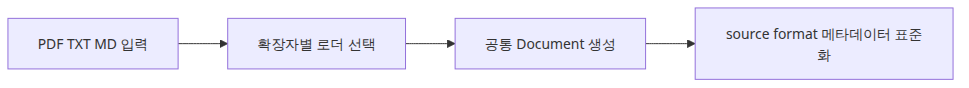

# 다중 포맷 문서 파이프라인

## 이 글에서 답할 질문

- PDF, TXT, MD를 하나의 파이프라인으로 어떻게 묶을 수 있을까요?
- 파일 형식마다 로더가 달라도 왜 공통 `Document` 구조가 중요할까요?
- 포맷별 분기와 메타데이터 표준화는 어디서 처리하는 편이 좋을까요?

> 다중 포맷 파이프라인의 본질은 다양한 입력을 하나의 `Document` 계약으로 수렴시키는 일입니다.

예제 코드: `/root/Github/document-ingestion-101/ko/05-multi-format-pipeline/main.py`


실제 문서 수집은 PDF만 다루지 않습니다. 운영 노트는 TXT로, 팀 런북은 Markdown으로, 외부 자료는 PDF로 들어오는 경우가 흔합니다.

이번 예제는 세 포맷을 각각 읽되 최종 출력은 모두 같은 `Document` 구조로 맞춥니다. 그래야 이후 청킹과 인덱싱 단계가 포맷 차이를 의식하지 않아도 됩니다.

## 실행 예제

```python
# pyright: reportMissingImports=false, reportMissingModuleSource=false
from __future__ import annotations

from pathlib import Path

from langchain_core.documents import Document
from pypdf import PdfReader
from reportlab.lib.pagesizes import A4
from reportlab.pdfgen import canvas

BASE_DIR = Path(__file__).resolve().parent
DATA_DIR = BASE_DIR / 'data'
DATA_DIR.mkdir(exist_ok=True)

def create_pdf(path: Path) -> None:
    c = canvas.Canvas(str(path), pagesize=A4)
    c.setFont('Helvetica', 12)
    c.drawString(72, 780, 'PDF source: incident review and remediation steps.')
    c.drawString(72, 760, 'Store the source format in metadata so later stages stay uniform.')
    c.save()

def seed_files() -> list[Path]:
    pdf_path = DATA_DIR / 'incident.pdf'
    txt_path = DATA_DIR / 'notes.txt'
    md_path = DATA_DIR / 'runbook.md'
    create_pdf(pdf_path)
    txt_path.write_text('TXT source: queue backlog grew overnight. Scale-out reduced latency.
', encoding='utf-8')
    md_path.write_text('# Runbook

MD source: restart the worker only after checking the dead-letter queue.
', encoding='utf-8')
    return [pdf_path, txt_path, md_path]

def load_pdf(path: Path) -> list[Document]:
    reader = PdfReader(str(path))
    text = '
'.join((page.extract_text() or '').strip() for page in reader.pages)
    return [Document(page_content=text, metadata={'source': path.name, 'format': 'pdf'})]

def load_text_like(path: Path, fmt: str) -> list[Document]:
    return [Document(page_content=path.read_text(encoding='utf-8'), metadata={'source': path.name, 'format': fmt})]

def load_document(path: Path) -> list[Document]:
    suffix = path.suffix.lower()
    if suffix == '.pdf':
        return load_pdf(path)
    if suffix == '.txt':
        return load_text_like(path, 'txt')
    if suffix in {'.md', '.markdown'}:
        return load_text_like(path, 'md')
    raise ValueError(f'unsupported format: {suffix}')

def main() -> None:
    for path in seed_files():
        docs = load_document(path)
        for doc in docs:
            preview = doc.page_content.replace('
', ' ')[:90]
            print(f"source={doc.metadata['source']} format={doc.metadata['format']} preview={preview}")

if __name__ == '__main__':
    main()
```

## 실행 방법

```bash
python main.py
```

## 검증된 실행 결과

```text
source=incident.pdf format=pdf preview=PDF source: incident review and remediation steps. ...
source=notes.txt format=txt preview=TXT source: queue backlog grew overnight. ...
source=runbook.md format=md preview=# Runbook MD source: restart the worker ...
```

## 이 코드에서 봐야 할 것

- `load_document()`가 확장자 분기를 한곳에 모아서 라우팅 책임을 명확히 합니다.
- 각 로더가 `source`와 `format` 메타데이터를 공통 키로 맞추기 때문에 후속 단계 코드가 단순해집니다.
- PDF는 `pypdf`, TXT/MD는 파일 읽기로 처리해도 출력 계약은 동일합니다.

## 실무에서 헷갈리는 지점

- 다중 포맷 지원은 로더 개수를 늘리는 문제가 아니라 메타데이터 키를 통일하는 문제입니다.
- Markdown도 결국 텍스트처럼 읽을 수 있지만 헤더 보존이 필요하면 이후 청킹 설정을 별도로 가져가야 합니다.
- PDF 로더와 텍스트 로더의 반환 단위가 다를 수 있으니 페이지 기준인지 파일 기준인지 계약을 먼저 정해야 합니다.

## 체크리스트

- [ ] PDF, TXT, MD 입력을 모두 한 번에 처리했다.
- [ ] 모든 출력에 source와 format 메타데이터가 있다.
- [ ] 확장자 라우팅 로직이 한 함수에 모여 있다.
- [ ] 후속 단계가 포맷별 조건문 없이 동작할 수 있는지 확인했다.

<!-- blog-only:start -->

## 정리

포맷별 파싱은 달라도 `Document` 계약이 하나면 나머지 파이프라인은 훨씬 단순해집니다.

다음 글에서는 이 모든 단계를 합쳐 FAISS 저장과 재로딩까지 이어지는 완성형 파이프라인을 만듭니다.

<!-- blog-only:end -->

<!-- toc:begin -->
## 시리즈 목차

- [PDF 파싱과 텍스트 추출](./01-pdf-parsing.md)
- [청킹 전략 — 문서 유형별 최적화](./02-chunking-strategies.md)
- [메타데이터 설계와 필터링](./03-metadata-filtering.md)
- [증분 인덱싱 — 변경된 문서만 업데이트](./04-incremental-indexing.md)
- **다중 포맷 문서 파이프라인 (현재 글)**
- 문서 수집 파이프라인 완성 (예정)

<!-- toc:end -->

## 참고 자료

- https://python.langchain.com/docs/concepts/document_loaders/

Tags: RAG, Document Processing, LangChain, Python
