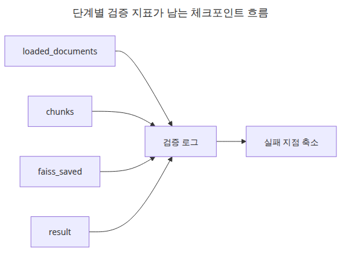
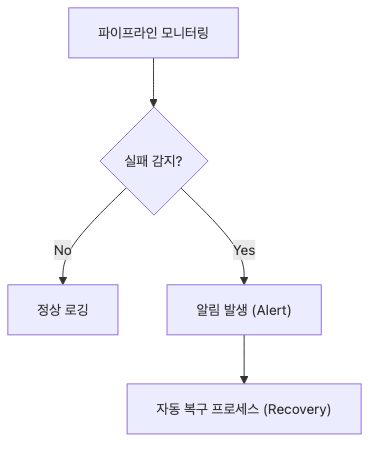

# 문서 수집 파이프라인 완성

> 완성된 수집 파이프라인은 단계 수가 많아서가 아니라 각 단계가 다음 단계로 깔끔하게 넘겨질 때 비로소 완성됩니다.

## 이 글에서 다룰 문제

- 로딩, 청킹, 임베딩, FAISS 저장·재로드를 하나의 흐름으로 어떻게 연결할 수 있을까요?
- 전체 파이프라인이 실제로 동작했다는 최소한의 증거는 어떤 출력일까요?
- 검색 흐름을 오프라인에서도 재현 가능하게 유지하려면 어떻게 해야 할까요?

## 엔드투엔드 수집 파이프라인


*전체 수집 단계가 이어지는 파이프라인 흐름*
마지막 글의 핵심은 각 단계의 세부 구현보다도 앞 단계 출력이 다음 단계 입력으로 자연스럽게 이어지는지 확인하는 데 있습니다.

## 단계별 검증 체크포인트



*단계별 검증 지표가 남는 체크포인트 흐름*
체크포인트를 적게 두더라도 단계 경계마다 숫자와 경로를 하나씩 남기면 원인 추적 속도가 크게 빨라집니다.

## 실행 예제

```python
# pyright: reportMissingImports=false, reportMissingModuleSource=false
from __future__ import annotations

import hashlib
import shutil
from pathlib import Path

from langchain_community.vectorstores import FAISS
from langchain_core.documents import Document
from langchain_core.embeddings import Embeddings
from langchain_text_splitters import RecursiveCharacterTextSplitter
from pypdf import PdfReader
from reportlab.lib.pagesizes import A4
from reportlab.pdfgen import canvas

BASE_DIR = Path(__file__).resolve().parent
DATA_DIR = BASE_DIR / 'data'
INDEX_DIR = BASE_DIR / 'faiss_store'
DATA_DIR.mkdir(exist_ok=True)

class SimpleHashEmbeddings(Embeddings):
    def __init__(self, size: int = 32):
        self.size = size

    def _embed(self, text: str) -> list[float]:
        vector = [0.0] * self.size
        for token in text.lower().split():
            digest = hashlib.sha256(token.encode('utf-8')).digest()
            for index in range(self.size):
                vector[index] += digest[index] / 255.0
        return vector

    def embed_documents(self, texts: list[str]) -> list[list[float]]:
        return [self._embed(text) for text in texts]

    def embed_query(self, text: str) -> list[float]:
        return self._embed(text)

def create_pdf(path: Path) -> None:
    c = canvas.Canvas(str(path), pagesize=A4)
    c.setFont('Helvetica', 12)
    c.drawString(72, 780, 'PDF source: access policy and retention rules.')
    c.drawString(72, 760, 'Chunk metadata should preserve the original file name and format.')
    c.save()

def seed_files() -> list[Path]:
    pdf_path = DATA_DIR / 'policy.pdf'
    txt_path = DATA_DIR / 'ops.txt'
    md_path = DATA_DIR / 'faq.md'
    create_pdf(pdf_path)
    txt_path.write_text('TXT source: nightly ingestion runs at 02:00 and retries failed files first.
', encoding='utf-8')
    md_path.write_text('# FAQ

MD source: metadata filters reduce the candidate set before answer generation.
', encoding='utf-8')
    return [pdf_path, txt_path, md_path]

def load_file(path: Path) -> list[Document]:
    suffix = path.suffix.lower()
    if suffix == '.pdf':
        reader = PdfReader(str(path))
        text = '
'.join((page.extract_text() or '').strip() for page in reader.pages)
        return [Document(page_content=text, metadata={'source': path.name, 'format': 'pdf'})]
    if suffix == '.txt':
        return [Document(page_content=path.read_text(encoding='utf-8'), metadata={'source': path.name, 'format': 'txt'})]
    if suffix in {'.md', '.markdown'}:
        return [Document(page_content=path.read_text(encoding='utf-8'), metadata={'source': path.name, 'format': 'md'})]
    raise ValueError(f'unsupported format: {suffix}')

def chunk_documents(documents: list[Document]) -> list[Document]:
    splitter = RecursiveCharacterTextSplitter(
        chunk_size=90,
        chunk_overlap=20,
        separators=['

', '
', '. ', ' '],
    )
    chunks = splitter.split_documents(documents)
    for index, chunk in enumerate(chunks):
        chunk.metadata['chunk_id'] = f'chunk-{index:02d}'
    return chunks

def main() -> None:
    files = seed_files()
    loaded = [doc for path in files for doc in load_file(path)]
    chunks = chunk_documents(loaded)
    if INDEX_DIR.exists():
        shutil.rmtree(INDEX_DIR)
    vectorstore = FAISS.from_documents(chunks, SimpleHashEmbeddings())
    vectorstore.save_local(str(INDEX_DIR))
    reloaded = FAISS.load_local(
        str(INDEX_DIR),
        SimpleHashEmbeddings(),
        allow_dangerous_deserialization=True,
    )
    results = reloaded.similarity_search('metadata filters and retention', k=2)

    print(f'loaded_documents: {len(loaded)}')
    print(f'chunks: {len(chunks)}')
    print(f'faiss_saved: {INDEX_DIR}')
    for doc in results:
        preview = doc.page_content.replace('
', ' ')[:90]
        print(f"result={doc.metadata['source']} chunk_id={doc.metadata['chunk_id']} preview={preview}")

if __name__ == '__main__':
    main()
```

## 실행 방법

```bash
python main.py
```

## 검증된 실행 결과

```text
loaded_documents: 3
chunks: 4
faiss_saved: /root/Github/document-ingestion-101/ko/06-pipeline-completion/faiss_store
result=policy.pdf chunk_id=chunk-00 preview=PDF source: access policy and retention rules.
result=policy.pdf chunk_id=chunk-01 preview=Chunk metadata should preserve the original file name and format.
```

## 이 코드에서 봐야 할 것

### 모니터링과 장애 복구 흐름



*모니터링과 장애 복구가 이어지는 흐름*
운영용 ingestion은 성공 경로만 그리면 부족하고 어느 단계에서 멈췄는지 되짚을 복구 경로도 함께 있어야 합니다.

- `load_file()`가 포맷 차이를 흡수하고, `chunk_documents()`가 공통 청크 계약을 만듭니다.
- `SimpleHashEmbeddings` 덕분에 외부 모델 다운로드 없이도 FAISS 저장·재로딩 흐름을 끝까지 검증할 수 있습니다.
- 검증 포인트를 `loaded_documents`, `chunks`, `faiss_saved`, `result` 네 줄로 남겨서 실패 지점을 빠르게 좁힐 수 있습니다.

## 실무에서 헷갈리는 지점

### 재시도와 재처리 제어 구조


*재시도와 재처리를 나누는 제어 구조*
재시도와 재처리를 같은 버튼으로 취급하면 중복 비용이 커지므로 둘을 다른 제어 경로로 나눠 두는 편이 좋습니다.

- 엔드투엔드 데모라고 해서 LLM 호출까지 꼭 넣을 필요는 없습니다. 먼저 인덱스가 정상 저장·재로딩되는지 확인하는 편이 중요합니다.
- 임베딩 품질과 파이프라인 동작 검증은 다른 문제입니다. 데모 단계에서는 재현성이 더 중요합니다.
- FAISS 저장 후 다시 읽는 절차를 빼면 운영 배포 시 경로, 권한, 직렬화 문제를 놓치기 쉽습니다.

## 체크리스트

- [ ] 세 포맷을 모두 로드했다.
- [ ] 청크 수가 기대 범위인지 확인했다.
- [ ] FAISS 인덱스를 저장한 뒤 다시 로드했다.
- [ ] 재로딩된 인덱스에서 검색 결과를 확인했다.

<!-- toc:begin -->
## 시리즈 목차

- [PDF 파싱과 텍스트 추출](./01-pdf-parsing.md)
- [청킹 전략 — 문서 유형별 최적화](./02-chunking-strategies.md)
- [메타데이터 설계와 필터링](./03-metadata-filtering.md)
- [증분 인덱싱 — 변경된 문서만 업데이트](./04-incremental-indexing.md)
- [다중 포맷 문서 파이프라인](./05-multi-format-pipeline.md)
- **문서 수집 파이프라인 완성 (현재 글)**

<!-- toc:end -->

## 참고 자료

- https://python.langchain.com/docs/integrations/vectorstores/faiss/
- https://github.com/facebookresearch/faiss

Tags: RAG, Document Processing, LangChain, Python
