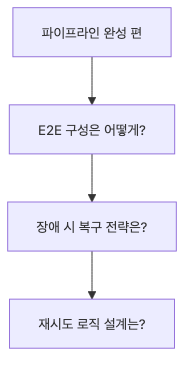

# 문서 수집 파이프라인 완성

수집 파이프라인의 가치는 각 단계를 따로 아는 데서 나오지 않습니다. 로딩, 청킹, 인덱싱을 각각 이해해도, 그것들이 엔드투엔드 실행에서 함께 버티지 못하면 실제 파이프라인이라고 부르기 어렵습니다.

이 글은 Document Ingestion 101 시리즈의 마지막 글입니다. 여기서는 앞선 조각들을 하나의 재현 가능한 흐름으로 연결하고, 인덱스를 저장한 뒤 다시 불러와 검색까지 되는지 확인합니다.

## 이 글에서 다룰 문제

- 로딩, 청킹, 임베딩, FAISS 저장·재로드를 하나의 흐름으로 어떻게 연결할 수 있을까요?
- 전체 파이프라인이 실제로 동작했다는 최소 증거는 무엇일까요?
- 검색 흐름을 오프라인에서도 재현 가능하게 유지하려면 어떻게 해야 할까요?

> 완성된 수집 파이프라인은 단계 수가 아니라, 각 단계가 다음 단계로 깨지지 않고 넘겨지는지로 판단해야 합니다.

예제 코드: `en/06-pipeline-completion/main.py`



*Questions this post answers*

마지막 글은 앞에서 따로 보았던 예제들을 하나의 실제 흐름으로 조립합니다. 이제 중요한 질문은 각 단계 경계가 여전히 맞물리는가입니다.

이 예제는 세 가지 형식을 로드하고, 청킹하고, FAISS에 임베딩을 저장한 뒤, 저장한 인덱스를 다시 읽어 검색합니다. 이 정도면 ingestion MVP가 끝에서 끝까지 동작한다는 최소 증거로 충분합니다.

## 엔드투엔드 수집 파이프라인


*End-to-end ingestion pipeline flow*

마지막 글의 핵심은 개별 함수의 깊은 로직보다 단계 사이 handoff가 깨지지 않는지 확인하는 데 있습니다.

## 단계별 검증 체크포인트


*Stage verification checkpoint flow*

단계별 체크포인트 몇 개만 잘 두어도 파이프라인이 어디서 깨졌는지 빠르게 좁힐 수 있습니다.

## 실행 예제

```python
# pyright: reportMissingImports=false, reportMissingModuleSource=false
from __future__ import annotations

import hashlib
import shutil
from pathlib import Path

from langchain_community.vectorstores import FAISS
from langchain_core.documents import Document
from langchain_core.embeddings import Embeddings
from langchain_text_splitters import RecursiveCharacterTextSplitter
from pypdf import PdfReader
from reportlab.lib.pagesizes import A4
from reportlab.pdfgen import canvas

BASE_DIR = Path(__file__).resolve().parent
DATA_DIR = BASE_DIR / 'data'
INDEX_DIR = BASE_DIR / 'faiss_store'
DATA_DIR.mkdir(exist_ok=True)

class SimpleHashEmbeddings(Embeddings):
    def __init__(self, size: int = 32):
        self.size = size

    def _embed(self, text: str) -> list[float]:
        vector = [0.0] * self.size
        for token in text.lower().split():
            digest = hashlib.sha256(token.encode('utf-8')).digest()
            for index in range(self.size):
                vector[index] += digest[index] / 255.0
        return vector

    def embed_documents(self, texts: list[str]) -> list[list[float]]:
        return [self._embed(text) for text in texts]

    def embed_query(self, text: str) -> list[float]:
        return self._embed(text)

def create_pdf(path: Path) -> None:
    c = canvas.Canvas(str(path), pagesize=A4)
    c.setFont('Helvetica', 12)
    c.drawString(72, 780, 'PDF source: access policy and retention rules.')
    c.drawString(72, 760, 'Chunk metadata should preserve the original file name and format.')
    c.save()

def seed_files() -> list[Path]:
    pdf_path = DATA_DIR / 'policy.pdf'
    txt_path = DATA_DIR / 'ops.txt'
    md_path = DATA_DIR / 'faq.md'
    create_pdf(pdf_path)
    txt_path.write_text('TXT source: nightly ingestion runs at 02:00 and retries failed files first.\n', encoding='utf-8')
    md_path.write_text('# FAQ\n\nMD source: metadata filters reduce the candidate set before answer generation.\n', encoding='utf-8')
    return [pdf_path, txt_path, md_path]

def load_file(path: Path) -> list[Document]:
    suffix = path.suffix.lower()
    if suffix == '.pdf':
        reader = PdfReader(str(path))
        text = '\n'.join((page.extract_text() or '').strip() for page in reader.pages)
        return [Document(page_content=text, metadata={'source': path.name, 'format': 'pdf'})]
    if suffix == '.txt':
        return [Document(page_content=path.read_text(encoding='utf-8'), metadata={'source': path.name, 'format': 'txt'})]
    if suffix in {'.md', '.markdown'}:
        return [Document(page_content=path.read_text(encoding='utf-8'), metadata={'source': path.name, 'format': 'md'})]
    raise ValueError(f'unsupported format: {suffix}')

def chunk_documents(documents: list[Document]) -> list[Document]:
    splitter = RecursiveCharacterTextSplitter(
        chunk_size=90,
        chunk_overlap=20,
        separators=['\n\n', '\n', '. ', ' '],
    )
    chunks = splitter.split_documents(documents)
    for index, chunk in enumerate(chunks):
        chunk.metadata['chunk_id'] = f'chunk-{index:02d}'
    return chunks

def main() -> None:
    files = seed_files()
    loaded = [doc for path in files for doc in load_file(path)]
    chunks = chunk_documents(loaded)
    if INDEX_DIR.exists():
        shutil.rmtree(INDEX_DIR)
    vectorstore = FAISS.from_documents(chunks, SimpleHashEmbeddings())
    vectorstore.save_local(str(INDEX_DIR))
    reloaded = FAISS.load_local(
        str(INDEX_DIR),
        SimpleHashEmbeddings(),
        allow_dangerous_deserialization=True,
    )
    results = reloaded.similarity_search('metadata filters and retention', k=2)

    print(f'loaded_documents: {len(loaded)}')
    print(f'chunks: {len(chunks)}')
    print(f'faiss_saved: {INDEX_DIR}')
    for doc in results:
        preview = doc.page_content.replace('\n', ' ')[:90]
        print(f"result={doc.metadata['source']} chunk_id={doc.metadata['chunk_id']} preview={preview}")

if __name__ == '__main__':
    main()
```

## 실행 방법

```bash
python main.py
```

## 검증된 실행 결과

```text
loaded_documents: 3
chunks: 4
faiss_saved: en/06-pipeline-completion/faiss_store
result=policy.pdf chunk_id=chunk-00 preview=PDF source: access policy and retention rules.
result=policy.pdf chunk_id=chunk-01 preview=Chunk metadata should preserve the original file name and format.
```

## 이 코드에서 먼저 봐야 할 점

### 모니터링과 복구 경로


*Monitoring and recovery flow*

운영용 수집 파이프라인에는 성공 경로만이 아니라, 실패 후 어디서 다시 시작할지 보이는 복구 경로도 필요합니다.

- `load_file()`는 파일 형식 차이를 흡수하고, `chunk_documents()`는 공통 청크 계약을 만듭니다.
- `SimpleHashEmbeddings`는 외부 모델 다운로드 없이도 FAISS 저장·재로드 동작을 검증하게 해 줍니다.
- 로그는 `loaded_documents`, `chunks`, `faiss_saved`, `result`라는 네 개의 짧은 체크포인트를 남깁니다.

## 실무에서 자주 헷갈리는 지점

### 재시도와 재실행 제어


*Retry and replay control flow*

재시도와 재실행은 다른 제어 경로입니다. 둘을 하나의 동작으로 뭉개면 시간과 계산 비용을 쉽게 낭비합니다.

- 엔드투엔드 데모라고 해서 첫날부터 LLM 호출까지 넣을 필요는 없습니다. 우선 인덱스 저장과 재로드를 검증하는 편이 더 중요합니다.
- 임베딩 품질과 파이프라인의 정합성은 다른 문제입니다. 데모 단계에서는 재현성이 우선입니다.
- 재로드 단계를 건너뛰면 배포 시점의 경로 문제와 직렬화 문제가 나중까지 숨어 버립니다.

## 체크리스트

- [ ] 세 가지 형식을 모두 로드했습니다.
- [ ] 청크 수가 납득 가능한지 확인했습니다.
- [ ] FAISS 인덱스를 저장하고 다시 불러왔습니다.
- [ ] 재로드한 인덱스로 검색까지 검증했습니다.

## 정리

완성된 파이프라인은 기능 목록이 많아서가 아니라, 각 단계의 출력이 다음 단계의 입력으로 자연스럽게 이어질 때 비로소 완성됩니다. 그래서 마지막 검증은 개별 기술보다 handoff가 끊기지 않는지를 보는 데 초점이 있어야 합니다.

이 시리즈에서 다룬 PDF 추출, 청킹, 메타데이터, 증분 인덱싱, 다중 포맷 수집은 따로 존재하는 팁이 아닙니다. 하나의 흐름으로 묶였을 때 비로소 문서 수집 시스템의 최소 형태가 됩니다.

<!-- toc:begin -->
## 시리즈 목차

- [PDF 파싱과 텍스트 추출](./01-pdf-parsing.md)
- [청킹 전략 — 문서 유형별 최적화](./02-chunking-strategies.md)
- [메타데이터 설계와 필터링](./03-metadata-filtering.md)
- [증분 인덱싱 — 변경된 문서만 업데이트](./04-incremental-indexing.md)
- [다중 포맷 문서 파이프라인](./05-multi-format-pipeline.md)
- **문서 수집 파이프라인 완성 (현재 글)**

<!-- toc:end -->

## 참고 자료

### 공식 문서

- [LangChain FAISS integration guide](https://python.langchain.com/docs/integrations/vectorstores/faiss/)
- [FAISS documentation](https://faiss.ai/)

### 검증에 도움 되는 자료

- [FAISS GitHub repository](https://github.com/facebookresearch/faiss)
- [LangChain text splitters integration package](https://docs.langchain.com/oss/python/integrations/splitters/index)

Tags: RAG, Document Processing, LangChain, Python
