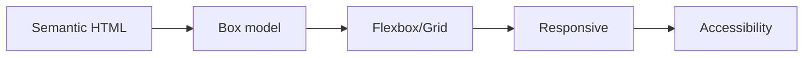

# HTML and CSS Basics

This is post 2 in the Frontend Development 101 series.

> Frontend Development 101 series (2/10)

<!-- a-grade-intro:begin -->

**Core question**: How do you keep the *skeleton* and the *clothes* of a page cleanly apart?

> HTML carries *meaning*. CSS carries *appearance*. Future-you will *thank you* for keeping that line clear.

<!-- a-grade-intro:end -->

## What You Will Learn

- Building *meaningful structure* with semantic HTML
- The CSS box model
- *Where Flexbox shines and where Grid shines*
- A *minimal pattern* for responsive design
- The *starting point* for accessibility

## Why It Matters

HTML and CSS are *long-lived skills*. Frameworks rotate every five years, but *semantic tags and the box model* stay. Time spent here is the *highest-yield investment* in your frontend career.

> Semantic HTML is code that *search engines and screen readers can read together*.

## Concept at a Glance



## Key Terms

- **Semantic HTML**: tags like `<header>`, `<nav>`, `<article>` that *carry meaning*.
- **Box model**: every element is *content + padding + border + margin*.
- **Flexbox**: a *one-axis* layout system.
- **Grid**: a *two-axis* layout system that divides regions.
- **Media query**: syntax that applies *different styles* per screen size.

## Before/After

**Before (a pile of meaningless divs)**

```html
<div class="header">
  <div class="nav">...</div>
</div>
<div class="content">...</div>
```

**After (semantic structure)**

```html
<header><nav>...</nav></header>
<main>...</main>
<footer>...</footer>
```

## Hands-on: A Card Layout in Five Steps

### Step 1 — Semantic structure

```html
<main>
  <article class="card">
    <h2>Title</h2>
    <p>Body</p>
  </article>
</main>
```

### Step 2 — Apply the box model

```css
.card {
  padding: 1rem;
  border: 1px solid #ddd;
  border-radius: 8px;
  margin-bottom: 1rem;
}
```

### Step 3 — Flexbox row

```css
main {
  display: flex;
  flex-wrap: wrap;
  gap: 1rem;
}
.card { flex: 1 1 250px; }
```

### Step 4 — Grid regions

```css
main {
  display: grid;
  grid-template-columns: repeat(auto-fill, minmax(250px, 1fr));
  gap: 1rem;
}
```

### Step 5 — Media query

```css
@media (max-width: 600px) {
  main { grid-template-columns: 1fr; }
}
```

## What to Notice in This Code

- Use *role-based class names* like `card`, not `red`.
- `gap` removes *margin collision* problems.
- `minmax(250px, 1fr)` is the *responsive magic*.

## Five Common Mistakes

1. **Using only `<div>`.** Search engines and screen readers *cannot read structure*.
2. **Spamming `!important`.** CSS specificity becomes *chaos*.
3. **Using only fixed `px`.** Mix `rem`, `%`, `fr` to keep responsive flow.
4. **Carrying information in color alone.** *Color-blind* users miss it.
5. **Leaving alt text empty.** Meaningful images *need alt*.

## How This Shows Up in Production

Most companies adopt a *design system* (Tailwind, Material UI, custom tokens) for reuse. But every design system *runs on* semantic HTML and Flexbox/Grid underneath. Skipping fundamentals makes design systems *un-debuggable*.

## How a Senior Engineer Thinks

- *Semantic tags* are the cheapest SEO/accessibility investment.
- Most layout problems reduce to *Flexbox vs Grid*.
- Design *mobile-first*, then scale up.
- Color must *not be the only* signal.
- Always ask: "*Why* did I make this a div?"

## Checklist

- [ ] You use `<header>`, `<main>`, `<footer>` correctly.
- [ ] You can sketch the box model.
- [ ] You can describe Flexbox vs Grid in one sentence.
- [ ] You can add a media query for responsiveness.
- [ ] All images have meaningful `alt`.

## Practice Problems

1. Build a business card with semantic HTML and CSS.
2. Lay out three cards once with Flexbox, once with Grid. Note the difference.
3. Add a media query so the layout collapses to one column under 600 px.

## Wrap-up and Next Steps

HTML is *the skeleton*; CSS is *the clothes*. With the two clearly separated, behavior — JavaScript — slots in cleanly. We tackle JavaScript fundamentals next.

<!-- toc:begin -->
- [What Is Frontend Development?](./01-what-is-frontend-development.md)
- **HTML and CSS Basics (current)**
- JavaScript Basics (upcoming)
- Components and State (upcoming)
- Routing and Pages (upcoming)
- API Calls and Async (upcoming)
- Forms and Validation (upcoming)
- Styling and Design Systems (upcoming)
- Build Tools and Bundling (upcoming)
- Building a Small Frontend App (upcoming)
<!-- toc:end -->

## References

- [MDN HTML elements](https://developer.mozilla.org/en-US/docs/Web/HTML/Element)
- [CSS Tricks Flexbox guide](https://css-tricks.com/snippets/css/a-guide-to-flexbox/)
- [CSS Tricks Grid guide](https://css-tricks.com/snippets/css/complete-guide-grid/)
- [WAI ARIA basics](https://developer.mozilla.org/en-US/docs/Learn/Accessibility/WAI-ARIA_basics)

Tags: Frontend, HTML, CSS, Web, Beginner
