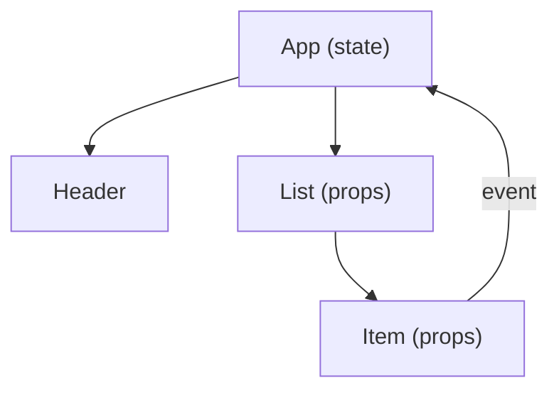

# Components and State

> Frontend Development 101 series (4/10)

<!-- a-grade-intro:begin -->

**Core question**: How do you manage a screen once it grows past *a thousand lines*?

> The answer is *components*. Split the screen into small functions; each function owns *only its props and state*.

<!-- a-grade-intro:end -->

## What You Will Learn

- The *component mindset*
- The *clear distinction* between props and state
- Unidirectional data flow
- *When to split* a component
- A minimal React example

## Why It Matters

The component mindset is not exclusive to React. The same pattern works in Vue, Svelte, Angular, and even *plain JS*. Once you internalize it, *every framework reads like a familiar language*.

> Well-split components exist for *readability*, not for *reuse*.

## Concept at a Glance



State flows *down*, events flow *up*.

## Key Terms

- **Component**: a function that draws *one slice* of the screen.
- **Props**: values *passed down* from parent. *Read-only*.
- **State**: a mutable value a component *holds itself*.
- **Unidirectional data flow**: data moves *only top-down*.
- **Lifting state up**: when two children share state, *move it up to the parent*.

## Before/After

**Before (everything in one file)**

```html
<script>
  // 1000 lines of DOM manipulation
</script>
```

**After (split into components)**

```jsx
function App()    { ... }
function Header() { ... }
function List()   { ... }
function Item()   { ... }
```

## Hands-on: A React Counter in Five Steps

### Step 1 — Project

```bash
npm create vite@latest counter -- --template react
cd counter && npm install && npm run dev
```

### Step 2 — Define a component

```jsx
function Counter({ initial = 0 }) {
  return <button>{initial}</button>;
}
```

### Step 3 — Add state

```jsx
import { useState } from "react";

function Counter({ initial = 0 }) {
  const [count, setCount] = useState(initial);
  return <button onClick={() => setCount(count + 1)}>{count}</button>;
}
```

### Step 4 — Use it from the parent

```jsx
function App() {
  return (
    <>
      <Counter initial={0} />
      <Counter initial={10} />
    </>
  );
}
```

### Step 5 — Lift state up

```jsx
function App() {
  const [total, setTotal] = useState(0);
  return (
    <>
      <p>Total: {total}</p>
      <button onClick={() => setTotal(total + 1)}>+1</button>
    </>
  );
}
```

## What to Notice in This Code

- `props` are *input*; `state` is *internal memory*.
- A child mutates parent state by receiving a *function* as a prop.
- The same component can live as *multiple instances*.

## Five Common Mistakes

1. **Mutating props inside the component.** Props are *read-only*.
2. **Putting all state at the top.** Unnecessary *globalization* hurts performance and readability.
3. **Letting a component grow past *a thousand lines*.** Past 200 lines is a *split signal*.
4. **Recreating event callbacks every render.** Causes needless child re-renders.
5. **Storing both state and derived values.** You end up with *two sources of truth*.

## How This Shows Up in Production

Most companies maintain a *design system* as a component library. New screens are built by *composing* base components like Button + Input + Card. A senior engineer's job is deciding *which components NOT to build*.

## How a Senior Engineer Thinks

- Components should be *small* — *only when they correspond to meaningful units*.
- Place state at the *closest common parent*.
- Two components that *look identical* deserve a second thought before merging.
- Cyclic data flow is a sign of *bad design*.
- *Readable* components beat *reusable* ones.

## Checklist

- [ ] You can define a component as a function.
- [ ] You distinguish props from state.
- [ ] You can bubble events from child to parent.
- [ ] You can place state in the *right* location.
- [ ] You can sketch unidirectional data flow.

## Practice Problems

1. Build a todo app split into `<TodoItem>`, `<TodoList>`, `<App>`.
2. Apply lifting state up so two counters share *the same total*.
3. Build a *pure presentational component* that only takes props, and write a unit test for it.

## Wrap-up and Next Steps

Components and state make screens *composable*. Next, we connect multiple screens via *URLs and routers*.

<!-- toc:begin -->
- [What Is Frontend Development?](./01-what-is-frontend-development.md)
- [HTML and CSS Basics](./02-html-and-css-basics.md)
- [JavaScript Basics](./03-javascript-basics.md)
- **Components and State (current)**
- Routing and Pages (upcoming)
- API Calls and Async (upcoming)
- Forms and Validation (upcoming)
- Styling and Design Systems (upcoming)
- Build Tools and Bundling (upcoming)
- Building a Small Frontend App (upcoming)
<!-- toc:end -->

## References

- [React docs](https://react.dev/)
- [Thinking in React](https://react.dev/learn/thinking-in-react)
- [Vue Components](https://vuejs.org/guide/essentials/component-basics.html)
- [Svelte tutorial](https://svelte.dev/tutorial)

Tags: Frontend, React, Components, State, JavaScript
