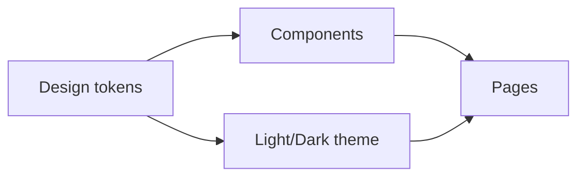

# Styling and Design Systems

> Frontend Development 101 series (8/10)

<!-- a-grade-intro:begin -->

**Core question**: How do you keep design *consistent* as a project grows?

> Through *design tokens* and a *component library*. Manage every color, spacing, and typography choice *in one place*.

<!-- a-grade-intro:end -->

## What You Will Learn

- A *comparison* of styling approaches (global CSS, CSS Modules, CSS-in-JS, Tailwind)
- The role of *design tokens* (color, spacing, typography)
- The internal structure of a *component library*
- Dark mode and theming
- *Automatically enforcing* consistency

## Why It Matters

Even with consistent code, *inconsistent design* makes users *uneasy*. Buttons that differ per page make a product feel *unfinished*. A design system is *consistency at team scale*.

> A great design system gets *designers and engineers speaking the same language*.

## Concept at a Glance



## Key Terms

- **Design token**: an *atomic unit* of color/spacing/typography (e.g., `color.primary.500`).
- **CSS Modules**: makes class names *uniquely scoped automatically*.
- **CSS-in-JS**: write CSS *inside the component function*.
- **Utility-first CSS**: small, composable classes (Tailwind).
- **Component library**: a *reusable set of components* implementing the design system.

## Before/After

**Before (different colors per page)**

```css
.btn-a { background: #1d72ff; }   /* page A */
.btn-b { background: #1d70ff; }   /* page B (typo) */
```

**After (design token)**

```css
:root { --color-primary: #1d72ff; }
.btn  { background: var(--color-primary); }
```

## Hands-on: A Component With Tailwind in Five Steps

### Step 1 — Install Tailwind

```bash
npm install -D tailwindcss postcss autoprefixer
npx tailwindcss init -p
```

### Step 2 — Define tokens

```javascript
// tailwind.config.js
module.exports = {
  theme: {
    extend: {
      colors: { primary: "#1d72ff", surface: "#f8fafc" },
      spacing: { gutter: "1rem" },
    },
  },
};
```

### Step 3 — Button component

```jsx
function Button({ children, variant = "primary" }) {
  const base = "px-4 py-2 rounded font-medium transition";
  const variants = {
    primary:   "bg-primary text-white hover:opacity-90",
    secondary: "bg-surface text-gray-900 border border-gray-200",
  };
  return <button className={`${base} ${variants[variant]}`}>{children}</button>;
}
```

### Step 4 — Dark mode

```jsx
// tailwind.config.js: { darkMode: "class" }
<button className="bg-primary dark:bg-primary/80 text-white">
  Click
</button>
```

### Step 5 — Enforce consistency

```bash
# eslint-plugin-tailwindcss
# Catches arbitrary class names and bad token usage at lint time.
```

## What to Notice in This Code

- All colors appear by *name* (like `primary`) — change in *one place*.
- A component like `Button` is *the single source of truth*.
- Dark mode is *not extra code* — it's *extra tokens*.

## Five Common Mistakes

1. **Hardcoding colors per component.** Designer changes color → *hell*.
2. **Adding button/input variants *without docs*.** Components diverge from *agreed designs*.
3. **Adding dark mode *later*.** Scattered colors mean *every component* needs touching.
4. **Hardcoding *all spacing in px*.** Responsive and accessibility break.
5. **Putting *business logic* in the component library.** Reuse becomes impossible.

## How This Shows Up in Production

Most teams catalog components in *Storybook* and unify styling with *Tailwind/CSS Modules + design tokens*. Big companies publish their *design system as an npm package* so multiple products share the *same components*.

## How a Senior Engineer Thinks

- *Color without a token* gets caught in code review.
- Build the design system *with designers*, not for them.
- New components must answer: *why doesn't an existing one work?*
- Storybook is *unit testing for components*.
- Dark mode should be solved *purely by tokens*.

## Checklist

- [ ] You understand what design tokens mean.
- [ ] You have styled a component with CSS Modules or Tailwind.
- [ ] You have used Storybook once.
- [ ] You have applied dark mode once.
- [ ] You have lint rules to catch arbitrary colors/spacing.

## Practice Problems

1. Define your own `primary` color in Tailwind tokens and apply it to a Button.
2. Install Storybook and catalog two Button variants.
3. Apply dark mode using `prefers-color-scheme` or a class-based switch.

## Wrap-up and Next Steps

Even styling needs *shared vocabulary*. Next, we look at the build tools that turn your code into something *the browser can read*.

<!-- toc:begin -->
- [What Is Frontend Development?](./01-what-is-frontend-development.md)
- [HTML and CSS Basics](./02-html-and-css-basics.md)
- [JavaScript Basics](./03-javascript-basics.md)
- [Components and State](./04-components-and-state.md)
- [Routing and Pages](./05-routing-and-pages.md)
- [API Calls and Async](./06-api-calls-and-async.md)
- [Forms and Validation](./07-forms-and-validation.md)
- **Styling and Design Systems (current)**
- Build Tools and Bundling (upcoming)
- Building a Small Frontend App (upcoming)
<!-- toc:end -->

## References

- [Tailwind CSS docs](https://tailwindcss.com/)
- [Storybook](https://storybook.js.org/)
- [Design Tokens W3C draft](https://www.w3.org/community/design-tokens/)
- [Material Design](https://m3.material.io/)

Tags: Frontend, CSS, DesignSystem, Tailwind, UX
