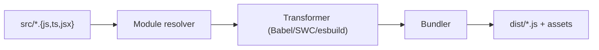

# Build Tools and Bundling

> Frontend Development 101 series (9/10)

<!-- a-grade-intro:begin -->

**Core question**: How do the *hundreds* of files we write turn into the *one or two* files the browser actually downloads?

> Build tools *collect modules, compress them, and split them*. The shape of that output decides the *user experience*.

<!-- a-grade-intro:end -->

## What You Will Learn

- The *role* of a bundler (module graph, transform, split)
- *Why* Vite and esbuild are fast
- Tree shaking and dead code elimination
- Finding *large modules* with bundle analysis
- Building per environment and basic optimization

## Why It Matters

Bundle size is paid *directly* by your users. A 1MB bundle is *eight seconds of white screen* on a 3G connection. If you do not understand the build tool, you will not understand *why your product gets heavy*.

> A good bundle is *small, cacheable, and split*.

## Concept at a Glance



## Key Terms

- **Module bundler**: a tool that *follows the import graph* and merges files.
- **Tree shaking**: an optimization that *drops* unused exports.
- **Code splitting**: cutting one bundle into *multiple chunks*.
- **Source map**: the mapping that lets you debug built code *as the original*.
- **HMR (Hot Module Replacement)**: applying changes during development *without a full page reload*.

## Before/After

**Before (dozens of `<script>` tags)**

```html
<script src="utils.js"></script>
<script src="auth.js"></script>
<script src="app.js"></script>
```

**After (one `<script>` plus automatic split)**

```html
<script type="module" src="/dist/index-[hash].js"></script>
```

## Hands-on: Vite in Five Steps

### Step 1 — Create the project

```bash
npm create vite@latest my-app -- --template react-ts
cd my-app && npm install
```

### Step 2 — Dev server (HMR)

```bash
npm run dev
# Browser: http://localhost:5173
# The page updates *automatically* on code changes
```

### Step 3 — Production build

```bash
npm run build
# Static files appear in dist/
ls -lh dist/assets
```

### Step 4 — Bundle analysis

```bash
npm install -D rollup-plugin-visualizer
```

```javascript
// vite.config.ts
import { visualizer } from "rollup-plugin-visualizer";
export default {
  plugins: [visualizer({ open: true })],
};
```

After the build, *see which modules are large* visually.

### Step 5 — Environment variables and modes

```bash
# .env.production
VITE_API_URL=https://api.example.com

# In code
const url = import.meta.env.VITE_API_URL;
```

## What to Notice in This Code

- The dev server serves *ESM directly*, so *startup is fast*.
- Build output filenames carry a *hash*, so they are *cacheable forever*.
- Bundle analysis is *the starting point of optimization*.

## Five Common Mistakes

1. **Doing `import * as _ from "lodash"`.** All of lodash lands in the bundle. Use `import debounce from "lodash/debounce"` for *per-function imports*.
2. **Assuming dev server and production build behave the *same*.** HMR code and source maps are heavy *if they reach production*.
3. **Never *analyzing the bundle*.** You will not know which library takes *4MB*.
4. **Exposing *source maps in production*.** Original code becomes *fully readable*.
5. **Bundling *unoptimized images*.** A 1MB image goes *as is* to the user.

## How This Shows Up in Production

Most new projects use a *Vite + esbuild + SWC* stack. Larger monorepos are gradually moving to next-gen bundlers like *Turbopack/Rspack*. *Webpack* is still common but is slowly disappearing from *the default choice* for new projects.

## How a Senior Engineer Thinks

- Treats bundle size as a *budget* (for example, main < 200KB).
- Looks at *bundle analysis weekly*.
- Checks *the size of a library* before adding it.
- Sends images and fonts through a separate *optimization pipeline*.
- Uses the *slowest user as the reference*.

## Checklist

- [ ] You can scaffold a Vite project.
- [ ] You confirmed HMR works.
- [ ] You inspected the files inside `dist/`.
- [ ] You ran a bundle analyzer at least once.
- [ ] You can split dev and prod through environment variables.

## Practice Problems

1. Scaffold a React project with Vite, run `npm run build`, and inspect the `dist` folder.
2. Use a bundle analyzer and write down which module is largest.
3. Compare lodash with a *full import* versus *per-function import* and measure the bundle size difference.

## Wrap-up and Next Steps

Build tools decide *how fast the first screen the user sees becomes interactive*. In the final post we will pull every concept so far into *a small frontend app*.

<!-- toc:begin -->
- [What Is Frontend Development?](./01-what-is-frontend-development.md)
- [HTML and CSS Basics](./02-html-and-css-basics.md)
- [JavaScript Basics](./03-javascript-basics.md)
- [Components and State](./04-components-and-state.md)
- [Routing and Pages](./05-routing-and-pages.md)
- [API Calls and Async](./06-api-calls-and-async.md)
- [Forms and Validation](./07-forms-and-validation.md)
- [Styling and Design Systems](./08-styling-and-design-system.md)
- **Build Tools and Bundling (current)**
- Building a Small Frontend App (upcoming)
<!-- toc:end -->

## References

- [Vite docs](https://vitejs.dev/)
- [esbuild docs](https://esbuild.github.io/)
- [web.dev: Reduce JavaScript payloads](https://web.dev/reduce-javascript-payloads-with-tree-shaking/)
- [Bundlephobia](https://bundlephobia.com/)

Tags: Frontend, Build, Vite, Bundling, Performance
