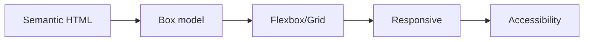

# HTML과 CSS 기본

> Frontend Development 101 시리즈 (2/10)


## 이 글에서 다룰 문제

HTML/CSS는 오래 살아남는 기술입니다. 프레임워크는 5년마다 바뀌어도 시맨틱 태그와 박스 모델은 그대로 남습니다. 여기에 시간을 쓰는 편이 가장 효율이 좋습니다.

> 시맨틱 HTML은 검색엔진과 스크린리더가 함께 읽는 코드입니다.

## 전체 흐름


## Before/After

**Before (의미 없는 div 더미)**

```html
<div class="header">
  <div class="nav">...</div>
</div>
<div class="content">...</div>
```

**After (의미 있는 시맨틱 HTML)**

```html
<header><nav>...</nav></header>
<main>...</main>
<footer>...</footer>
```

## 카드 레이아웃 5단계

### 1단계 — 시맨틱 구조

```html
<main>
  <article class="card">
    <h2>제목</h2>
    <p>본문</p>
  </article>
</main>
```

### 2단계 — 박스 모델 적용

```css
.card {
  padding: 1rem;
  border: 1px solid #ddd;
  border-radius: 8px;
  margin-bottom: 1rem;
}
```

### 3단계 — Flexbox로 가로 정렬

```css
main {
  display: flex;
  flex-wrap: wrap;
  gap: 1rem;
}
.card { flex: 1 1 250px; }
```

### 4단계 — Grid로 영역 나누기

```css
main {
  display: grid;
  grid-template-columns: repeat(auto-fill, minmax(250px, 1fr));
  gap: 1rem;
}
```

### 5단계 — Media query

```css
@media (max-width: 600px) {
  main { grid-template-columns: 1fr; }
}
```

## 이 코드에서 주목할 점

- `class="card"` 같은 역할 기반 이름을 씁니다. `class="red"` 같은 이름은 피하는 편이 좋습니다.
- `gap` 으로 간격을 다루면 margin 충돌이 줄어듭니다.
- `minmax(250px, 1fr)` 는 반응형 레이아웃에서 매우 자주 쓰이는 패턴입니다.

## 자주 하는 실수 5가지

1. **`<div>` 만 사용한다.** 검색엔진과 스크린리더가 구조를 읽기 어려워집니다.
2. **`!important` 를 남발한다.** CSS 우선순위가 금방 뒤엉킵니다.
3. **고정 px만 쓴다.** 반응형이 깨집니다. `rem`, `%`, `fr` 을 함께 쓰세요.
4. **글자 색만으로 정보를 전달한다.** 색각 이상 사용자는 정보를 놓칠 수 있습니다.
5. **alt 텍스트를 빈 문자열로 둔다.** 이미지에 의미가 있으면 alt를 써야 합니다.

## 실무에서는 이렇게 쓰입니다

대부분의 회사는 디자인 시스템(예: Tailwind, Material UI, 자체 토큰)을 표준으로 정하고 재사용합니다. 하지만 디자인 시스템도 결국 시맨틱 HTML과 Flexbox/Grid 위에서 돌아갑니다. 기본기 없이 디자인 시스템만 익히면 디버깅이 막막해집니다.

## 체크리스트

- [ ] `<header>`, `<main>`, `<footer>` 를 적절히 쓴다.
- [ ] 박스 모델을 그릴 수 있다.
- [ ] Flexbox와 Grid의 차이를 한 줄로 말할 수 있다.
- [ ] media query로 반응형을 만들 수 있다.
- [ ] 모든 이미지에 의미 있는 alt를 단다.

## 정리 및 다음 단계

HTML은 뼈대이고 CSS는 옷입니다. 둘이 명확히 분리되어야 행동을 맡는 JS도 깔끔하게 들어갑니다. 다음 글에서 그 JS의 기본을 다룹니다.

<!-- toc:begin -->
- [프론트엔드 개발이란 무엇인가?](./01-what-is-frontend-development.md)
- **HTML과 CSS 기본 (현재 글)**
- JavaScript 기본 (예정)
- 컴포넌트와 상태 (예정)
- 라우팅과 페이지 (예정)
- API 호출과 비동기 (예정)
- 폼과 유효성 검사 (예정)
- 스타일링과 디자인 시스템 (예정)
- 빌드 도구와 번들링 (예정)
- 작은 프론트엔드 앱 만들기 (예정)
<!-- toc:end -->

## 참고 자료

- [MDN HTML elements](https://developer.mozilla.org/en-US/docs/Web/HTML/Element)
- [CSS Tricks Flexbox guide](https://css-tricks.com/snippets/css/a-guide-to-flexbox/)
- [CSS Tricks Grid guide](https://css-tricks.com/snippets/css/complete-guide-grid/)
- [WAI ARIA basics](https://developer.mozilla.org/en-US/docs/Learn/Accessibility/WAI-ARIA_basics)

Tags: Frontend, HTML, CSS, Web, Beginner
