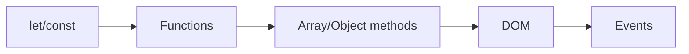

# JavaScript 기본

> Frontend Development 101 시리즈 (3/10)


## 이 글에서 다룰 문제

JS는 프레임워크가 바뀌어도 그대로 쓰입니다. React 컴포넌트 안에서도, Vue 안에서도, Node.js 백엔드에서도 문법은 같습니다. 여기에 시간을 쓰면 어떤 프레임워크를 배우든 속도가 빨라집니다.

> 좋은 자바스크립트는 작고 분리된 함수가 쌓여 만들어집니다.

## 전체 흐름


## Before/After

**Before (var와 for문)**

```javascript
var arr = [1,2,3];
var doubled = [];
for (var i = 0; i < arr.length; i++) doubled.push(arr[i] * 2);
```

**After (modern JS)**

```javascript
const arr = [1, 2, 3];
const doubled = arr.map(n => n * 2);
```

## 할 일 목록 5단계

### 1단계 — HTML 골격

```html
<input id="todo">
<button id="add">추가</button>
<ul id="list"></ul>
```

### 2단계 — 상태 변수

```javascript
const todos = [];
```

### 3단계 — 함수로 분리

```javascript
function render() {
  const list = document.getElementById("list");
  list.innerHTML = todos.map(t => `<li>${t}</li>`).join("");
}
```

### 4단계 — 이벤트

```javascript
document.getElementById("add").addEventListener("click", () => {
  const input = document.getElementById("todo");
  if (!input.value) return;
  todos.push(input.value);
  input.value = "";
  render();
});
```

### 5단계 — Event delegation으로 삭제

```javascript
document.getElementById("list").addEventListener("click", (e) => {
  if (e.target.tagName === "LI") {
    const idx = [...e.target.parentNode.children].indexOf(e.target);
    todos.splice(idx, 1);
    render();
  }
});
```

## 이 코드에서 주목할 점

- 상태(`todos`)와 렌더링(`render`)이 분리되어 있습니다.
- 모든 변경은 상태 → 렌더링 순서로 흐릅니다. React 사고방식의 기본 흐름을 미리 보여 주는 예시입니다.
- 이벤트 리스너는 부모에 하나만 달아도 충분한 경우가 많습니다.

## 자주 하는 실수 5가지

1. **`var` 를 사용한다.** 함수 스코프 특성 때문에 버그가 생기기 쉽습니다. `const/let` 만 쓰세요.
2. **`==` 를 쓴다.** 타입 변환이 끼어들어 결과를 예측하기 어려워집니다. `===` 만 쓰세요.
3. **상태와 DOM을 동시에 갱신한다.** 무엇이 실제 상태인지 금방 헷갈립니다.
4. **모든 요소에 리스너를 단다.** 메모리와 성능을 낭비합니다.
5. **`async` 안에서 에러를 처리하지 않는다.** 조용히 실패하는 버그가 생깁니다.

## 실무에서는 이렇게 쓰입니다

대부분의 회사는 TypeScript + ESLint + Prettier 조합을 표준으로 사용합니다. JS의 자유로움은 팀 규모가 커질수록 위험이 되기 때문에, 타입과 lint로 경계를 세웁니다. 다만 그 모든 도구도 결국 순수 JS 위에서 동작합니다.

## 체크리스트

- [ ] `let/const` 의 차이를 안다.
- [ ] arrow function을 쓸 수 있다.
- [ ] `map/filter/reduce` 로 for문을 대체한다.
- [ ] DOM을 조회/수정할 수 있다.
- [ ] event delegation을 한 번 써봤다.

## 정리 및 다음 단계

순수 JS만으로도 작은 앱은 충분히 만들 수 있습니다. 하지만 화면이 커지면 상태와 렌더링을 자동으로 묶어 주는 도구가 필요해집니다. 다음 글에서 컴포넌트와 상태라는 개념을 다룹니다.

<!-- toc:begin -->
- [프론트엔드 개발이란 무엇인가?](./01-what-is-frontend-development.md)
- [HTML과 CSS 기본](./02-html-and-css-basics.md)
- **JavaScript 기본 (현재 글)**
- 컴포넌트와 상태 (예정)
- 라우팅과 페이지 (예정)
- API 호출과 비동기 (예정)
- 폼과 유효성 검사 (예정)
- 스타일링과 디자인 시스템 (예정)
- 빌드 도구와 번들링 (예정)
- 작은 프론트엔드 앱 만들기 (예정)
<!-- toc:end -->

## 참고 자료

- [MDN JavaScript Guide](https://developer.mozilla.org/en-US/docs/Web/JavaScript/Guide)
- [JavaScript.info](https://javascript.info/)
- [Eloquent JavaScript](https://eloquentjavascript.net/)
- [TC39 Proposals](https://github.com/tc39/proposals)

Tags: Frontend, JavaScript, DOM, Web, Beginner
