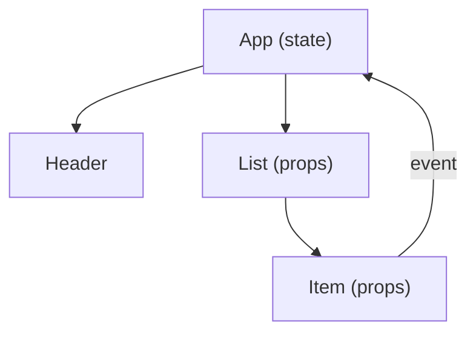

# 컴포넌트와 상태

> Frontend Development 101 시리즈 (4/10)

<!-- a-grade-intro:begin -->

**핵심 질문**: 화면이 *천 줄* 이 넘어가면 어떻게 *조각* 으로 나눠 관리해야 할까요?

> 답은 *컴포넌트* 입니다. 화면을 작은 함수로 쪼개고, 각 함수는 *자기 상태와 props* 만 책임집니다.

<!-- a-grade-intro:end -->

## 이 글에서 배울 것

- 컴포넌트라는 *사고방식*
- props vs state의 *명확한 구분*
- 단방향 데이터 흐름
- 컴포넌트 *분리 기준*
- React로 본 최소 예제

## 왜 중요한가

컴포넌트 사고는 React에만 있는 것이 아닙니다. Vue, Svelte, Angular, 심지어 *순수 JS* 에서도 같은 패턴이 작동합니다. 한 번 익히면 *모든 framework가 한국어처럼* 읽힙니다.

> 잘 나뉜 컴포넌트는 *재사용* 을 위한 게 아니라 *읽기 쉬움* 을 위한 것입니다.

## 개념 한눈에 보기



상태는 *위에서* 내려가고, 이벤트는 *아래에서* 올라옵니다.

## 핵심 용어 정리

- **Component**: 화면의 *한 조각* 을 그리는 함수.
- **Props**: 부모가 자식에게 *내려주는* 값. *읽기 전용* 입니다.
- **State**: 컴포넌트가 *스스로* 갖는 변경 가능한 값.
- **Unidirectional data flow**: 데이터는 *위에서 아래로만* 흐른다.
- **Lifting state up**: 두 자식이 같은 상태를 공유하면 *부모로 끌어올린다*.

## Before/After

**Before (한 파일에 모든 것)**

```html
<script>
  // 1000줄의 DOM 조작
</script>
```

**After (컴포넌트 분리)**

```jsx
function App()    { ... }
function Header() { ... }
function List()   { ... }
function Item()   { ... }
```

## 실습: React 카운터 5단계

### 1단계 — 프로젝트

```bash
npm create vite@latest counter -- --template react
cd counter && npm install && npm run dev
```

### 2단계 — 컴포넌트 정의

```jsx
function Counter({ initial = 0 }) {
  return <button>{initial}</button>;
}
```

### 3단계 — state 추가

```jsx
import { useState } from "react";

function Counter({ initial = 0 }) {
  const [count, setCount] = useState(initial);
  return <button onClick={() => setCount(count + 1)}>{count}</button>;
}
```

### 4단계 — 부모에서 사용

```jsx
function App() {
  return (
    <>
      <Counter initial={0} />
      <Counter initial={10} />
    </>
  );
}
```

### 5단계 — 상태를 부모로 올리기

```jsx
function App() {
  const [total, setTotal] = useState(0);
  return (
    <>
      <p>합계: {total}</p>
      <button onClick={() => setTotal(total + 1)}>+1</button>
    </>
  );
}
```

## 이 코드에서 주목할 점

- `props` 는 *입력*, `state` 는 *내부 메모리* 입니다.
- 자식이 부모의 상태를 바꾸려면 *함수* 를 props로 받습니다.
- 같은 컴포넌트가 *여러 곳에서* 인스턴스로 살 수 있습니다.

## 자주 하는 실수 5가지

1. **props를 컴포넌트 안에서 직접 수정한다.** props는 *읽기 전용* 입니다.
2. **모든 상태를 최상위에 둔다.** 불필요한 *전역화* 는 성능과 가독성을 해칩니다.
3. **컴포넌트가 *천 줄* 이 되도록 방치한다.** 200줄을 넘으면 *분리 신호* 입니다.
4. **이벤트 콜백을 매 렌더마다 새로 만든다.** 자식의 불필요한 리렌더가 생깁니다.
5. **state와 derived value를 *둘 다* 저장한다.** *진실의 출처* 가 두 개가 됩니다.

## 실무에서는 이렇게 쓰입니다

대부분의 회사는 *디자인 시스템* 을 컴포넌트 라이브러리로 정리합니다. 새 화면은 *Button + Input + Card* 같은 기본 컴포넌트의 *조합* 으로 만들어집니다. 시니어의 일은 *어떤 컴포넌트를 만들지* 가 아니라 *어떤 컴포넌트를 만들지 않을지* 결정하는 것입니다.

## 시니어 엔지니어는 이렇게 생각합니다

- 컴포넌트는 *작을수록* 좋다 — 단, *의미 있는 단위* 일 때만.
- 상태는 *가장 가까운 공통 부모* 에 둔다.
- 똑같이 보이는 두 컴포넌트는 *합치기 전* 에 차이가 있을지 한 번 더 생각.
- 데이터 흐름이 *원형* 이 되면 설계가 잘못된 신호.
- *읽기 쉬운* 컴포넌트가 *재사용 가능한* 컴포넌트보다 우선.

## 체크리스트

- [ ] 컴포넌트를 함수로 정의할 수 있다.
- [ ] props와 state를 구분한다.
- [ ] 자식 → 부모로 이벤트를 올릴 수 있다.
- [ ] state를 *적절한 위치* 에 둘 수 있다.
- [ ] 단방향 데이터 흐름을 그림으로 설명할 수 있다.

## 연습 문제

1. `<TodoItem>`, `<TodoList>`, `<App>` 으로 분리한 todo 앱을 만드세요.
2. 두 카운터가 *같은 합계* 를 공유하도록 lift state up을 적용하세요.
3. props만 받는 *순수 표시 컴포넌트* 를 하나 만들고 단위 테스트를 작성해 보세요.

## 정리 및 다음 단계

컴포넌트와 상태가 화면을 *조립 가능한 형태* 로 만듭니다. 다음 글에서는 여러 화면을 *URL과 라우터* 로 연결하는 방법을 배웁니다.

<!-- toc:begin -->
- [프론트엔드 개발이란 무엇인가?](./01-what-is-frontend-development.md)
- [HTML과 CSS 기본](./02-html-and-css-basics.md)
- [JavaScript 기본](./03-javascript-basics.md)
- **컴포넌트와 상태 (현재 글)**
- 라우팅과 페이지 (예정)
- API 호출과 비동기 (예정)
- 폼과 유효성 검사 (예정)
- 스타일링과 디자인 시스템 (예정)
- 빌드 도구와 번들링 (예정)
- 작은 프론트엔드 앱 만들기 (예정)
<!-- toc:end -->

## 참고 자료

- [React docs](https://react.dev/)
- [Thinking in React](https://react.dev/learn/thinking-in-react)
- [Vue Components](https://vuejs.org/guide/essentials/component-basics.html)
- [Svelte tutorial](https://svelte.dev/tutorial)

Tags: Frontend, React, Components, State, JavaScript
