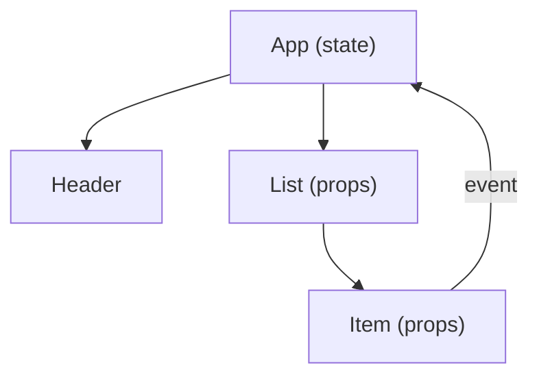

# 컴포넌트와 상태

> Frontend Development 101 시리즈 (4/10)


## 이 글에서 다룰 문제

컴포넌트 사고는 React에만 있는 것이 아닙니다. Vue, Svelte, Angular, 심지어 순수 JS에서도 같은 패턴이 작동합니다. 한 번 익히면 어떤 프레임워크를 보더라도 구조가 훨씬 잘 읽힙니다.

> 잘 나뉜 컴포넌트는 재사용만을 위한 것이 아니라, 먼저 읽기 쉬운 구조를 만들기 위한 것입니다.

## 전체 흐름


상태는 위에서 내려가고, 이벤트는 아래에서 올라옵니다.

## Before/After

**Before (한 파일에 모든 것)**

```html
<script>
  // 1000줄짜리 DOM 조작 코드
</script>
```

**After (컴포넌트 분리)**

```jsx
function App()    { ... }
function Header() { ... }
function List()   { ... }
function Item()   { ... }
```

## React 카운터 5단계

### 1단계 — 프로젝트

```bash
npm create vite@latest counter -- --template react
cd counter && npm install && npm run dev
```

### 2단계 — 컴포넌트 정의

```jsx
function Counter({ initial = 0 }) {
  return <button>{initial}</button>;
}
```

### 3단계 — state 추가

```jsx
import { useState } from "react";

function Counter({ initial = 0 }) {
  const [count, setCount] = useState(initial);
  return <button onClick={() => setCount(count + 1)}>{count}</button>;
}
```

### 4단계 — 부모에서 사용

```jsx
function App() {
  return (
    <>
      <Counter initial={0} />
      <Counter initial={10} />
    </>
  );
}
```

### 5단계 — 상태를 부모로 올리기

```jsx
function App() {
  const [total, setTotal] = useState(0);
  return (
    <>
      <p>합계: {total}</p>
      <button onClick={() => setTotal(total + 1)}>+1</button>
    </>
  );
}
```

## 이 코드에서 주목할 점

- `props` 는 입력이고 `state` 는 내부 메모리입니다.
- 자식이 부모의 상태를 바꾸려면 함수를 props로 받아야 합니다.
- 같은 컴포넌트가 여러 곳에서 각각의 인스턴스로 동작할 수 있습니다.

## 자주 하는 실수 5가지

1. **props를 컴포넌트 안에서 직접 수정한다.** props는 읽기 전용입니다.
2. **모든 상태를 최상위에 둔다.** 불필요한 전역화는 성능과 가독성을 해칩니다.
3. **컴포넌트가 천 줄이 되도록 방치한다.** 200줄을 넘기기 시작하면 분리를 고민해야 합니다.
4. **이벤트 콜백을 매 렌더마다 새로 만든다.** 자식의 불필요한 리렌더가 생깁니다.
5. **state와 derived value를 둘 다 저장한다.** 진실의 출처가 두 개가 됩니다.

## 실무에서는 이렇게 쓰입니다

대부분의 회사는 디자인 시스템을 컴포넌트 라이브러리 형태로 정리합니다. 새 화면은 Button, Input, Card 같은 기본 컴포넌트를 조합해 만듭니다. 시니어의 일은 무엇을 더 만들지보다, 무엇을 만들지 않을지 먼저 결정하는 데 가깝습니다.

## 체크리스트

- [ ] 컴포넌트를 함수로 정의할 수 있다.
- [ ] props와 state를 구분한다.
- [ ] 자식 → 부모로 이벤트를 올릴 수 있다.
- [ ] state를 적절한 위치에 둘 수 있다.
- [ ] 단방향 데이터 흐름을 그림으로 설명할 수 있다.

## 정리 및 다음 단계

컴포넌트와 상태는 화면을 조립 가능한 형태로 만들어 줍니다. 다음 글에서는 여러 화면을 URL과 라우터로 연결하는 방법을 배웁니다.

<!-- toc:begin -->
- [프론트엔드 개발이란 무엇인가?](./01-what-is-frontend-development.md)
- [HTML과 CSS 기본](./02-html-and-css-basics.md)
- [JavaScript 기본](./03-javascript-basics.md)
- **컴포넌트와 상태 (현재 글)**
- 라우팅과 페이지 (예정)
- API 호출과 비동기 (예정)
- 폼과 유효성 검사 (예정)
- 스타일링과 디자인 시스템 (예정)
- 빌드 도구와 번들링 (예정)
- 작은 프론트엔드 앱 만들기 (예정)
<!-- toc:end -->

## 참고 자료

- [React docs](https://react.dev/)
- [Thinking in React](https://react.dev/learn/thinking-in-react)
- [Vue Components](https://vuejs.org/guide/essentials/component-basics.html)
- [Svelte tutorial](https://svelte.dev/tutorial)

Tags: Frontend, React, Components, State, JavaScript
