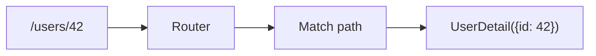

# 라우팅과 페이지

> Frontend Development 101 시리즈 (5/10)

<!-- a-grade-intro:begin -->

**핵심 질문**: 한 페이지짜리 앱에서 *여러 화면* 은 어떻게 만들어질까요?

> URL은 *상태* 입니다. 라우터는 URL을 보고 *어떤 컴포넌트를 그릴지* 결정합니다.

<!-- a-grade-intro:end -->

## 이 글에서 배울 것

- SPA 라우팅의 *원리*
- 경로 → 컴포넌트 매핑
- nested routes (중첩 라우트)
- 동적 파라미터와 query string
- code splitting과 lazy loading

## 왜 중요한가

라우팅은 *사용자가 새로고침해도 같은 화면* 을 보장하고, *공유 링크* 를 만들고, *뒤로 가기* 가 작동하게 합니다. 라우팅이 깨지면 *제품의 신뢰* 가 깨집니다.

> 좋은 라우팅은 *URL만 봐도 어떤 화면인지* 짐작이 갑니다.

## 개념 한눈에 보기



## 핵심 용어 정리

- **Route**: URL 패턴과 컴포넌트의 *연결*.
- **Nested route**: 라우트 안에 *또 다른 라우트* 가 있는 구조.
- **Dynamic segment**: `/users/:id` 처럼 *변수 자리* 를 가진 패턴.
- **Query string**: `?q=react&page=2` — 라우트 *외부* 의 부가 정보.
- **Lazy loading**: 라우트별로 *코드를 나눠서* 필요할 때만 다운로드.

## Before/After

**Before (서버 라우팅, 새로고침 발생)**

```html
<a href="/about">About</a>
```

**After (SPA 라우팅, 부드러운 전환)**

```jsx
<Link to="/about">About</Link>
```

## 실습: React Router 5단계

### 1단계 — 설치

```bash
npm install react-router-dom
```

### 2단계 — 라우트 정의

```jsx
import { createBrowserRouter, RouterProvider } from "react-router-dom";

const router = createBrowserRouter([
  { path: "/", element: <Home /> },
  { path: "/about", element: <About /> },
]);

<RouterProvider router={router} />
```

### 3단계 — Link 사용

```jsx
import { Link } from "react-router-dom";

<nav>
  <Link to="/">홈</Link>
  <Link to="/about">소개</Link>
</nav>
```

### 4단계 — 동적 파라미터

```jsx
{ path: "/users/:id", element: <UserDetail /> }

import { useParams } from "react-router-dom";
function UserDetail() {
  const { id } = useParams();
  return <p>user {id}</p>;
}
```

### 5단계 — Lazy loading

```jsx
import { lazy } from "react";
const Settings = lazy(() => import("./Settings"));

{ path: "/settings", element: <Suspense><Settings /></Suspense> }
```

## 이 코드에서 주목할 점

- `<Link>` 는 *페이지 새로고침 없이* 라우터 상태만 바꿉니다.
- `useParams` 가 동적 segment를 *값* 으로 꺼내줍니다.
- Lazy loading으로 *초기 번들 크기* 를 줄일 수 있습니다.

## 자주 하는 실수 5가지

1. **`<a>` 와 `<Link>` 를 혼용한다.** `<a>` 는 *새로고침* 을 일으켜 SPA의 의미가 사라집니다.
2. **인증이 필요한 라우트를 보호하지 않는다.** URL을 *직접 입력* 하면 통과됩니다.
3. **라우트가 *수십 개* 인데 lazy loading을 안 한다.** 첫 로드가 *치명적* 으로 느려집니다.
4. **query string을 *상태로 동기화* 하지 않는다.** 새로고침하면 검색 결과가 사라집니다.
5. **404 페이지를 만들지 않는다.** 잘못된 URL이 *흰 화면* 을 보여줍니다.

## 실무에서는 이렇게 쓰입니다

대부분의 회사는 *Next.js, Remix, Nuxt* 같은 framework가 제공하는 *파일 기반 라우팅* 을 사용합니다. `pages/users/[id].tsx` 가 자동으로 `/users/:id` 라우트가 됩니다. 손으로 라우트를 *나열* 하는 일은 점점 줄어들고 있습니다.

## 시니어 엔지니어는 이렇게 생각합니다

- URL은 *공유 가능한 상태* 다.
- 인증/권한 라우트 가드는 *처음부터* 설계한다.
- 라우트가 늘면 *코드 splitting* 이 필수.
- 검색/필터는 *query string* 으로 표현해 *공유 가능* 하게.
- 404는 *친절한 안내* 와 *돌아갈 길* 을 제공한다.

## 체크리스트

- [ ] 정적 라우트와 동적 라우트를 구분한다.
- [ ] `<Link>` 와 `<a>` 의 차이를 안다.
- [ ] `useParams` 로 동적 값을 꺼낼 수 있다.
- [ ] lazy loading을 한 번 설정해봤다.
- [ ] 404 페이지가 있다.

## 연습 문제

1. `/`, `/about`, `/users/:id`, `/*`(404) 네 라우트를 만드세요.
2. `/users/:id` 에서 `useParams` 로 id를 표시하세요.
3. `/settings` 를 lazy loading으로 분리하고 Network 탭에서 *별도 chunk* 가 다운로드되는지 확인하세요.

## 정리 및 다음 단계

URL이 화면을 결정합니다. 다음 글에서는 그 화면이 *서버에서 데이터를 가져오는* 비동기 흐름을 다룹니다.

<!-- toc:begin -->
- [프론트엔드 개발이란 무엇인가?](./01-what-is-frontend-development.md)
- [HTML과 CSS 기본](./02-html-and-css-basics.md)
- [JavaScript 기본](./03-javascript-basics.md)
- [컴포넌트와 상태](./04-components-and-state.md)
- **라우팅과 페이지 (현재 글)**
- API 호출과 비동기 (예정)
- 폼과 유효성 검사 (예정)
- 스타일링과 디자인 시스템 (예정)
- 빌드 도구와 번들링 (예정)
- 작은 프론트엔드 앱 만들기 (예정)
<!-- toc:end -->

## 참고 자료

- [React Router docs](https://reactrouter.com/)
- [Next.js routing](https://nextjs.org/docs/app/building-your-application/routing)
- [URL Living Standard](https://url.spec.whatwg.org/)
- [MDN History API](https://developer.mozilla.org/en-US/docs/Web/API/History_API)

Tags: Frontend, Routing, SPA, React, Web
