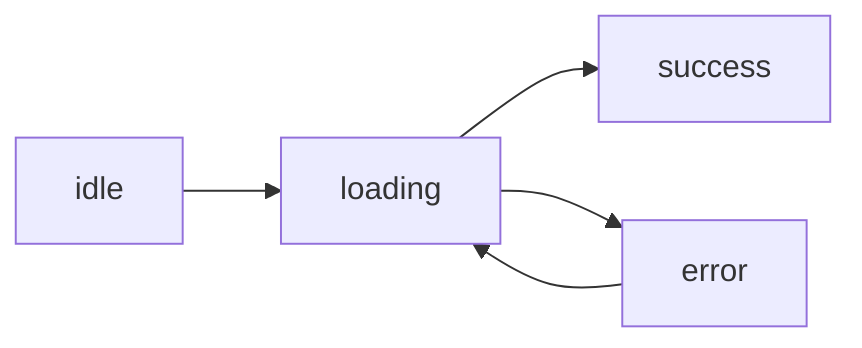

# API 호출과 비동기

이 글은 Frontend Development 101 시리즈의 여섯 번째 글입니다.

프론트엔드는 거의 항상 서버와 대화합니다. 사용자 목록을 불러오고, 검색 결과를 받고, 저장 버튼을 누르면 데이터를 전송합니다. 문제는 이 모든 일이 즉시 끝나지 않는다는 점입니다. 네트워크는 느릴 수 있고, 실패할 수 있으며, 요청 순서가 뒤집힐 수도 있습니다.

이 글에서는 프론트엔드의 비동기 흐름을 상태 중심으로 설명하겠습니다. 한 가지 관점이 중요합니다. 비동기 코드는 결국 로딩, 성공, 실패라는 상태를 어떻게 명시적으로 다루느냐의 문제라는 점입니다.

## 이 글에서 다룰 문제

- `fetch`와 `async/await`는 어떤 최소 패턴으로 시작하면 될까요?
- 로딩 상태와 에러 상태를 왜 반드시 화면에 드러내야 할까요?
- 컴포넌트가 사라질 때 요청 취소가 왜 필요할까요?
- race condition은 어떤 상황에서 생기고 어떻게 막을 수 있을까요?
- React Query와 SWR 같은 도구가 사실상 표준이 된 이유는 무엇일까요?

> 비동기 코드를 읽을 때는 항상 세 상태를 먼저 떠올려야 합니다. 로딩 중인지, 성공했는지, 실패했는지 분리되지 않으면 화면은 곧 혼란스러워집니다.

## 왜 중요한가

프론트엔드 버그의 큰 비중은 비동기 처리에서 나옵니다. 빠른 사내 와이파이에서는 잘 보이지 않다가 실제 사용자의 느린 네트워크에서만 터지는 경우가 많습니다. 그래서 비동기 로직은 낙관보다 명시적 상태 관리가 더 중요합니다.

좋은 비동기 코드는 최선의 네트워크가 아니라 최악의 네트워크를 기준으로 설계합니다. 느릴 때 무엇을 보여 줄지, 실패했을 때 어디까지 복구할지, 오래된 응답이 늦게 도착하면 어떻게 무시할지를 미리 정해야 합니다.

## 개념 한눈에 보기



이 네 가지 상태를 그려 놓고 시작하면 비동기 UI 설계가 훨씬 선명해집니다. 로딩 전, 로딩 중, 성공, 실패를 모두 다른 화면 상태로 다뤄야 합니다.

## 핵심 용어

- **`fetch`**: 브라우저에 기본 내장된 HTTP 클라이언트입니다.
- **Promise**: 미래에 도착할 값을 표현하는 객체입니다.
- **`async/await`**: Promise를 동기 코드처럼 읽게 해 주는 문법입니다.
- **AbortController**: 진행 중인 요청을 취소하는 도구입니다.
- **Stale-while-revalidate**: 캐시된 데이터를 먼저 보여 주고 뒤에서 새로 고치는 전략입니다.

## Before/After

**Before (callback hell)**

```javascript
fetch(url, (res) => {
  parse(res, (data) => {
    render(data, (e) => { ... });
  });
});
```

**After (async/await)**

```javascript
const res = await fetch(url);
const data = await res.json();
render(data);
```

문법이 단순해진 것만이 핵심은 아닙니다. `async/await`를 쓰면 흐름을 위에서 아래로 읽을 수 있어 예외 처리와 상태 분기가 훨씬 명확해집니다.

## 실습: 사용자 목록을 5단계로 만들기

### 1단계 — Plain fetch

```javascript
async function loadUsers() {
  const res = await fetch("/api/users");
  return res.json();
}
```

### 2단계 — Use it from React

```jsx
function Users() {
  const [users, setUsers] = useState([]);
  useEffect(() => { loadUsers().then(setUsers); }, []);
  return <ul>{users.map(u => <li key={u.id}>{u.name}</li>)}</ul>;
}
```

### 3단계 — Loading and error states

```jsx
function Users() {
  const [state, setState] = useState({ status: "idle" });
  useEffect(() => {
    setState({ status: "loading" });
    loadUsers()
      .then(data => setState({ status: "success", data }))
      .catch(err => setState({ status: "error", err }));
  }, []);

  if (state.status === "loading") return <p>Loading...</p>;
  if (state.status === "error")   return <p>Error: {state.err.message}</p>;
  return <ul>{state.data.map(u => <li key={u.id}>{u.name}</li>)}</ul>;
}
```

### 4단계 — Cancel on unmount

```jsx
useEffect(() => {
  const ctrl = new AbortController();
  fetch("/api/users", { signal: ctrl.signal })
    .then(r => r.json()).then(setUsers)
    .catch(e => e.name !== "AbortError" && console.error(e));
  return () => ctrl.abort();
}, []);
```

### 5단계 — Compress all of it with React Query

```jsx
import { useQuery } from "@tanstack/react-query";

function Users() {
  const { data, isLoading, error } = useQuery({
    queryKey: ["users"],
    queryFn: loadUsers,
  });
  if (isLoading) return <p>Loading...</p>;
  if (error)     return <p>Error</p>;
  return <ul>{data.map(u => <li key={u.id}>{u.name}</li>)}</ul>;
}
```

실무에서 중요한 포인트는 3단계와 4단계입니다. 데이터를 받아오는 코드 자체보다 로딩과 실패를 어떻게 보여 주는지, 그리고 컴포넌트가 사라질 때 오래된 요청이 남지 않게 처리하는지가 안정성을 좌우합니다.

## 이 코드에서 주목할 점

- 상태가 `idle/loading/success/error`로 명확히 드러납니다.
- 컴포넌트가 unmount될 때 요청을 취소합니다.
- React Query는 캐싱, 재시도, race condition 대응까지 한 번에 맡아줍니다.

## 자주 하는 실수 5가지

1. **로딩 상태를 생략합니다.** 사용자는 앱이 멈췄다고 느낍니다.
2. **에러를 콘솔에만 남깁니다.** 사용자 입장에서는 이유 없는 빈 화면만 보게 됩니다.
3. **race condition을 무시합니다.** 빠르게 입력한 검색에서 오래된 결과가 마지막에 덮어쓸 수 있습니다.
4. **같은 데이터를 여러 컴포넌트가 각각 다시 불러옵니다.** 한 리소스를 여러 번 중복 요청하게 됩니다.
5. **캐시 무효화 전략이 없습니다.** 새 데이터가 있어도 오래된 화면이 계속 남습니다.

## 실무에서는 이렇게 보입니다

현대 React 앱은 대부분 TanStack Query나 SWR을 표준처럼 사용합니다. Vue는 composable과 상태 관리 조합을 쓰고, Svelte는 내장 load 함수로 이 문제를 단순화합니다. 손으로 일일이 fetch 상태를 관리하는 코드는 학습 단계 이후 점점 줄어드는 편입니다.

그렇더라도 기본 원리는 사라지지 않습니다. 도구를 쓰든 직접 쓰든 비동기 UI는 상태 기계로 이해해야 합니다.

## 시니어 엔지니어는 이렇게 생각합니다

- 비동기는 상태 기계이므로 상태 전이를 먼저 그립니다.
- 모든 fetch는 취소 가능해야 한다고 가정합니다.
- 캐싱을 기본값으로 두고 실시간 갱신을 예외로 다룹니다.
- 사용자에게 보이는 에러는 친절하고 행동 가능해야 합니다.
- 가끔은 DevTools의 Slow 3G로 실제 체감을 확인합니다.

## 체크리스트

- [ ] `fetch`를 `async/await`와 함께 작성할 수 있습니다.
- [ ] 로딩, 에러, 성공 상태를 각각 따로 렌더링할 수 있습니다.
- [ ] `AbortController`를 한 번 사용해 봤습니다.
- [ ] React Query나 SWR을 직접 써 봤습니다.
- [ ] Slow 3G 환경에서 동작을 점검해 봤습니다.

## 연습 문제

1. `https://jsonplaceholder.typicode.com/users`를 호출해 사용자 목록을 렌더링해 보세요.
2. 로딩 상태와 에러 상태를 명시적으로 추가해 보세요.
3. 검색 입력창을 붙이고, 빠르게 입력해도 가장 최근 입력 결과만 보이도록 race condition을 제어해 보세요.

## 정리 및 다음 단계

비동기는 결국 상태입니다. 이 관점이 잡히면 이제 사용자 입력을 받는 폼도 같은 방식으로 더 명확하게 읽을 수 있습니다.

다음 글에서는 폼과 유효성 검사를 통해 사용자 입력을 안전하고 친절하게 다루는 방법을 살펴보겠습니다.

<!-- toc:begin -->
- [프론트엔드 개발이란 무엇인가?](./01-what-is-frontend-development.md)
- [HTML과 CSS 기본](./02-html-and-css-basics.md)
- [JavaScript 기본](./03-javascript-basics.md)
- [컴포넌트와 상태](./04-components-and-state.md)
- [라우팅과 페이지](./05-routing-and-pages.md)
- **API 호출과 비동기 (현재 글)**
- 폼과 유효성 검사 (예정)
- 스타일링과 디자인 시스템 (예정)
- 빌드 도구와 번들링 (예정)
- 작은 프론트엔드 앱 만들기 (예정)
<!-- toc:end -->

## 참고 자료

- [MDN Fetch API](https://developer.mozilla.org/en-US/docs/Web/API/Fetch_API)
- [TanStack Query](https://tanstack.com/query/latest)
- [SWR docs](https://swr.vercel.app/)
- [MDN AbortController](https://developer.mozilla.org/en-US/docs/Web/API/AbortController)

Tags: Frontend, API, Async, Fetch, JavaScript
