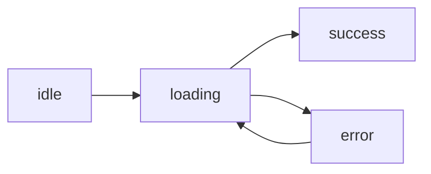

# API 호출과 비동기

> Frontend Development 101 시리즈 (6/10)


## 이 글에서 다룰 문제

비동기는 프론트엔드 버그의 큰 비중을 차지합니다. 빠른 네트워크에서는 잘 안 보이다가, 사용자의 느린 3G 환경에서 갑자기 문제가 드러납니다. 그래서 상태를 명시적으로 관리해야 합니다.

> 좋은 비동기 코드는 항상 가장 나쁜 네트워크 상황을 가정합니다.

## 전체 흐름


## Before/After

**Before (콜백 지옥)**

```javascript
fetch(url, (res) => {
  parse(res, (data) => {
    render(data, (e) => { ... });
  });
});
```

**After (async/await)**

```javascript
const res = await fetch(url);
const data = await res.json();
render(data);
```

## 사용자 목록 5단계

### 1단계 — 단순 fetch

```javascript
async function loadUsers() {
  const res = await fetch("/api/users");
  return res.json();
}
```

### 2단계 — React에서 사용

```jsx
function Users() {
  const [users, setUsers] = useState([]);
  useEffect(() => { loadUsers().then(setUsers); }, []);
  return <ul>{users.map(u => <li key={u.id}>{u.name}</li>)}</ul>;
}
```

### 3단계 — 로딩과 에러 상태

```jsx
function Users() {
  const [state, setState] = useState({ status: "idle" });
  useEffect(() => {
    setState({ status: "loading" });
    loadUsers()
      .then(data => setState({ status: "success", data }))
      .catch(err => setState({ status: "error", err }));
  }, []);

  if (state.status === "loading") return <p>로딩 중...</p>;
  if (state.status === "error")   return <p>에러: {state.err.message}</p>;
  return <ul>{state.data.map(u => <li key={u.id}>{u.name}</li>)}</ul>;
}
```

### 4단계 — 취소

```jsx
useEffect(() => {
  const ctrl = new AbortController();
  fetch("/api/users", { signal: ctrl.signal })
    .then(r => r.json()).then(setUsers)
    .catch(e => e.name !== "AbortError" && console.error(e));
  return () => ctrl.abort();
}, []);
```

### 5단계 — React Query로 위 코드 압축

```jsx
import { useQuery } from "@tanstack/react-query";

function Users() {
  const { data, isLoading, error } = useQuery({
    queryKey: ["users"],
    queryFn: loadUsers,
  });
  if (isLoading) return <p>로딩 중...</p>;
  if (error)     return <p>에러</p>;
  return <ul>{data.map(u => <li key={u.id}>{u.name}</li>)}</ul>;
}
```

## 이 코드에서 주목할 점

- 상태가 `idle/loading/success/error` 네 가지로 명확하게 나뉩니다.
- 컴포넌트 unmount 시 요청을 취소합니다.
- React Query는 캐싱, 재시도, race condition 처리까지 한 번에 맡아줍니다.

## 자주 하는 실수 5가지

1. **로딩 상태를 표시하지 않는다.** 사용자는 앱이 멈췄다고 생각합니다.
2. **에러를 `console.log` 만 한다.** 사용자 입장에서는 흰 화면만 남습니다.
3. **race condition을 무시한다.** 빠르게 검색할 때 잘못된 결과가 표시될 수 있습니다.
4. **모든 컴포넌트가 각자 fetch한다.** 같은 데이터를 여러 번 받게 됩니다.
5. **캐시 무효화 전략이 없다.** 새 데이터가 들어와도 오래된 화면이 남습니다.

## 실무에서는 이렇게 쓰입니다

대부분의 React 앱은 React Query(TanStack Query) 또는 SWR을 표준으로 사용합니다. Vue는 Pinia + composables, Svelte는 내장 load 함수를 많이 씁니다. fetch 상태를 전부 손으로 관리하는 코드는 점점 줄어들고 있습니다.

## 체크리스트

- [ ] `async/await` 로 fetch를 작성할 수 있다.
- [ ] 로딩/에러/성공 상태를 분리해서 표시한다.
- [ ] AbortController를 한 번 써봤다.
- [ ] React Query 또는 SWR을 시도해봤다.
- [ ] Slow 3G 모드에서 앱을 테스트해봤다.

## 정리 및 다음 단계

비동기는 결국 상태 관리 문제입니다. 다음 글에서는 사용자 입력을 다루는 폼과 유효성 검사를 봅니다.

<!-- toc:begin -->
- [프론트엔드 개발이란 무엇인가?](./01-what-is-frontend-development.md)
- [HTML과 CSS 기본](./02-html-and-css-basics.md)
- [JavaScript 기본](./03-javascript-basics.md)
- [컴포넌트와 상태](./04-components-and-state.md)
- [라우팅과 페이지](./05-routing-and-pages.md)
- **API 호출과 비동기 (현재 글)**
- 폼과 유효성 검사 (예정)
- 스타일링과 디자인 시스템 (예정)
- 빌드 도구와 번들링 (예정)
- 작은 프론트엔드 앱 만들기 (예정)
<!-- toc:end -->

## 참고 자료

- [MDN Fetch API](https://developer.mozilla.org/en-US/docs/Web/API/Fetch_API)
- [TanStack Query](https://tanstack.com/query/latest)
- [SWR docs](https://swr.vercel.app/)
- [MDN AbortController](https://developer.mozilla.org/en-US/docs/Web/API/AbortController)

Tags: Frontend, API, Async, Fetch, JavaScript
