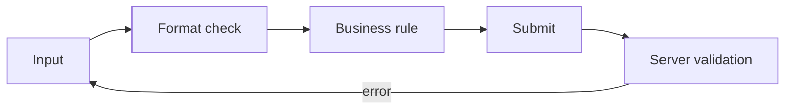

# 폼과 유효성 검사

> Frontend Development 101 시리즈 (7/10)


## 이 글에서 다룰 문제

폼은 *전환율* 의 핵심입니다. 가입, 결제, 검색이 모두 폼입니다. 폼이 *조금만 어색해도* 사용자는 떠납니다. 폼은 *프론트엔드 UX의 시험대* 입니다.

> 좋은 폼은 *덜 입력하게* 하고, *오타를 미리 잡아주고*, *제출이 빠르게* 끝납니다.

## 전체 흐름


## Before/After

**Before (제출 후에만 검사)**

```javascript
form.onsubmit = () => {
  if (email.value === "") alert("이메일을 입력하세요");
};
```

**After (실시간 inline 검사 + 친절한 메시지)**

```jsx
{!isEmail(email) && <p className="error">이메일 형식이 아닙니다</p>}
```

## 가입 폼 5단계

### 1단계 — controlled input

```jsx
function Signup() {
  const [email, setEmail] = useState("");
  return <input value={email} onChange={e => setEmail(e.target.value)} />;
}
```

### 2단계 — 형식 검사

```jsx
const isValidEmail = /^[^@\s]+@[^@\s]+\.[^@\s]+$/.test(email);
```

### 3단계 — inline 에러

```jsx
<input
  value={email}
  onChange={e => setEmail(e.target.value)}
  aria-invalid={!isValidEmail}
/>
{!isValidEmail && email && <p className="error">올바른 이메일이 아닙니다</p>}
```

### 4단계 — 제출 시 비활성화

```jsx
<button disabled={!isValidEmail || submitting}>
  {submitting ? "전송 중..." : "가입"}
</button>
```

### 5단계 — Zod로 스키마화

```jsx
import { z } from "zod";

const SignupSchema = z.object({
  email: z.string().email(),
  password: z.string().min(8),
});

const result = SignupSchema.safeParse({ email, password });
if (!result.success) showErrors(result.error.format());
```

## 이 코드에서 주목할 점

- 사용자가 *타이핑하는 동안* 검사가 일어납니다.
- `aria-invalid` 로 스크린리더 사용자에게도 *동일한 정보* 를 줍니다.
- Zod 스키마 하나가 *프론트와 백엔드의 검증 로직* 을 통일합니다.

## 자주 하는 실수 5가지

1. **비밀번호를 *한 번만* 받는다.** 오타 시 가입 자체가 실패합니다.
2. **에러를 *제출 후* 에만 보여준다.** 사용자는 *모든 필드* 를 다시 봐야 합니다.
3. **에러 메시지가 *기술적* 이다.** "Schema validation failed" 는 사용자에게 *의미 없습니다*.
4. **`<label>` 을 빠뜨린다.** 스크린리더가 *어떤 입력인지* 모릅니다.
5. **모바일 키보드 타입을 지정하지 않는다.** 이메일 필드인데 *문자 키보드* 가 뜹니다.

## 실무에서는 이렇게 쓰입니다

대부분의 React 앱은 *React Hook Form + Zod* 조합을 사용합니다. 폼 상태 관리, 유효성 검사, 제출, 에러 표시를 *선언적으로* 묶을 수 있습니다. 직접 useState로 폼을 관리하는 코드는 *학습 단계 이후* 거의 사라집니다.

## 체크리스트

- [ ] controlled input을 쓸 수 있다.
- [ ] inline 에러를 표시한다.
- [ ] `<label>` 과 `for` 를 모든 input에 단다.
- [ ] `aria-invalid` 와 `aria-describedby` 를 안다.
- [ ] Zod/Yup 같은 스키마 검증을 한 번 써봤다.

## 정리 및 다음 단계

폼은 *사용자와의 가장 긴 대화* 입니다. 다음 글에서는 그 폼을 포함해 *전체 화면의 외형* 을 결정하는 스타일링과 디자인 시스템을 봅니다.

<!-- toc:begin -->
- [프론트엔드 개발이란 무엇인가?](./01-what-is-frontend-development.md)
- [HTML과 CSS 기본](./02-html-and-css-basics.md)
- [JavaScript 기본](./03-javascript-basics.md)
- [컴포넌트와 상태](./04-components-and-state.md)
- [라우팅과 페이지](./05-routing-and-pages.md)
- [API 호출과 비동기](./06-api-calls-and-async.md)
- **폼과 유효성 검사 (현재 글)**
- 스타일링과 디자인 시스템 (예정)
- 빌드 도구와 번들링 (예정)
- 작은 프론트엔드 앱 만들기 (예정)
<!-- toc:end -->

## 참고 자료

- [React Hook Form](https://react-hook-form.com/)
- [Zod docs](https://zod.dev/)
- [MDN Form validation](https://developer.mozilla.org/en-US/docs/Learn/Forms/Form_validation)
- [W3C Form best practices](https://www.w3.org/WAI/tutorials/forms/)

Tags: Frontend, Forms, Validation, UX, React
