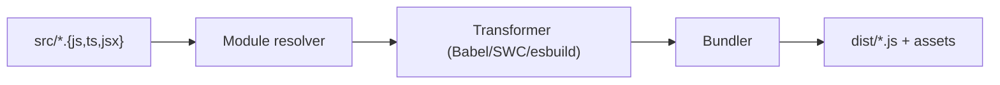

# 빌드 도구와 번들링

> Frontend Development 101 시리즈 (9/10)


## 이 글에서 다룰 문제

번들 크기는 곧바로 사용자 경험으로 이어집니다. 1MB 번들은 3G 사용자에게는 8초짜리 흰 화면일 수 있습니다. 빌드 도구를 이해하지 못하면 왜 제품이 무거워지는지 설명하기 어렵습니다.

> 좋은 번들은 작고, 캐시 가능하고, 적절히 분할되어 있습니다.

## 전체 흐름


## Before/After

**Before (수십 개의 `<script>` 태그)**

```html
<script src="utils.js"></script>
<script src="auth.js"></script>
<script src="app.js"></script>
```

**After (한 번의 `<script>` + 자동 split)**

```html
<script type="module" src="/dist/index-[hash].js"></script>
```

## Vite 5단계

### 1단계 — 프로젝트 생성

```bash
npm create vite@latest my-app -- --template react-ts
cd my-app && npm install
```

### 2단계 — 개발 서버 (HMR)

```bash
npm run dev
# 브라우저: http://localhost:5173
# 코드가 바뀌면 페이지가 자동으로 갱신됩니다.
```

### 3단계 — 프로덕션 빌드

```bash
npm run build
# dist/ 에 정적 파일이 생성됩니다.
ls -lh dist/assets
```

### 4단계 — 번들 분석

```bash
npm install -D rollup-plugin-visualizer
```

```javascript
// vite.config.ts 파일
import { visualizer } from "rollup-plugin-visualizer";
export default {
  plugins: [visualizer({ open: true })],
};
```

빌드 후 어떤 모듈이 큰지 시각적으로 확인합니다.

### 5단계 — 환경 변수와 모드

```bash
# .env.production
VITE_API_URL=https://api.example.com

# 코드에서 사용
const url = import.meta.env.VITE_API_URL;
```

## 이 코드에서 주목할 점

- 개발 서버는 ESM을 직접 서빙하므로 부팅이 빠릅니다.
- 빌드 산출물은 파일명에 해시가 붙어 장기 캐시에 유리합니다.
- 번들 분석은 최적화의 출발점입니다.

## 자주 하는 실수 5가지

1. **`import * as _ from "lodash"` 를 한다.** 전체 lodash가 번들에 들어갑니다. `import debounce from "lodash/debounce"` 처럼 필요한 것만 가져오세요.
2. **dev server와 production 빌드를 동일하게 가정한다.** HMR 코드와 sourcemap이 프로덕션에 섞이면 번들이 무거워집니다.
3. **번들을 한 번도 분석하지 않는다.** 어떤 라이브러리가 4MB를 차지하는지조차 모르게 됩니다.
4. **소스맵을 프로덕션에 노출한다.** 원본 코드가 그대로 드러날 수 있습니다.
5. **이미지를 압축 없이 번들한다.** 큰 이미지가 그대로 사용자에게 전달됩니다.

## 실무에서는 이렇게 쓰입니다

대부분의 신규 프로젝트는 Vite + esbuild + SWC 조합을 씁니다. 큰 모노레포는 Turbopack/Rspack 같은 차세대 번들러로 옮겨가는 중입니다. Webpack도 여전히 널리 쓰이지만, 새 프로젝트의 기본 선택지에서는 조금씩 뒤로 밀리고 있습니다.

## 체크리스트

- [ ] Vite 프로젝트를 만들 수 있다.
- [ ] HMR이 작동하는 것을 확인했다.
- [ ] `dist/` 안의 파일을 살펴봤다.
- [ ] 번들 분석 도구를 한 번 돌렸다.
- [ ] 환경 변수로 dev/prod를 분리할 수 있다.

## 정리 및 다음 단계

빌드 도구는 사용자가 처음 보는 화면의 속도를 결정합니다. 마지막 글에서는 지금까지의 개념을 모두 모아 작은 프론트엔드 앱을 만듭니다.

<!-- toc:begin -->
- [프론트엔드 개발이란 무엇인가?](./01-what-is-frontend-development.md)
- [HTML과 CSS 기본](./02-html-and-css-basics.md)
- [JavaScript 기본](./03-javascript-basics.md)
- [컴포넌트와 상태](./04-components-and-state.md)
- [라우팅과 페이지](./05-routing-and-pages.md)
- [API 호출과 비동기](./06-api-calls-and-async.md)
- [폼과 유효성 검사](./07-forms-and-validation.md)
- [스타일링과 디자인 시스템](./08-styling-and-design-system.md)
- **빌드 도구와 번들링 (현재 글)**
- 작은 프론트엔드 앱 만들기 (예정)
<!-- toc:end -->

## 참고 자료

- [Vite docs](https://vitejs.dev/)
- [esbuild docs](https://esbuild.github.io/)
- [web.dev: Reduce JavaScript payloads](https://web.dev/reduce-javascript-payloads-with-tree-shaking/)
- [Bundlephobia](https://bundlephobia.com/)

Tags: Frontend, Build, Vite, Bundling, Performance
