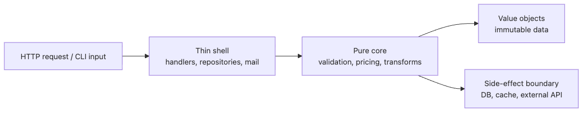

# Balancing OOP and Functional Programming

Teams rarely fail because they picked OOP or FP. They fail because stateful orchestration, validation rules, persistence, and formatting all get mixed into the same place. Once that happens, the debate becomes ideological even though the real problem is boundary design.

This is the final post in the Functional Programming 101 series.

Python gives you a practical escape hatch because it does not force a single paradigm. You can model long-lived state with objects, keep business rules in pure functions, and leave persistence or messaging at the edge. The hard part is not choosing a side. It is deciding where each concern belongs.

## What You Will Learn

- Comparing the strengths and weaknesses of OOP and FP
- Patterns for mixing both paradigms
- Situation-specific design selection criteria
- Practical hybrid design in Python

## Why It Matters

"Use only OOP" or "use only FP" is unrealistic. Production code has parts that need state management (OOP) and parts that need data transformation (FP). Combining both paradigms well is the essence of good design.

> Good design = choosing the right paradigm for the problem

Python's standard library ships both `pathlib` (OOP) and `itertools` (FP). Using every tool the language provides is Pythonic.

## Concept Overview

> OOP vs FP — strength comparison

```text
OOP Fits Best                  FP Fits Best
─────────────────             ─────────────────
State + behavior together     Stateless data transformation
Managing multiple instances   Pipeline data processing
Framework integration         Concurrency / parallelism
Complex domain models         Mathematical / declarative logic
```

## Where to draw the OOP/FP boundary



*Keep handlers and repositories at the edge, and push the important business rules into a pure core. That is the simplest repeatable way to mix OOP and FP without losing consistency.*

## Key Concepts

| Term | Description |
|------|-------------|
| Multi-paradigm | A language that supports multiple programming styles |
| Hybrid design | A design approach that combines OOP and FP based on purpose |
| Functional Core, Imperative Shell | An architecture with pure function core and side-effect boundary |
| Value object | An immutable object compared by equality rather than identity |
| Service function | A stateless function that implements business logic |

## Before / After

Convert pure OOP into a hybrid approach.

```python
# before: everything in a class
class OrderProcessor:
    def __init__(self, tax_rate: float) -> None:
        self.tax_rate = tax_rate

    def calculate_total(self, items: list[dict]) -> float:
        subtotal = sum(i["price"] * i["qty"] for i in items)
        return subtotal * (1 + self.tax_rate)

    def format_receipt(self, items: list[dict]) -> str:
        total = self.calculate_total(items)
        return f"Total: ${total:,.2f}"

processor = OrderProcessor(0.1)
print(processor.format_receipt([{"price": 25.00, "qty": 2}]))
```

```python
# after: value objects (OOP) + pure functions (FP)
from dataclasses import dataclass

@dataclass(frozen=True)
class OrderItem:
    name: str
    price: float
    qty: int

def calculate_total(items: list[OrderItem], tax_rate: float) -> float:
    subtotal = sum(i.price * i.qty for i in items)
    return subtotal * (1 + tax_rate)

def format_receipt(items: list[OrderItem], tax_rate: float) -> str:
    total = calculate_total(items, tax_rate)
    return f"Total: ${total:,.2f}"

items = [OrderItem("Coffee", 25.00, 2)]
print(format_receipt(items, 0.1))
```

## Hands-On Steps

### Step 1: Value Objects + Pure Functions

```python
from dataclasses import dataclass, replace
from typing import NamedTuple


# value objects: immutable, equality-based
@dataclass(frozen=True)
class Money:
    amount: int
    currency: str = "USD"

class Percentage(NamedTuple):
    value: float


# pure functions: transform value objects
def apply_discount(price: Money, discount: Percentage) -> Money:
    discounted = int(price.amount * (1 - discount.value))
    return replace(price, amount=discounted)

def add_tax(price: Money, tax: Percentage) -> Money:
    taxed = int(price.amount * (1 + tax.value))
    return replace(price, amount=taxed)

def format_money(money: Money) -> str:
    return f"{money.amount:,} {money.currency}"


price = Money(50000)
discounted = apply_discount(price, Percentage(0.1))
final = add_tax(discounted, Percentage(0.1))

print(f"Original: {format_money(price)}")       # Original: 50,000 USD
print(f"After discount: {format_money(discounted)}")  # After discount: 45,000 USD
print(f"After tax: {format_money(final)}")       # After tax: 49,500 USD
```

### Step 2: Functional Core, Imperative Shell

```python
from dataclasses import dataclass


# === Functional Core (pure functions) ===
@dataclass(frozen=True)
class User:
    name: str
    email: str
    active: bool = True

def validate_email(email: str) -> list[str]:
    """Email validation — pure function."""
    errors = []
    if "@" not in email:
        errors.append("@ symbol is required")
    if "." not in email.split("@")[-1]:
        errors.append("Domain must contain a dot")
    return errors

def create_user_data(name: str, email: str) -> User | list[str]:
    """User creation validation — pure function."""
    errors = validate_email(email)
    if not name.strip():
        errors.append("Name is empty")
    if errors:
        return errors
    return User(name=name.strip(), email=email.lower())


# === Imperative Shell (side effects) ===
def handle_registration(name: str, email: str) -> None:
    """Registration handler — contains side effects."""
    result = create_user_data(name, email)
    if isinstance(result, list):
        for error in result:
            print(f"  Error: {error}")
    else:
        print(f"  Registered: {result}")
        # In production: save to DB, send email, etc.


handle_registration("Alice", "alice@example.com")
# Registered: User(name='Alice', email='alice@example.com', active=True)

handle_registration("", "invalid-email")
# Error: @ symbol is required
# Error: Name is empty
```

### Step 3: Classes + Functional Methods

```python
from dataclasses import dataclass
from typing import Callable, Iterator


@dataclass
class DataPipeline:
    """A class that composes a pipeline where each stage is a pure function."""
    steps: list[Callable] = None

    def __post_init__(self) -> None:
        if self.steps is None:
            self.steps = []

    def add_step(self, func: Callable) -> "DataPipeline":
        """Returns a new pipeline with the added step (immutable)."""
        return DataPipeline(steps=[*self.steps, func])

    def run(self, data):
        """Executes the pipeline."""
        result = data
        for step in self.steps:
            result = step(result)
        return result


# pure function stages
def normalize(records: list[dict]) -> list[dict]:
    return [{**r, "name": r["name"].strip().title()} for r in records]

def enrich(records: list[dict]) -> list[dict]:
    return [{**r, "name_len": len(r["name"])} for r in records]

def filter_valid(records: list[dict]) -> list[dict]:
    return [r for r in records if r.get("score", 0) > 0]


# assemble the pipeline (OOP interface + FP execution)
pipeline = (
    DataPipeline()
    .add_step(normalize)
    .add_step(filter_valid)
    .add_step(enrich)
)

data = [
    {"name": "  alice  ", "score": 85},
    {"name": "  bob  ", "score": 0},
    {"name": "  charlie  ", "score": 92},
]

result = pipeline.run(data)
for r in result:
    print(r)
# {'name': 'Alice', 'score': 85, 'name_len': 5}
# {'name': 'Charlie', 'score': 92, 'name_len': 7}
```

### Step 4: Paradigm Selection Guide

```python
# Situation 1: state management -> OOP
class ShoppingCart:
    def __init__(self) -> None:
        self._items: list[dict] = []

    def add(self, item: str, price: int) -> None:
        self._items.append({"item": item, "price": price})

    @property
    def total(self) -> int:
        return sum(i["price"] for i in self._items)


# Situation 2: data transformation -> FP
def transform_prices(
    items: list[dict],
    rate: float,
) -> list[dict]:
    return [{**i, "price": int(i["price"] * rate)} for i in items]


# Situation 3: framework integration -> OOP (framework requires it)
class UserSerializer:
    def to_dict(self, user) -> dict:
        return {"name": user.name, "email": user.email}


# Situation 4: utility -> FP
def slugify(text: str) -> str:
    return text.lower().strip().replace(" ", "-")


# mixed usage
cart = ShoppingCart()
cart.add("Coffee", 450)
cart.add("Cake", 600)

# transform OOP object data with FP
discounted = transform_prices(cart._items, 0.9)
print(f"Before discount: {cart.total:,}")
print(f"After discount: {sum(i['price'] for i in discounted):,}")
# Before discount: 1,050
# After discount: 945
```

### Step 5: Executable Hybrid Workflow

```python
from dataclasses import dataclass


@dataclass(frozen=True)
class RawConfig:
    host: str
    port: str
    debug: str


@dataclass(frozen=True)
class AppConfig:
    host: str
    port: int
    debug: bool


def normalize_config(raw: RawConfig) -> AppConfig:
    return AppConfig(
        host=raw.host.strip(),
        port=int(raw.port),
        debug=raw.debug.strip().lower() in {"1", "true", "yes"},
    )


def validate_config(config: AppConfig) -> list[str]:
    errors = []
    if not config.host:
        errors.append("host is required")
    if config.port < 1 or config.port > 65535:
        errors.append("port must be 1-65535")
    return errors


class AppServer:
    def __init__(self, config: AppConfig) -> None:
        self.config = config

    def start(self) -> str:
        mode = "debug" if self.config.debug else "prod"
        return f"starting server on {self.config.host}:{self.config.port} ({mode})"


def boot(raw: RawConfig) -> str:
    normalized = normalize_config(raw)
    errors = validate_config(normalized)
    if errors:
        return f"validation failed: {errors}"
    server = AppServer(normalized)
    return server.start()


good = RawConfig(host=" localhost ", port="8080", debug="yes")
bad_host = RawConfig(host="   ", port="8080", debug="yes")
bad_port = RawConfig(host="api.internal", port="70000", debug="no")

assert normalize_config(good) == AppConfig(host="localhost", port=8080, debug=True)
assert boot(good) == "starting server on localhost:8080 (debug)"
assert boot(bad_host) == "validation failed: ['host is required']"
assert boot(bad_port) == "validation failed: ['port must be 1-65535']"

print("Normalized config:", normalize_config(good))
print("Success run:", boot(good))
print("Missing host:", boot(bad_host))
print("Bad port:", boot(bad_port))
# Normalized config: AppConfig(host='localhost', port=8080, debug=True)
# Success run: starting server on localhost:8080 (debug)
# Missing host: validation failed: ['host is required']
# Bad port: validation failed: ['port must be 1-65535']
```

#### Expected output

```text
Normalized config: AppConfig(host='localhost', port=8080, debug=True)
Success run: starting server on localhost:8080 (debug)
Missing host: validation failed: ['host is required']
Bad port: validation failed: ['port must be 1-65535']
```

#### If your result differs, inspect this first

- Make sure `normalize_config()` still calls `host.strip()`. A host made of whitespace should become an empty string before validation.
- Check that `port` is converted to `int` before range validation. Comparing the raw string can let invalid ports slip through.
- Make sure validation failure stops before `AppServer` is constructed. That edge is the whole point of keeping shell code outside the functional core.
- Confirm the success path lives in the thin class shell while normalization and validation stay pure. That separation is the design rule the example is trying to prove.

## What to Notice in This Code

- Value objects (frozen dataclasses) combine OOP structure with FP immutability
- "Functional Core, Imperative Shell" creates a testable core architecture
- Using OOP for the public interface and FP for internal logic is an effective hybrid
- The selection criterion is "Does this need state management?"

## 5 Common Mistakes

| Mistake | Why It Is a Problem | Fix |
|---------|---------------------|-----|
| Paradigm purism | Adds unnecessary complexity | Choose the right tool for the problem |
| Wrapping everything in classes | Functions suffice in many cases | Ask "Do I need state?" first |
| Avoiding state at all costs with FP | Inefficient where state management is needed | Use classes when state is required |
| Inconsistent style within a team | Code review and collaboration suffer | Agree on team guidelines |
| Over-abstraction | Simple code is often better | Apply the YAGNI principle |

## Real-World Applications

- Django/FastAPI: class-based views combined with pure function business logic
- Data pipelines: functional transformations combined with OOP connectors
- Testing: unit tests for pure functions, integration tests for classes
- Configuration: frozen dataclasses (OOP) combined with validation functions (FP)
- Event handling: event objects (OOP) combined with handler functions (FP)

## How Senior Engineers Think About This

"OOP vs FP" is a false dichotomy. Python's strength is the freedom to combine both paradigms. Data models as dataclasses, business logic as pure functions, framework integration as classes — that is practical Python.

"Which paradigm do you use?" matters less than "Is the code easy to test?", "Is it easy to change?", "Is it easy to read?" The pure functions, immutable data, higher-order functions, closures, generators, and composition covered in this series are new tools in your toolbox.

## Checklist

- [ ] I can compare the strengths and weaknesses of OOP and FP
- [ ] I can explain the "Functional Core, Imperative Shell" pattern
- [ ] I can design with value objects and pure functions combined
- [ ] I can apply situation-specific paradigm selection criteria
- [ ] I can apply hybrid design patterns in production code

## Exercises

1. Design a shopping cart using OOP (Cart class) + FP (pure discount and tax calculation functions) as a hybrid.
2. Implement a file-based configuration loader using the "Functional Core, Imperative Shell" pattern.
3. Identify parts of existing OOP code that can be extracted as pure functions and refactor them.

## Summary and Next Steps

OOP and functional programming are not opposites — they complement each other. In Python, the most practical approach is immutable value objects (OOP) + pure functions (FP) + thin class shells. The pure functions, immutable data, higher-order functions, closures, generators, and composition covered in this series will help you write cleaner, more testable code.

<!-- toc:begin -->
- [What Is Functional Programming?](./01-what-is-fp.md)
- [Pure Functions and Side Effects](./02-pure-functions.md)
- [Immutable Data](./03-immutable-data.md)
- [Higher-Order Functions](./04-higher-order-functions.md)
- [map, filter, reduce](./05-map-filter-reduce.md)
- [Closures and Partial Application](./06-closure-and-partial.md)
- [Recursion and Tail Calls](./07-recursion.md)
- [Lazy Evaluation and Generators](./08-lazy-evaluation.md)
- [Function Composition and Pipelines](./09-function-composition.md)
- **Balancing OOP and Functional Programming (current)**
<!-- toc:end -->

## References

- [Functional Core, Imperative Shell — Gary Bernhardt](https://www.destroyallsoftware.com/screencasts/catalog/functional-core-imperative-shell)
- [Clean Architecture — Robert C. Martin](https://www.oreilly.com/library/view/clean-architecture-a/9780134494272/)
- [Fluent Python — Chapter 7: Functions as First-Class Objects](https://www.oreilly.com/library/view/fluent-python-2nd/9781492056348/)
- [Python Official Docs — Programming FAQ](https://docs.python.org/3/faq/programming.html)

Tags: Python, Functional Programming, OOP, Multi-Paradigm, Design Decisions
