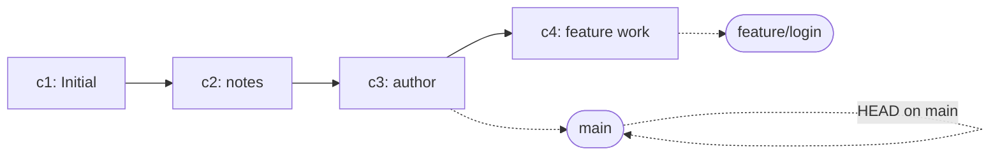

# Branch basics - create, switch, and compare

## What you will learn

- What a branch actually is (it is not a folder copy)
- How to list and create branches with `git branch`
- How to move between branches with `git switch` (and how it relates to `git checkout`)
- How `HEAD` moves together with the current branch
- How to compare two branches using `git log` and `git diff`

## Why it matters

The real value of Git shows up the moment you have more than one thing in flight. If you need to work on a "login feature" and a "bug fix" in the same folder at the same time, zip backups and copy-pasted folders fall apart fast.

A branch is a way to keep **multiple lines of work** inside the same repository. Each line accumulates its own commits, and you can merge them when you are ready.

- You can try an experimental change without touching `main`.
- You can park a feature on its own line until review is done.
- In team work, each person works on their own branch and merges through pull requests.

This article stops just before merging. We focus on **creating, switching, and comparing** branches. Merge and conflict resolution come in the next article.

## Mental Model

A branch is a **pointer** to a commit. When you make a new commit, the current branch pointer moves one step forward.



Two ideas to hold together:

- **A branch itself is cheap.** It is roughly a 41-byte file under `.git/refs/heads/<name>` that stores a commit hash.
- **`HEAD` is a second pointer that says "which branch am I on right now."** When you switch branches, `HEAD` moves with you.

Once that picture is in your head, behaviors like "I created a branch and disk usage stayed about the same" or "I switched and the files in my working tree changed" stop feeling magical.

## Core concepts

- **branch**: A movable pointer to a commit. When you make a new commit on it, the pointer moves to that new commit.
- **`main`**: The conventional default branch. Many older repositories use `master` for the same role.
- **`HEAD`**: A special pointer that says "the branch I am working on right now." Most of the time it points to a branch name, and that branch points to a commit, which is the current commit.
- **`git branch`**: Lists branches when called with no arguments, or creates a new branch when given a name.
- **`git switch`**: The newer command (Git 2.23+) for moving between branches. With `-c`, it creates and switches in one step.
- **`git checkout`**: The older command. It bundled branch switching and file restoration into a single command, which was a frequent source of confusion. Since Git 2.23 those jobs are split into `switch` (move branches) and `restore` (restore files). Both old and new commands still work.
- **fast-forward**: When two branches sit on the same line of history, merging is just moving a pointer forward. When they have diverged, Git needs a merge commit instead (the topic of the next article).

## Before-After

The same situation - "two pieces of work at once" - looks very different with and without branches.

**Before (folder copies)**

```text
$ cp -r project project-feature-login
$ cp -r project project-bugfix
```

- Whole folders get duplicated, and disk usage balloons.
- You have to remember by hand which folder is the latest and where each change lives.
- There is no standard way to move a change from one folder into another.

**After (Git branches)**

```text
$ git branch
* main

$ git switch -c feature/login
Switched to a new branch 'feature/login'

$ git branch
* feature/login
  main
```

- You stay in one folder and step between two lines of work. The only thing that grows is a tiny file under `.git/refs/heads/`.
- The `*` marker shows which branch you are on.
- Merging changes back together has standard tools (`merge`, `rebase`).

## Step-by-step walkthrough

We continue with the `my-first-repo` directory from the previous article. We start in a state where `git log --oneline` shows three commits.

```text
$ git log --oneline
e7d2c1a Add author line to README
9b8c3e2 Add intro paragraph to notes
4f1a2c0 Initial commit
```

### 1. Check the current branch

```text
$ git branch
* main
```

The `*` marks the current branch. Only `main` exists right now.

The first line of `git status` shows the same information.

```text
$ git status
On branch main
nothing to commit, working tree clean
```

### 2. Create a new branch

Pass a name to `git branch` and you get a new branch that points to the same commit `main` points to.

```text
$ git branch feature/login
$ git branch
  feature/login
* main
```

The `*` is still on `main`. **Creating a branch does not move you onto it.**

### 3. Switch branches

Use `git switch` to move.

```text
$ git switch feature/login
Switched to branch 'feature/login'
$ git branch
* feature/login
  main
```

To create and switch in one step, use `-c`.

```text
$ git switch -c feature/signup
Switched to a new branch 'feature/signup'
```

The older command spelling does the same thing (both still work).

```text
$ git checkout feature/login           # move
$ git checkout -b feature/signup       # create and move
```

### 4. Make a commit on a branch

Add a new file on `feature/login` and commit it.

```text
$ git switch feature/login
$ echo "login form" > login.md
$ git add login.md
$ git commit -m "Add login form draft"
[feature/login a2b3c4d] Add login form draft
 1 file changed, 1 insertion(+)
 create mode 100644 login.md
```

Now `git log --oneline` shows four commits.

```text
$ git log --oneline
a2b3c4d Add login form draft
e7d2c1a Add author line to README
9b8c3e2 Add intro paragraph to notes
4f1a2c0 Initial commit
```

Switch back to `main` and the new file disappears (more precisely, `main` does not have that commit at all).

```text
$ git switch main
Switched to branch 'main'
$ ls
README.md  notes.md
$ git log --oneline
e7d2c1a Add author line to README
9b8c3e2 Add intro paragraph to notes
4f1a2c0 Initial commit
```

`login.md` was not deleted; **the commit that introduced it does not exist on `main`**. Switch back to `feature/login` and the file is there again.

### 5. Compare two branches

Ask which commits `feature/login` has that `main` does not.

```text
$ git log --oneline main..feature/login
a2b3c4d Add login form draft
```

`A..B` means "commits that are in B but not in A." For a two-way comparison use `...`.

```text
$ git log --oneline --graph --decorate --all
* a2b3c4d (feature/login) Add login form draft
* e7d2c1a (HEAD -> main, feature/signup) Add author line to README
* 9b8c3e2 Add intro paragraph to notes
* 4f1a2c0 Initial commit
```

`--all` includes commits from each branch, `--graph` draws the shape, and `--decorate` adds the branch labels you see in `(HEAD -> main, feature/signup)` and `(feature/login)`.

For file-level differences use `git diff`.

```text
$ git diff main feature/login
diff --git a/login.md b/login.md
new file mode 100644
index 0000000..2c4e0d2
--- /dev/null
+++ b/login.md
@@ -0,0 +1 @@
+login form
```

`/dev/null` in the `a/` slot means "this file did not exist on `main`."

### 6. Rename and delete branches

The `feature/signup` branch we created in Step 3 still has no commits of its own and points to the same commit as `main`. Add a small commit there, rename it, and then delete it.

```text
$ git switch feature/signup
Switched to branch 'feature/signup'
$ echo "signup form" > signup.md
$ git add signup.md
$ git commit -m "Add signup form draft"
[feature/signup f1e2d3c] Add signup form draft
 1 file changed, 1 insertion(+)
 create mode 100644 signup.md
$ git switch main
Switched to branch 'main'
```

Rename the branch.

```text
$ git branch -m feature/signup feature/sign-up
```

Delete a branch you no longer need. Git refuses if it has not been merged yet, as a safety net.

```text
$ git branch -d feature/sign-up
error: The branch 'feature/sign-up' is not fully merged.
If you are sure you want to delete it, run 'git branch -D feature/sign-up'.
```

If you really want to throw the work away, force the delete with capital `-D`. This is a frequent source of accidents, so pause once before you press it.

```text
$ git branch -D feature/sign-up
Deleted branch feature/sign-up (was f1e2d3c).
```

## Common mistakes

- **Running `git branch <name>` and assuming you have moved.** The branch is created, but `HEAD` does not move. Follow up with `git switch <name>`, or start with `git switch -c <name>` from the beginning.
- **Switching branches with uncommitted changes.** If your changes do not collide with the target branch, Git carries them along. If they do, Git refuses the switch. A quick `git status` before switching is the safer habit.
- **Confusing `git checkout <branch>` with `git checkout -- <file>`.** The old `checkout` did two different jobs. In the modern split, branches are `switch` and file restoration is `restore`, which removes most of the confusion.
- **Branch names with spaces, mixed case, or special characters.** They cause friction in team work. Stick to lowercase with `-` or `/` separators (for example `feature/login`, `bugfix/null-check`).
- **Force-deleting a branch that has not yet been merged.** Commits that exist only on that branch and are not referenced elsewhere are hard to recover. Try `-d` (lowercase) first and decide only after you read the rejection message.
- **Pinning `HEAD` to a commit hash and forgetting (detached HEAD).** `git checkout <hash>` or `git switch --detach <hash>` puts you on a commit that does not belong to any branch. Use it for a quick look. If you want to keep changes from that state, create a real branch with `git switch -c <name>`.

## In practice

- **Create branches per unit of work**: Agree on prefixes like `feature/<summary>` and `bugfix/<summary>` so the intent is visible at a glance.
- **The shorter the lifetime, the better**: The longer a branch lives, the further it drifts from `main` and the harder the eventual merge. Keep slices small enough to close in a day or a few days.
- **Run `status` before you switch**: Run `git status -s` before moving so you can see anything floating in the working tree or staging area. If you need a quick detour, `git stash` (covered in a later series) keeps your in-flight changes aside.
- **Make `git log --graph --all` an alias**: Something like `git config --global alias.lga "log --oneline --graph --decorate --all"` makes it cheap to peek at the branch shape often.
- **Polish branch names freely**: If a name reads awkwardly, `git branch -m` renames it cheaply. Good names line up with PR titles and the commit story stays tidy.

## Checklist

- [ ] You ran `git branch` and identified the current branch by the `*` marker.
- [ ] You walked through `git switch -c` to create and switch in one step.
- [ ] You made different commits on two branches and inspected them with `git log --oneline --graph --decorate --all`.
- [ ] You can explain in one sentence what `main..feature/login` means.
- [ ] You can explain in one sentence how `git switch` and `git checkout` differ and why they were split.
- [ ] You know the difference between `-d` and `-D` and which one to try first.

## Exercises

1. Create a `feature/notes` branch with `git branch` only and confirm with `git status` and `git branch` that you are still on `main`.
2. Use `git switch -c feature/notes-2` to create and switch, add a `notes.md` file, and commit it. Then switch back to `main` and confirm the file is not visible.
3. Run `git log --oneline --graph --decorate --all` and capture the picture of two branches diverging from a shared commit.
4. Run `git diff main feature/notes-2`, look at the file diff, and write one line about which side `/dev/null` shows up on.
5. Try `git branch -d feature/notes-2`, read the rejection message, then run `git branch -D feature/notes-2` and write down what message comes back.

## Wrap-up and next article

- A branch is a lightweight pointer to a commit, and `HEAD` is a second pointer that says "which branch am I on."
- `git branch <name>` creates only, `git switch <name>` moves only, and `git switch -c <name>` does both at once.
- Compare branches with `git log A..B` for the commit list and `git diff A B` for file content.
- `git log --oneline --graph --decorate --all` is the most common combination for seeing the shape of branches and their labels at a glance.

The next article picks up from a diverged history and walks through `git merge`, including a hands-on conflict resolution.

<!-- toc:begin -->
## Series TOC

- [What is Git? - the basics of distributed version control](./01-what-is-git.md)
- [Make your first commit - init, status, add, commit](./02-first-commit.md)
- [Reading change history - status, diff, log](./03-status-diff-log.md)
- **Branch basics - create, switch, and compare (current)**
- Merge and resolving conflicts (upcoming)
- GitHub repositories and remote connections (upcoming)
- Collaborating with Pull Requests (upcoming)
- Managing work with Issues and Projects (upcoming)
- Writing good commit messages (upcoming)
- A real-world workflow at a glance (upcoming)
<!-- toc:end -->

## References

- Git official documentation: <https://git-scm.com/doc>
- Pro Git Book - "Branches in a Nutshell": <https://git-scm.com/book/en/v2/Git-Branching-Branches-in-a-Nutshell>
- `git help branch`, `git help switch`, `git help checkout`

Tags: git-branch, git-switch, git-checkout, HEAD, parallel-development, feature-branch
