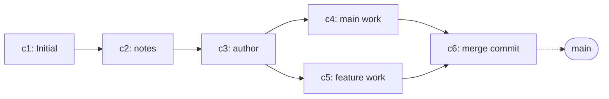

# Merge and Conflict Resolution - Bringing Two Lines Back Together

## What You'll Learn

- What `git merge` actually does, and how fast-forward differs from three-way merge
- Why a merge commit has two parents
- How to read and resolve conflict markers (`<<<<<<<`, `=======`, `>>>>>>>`)
- What `git status` tells you in the middle of a conflict
- How `git merge --abort` rolls back safely

## Why It Matters

In the previous chapters we created branches and moved between them to keep work separate. Eventually that work has to come back together. Merging happens when a PR lands, when you pull a teammate's changes into your branch, or when a long-running feature finally ships to `main`.

Without a clear model for merging, two failure modes show up early.

- First, "why did Git create yet another commit?" turns into a messy history that nobody can read.
- Second, when a conflict appears, panic sets in. People force-reset the branch, copy the folder somewhere safe, and start over.

The goal of this chapter is to remove both. By the end you should be able to picture which kind of merge will happen before you run the command, and resolve a conflict (or back out of one) without breaking a sweat.

## Mental Model

A merge produces "a new commit that combines two commits." When the two commits sit on the same line of history, Git skips the new commit and just slides a pointer forward (fast-forward). When the two commits sit on diverged lines, Git creates a new merge commit with two parents (three-way).



Three things to internalize:

- **Fast-forward**: if the target branch is a direct descendant of the current branch, Git creates no new commit and just moves the current branch pointer forward.
- **Three-way merge**: if the two branches diverged from a common ancestor and each has new commits, Git compares the common ancestor and the two tips, then creates a new merge commit. That commit has two parents.
- **Conflict**: if both sides changed the same lines of the same file in incompatible ways, Git cannot decide on its own. It pauses the merge and writes conflict markers into the file so you can pick.

## Core Concepts

- **`git merge <branch>`**: brings the changes from `<branch>` into the current branch. Uses fast-forward when possible; otherwise creates a three-way merge commit.
- **Fast-forward**: no new commit, just a pointer move. The history stays linear, but it does not record which commits belonged to which feature.
- **`--no-ff`**: forces a merge commit even when fast-forward would be possible. Common when teams want each PR to leave a visible "merge bubble" in history.
- **Three-way merge**: compares the merge base (common ancestor) with both tips. The default strategy on modern Git is `ort`.
- **Conflict**: the state where Git stops because changes overlap. The repo is mid-merge until you finish or abort.
- **Conflict marker**: the `<<<<<<< HEAD` ... `=======` ... `>>>>>>> <branch>` block. The `HEAD` half is the current branch; the `>>>>>>>` half is the branch being merged in.
- **`git merge --abort`**: cancels the in-progress merge and restores the working tree to the pre-merge state. When resolving feels too tangled, abort and try again.

## Before-After

Compare two ways of "bringing a feature branch into main."

**Before (manual copy)**

```text
$ cp feature/login.md main/login.md
$ # if both folders changed the same file, you have to remember which is right
```

- Nothing in history records what was combined.
- If both sides edited the same file, you have no signal that they did.
- There is no standard way to undo it.

**After (`git merge`)**

```text
$ git switch main
$ git merge feature/login
Updating e7d2c1a..a2b3c4d
Fast-forward
 login.md | 1 +
 1 file changed, 1 insertion(+)
 create mode 100644 login.md
```

- The result lives in history (pointer move for fast-forward, a merge commit for three-way).
- Conflicts stop the merge and Git writes markers to point you at the lines.
- `git merge --abort` cleanly restores the pre-merge state.

## Step-by-Step Walkthrough

We continue with `my-first-repo` from the previous chapter. The starting state is:

- `main` -> `e7d2c1a` (Add author line to README)
- `feature/login` -> `a2b3c4d` (Add login form draft)
- Files: `README.md`, `notes.md` on `main`; `README.md`, `notes.md`, `login.md` on `feature/login`

### 1. Confirm current state

```text
$ git switch main
Switched to branch 'main'
$ git log --oneline --graph --decorate --all
* a2b3c4d (feature/login) Add login form draft
* e7d2c1a (HEAD -> main) Add author line to README
* 9b8c3e2 Add intro paragraph to notes
* 4f1a2c0 Initial commit
```

`feature/login` is one commit ahead of `main`, on the same straight line. Merging it into `main` triggers a fast-forward.

### 2. Fast-forward merge

```text
$ git merge feature/login
Updating e7d2c1a..a2b3c4d
Fast-forward
 login.md | 1 +
 1 file changed, 1 insertion(+)
 create mode 100644 login.md
```

The clue is `Updating <old>..<new>` followed by `Fast-forward`. **No new merge commit is created**; the `main` pointer simply moves forward to `a2b3c4d`.

```text
$ git log --oneline --graph --decorate --all
* a2b3c4d (HEAD -> main, feature/login) Add login form draft
* e7d2c1a Add author line to README
* 9b8c3e2 Add intro paragraph to notes
* 4f1a2c0 Initial commit
```

Both branches now point at the same commit. Since `feature/login` is fully merged into `main`, deleting it is safe.

```text
$ git branch -d feature/login
Deleted branch feature/login (was a2b3c4d).
```

> If you want each PR-style merge to leave a visible commit in history, use `git merge --no-ff feature/login`. The next steps create a three-way merge commit naturally, so you'll see what one looks like.

### 3. Create divergence

Now we deliberately fork history: one commit on a new branch, one commit on `main`.

```text
$ git switch -c feature/header
Switched to a new branch 'feature/header'
$ echo "# My Project" > header.md
$ git add header.md
$ git commit -m "Add project header"
[feature/header d4e5f6a] Add project header
 1 file changed, 1 insertion(+)
 create mode 100644 header.md
```

Back on `main`, add an unrelated commit.

```text
$ git switch main
Switched to branch 'main'
$ echo "Released on 2026-05-04." >> notes.md
$ git add notes.md
$ git commit -m "Append release note"
[main c1a8e9f] Append release note
 1 file changed, 1 insertion(+)
```

The two branches now share `a2b3c4d` as their common ancestor and have one commit each on top.

```text
$ git log --oneline --graph --decorate --all
* c1a8e9f (HEAD -> main) Append release note
| * d4e5f6a (feature/header) Add project header
|/
* a2b3c4d Add login form draft
* e7d2c1a Add author line to README
* 9b8c3e2 Add intro paragraph to notes
* 4f1a2c0 Initial commit
```

The `|/` shape marks the point where the lines split and rejoin.

### 4. Three-way merge (no conflict)

Merge `feature/header` into `main`. The two branches touched different files, so there is no conflict, but they have diverged, so fast-forward is impossible.

```text
$ git merge feature/header
Merge made by the 'ort' strategy.
 header.md | 1 +
 1 file changed, 1 insertion(+)
 create mode 100644 header.md
```

`Merge made by the 'ort' strategy.` confirms a three-way merge. A new merge commit appears, and it has two parents.

```text
$ git log --oneline --graph --decorate --all
*   b5d4c6e (HEAD -> main) Merge branch 'feature/header'
|\
| * d4e5f6a (feature/header) Add project header
* | c1a8e9f Append release note
|/
* a2b3c4d Add login form draft
* e7d2c1a Add author line to README
* 9b8c3e2 Add intro paragraph to notes
* 4f1a2c0 Initial commit
```

Merge commit `b5d4c6e` has parents `c1a8e9f` (from `main`) and `d4e5f6a` (from `feature/header`). Run `git show b5d4c6e` and you'll see a `Merge: c1a8e9f d4e5f6a` line at the top.

```text
$ git branch -d feature/header
Deleted branch feature/header (was d4e5f6a).
```

### 5. Trigger a conflict

This time, change the same line in the same file from both sides.

```text
$ git switch -c feature/header-emoji
Switched to a new branch 'feature/header-emoji'
$ printf "## My Project\n" > header.md
$ git add header.md
$ git commit -m "Use h2 for project header"
[feature/header-emoji a7b8c9d] Use h2 for project header
 1 file changed, 1 insertion(+), 1 deletion(-)
```

Switch back to `main` and change the same line differently.

```text
$ git switch main
Switched to branch 'main'
$ printf "# Awesome Project\n" > header.md
$ git add header.md
$ git commit -m "Rename project header"
[main e2f3a4b] Rename project header
 1 file changed, 1 insertion(+), 1 deletion(-)
```

Now the merge fails with a conflict.

```text
$ git merge feature/header-emoji
Auto-merging header.md
CONFLICT (content): Merge conflict in header.md
Automatic merge failed; fix conflicts and then commit the result.
```

The keyword is `CONFLICT (content)`. Git pauses and waits for you.

### 6. Resolve the conflict

`git status` spells out exactly where you are.

```text
$ git status
On branch main
You have unmerged paths.
  (fix conflicts and run "git commit")
  (use "git merge --abort" to abort the merge)

Unmerged paths:
  (use "git add <file>..." to mark resolution)
	both modified:   header.md

no changes added to commit (use "git add" and/or "git commit -a")
```

`both modified` means both sides changed the same file. Open it and you'll find the markers:

```text
<<<<<<< HEAD
# Awesome Project
=======
## My Project
>>>>>>> feature/header-emoji
```

Reading them is straightforward:

- Everything between `<<<<<<< HEAD` and `=======` is the **current branch (`main`) version**.
- Everything between `=======` and `>>>>>>> feature/header-emoji` is the **incoming branch version**.

Edit the file into whatever shape you want and remove the three marker lines. Suppose you decide to keep the new name from `main` but use the h2 style from the feature branch. The resolved file becomes:

```text
## Awesome Project
```

Tell Git the conflict is settled, then commit.

```text
$ git add header.md
$ git status
On branch main
All conflicts fixed but you are still merging.
  (use "git commit" to conclude merge)

Changes to be committed:
	modified:   header.md

$ git commit
[main f3a4b5c] Merge branch 'feature/header-emoji'
```

`git commit` with no `-m` uses Git's default merge message (`Merge branch '<name>'`). View `git log --oneline --graph --decorate --all` and you will see the new merge commit reconnecting the two lines.

### 7. Back out with `--abort`

When resolving feels too tangled, or you'd rather take a different approach, you can cancel the entire merge. We deliberately set up another conflict to demonstrate.

```text
$ git switch -c feature/header-bold
Switched to a new branch 'feature/header-bold'
$ printf "**Awesome Project**\n" > header.md
$ git add header.md
$ git commit -m "Bold the header"
[feature/header-bold 9d8e7f6] Bold the header
 1 file changed, 1 insertion(+), 1 deletion(-)
$ git switch main
Switched to branch 'main'
$ printf "### Awesome Project\n" > header.md
$ git add header.md
$ git commit -m "Demote header to h3"
[main 1c2d3e4] Demote header to h3
 1 file changed, 1 insertion(+), 1 deletion(-)
$ git merge feature/header-bold
Auto-merging header.md
CONFLICT (content): Merge conflict in header.md
Automatic merge failed; fix conflicts and then commit the result.
```

Abort returns the working tree to its pre-merge state.

```text
$ git merge --abort
$ git status
On branch main
nothing to commit, working tree clean
```

`header.md` is restored to whatever it was before the merge started (`### Awesome Project`). `--abort` only works while a merge is in progress; once you've committed, you need other tools (`git reset`, `git revert`) to roll back. Those land in the workflow chapter near the end of this series.

## Common Mistakes

- **Treating fast-forward and three-way merge as the same** — fast-forward moves a pointer; three-way creates a new commit with two parents. The shape of `git log --graph` (straight line vs branching diamond) tells them apart.
- **Committing while a marker is still in the file** — leaving any of `<<<<<<<`, `=======`, or `>>>>>>>` behind will break the code. After resolving, double-check that the three marker lines are gone.
- **Skipping `git add` before `git commit`** — the resolution flow is "edit the file -> `git add` -> `git commit`". Without the `add`, Git still considers the path unmerged and refuses to commit.
- **Deleting the folder and re-cloning when confused** — one `git merge --abort` does the same thing without losing untracked files or stash entries.
- **Reaching for `--no-ff` reflexively (or refusing it reflexively)** — both can be reasonable depending on team conventions. Linear history loves fast-forward; PR-flavored history prefers `--no-ff`.
- **Switching branches mid-merge** — Git either refuses or creates a more confusing state. Finish or abort the merge first, then move.

## Production Notes

- **Pull `main` before you merge upward**: starting from the latest shared state cuts down on both conflicts and review noise. (Remote sync is the topic of the next chapter.)
- **Keep the conflict surface small**: avoid touching the same lines or functions that another branch is editing. Move formatter and linter sweeps into their own commits so they don't tangle with feature changes.
- **Run the build and tests after resolving**: removing the markers does not guarantee the result still compiles. A green build before committing the merge is the minimum bar.
- **Use `git mergetool` or your IDE**: VS Code, IntelliJ, and editors with `:diffsplit` show the three sides (base, ours, theirs) at once. The bigger the conflict, the more these tools help.
- **PRs typically use `--no-ff`**: GitHub's "Create a merge commit" option is exactly `--no-ff`. The history then shows when each PR landed.

## Checklist

- [ ] Explain when a fast-forward happens and what Git prints when it does.
- [ ] Say in one sentence why a three-way merge commit has two parents.
- [ ] Write the three marker lines (`<<<<<<<`, `=======`, `>>>>>>>`) on paper and label which side belongs to which branch.
- [ ] Recite the conflict resolution flow: edit file -> `git add` -> `git commit`.
- [ ] Tell when `git merge --abort` works (mid-merge) and when it does not (after the merge commit lands).
- [ ] Look at `git log --oneline --graph --decorate --all` output and identify fast-forward vs three-way merge.

## Exercises

1. Create a branch `feature/footer` with a single commit that adds `footer.md`. Switch back to `main` and run `git merge feature/footer`. Confirm that `Fast-forward` appears in the output, and capture the linear shape from `git log --oneline --graph --decorate --all`.
2. From `main` and a new branch, commit different files on each side, then merge. Look for `Merge made by the 'ort' strategy.` and confirm with `git show <merge-hash>` that the merge commit has two parents.
3. Edit the same line of the same file on both sides and merge to force a conflict. Capture the `both modified` line from `git status` and the marker block from the file, then resolve in one direction and finish the commit.
4. Reproduce the same conflict, but this time run `git merge --abort`. Verify that `git status` reports `nothing to commit, working tree clean` and that the file is restored to its pre-merge state.
5. Force a merge commit on a fast-forward situation with `git merge --no-ff feature/footer-2`. Compare the `--graph` output to the plain fast-forward case and describe what changed.

## Wrap-Up and What's Next

- Two kinds of merge: fast-forward (pointer move) when the branches share a straight line, three-way (a new commit with two parents) when they diverged.
- A conflict happens when both sides change the same lines. Git pauses, writes markers, and waits for you. After editing, finish with `git add` then `git commit`.
- If resolving looks unsafe, `git merge --abort` returns to the pre-merge state. It only applies while a merge is in progress.
- `git log --oneline --graph --decorate --all` is the everyday tool for telling fast-forward and three-way merges apart at a glance.

In the next chapter we'll connect the local repo to a GitHub remote and walk through `git remote`, `git push`, and `git pull` in order.

<!-- toc:begin -->
## Series TOC

- [What is Git? - The Basics of Distributed Version Control](./01-what-is-git.md)
- [Your First Commit - init, status, add, commit](./02-first-commit.md)
- [Tracking Changes - Reading status, diff, and log](./03-status-diff-log.md)
- [Branch Basics - Create, Switch, Compare](./04-branch-basics.md)
- **Merge and Conflict Resolution - Bringing Two Lines Back Together (current)**
- Connecting to GitHub Remotes (upcoming)
- Collaborating with Pull Requests (upcoming)
- Tracking Work with Issues and Projects (upcoming)
- Writing Good Commit Messages (upcoming)
- Real-World Workflow at a Glance (upcoming)
<!-- toc:end -->

## References

- Git Reference Manual: <https://git-scm.com/doc>
- Pro Git Book - "Basic Branching and Merging": <https://git-scm.com/book/en/v2/Git-Branching-Basic-Branching-and-Merging>
- `git help merge`, `git help mergetool`

Tags: git-merge, fast-forward, three-way-merge, merge-conflict, merge-abort, conflict-markers
