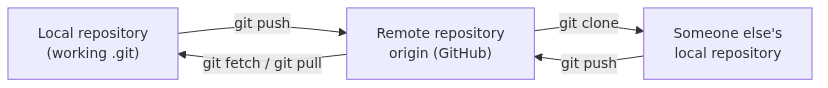

# Creating a GitHub repository - remote, push, and pull in one go

Up to this point, every command has stayed on one machine. The real collaboration shift begins when your local repository gains a remote home that other people and other devices can reach.

This is the sixth post in the Git & GitHub 101 series. Here, we connect a local repository to GitHub and walk through the first push, fetch, pull, and clone flow.

## What you'll learn

- What a `remote` is, and why the first one is conventionally called `origin`
- How to create an empty GitHub repository and wire it to your local one
- The two things `git push -u origin main` does in a single shot
- How `git fetch` and `git pull` differ from each other
- What `git clone` actually downloads
- When to choose HTTPS vs SSH

Up through Episode 5, each command ran inside one machine. Starting now, the local repository becomes something other people can see and other machines can keep working on.

## Questions this chapter answers

- What exactly is a `remote`, and why is the first one conventionally called `origin`?
- Which commands, in what order, connect an empty GitHub repository to your local one?
- What two things does `git push -u origin main` do in a single shot?
- How does `git fetch` differ from `git pull` in behavior?
- Beyond the working tree, what else does `git clone` actually download?
- Which signal should drive the choice between HTTPS and SSH for a remote?


## Why it matters

A repository that lives only on your laptop is, for collaboration purposes, not very different from a personal notebook. To share code with teammates, or to survive a stolen laptop without losing history, the repository has to exist somewhere else as well. GitHub is the most common "somewhere else."

A `remote` is an alias that points to a repository at another location. Once registered, you reference it by a short name instead of typing the URL each time. The first remote is conventionally named `origin` - the word means "where this project came from," and Git uses it as the automatic default.

`push`, `pull`, and `fetch` are the three verbs that move commits between a local repository and a remote.

- `push`: upload commits you've made locally to the remote.
- `fetch`: download commits the remote has but you don't, without merging them.
- `pull`: `fetch` followed automatically by `merge` (or `rebase`).

Keeping these three apart is what makes "how do I safely incorporate someone else's push?" stop feeling intimidating.

## Mental Model

> A GitHub repository is just "another Git repository that lives across the network", and a `remote` is the nickname you give to such a repository. `push` and `pull` are synchronization moves that exchange commits between the two.
A GitHub repository is just another Git repository. The only differences are that it lives on GitHub's servers and that anyone with access can reach it. Local and remote act as mirrors of each other, and push/fetch/pull are the commands that keep them aligned.



*Mental Model*
Three reminders make this picture solid. First, a GitHub repository is itself nothing more than a `.git` directory. Second, each collaborator owns a complete copy on their own machine. Third, synchronization is explicit - it happens when you run a command. Skip `push`, and GitHub doesn't know. Skip `pull`, and your laptop doesn't know.

## Core concepts

| Term | Meaning |
| --- | --- |
| remote | An alias pointing to a repository at another location (typically GitHub) |
| origin | The default name attached to the first remote |
| upstream | The remote branch a local branch is configured to track |
| `git remote add` | Register a new remote alias |
| `git push` | Upload local commits to a remote |
| `git fetch` | Download remote commits without merging them |
| `git pull` | `fetch` plus `merge` (or `rebase`) |
| `git clone` | Copy an entire remote repository into a new directory |
| HTTPS URL | `https://github.com/<user>/<repo>.git`, authenticated with a token |
| SSH URL | `git@github.com:<user>/<repo>.git`, authenticated with an SSH key |

`origin` is a convention, not a rule. You can run `git remote add backup ...` and use a different name. Tools and documentation, however, mostly assume `origin`, so leaving it alone tends to make collaboration smoother.

The word `upstream` shows up in two senses. The first is "the remote branch that a local branch defaults to for push and pull." That is what the `-u` in `git push -u origin main` configures. The second is the conventional name for "the original repository a fork came from," which Episode 7 returns to.

## Before-After

Comparing the local-only flow to the remote-connected flow makes the difference concrete.

**Before - a repository that lives only locally**

```text
$ git log --oneline
1c2d3e4 Demote header to h3
b5d4c6e Merge branch 'feature/header'
...
$ git push
fatal: No configured push destination.
Either specify the URL from the command-line or configure a remote repository using
    git remote add <name> <url>
and then push using the remote name
    git push <name>
```

With no remote, there is nowhere to push. The history exists only on your laptop.

**After - a repository wired to origin**

```text
$ git remote -v
origin  https://github.com/<your-id>/vacation-notes.git (fetch)
origin  https://github.com/<your-id>/vacation-notes.git (push)
$ git push -u origin main
Enumerating objects: 12, done.
...
To https://github.com/<your-id>/vacation-notes.git
 * [new branch]      main -> main
```

Once the remote is registered and upstream is set, a single `git push` mirrors the same commits onto GitHub, and any other machine that runs `git clone` receives the same copy. The role of `-u origin main` is covered in detail in Step 3 of the walkthrough.

## Step-by-step walkthrough

Reuse the `vacation-notes` repository from Episode 5. The ending state was `main` pointing at `1c2d3e4 Demote header to h3` with a clean working tree.

### 1. Create an empty GitHub repository

In a browser, open `https://github.com/new`. Fill in the following fields and leave the rest at their defaults.

- Repository name: `vacation-notes`
- Description: optional
- Public / Private: Public is fine for learning
- Leave each of "Add a README file," "Add .gitignore," and "Choose a license" **unchecked**

Those three checkboxes are unchecked deliberately. If GitHub creates an initial commit on its side, the local history and the GitHub history diverge from the very beginning, and the first push gets awkward. An empty repository accepts your local history exactly as it is.

After clicking `Create repository`, GitHub displays a "set up an existing repository" panel with the exact commands you're about to run.

### 2. Register the remote

Back in the local repository, register the remote. Replace `<your-id>` with your own GitHub handle.

```text
$ git remote add origin https://github.com/<your-id>/vacation-notes.git
$ git remote -v
origin  https://github.com/<your-id>/vacation-notes.git (fetch)
origin  https://github.com/<your-id>/vacation-notes.git (push)
```

`git remote add` produces no output. Use `git remote -v` to confirm both the fetch URL and the push URL point to the right place. Two lines means registration succeeded.

If you typed the URL wrong, `git remote set-url origin <correct-URL>` fixes it, or `git remote remove origin` lets you start over.

### 3. First push and upstream setup

Now publish the `main` branch to GitHub.

```text
$ git push -u origin main
Enumerating objects: 24, done.
Counting objects: 100% (24/24), done.
Delta compression using up to 8 threads
Compressing objects: 100% (16/16), done.
Writing objects: 100% (24/24), 2.31 KiB | 1.16 MiB/s, done.
Total 24 (delta 5), reused 0 (delta 0)
remote: Resolving deltas: 100% (5/5), completed with 0 local objects.
To https://github.com/<your-id>/vacation-notes.git
 * [new branch]      main -> main
Branch 'main' set up to track remote branch 'main' from 'origin'.
```

`-u` (or its long form `--set-upstream`) does two things at once.

1. It configures the local `main` to track `origin/main`.
2. From this push onward, plain `git push` knows where to send commits.

The closing line `Branch 'main' set up to track remote branch 'main' from 'origin'.` confirms the tracking setup. After this, `git push` by itself is enough.

### 4. A second commit and a shorter push

Make a small additional commit to see how the flow shortens after upstream is set.

```text
$ printf "## Quickstart\n\n1. Clone the repo.\n2. Open notes.md.\n" > quickstart.md
$ git add quickstart.md
$ git commit -m "Add quickstart section"
[main 2b3c4d5] Add quickstart section
 1 file changed, 4 insertions(+)
$ git push
Enumerating objects: 4, done.
Counting objects: 100% (4/4), done.
Delta compression using up to 8 threads
Compressing objects: 100% (2/2), done.
Writing objects: 100% (3/3), 351 bytes | 351.00 KiB/s, done.
Total 3 (delta 0), reused 0 (delta 0)
To https://github.com/<your-id>/vacation-notes.git
   1c2d3e4..2b3c4d5  main -> main
```

With upstream configured, you no longer need `-u origin main`. The closing line `1c2d3e4..2b3c4d5 main -> main` reports the hash range that `origin/main` just received.

Refresh the browser tab on GitHub: the `Add quickstart section` commit is at the top. The same history now lives in two places.

### 5. Clone into a different location

Pretend you've moved to another machine (or simply another directory) and clone the repository.

```text
$ cd /tmp
$ git clone https://github.com/<your-id>/vacation-notes.git
Cloning into 'vacation-notes'...
remote: Enumerating objects: 27, done.
remote: Counting objects: 100% (27/27), done.
remote: Compressing objects: 100% (18/18), done.
remote: Total 27 (delta 5), reused 27 (delta 5), pack-reused 0
Receiving objects: 100% (27/27), 2.66 KiB | 2.66 MiB/s, done.
Resolving deltas: 100% (5/5), done.
$ cd vacation-notes
$ git log --oneline -3
2b3c4d5 Add quickstart section
1c2d3e4 Demote header to h3
b5d4c6e Merge branch 'feature/header'
$ git remote -v
origin  https://github.com/<your-id>/vacation-notes.git (fetch)
origin  https://github.com/<your-id>/vacation-notes.git (push)
```

`git clone` did three things. First, it created a `vacation-notes` directory and populated `.git` inside it. Second, it registered an `origin` remote automatically (which is why `git remote -v` shows two lines even though we did not run `git remote add` here). Third, it checked out the default branch (`main`).

A cloned repository is a complete copy. Disconnect the network and `git log`, `git diff`, and `git checkout` keep working.

### 6. Push from one side, then fetch and pull on the other

In the cloned directory (`/tmp/vacation-notes`), make one more commit and push it.

```text
$ printf "## Deployment\n\nDeploy by pushing to main.\n" > deployment.md
$ git add deployment.md
$ git commit -m "Add deployment notes"
[main 7e8f9a0] Add deployment notes
 1 file changed, 3 insertions(+)
$ git push
...
To https://github.com/<your-id>/vacation-notes.git
   2b3c4d5..7e8f9a0  main -> main
```

Switch back to the original working directory. GitHub's `main` is now at `7e8f9a0`, but your local `main` is still at `2b3c4d5`. Start by running `git fetch` to download the new commit without merging it.

```text
$ git fetch
remote: Enumerating objects: 4, done.
remote: Counting objects: 100% (4/4), done.
remote: Compressing objects: 100% (2/2), done.
remote: Total 3 (delta 0), reused 3 (delta 0), pack-reused 0
Unpacking objects: 100% (3/3), 358 bytes | 358.00 KiB/s, done.
From https://github.com/<your-id>/vacation-notes
   2b3c4d5..7e8f9a0  main       -> origin/main
$ git status
On branch main
Your branch is behind 'origin/main' by 1 commit, and can be fast-forwarded.
  (use "git pull" to update your local branch)

nothing to commit, working tree clean
```

`fetch` updates only the remote-tracking branch `origin/main`. The local `main` stays where it was, which is why `git status` reports being one commit behind and the working tree is unchanged. `git log --oneline --decorate --all` would show `origin/main` one step ahead of `main`.

Catch up with `git pull`.

```text
$ git pull
Updating 2b3c4d5..7e8f9a0
Fast-forward
 deployment.md | 3 +++
 1 file changed, 3 insertions(+)
$ git log --oneline -2
7e8f9a0 Add deployment notes
2b3c4d5 Add quickstart section
```

`pull` is, internally, `fetch` then `merge`. Because the local side had no new commits, this resolves as a fast-forward. With commits on both sides, the three-way merge from Episode 5 would have run instead.

## Common mistakes

- **Creating the GitHub repo with README/.gitignore/license checked, then watching the first push fail** - GitHub's auto-commit and your local commits diverge, producing `! [rejected] main -> main (fetch first)`. The fixes are `git pull --rebase origin main` followed by another push, or starting over with an empty repository.
- **Trying to authenticate an HTTPS push with a password** - GitHub stopped accepting passwords for HTTPS pushes in August 2021. Use a Personal Access Token (PAT) or switch to SSH.
- **Reaching for `git pull` as the first command of the day** - if local changes are uncommitted, a pull can drop conflicts into your working tree. Confirming a clean tree with `git status` first is the safer habit.
- **Treating `git fetch` as the whole job** - fetch only updates information. To move the local branch forward, `merge` or `pull` has to follow.
- **Changing a remote URL and pushing somewhere unintended** - run `git remote -v` after any URL edit so you know exactly where the next push lands.
- **Pushing without realizing more than one remote is registered** - in repositories with both `origin` and `upstream` (the fork-original convention), an unqualified `git push` can land in a place you didn't mean.

## In real-world use

Three early choices shape day-to-day collaboration.

**HTTPS vs SSH** - HTTPS is convenient on networks that block SSH ports. Otherwise, registering an SSH key once spares you from typing credentials each time. Add the public key under `SSH and GPG keys` in your GitHub account settings, then clone with `git@github.com:<user>/<repo>.git`.

**Default branch name** - GitHub has used `main` as the default branch for new repositories since 2020. Older repositories and a handful of tools still assume `master`, so checking which convention your team uses up front avoids confusion later.

**Branch protection rules** - production repositories usually disable direct pushes to `main`. That is exactly the gap Pull Requests fill, which Episode 7 covers. The push and pull commands from this episode shift roles - they become the way you sync your own working branch with its counterpart on GitHub.

GitHub Desktop and IDE Git panels collapse these commands behind buttons. Knowing what each button bundles makes the difference when something goes wrong; running them on the command line a few times is worth the small effort.

## Checklist

If you can tick each of these, this episode has done its job.

- [ ] You can explain a `remote` in one sentence
- [ ] You know where the name `origin` comes from
- [ ] You can create an empty GitHub repository and connect it to a local one
- [ ] You know the two things `git push -u origin main` configures simultaneously
- [ ] You can state the difference between `git fetch` and `git pull` in one sentence
- [ ] You know what `git clone` registers automatically
- [ ] You can list registered remotes with `git remote -v`
- [ ] You can recognize HTTPS and SSH URL formats at a glance

## Exercises

1. Create another empty GitHub repository (`practice-remote`), then in an empty local directory run the full sequence: `git init` -> commit one file -> `git remote add origin ...` -> `git push -u origin main`.
2. Clone the repository from exercise 1 into a different directory (e.g., `/tmp/practice-clone`) and alternate commits and push/pull between the two working copies. Try pulling while you have uncommitted local changes and read the message Git prints.
3. Run `git fetch` and observe how `git status` changes. Then look at `git log --oneline --decorate --all` and locate `origin/main` relative to your local `main`.

## Summary, and what's next

This episode walked through the lifecycle of connecting a local repository to GitHub. The takeaways are short.

- A `remote` is an alias for a repository elsewhere, and the first one is usually `origin`
- `git push` uploads local commits, `git fetch` only downloads them, and `git pull` does both download and merge
- The `-u` flag in `git push -u origin main` sets up an upstream so future pushes and pulls can omit arguments
- `git clone` creates a fresh local copy and registers `origin` for you

Episode 7 picks up where this one leaves off: the most common collaboration unit on GitHub, the Pull Request. We'll commit and push on a branch, request review, and follow the change back to `main`.

<!-- toc:begin -->
## Series Table of Contents

- [What is Git? Version Control Fundamentals](./01-what-is-git.md)
- [Your First Commit: init, add, commit](./02-first-commit.md)
- [Inspecting Changes: status, diff, log](./03-status-diff-log.md)
- [Understanding Branches: Diverging and Switching](./04-branch-basics.md)
- [Merging Branches and Resolving Conflicts](./05-merge-and-conflict.md)
- **Creating a GitHub Repository: remote, push, pull (current)**
- [Collaborating with Pull Requests](./07-pull-request.md)
- Tracking Work with Issues and Projects (upcoming)
- Writing Good Commit Messages (upcoming)
- Real-World Workflow at a Glance (upcoming)
<!-- toc:end -->

## References

- Git docs, `git remote`: <https://git-scm.com/docs/git-remote>
- Git docs, `git push`: <https://git-scm.com/docs/git-push>
- Git docs, `git fetch`: <https://git-scm.com/docs/git-fetch>
- Git docs, `git pull`: <https://git-scm.com/docs/git-pull>
- Git docs, `git clone`: <https://git-scm.com/docs/git-clone>
- GitHub Docs, "About remote repositories": <https://docs.github.com/en/get-started/getting-started-with-git/about-remote-repositories>
- GitHub Docs, "Connecting to GitHub with SSH": <https://docs.github.com/en/authentication/connecting-to-github-with-ssh>

Tags: github-remote, git-push, git-pull, git-clone, git-fetch, origin
