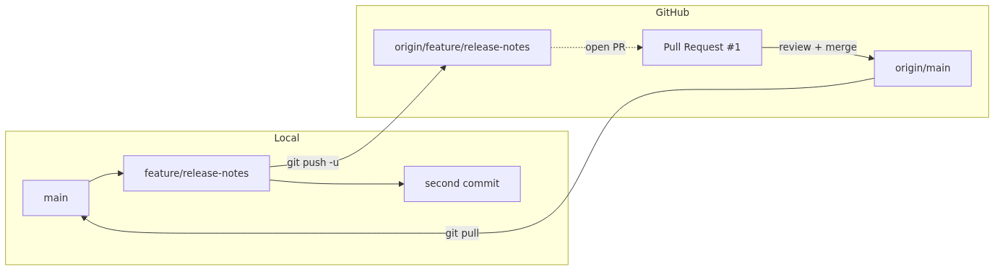

# Collaborating with Pull Requests - From Branch to Review to Main

## What you will learn

- What a Pull Request (PR) really is, and how it differs from a plain `git merge`
- The order of operations: feature branch, commit, push, open PR
- How to respond to review comments by adding more commits to the same branch
- How to merge the PR and update your local `main` afterward
- How to keep PRs small enough that reviewers actually look at them

By the end you will be able to take a feature branch like `feature/release-notes`, open a PR, get it reviewed, merge it, and clean up locally - end to end, by yourself.

## Why this matters

When you work alone, `git merge feature/x` ends the story. The moment a second person joins, that command becomes painful. There is no place to record what changed, why it was needed, or who agreed it was a good idea.

Pull Requests are GitHub's answer to that gap. A PR is not just a merge tool. It is a screen that says, "Let us talk about this change first, agree, then merge."

Once PRs become routine, three habits follow naturally:

1. Each change ends up with at least one human pair of eyes on it (even if that pair is yours, a day later).
2. When a bad commit slips in, the PR number and description give you a starting point for the search.
3. You start slicing big changes into small PRs, because each PR has to fit one reviewer's attention span.

## Mental model

> A Pull Request is not a plain merge; it is a place to "propose merging your branch into main and host the review and discussion that surrounds that proposal".
A PR is a request: "Please accept my branch as a proposal against `main`." The request has a title, a description, a list of changed files, and a comment thread.


The diagram reads like this:

1. Locally you create `feature/release-notes` on top of `main` and stack commits on it.
2. Pushing the branch to GitHub creates `origin/feature/release-notes`.
3. The PR screen is the request to merge that branch into the base, `main`.
4. Reviews and follow-up commits live inside the PR. Pressing the merge button updates GitHub's `main`.
5. Finally, `git pull` brings the result back to your local `main`.

The key idea: a PR is a conversation about merging a branch, not the merge command itself.

## Core concepts

| Term | Meaning |
| --- | --- |
| base branch | The branch the PR will be merged into. Usually `main`. |
| compare branch | The branch that contains the changes. Usually a `feature/...` branch. |
| draft PR | A PR marked "not ready for review yet, but I want to share progress." |
| review | Another person's verdict on the change. Three outcomes: Approve, Request changes, or Comment. |
| merge commit | A commit GitHub creates when merging a PR. It has two parents and a message like `Merge pull request #1 ...`. |
| squash merge | Compresses each commit on the PR into a single new commit on the base branch. Useful when the branch has noisy WIP commits. |
| rebase merge | Replays the PR's commits on top of the base. No merge commit is created. |

Which of the three merge styles you use is a team decision. This article uses the default - a regular merge commit.

## Before-After

**Before - branch made, not shared**

```text
$ git switch -c feature/release-notes
$ git commit -am "Draft release notes"
$ # a few days pass
$ git log --oneline main..feature/release-notes
3c4d5e6 Draft release notes
$ # nobody else has seen the change yet
```

If you now run `git merge feature/release-notes` directly, your teammates only learn about the change after it has already landed. There is no place to ask, "Why did this line appear?"

**After - same branch, opened as a PR**

```text
$ git push -u origin feature/release-notes
$ # open a PR on GitHub, a teammate leaves a one-line review
$ git commit -am "Tweak release checklist heading"
$ git push
$ # click "Merge pull request" on GitHub
$ git switch main
$ git pull
```

It is the same branch, but now the intent (PR description), the feedback (review comments), and the consensus (merge commit) live on GitHub. A month from now, anyone who finds that commit in `git log` can click through to the PR number and rebuild the context.

## Step-by-step walkthrough

Reuse the `vacation-notes` repository from Episode 6. `main` points at `7e8f9a0 Add deployment notes`, and `origin` is wired up to GitHub.

### 1. Sync main first

```text
$ git switch main
Already on 'main'
Your branch is up to date with 'origin/main'.
$ git pull
Already up to date.
```

Before starting any new work, confirm your local `main` is in the same place as `origin/main`.

### 2. Create the feature branch

```text
$ git switch -c feature/release-notes
Switched to a new branch 'feature/release-notes'
$ git status
On branch feature/release-notes
nothing to commit, working tree clean
```

`-c` creates a new branch and switches to it in one step. Branch names typically use prefixes like `feature/`, `fix/`, or `chore/` to signal intent.

### 3. Make your first commit

```text
$ printf '\n## Release checklist\n\n- [ ] Tag version\n- [ ] Update CHANGELOG\n' >> notes.md
$ git add notes.md
$ git commit -m "Add release checklist"
[feature/release-notes 3c4d5e6] Add release checklist
 1 file changed, 5 insertions(+)
```

This is the first commit that will appear on the PR. Try not to mix unrelated changes in one commit - smaller commits are easier to review.

### 4. Push the branch to GitHub

```text
$ git push -u origin feature/release-notes
Enumerating objects: 5, done.
...
remote: Create a pull request for 'feature/release-notes' on GitHub by visiting:
remote:      https://github.com/<your-id>/vacation-notes/pull/new/feature/release-notes
To https://github.com/<your-id>/vacation-notes.git
 * [new branch]      feature/release-notes -> feature/release-notes
Branch 'feature/release-notes' set up to track remote branch 'feature/release-notes' from 'origin'.
```

You only need `-u origin feature/release-notes` on the first push to set the upstream. After that, plain `git push` works. Notice the `remote:` line: GitHub gives you a direct link to open a PR.

### 5. Open the PR on GitHub

Open the link printed above, or hit "Compare & pull request" on the repository's main page. Fill in:

- Title: `Add release checklist to notes`
- Description: a short note on the motivation, how you verified it, and the scope of impact.
- Reviewers: pick a teammate (leave it blank if you are practicing alone).

Press "Create pull request" and you get a PR number. This article calls it `#1`.

### 6. Address review comments with another commit

Suppose a reviewer leaves a comment: "Please make the checklist heading clearer."

```text
$ git switch feature/release-notes
$ sed -i 's/## Release checklist/## Release checklist (per version)/' notes.md
$ git add notes.md
$ git commit -m "Tweak release checklist heading"
[feature/release-notes 4d5e6f7] Tweak release checklist heading
 1 file changed, 1 insertion(+), 1 deletion(-)
$ git push
Enumerating objects: 5, done.
...
To https://github.com/<your-id>/vacation-notes.git
   3c4d5e6..4d5e6f7  feature/release-notes -> feature/release-notes
```

The new commit shows up on the PR automatically. No extra command is needed - one push refreshes the PR view.

### 7. Merge the PR

Once the review is approved, click "Merge pull request" at the bottom of the PR page. The default is a regular merge commit, which adds something like this to `main`:

```text
Merge pull request #1 from <your-id>/feature/release-notes

Add release checklist to notes
```

After the merge, GitHub offers a "Delete branch" button. If you have nothing more to add, delete the remote branch right there.

### 8. Clean up locally

```text
$ git switch main
Switched to branch 'main'
Your branch is up to date with 'origin/main'.
$ git pull
remote: Enumerating objects: 1, done.
...
Updating 7e8f9a0..5e6f7a8
Fast-forward
 notes.md | 5 +++++
 1 file changed, 5 insertions(+)
$ git branch -d feature/release-notes
Deleted branch feature/release-notes (was 4d5e6f7).
```

`git pull` brings the merge into your local `main`. Only after that should you delete the local feature branch. Branches are temporary workspaces - once the work is done, clear them out so they do not pile up.

## Common mistakes

- Committing directly to `main` and getting rejected by branch protection. Make a habit of starting each change on a new branch.
- Opening a PR that is too large for anyone to review. PRs over 200-400 changed lines tend to stall; split them.
- Creating a brand-new branch in response to review comments. Push another commit to the same branch instead - the PR updates itself.
- Skipping `git pull` on `main` after a merge and starting the next change on stale code. That is the fastest path to a conflict.
- Editing the auto-generated merge commit message by hand. The default format is searchable and consistent; leave it alone.

## In real-world projects

A PR is less of a merge tool and more of a decision log. Teams use it like this:

- **Explain the why in the PR body.** If commit messages are short, the PR body becomes the long version.
- **Read CI results on the PR.** Wire GitHub Actions to your repo so each PR shows test status. If it is red, do not press merge.
- **Use draft PRs to share progress early.** A reviewer can spot the wrong direction before you have invested another day in it.
- **Link related issues.** Writing `Closes #42` in the body auto-closes the issue when the PR merges (the topic of the next article).
- **Revert at the PR level.** GitHub's PR page has a "Revert" button that creates a new PR undoing the merge. That is safer than picking commits one by one.

## Checklist

- [ ] Pulled `main` to the latest commit before branching
- [ ] Used a prefixed branch name like `feature/`, `fix/`, or `chore/`
- [ ] First push used `-u origin <branch>` to set upstream
- [ ] PR body explains motivation and how you verified the change
- [ ] Responded to review comments by pushing more commits to the same branch
- [ ] Pulled `main` and deleted the merged branch after merging

## Exercises

1. In the same `vacation-notes` repo, create a branch named `feature/contact-section`, append a contact line to `notes.md`, and open a PR. Pretend you are reviewing your own PR: read it once, then merge it.
2. Open a PR with an empty description on purpose. See what GitHub prompts you with, then try a PR with a real description. Imagine yourself six months later and pick the one you would rather receive - that is the value of writing a real PR body.

## Wrap-up and what's next

This article ran through one full PR cycle. The recap:

- A PR is a request to merge a branch. The merge itself is one click at the end
- First push uses `git push -u origin <branch>`; later pushes are plain `git push`
- Reply to review comments by adding commits to the same branch
- After merging, sync `main` with `git pull` and delete the branch you used

The next article zooms in on something you saw in the PR body: `Closes #42`. That is GitHub Issues, and along with Projects, it is how teams keep a record of what to do, not just what was done.

<!-- toc:begin -->
## Series Table of Contents

- [What is Git? Version Control Fundamentals](./01-what-is-git.md)
- [Your First Commit: init, add, commit](./02-first-commit.md)
- [Inspecting Changes: status, diff, log](./03-status-diff-log.md)
- [Understanding Branches: Diverging and Switching](./04-branch-basics.md)
- [Merging Branches and Resolving Conflicts](./05-merge-and-conflict.md)
- [Creating a GitHub Repository: remote, push, pull](./06-github-repository.md)
- **Collaborating with Pull Requests (current)**
- [Tracking Work with Issues and Projects](./08-issue-and-project.md)
- Writing Good Commit Messages (upcoming)
- Real-World Workflow at a Glance (upcoming)
<!-- toc:end -->

## References

- GitHub Docs, "About pull requests": <https://docs.github.com/en/pull-requests/collaborating-with-pull-requests/proposing-changes-to-your-work-with-pull-requests/about-pull-requests>
- GitHub Docs, "Creating a pull request": <https://docs.github.com/en/pull-requests/collaborating-with-pull-requests/proposing-changes-to-your-work-with-pull-requests/creating-a-pull-request>
- GitHub Docs, "Reviewing changes in pull requests": <https://docs.github.com/en/pull-requests/collaborating-with-pull-requests/reviewing-changes-in-pull-requests>
- GitHub Docs, "About protected branches": <https://docs.github.com/en/repositories/configuring-branches-and-merges-in-your-repository/managing-protected-branches/about-protected-branches>
- Git docs, `git switch`: <https://git-scm.com/docs/git-switch>

Tags: github-pull-request, code-review, feature-branch, merge-commit, github-collaboration, pr-workflow
