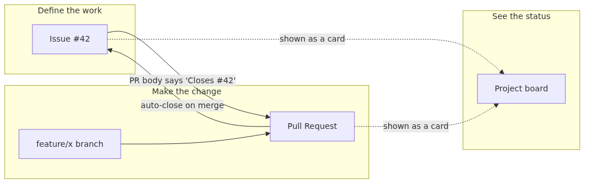

# Tracking Work with Issues and Projects - How GitHub Records What's Next

Code history tells you what changed, but teams also need a place to record what should happen next. Issues and Projects give GitHub a planning layer, so decisions, ownership, and progress do not live only in someone's memory.

This is the eighth post in the Git & GitHub 101 series. Here, we connect issues, pull requests, and project boards into one visible work-tracking flow.

## What you will learn

- What a GitHub Issue is, and how it differs from a commit or a Pull Request
- How to open an issue and attach labels, an assignee, and a milestone
- How a single line like `Closes #42` in a PR body auto-closes an issue on merge
- How to set up a Project board and track issues on a Kanban-style flow
- Why issues are useful even on a solo repository

By the end you can run a full cycle: define work as an issue, finish it through a PR, and watch the Project board reflect status as you go.

## Why this matters

So far, this series has focused on what changed in the code. Commits recorded the change, and PRs created agreement around it. In real teams, the more frequent question is what comes before the code: "What should I work on now? Who owns this? How much is left this month?"

GitHub Issues and Projects are how teams answer those questions inside the same repository as the code. Putting the to-do list and the progress board next to the source has three effects:

1. Work has a defined start and end. You open an issue, you finish it through a PR, and the merge auto-closes the issue.
2. A month later, when someone asks "Why did this change land?", you can trace commit → PR → issue and reach the original intent.
3. The same screens scale from one person to a small team. There is no need to spin up a separate tool like Jira on day one.

Even on a solo repository, issues earn their keep. Writing down the next thing to do gives you somewhere to look when you reopen the project after a week away.

## Mental model

> Issues record "what is to be done", Pull Requests record "how it was actually done", and Projects record "where the work currently sits" — three complementary views of the same work.
Here is how issues, PRs, and projects interlock.



*Mental model*
Read it as a flow:

1. The issue is the starting point. It explains what to do and why.
2. A branch and a PR are created to handle that issue.
3. Writing `Closes #42` in the PR body tells GitHub to close the issue when the PR merges.
4. The Project board surfaces issues and PRs as cards so you can see how far along the work is.

The key idea: issues are the work, PRs are the change that finishes the work.

## Core concepts

| Term | Meaning |
| --- | --- |
| Issue | A repository-scoped to-do card with a title, body, comment thread, labels, assignees, and a milestone. |
| Label | A colored tag for sorting issues and PRs - examples include `bug`, `enhancement`, `good first issue`. |
| Milestone | A group of issues and PRs sharing a deadline and a percent-complete bar. Often used like "v1.2 release". |
| Assignee | The person responsible for an issue or PR. One or several people can be assigned. |
| Project (Projects v2) | A board view that pulls issues and PRs into columns by status, priority, or any custom field. |
| Closing keywords | Words like `Closes`, `Fixes`, `Resolves`. Writing `Closes #42` in a PR body closes that issue when the PR merges into the repository's default branch. |
| Reference | Notation like `#42` or `org/repo#42` that links to an issue or PR. GitHub auto-renders it as a link. |

`Closes`, `Fixes`, and `Resolves` mean the same thing here. GitHub also accepts singular and plural forms (`Close`, `Fix`).

## Before-After

**Before - PR with no linked issue**

```text
PR #5: Fix sidebar overflow
- (empty body)
- merged

# 3 months later
$ git log --oneline | grep sidebar
9d8e7f6 Fix sidebar overflow
$ # nobody remembers why this needed fixing
```

The change is recorded, but the intent is gone. To recover the why, someone has to dig into the design from scratch.

**After - issue plus linked PR**

```text
Issue #42: Sidebar text overflows on narrow screens
- Text is cut off below 1024px
- Reports note that mouse interactions are blocked

PR #5: Fix sidebar overflow on narrow screens
Body: Closes #42
- Add 16px left padding, set max-width to 240px
- Verified scroll behavior between 320px and 1280px
```

The moment the PR merges, issue #42 closes itself. Six months later, anyone who finds commit `9d8e7f6` can click through the PR to the issue and rebuild the full context.

## Step-by-step walkthrough

Reuse the `vacation-notes` repository from Episode 7. `main` is at `5e6f7a8 Merge pull request #1 from feature/release-notes` and the working tree is clean.

### 1. Open the first issue

In the browser, go to the repository's `Issues` tab and click `New issue`.

- Title: `Add a packing list section to notes`
- Description (example body):
  ```text
  ## Background
  notes.md has nowhere to keep packing items for a trip.

  ## Goal
  Add a `## Packing list` section with three default items.
  Detailed structure can be handled in follow-up PRs.

  ## Out of scope
  - Inline images
  - i18n
  ```
- Click `Submit new issue`. The new issue gets number `#2` (PR #1 came from Episode 7).

### 2. Attach a label and an assignee

On the right sidebar of the issue:

- Labels: pick `enhancement`. If you have not made custom labels yet, the GitHub defaults are fine.
- Assignees: assign yourself. That is the signal that this issue has an owner.
- Milestone: leave it empty for now. Attach one later when a release date appears.

Multiple labels can be applied to one issue. Short, distinct names with clear colors work best.

### 3. Create a branch for the issue

Switch back to your local terminal. Including the issue number in the branch name makes later tracking easier.

```text
$ git switch main
Already on 'main'
Your branch is up to date with 'origin/main'.
$ git pull
Already up to date.
$ git switch -c feature/packing-list-2
Switched to a new branch 'feature/packing-list-2'
```

The trailing `2` in `feature/packing-list-2` matches the issue number. This is a common convention rather than a Git rule.

### 4. Commit the change and push the branch

```text
$ printf '\n## Packing list\n\n- Passport\n- Phone charger\n- Travel adapter\n' >> notes.md
$ git add notes.md
$ git commit -m "Add packing list section"
[feature/packing-list-2 a1b2c3d] Add packing list section
 1 file changed, 5 insertions(+)
$ git push -u origin feature/packing-list-2
Enumerating objects: 5, done.
...
remote: Create a pull request for 'feature/packing-list-2' on GitHub by visiting:
remote:      https://github.com/<your-id>/vacation-notes/pull/new/feature/packing-list-2
To https://github.com/<your-id>/vacation-notes.git
 * [new branch]      feature/packing-list-2 -> feature/packing-list-2
Branch 'feature/packing-list-2' set up to track remote branch 'feature/packing-list-2' from 'origin'.
```

This part follows the Episode 7 flow.

### 5. Open the PR linked to the issue

Open a new PR on GitHub. This time, include one specific line in the body:

```text
Title: Add packing list section to notes
Body:
Closes #2

Adds a place to write packing items before a trip.
Only the default items are included so follow-up PRs can refine the structure.
```

Writing `Closes #2` immediately links the issue under the PR's right-side `Development` section. To close multiple issues from one PR, repeat the keyword for each number, for example `Closes #2, closes #3`. The shorter `Closes #2, #3` form does not close the second issue.

### 6. Merging the PR auto-closes the issue

Review the PR, then click `Merge pull request`. The merge does three things at the same instant:

1. The PR's commits land on the base branch (`main`).
2. Issue `#2` flips from `Open` to `Closed`.
3. A line like "Closed via PR #N" appears under the issue body.

`Closes`, `Fixes`, and `Resolves` produce identical behavior. An already-closed issue is not closed twice.

### 7. See the flow on a Project board

Open the repository's `Projects` tab and click `New project`. Pick the `Board` template - the default columns are `Todo`, `In Progress`, and `Done`.

- Add issue `#2` to the board with `Add item`. It appears as a card in `Todo`.
- When you start the branch, drag the card to `In Progress`.
- Add the PR to the board too - it shares the same flow.
- Turn on the built-in `Workflows` automations so a card moves to `Done` as soon as the linked issue closes.

Start with manual moves first. Even hand-dragging cards is a clear improvement over having no board.

## Common mistakes

- Forgetting to close the issue when the work is done. Train the habit of writing `Closes #N` in the PR body so closing happens for you.
- Issue bodies that say only the title in long form. The reader six months later has to know what it meant. A few lines of background and goal are enough.
- Inventing too many labels too early. Start with `bug`, `enhancement`, and `chore`, then add more when you actually want to filter by them.
- Putting `Closes #N` only in a commit message rather than the PR body. Keywords inside commit messages do close issues, but only when those exact messages reach the default branch — and squash or rebase can rewrite them. The PR body is the safe place.
- Skipping issues on a solo repository because "I will just remember." Issues turn that mental note into something searchable that links to commits.

## In real-world projects

Teams use issues and projects in patterns like these:

- **Issue templates.** A file at `.github/ISSUE_TEMPLATE/bug.yml` pre-fills new issues with sections like reproduction steps, expected behavior, and actual behavior.
- **Milestones for release scope.** Create `v1.2` as a milestone and attach issues to it. The milestone page shows percent complete at a glance.
- **`good first issue` for new contributors.** Open source projects label easy starter issues so newcomers can find a safe place to start.
- **Project automations.** Configure rules so a card moves to `In Progress` when its PR opens and to `Done` when the issue closes.
- **Decision records as issues.** Even when no code changes, an issue like "We will use library X" gives the team a single place to revisit the discussion later.

## Checklist

- [ ] Issue body includes a short background and goal
- [ ] Issue has at least one label and an assignee
- [ ] Branch name includes the issue number
- [ ] PR body has at least one `Closes #N` line
- [ ] Verified the issue closed automatically after the PR merged
- [ ] Issue and PR are visible as cards on a Project board

## Exercises

1. In `vacation-notes`, open two new issues. Make a PR for each: include `Closes #N` in one PR body and leave it out of the other. After merging both, compare the two issues' status to see the difference.
2. Make a Project board and replace the default columns with `Triage`, `This week`, and `Done`. Choosing column names that match your own workflow is half the value of a board.

## Wrap-up and what's next

This article walked through one full issue-to-PR-to-board cycle. Recap:

- Issues are the work; PRs are the change that finishes the work
- Writing `Closes #N` in the PR body lets the merge close the issue
- Labels, milestones, and assignees sort, group, and assign issues
- Project boards collect issues and PRs into one shared view

The next article looks at something even shorter than a PR body: the commit message. Why does `git log --oneline` lean so heavily on a single line, and what makes that line useful?

<!-- toc:begin -->
## Series Table of Contents

- [What is Git? Version Control Fundamentals](./01-what-is-git.md)
- [Your First Commit: init, add, commit](./02-first-commit.md)
- [Inspecting Changes: status, diff, log](./03-status-diff-log.md)
- [Understanding Branches: Diverging and Switching](./04-branch-basics.md)
- [Merging Branches and Resolving Conflicts](./05-merge-and-conflict.md)
- [Creating a GitHub Repository: remote, push, pull](./06-github-repository.md)
- [Collaborating with Pull Requests](./07-pull-request.md)
- **Tracking Work with Issues and Projects (current)**
- [Writing Good Commit Messages](./09-good-commit-message.md)
- Real-World Workflow at a Glance (upcoming)
<!-- toc:end -->

## References

- GitHub Docs, "About issues": <https://docs.github.com/en/issues/tracking-your-work-with-issues/about-issues>
- GitHub Docs, "Linking a pull request to an issue": <https://docs.github.com/en/issues/tracking-your-work-with-issues/linking-a-pull-request-to-an-issue>
- GitHub Docs, "About Projects": <https://docs.github.com/en/issues/planning-and-tracking-with-projects/learning-about-projects/about-projects>
- GitHub Docs, "Managing labels": <https://docs.github.com/en/issues/using-labels-and-milestones-to-track-work/managing-labels>
- GitHub Docs, "About milestones": <https://docs.github.com/en/issues/using-labels-and-milestones-to-track-work/about-milestones>

Tags: github-issue, github-project, issue-tracking, kanban-board, issue-pr-linking, closes-keyword
