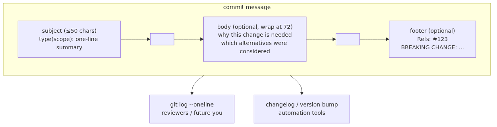

# Writing Good Commit Messages: Conventional Commits and Useful Bodies

## What you will learn

- Why a good commit message is an asset that pays off as much as the code itself.
- How to structure a commit message with a subject, body, and footer.
- How Conventional Commits (`feat`, `fix`, `docs`, etc.) signal the kind of change at a glance.
- How to polish messages after the fact with `git commit --amend` and `git rebase -i`.

## Why it matters

`git log` is a letter to your future self and to your teammates. Six months later, when `git blame` lands on a single line, a clear commit message restores the context in five seconds. The opposite — `fix bug`, `update`, `wip` — forces a reader to pull up the original PR and re-read the entire diff to figure out what happened.

Good messages also feed automation. With Conventional Commits, a release script can collect each `feat` commit into a changelog and bump the major version when a `BREAKING CHANGE` footer appears. The message itself becomes the first draft of release notes.

The benefit shows up in code review too. Even when a PR description is thin, well-written commit messages let reviewers walk through the change one commit at a time and follow the author's intent. Think of a commit message as the layer of abstraction that lives one step above the code.

## Mental model

> A good commit message is a small document that lets you and your teammate, six months later, see in one read what changed and why. The subject, body, and footer each carry one face of that document.
A solid commit message has a fixed skeleton.


Three habits define the shape. Keep the subject short and in the imperative mood. Add a body — separated by a blank line — when the change needs the "why". Use the footer for issue references and breaking-change notices.

## Core concepts

| Concept | Description |
| --- | --- |
| Subject | First line, 50 characters or fewer, no trailing period, written in the imperative mood. `Add login button` is good; `Added login button` is not. |
| Body | After a blank line. Wrap at 72 characters. Cover the "why" and the "how", not the "what". |
| Footer | Holds metadata such as `Refs: #42`, `Closes #42`, or `BREAKING CHANGE: ...`. |
| Type | The Conventional Commits classification: `feat`, `fix`, `docs`, `refactor`, `test`, `chore`, `perf`, `build`, `ci`, `style`. |
| Scope | An optional area marker in parentheses: `feat(auth): support OAuth login`. |
| Imperative mood | The verb that completes the sentence "If applied, this commit will ___". `Add`, `Fix`, `Refactor`. |
| Atomic commit | A commit that captures a single logical change, which keeps review and revert simple. |

## Before-After

Compare two logs that record identical work but with different message quality.

**Before** (messages only the author can decode)

```text
$ git log --oneline -5
9f8e7d6 fix
8e7d6c5 update
7d6c5b4 wip
6c5b4a3 stuff
5b4a3f2 final
```

Six months later this log is opaque. Even when `git blame` points at a specific line, the message offers nothing.

**After** (Conventional Commits with a short body)

```text
$ git log --oneline -5
9f8e7d6 fix(auth): handle expired refresh tokens
8e7d6c5 feat(auth): add OAuth login button
7d6c5b4 refactor(auth): extract token validation helper
6c5b4a3 test(auth): cover login redirect cases
5b4a3f2 docs(auth): document OAuth setup steps
```

A reader sees in five lines that the auth module was reorganized, OAuth was added, and a token-expiry bug was fixed. Filtering release notes to just `feat` commits becomes a one-liner thanks to the type prefix.

## Step-by-step walkthrough

Polish messages directly inside the `vacation-notes` repository from Episode 8. `main` now points at the merge commit `Merge pull request #2 from feature/packing-list-2` produced at the end of Episode 8.

### 1. Create one commit worth polishing

Make a tiny change and commit it with a deliberately weak message.

```bash
$ git switch -c chore/readme-typo
Switched to a new branch 'chore/readme-typo'
$ printf '\nThanks for reading.\n' >> README.md
$ git add README.md
$ git commit -m "fix"
[chore/readme-typo c4d5e6f] fix
 1 file changed, 2 insertions(+)
```

`git log -1` shows a single word, `fix`. There is no way to tell what was fixed.

### 2. Rewrite the message with `git commit --amend`

If the commit has not been pushed yet, `--amend` rewrites the message in place.

```bash
$ git commit --amend -m "docs(readme): add closing thank-you note"
[chore/readme-typo a8b7c6d] docs(readme): add closing thank-you note
 Date: Mon May 4 10:21:40 2026 +0900
 1 file changed, 2 insertions(+)
$ git log -1 --pretty=full
commit a8b7c6d4e3f2a1b0c9d8e7f6a5b4c3d2e1f0a9b8
Author: You <you@example.com>
Commit: You <you@example.com>

    docs(readme): add closing thank-you note
```

The hash moved from `c4d5e6f` to `a8b7c6d`. `--amend` is, in effect, a new commit. That is why amending a commit you have already pushed is risky.

### 3. Open an editor when you need a body

`-m` is a fit only for one-line messages. When a body is needed, drop `-m` and let Git open an editor.

```bash
$ git commit
```

Inside the editor, write something like this.

```text
feat(packing): add weather-aware section

Summary: extend the packing list section so recommended items shift
based on the weather forecast for the trip date.

Items used to be static, so users departing during the rainy season
got the same checklist as everyone else. The external weather API
call is wrapped in a cache layer to keep response time under 50ms.

Refs: #2
```

After saving, the first line becomes the subject, the blank line separates the body, and the trailing line is parsed as the footer.

### 4. Polish older messages with `git rebase -i`

To clean up several recent messages at once, reach for an interactive rebase. Use it only on commits that have not been pushed.

```bash
$ git rebase -i HEAD~3
```

Git opens an editor like this.

```text
pick a8b7c6d docs(readme): add closing thank-you note
pick b9c8d7e fix
pick c0d1e2f wip

# Rebase ...
# Commands:
# p, pick   = use commit
# r, reword = use commit, but edit the commit message
# ...
```

Change the second and third `pick` to `reword` and save. Git then opens a message editor for each of those commits in order. Replace `fix` and `wip` with meaningful messages, save, and let the rebase finish. `git log --oneline` reads cleanly afterwards.

### 5. Enforce the format with a `commit-msg` hook

The last step is automation. Drop a script into the repository to reject messages that do not follow the format.

```bash
$ cat .git/hooks/commit-msg
#!/bin/sh
pattern='^(feat|fix|docs|refactor|test|chore|perf|build|ci|style)(\([a-z0-9-]+\))?: .{1,50}$'
head -n1 "$1" | grep -Eq "$pattern" || {
  echo "Subject does not match the Conventional Commits format." >&2
  exit 1
}
$ chmod +x .git/hooks/commit-msg
```

Now `git commit -m "fix"` is rejected before the commit is recorded. For richer rules, move the same check into a tool such as `commitlint`.

## Common mistakes

- Mixing two unrelated changes into one commit. Review and revert both become harder. Use `git add -p` to split the work into hunk-sized commits.
- Ending the subject with a period and going past 50 characters. `git log --oneline` truncates the line and hides the rest.
- Describing only "what changed". The diff already carries that information; the message should explain "why".
- Amending a commit that was already pushed and pushing again. A force push becomes mandatory and other contributors' history drifts.
- Stuffing email addresses or issue numbers into the subject. That metadata belongs in the footer so the one-line summary stays clean.

## In practice

Teams usually write the message rules into the repository itself. A short list of five commitments in `README.md` or `CONTRIBUTING.md` is enough.

1. Subject is 50 characters or fewer, imperative, with no trailing period.
2. Type is one of the Conventional Commits ten.
3. Body wraps at 72 characters and explains the "why".
4. Footer carries issue numbers and any breaking change.
5. Force push is allowed only on personal feature branches.

The rules are enforced in two places: a local `commit-msg` hook and a CI step running `commitlint`. A message that fails CI blocks the PR from merging. Two automated nets are safer than relying on memory alone.

PR titles often follow the same format. With squash merges, the PR title becomes the commit message on the default branch, so a well-written PR title turns into a well-written log entry for free.

## Checklist

- [ ] Is the subject 50 characters or fewer, imperative, and free of a trailing period?
- [ ] Does the type belong to the Conventional Commits classification?
- [ ] If a body is present, does it sit after a blank line and wrap at 72 characters?
- [ ] Does the body explain the "why" rather than restating the diff?
- [ ] Does the footer reference an issue or call out a breaking change when relevant?
- [ ] Is a `commit-msg` hook or a CI lint enforcing the format automatically?
- [ ] Did you re-read the message and refine it with `--amend` before pushing?

## Practice questions

1. Run `git log --oneline -20` on a recent project. Pick three commits that violate the 50-character subject rule and write better replacements on paper.
2. Use `git commit --amend -m "..."` to rewrite the message of your latest commit. Confirm with `git log -1` that the hash changed.
3. On a fresh branch, create three small commits, then run `git rebase -i HEAD~3` and `reword` the second one.
4. Add the `commit-msg` hook above to a sample repository. Try committing with an out-of-format message and confirm it is rejected.
5. Add a four-to-six-line commit-message policy to the `README.md` of a personal or team repository.

## Wrap-up and next post

A well-written commit message is the cheapest documentation that explains the intent of a change without rereading the code. With the 50-character imperative subject, the "why" body, the metadata footer, and the Conventional Commits type prefix, `git log` doubles as a change-history document. Polish unpushed commits freely with `--amend` and `rebase -i`, and let a hook plus CI lint enforce the format automatically.

The next post stitches the tools from this series into one realistic workflow. We will follow a single change from the issue that opens it through PR merge and release, and look at how to recover with the right commands when something goes wrong along the way.

<!-- toc:begin -->
## Series TOC

- [What is Git? Version Control Fundamentals](./01-what-is-git.md)
- [Your First Commit: init, add, commit](./02-first-commit.md)
- [Inspecting Changes: status, diff, log](./03-status-diff-log.md)
- [Understanding Branches: Diverging and Switching](./04-branch-basics.md)
- [Merging Branches and Resolving Conflicts](./05-merge-and-conflict.md)
- [Creating a GitHub Repository: remote, push, pull](./06-github-repository.md)
- [Collaborating with Pull Requests](./07-pull-request.md)
- [Tracking Work with Issues and Projects](./08-issue-and-project.md)
- **Writing Good Commit Messages (current)**
- [Building a Real-World Git Workflow](./10-real-world-workflow.md)
<!-- toc:end -->

## References

- Conventional Commits, "Conventional Commits 1.0.0": <https://www.conventionalcommits.org/en/v1.0.0/>
- Tim Pope, "A Note About Git Commit Messages": <https://tbaggery.com/2008/04/19/a-note-about-git-commit-messages.html>
- Git docs, `git commit --amend`: <https://git-scm.com/docs/git-commit>
- Git docs, `git rebase -i`: <https://git-scm.com/docs/git-rebase>
- Git docs, "githooks - commit-msg": <https://git-scm.com/docs/githooks#_commit_msg>

Tags: git-commit-message, conventional-commits, commit-style, imperative-mood, git-amend, code-blame
