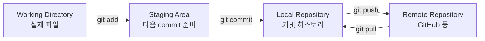

# Git이란 무엇인가? 버전 관리의 시작

## 이 글에서 배울 것

- 버전 관리(version control) 시스템이 해결하는 문제
- Git이 왜 분산 버전 관리(distributed VCS)인지
- "스냅샷" 모델과 파일 단위 변경 추적의 차이
- Git을 설치하고 첫 설정(`git config`)을 마치는 방법
- 다음 글에서 다룰 첫 commit을 위한 준비

## 이 글에서 답할 질문

- 버전 관리 시스템이 정확히 어떤 문제를 해결하기 위해 등장했는가?
- Git이 "분산" 버전 관리라는 말은 동작 측면에서 무엇을 의미하는가?
- 스냅샷 모델은 파일 단위 변경 추적과 어떤 점에서 다른가?
- `git config`로 처음에 잡아 두어야 할 설정은 무엇이며 왜 그런가?
- 다음 글의 첫 commit을 만들기 전에 끝내 두어야 할 준비물은 무엇인가?

## 왜 중요한가

코드를 혼자 짜더라도 시간이 흐르면 다음과 같은 상황이 옵니다.

- "어제 잘 되던 코드가 왜 지금은 안 되지?"
- "이 함수, 한 달 전에는 다르게 생겼던 것 같은데?"
- "다른 파일을 동시에 수정하다가 꼬여 버렸습니다."

Git은 이런 질문에 답할 수 있게 해 주는 도구입니다. 어느 시점의 코드든 다시 꺼내 볼 수 있고, 누가 언제 어떤 변경을 했는지 추적할 수 있습니다. 협업이 끼어들면 가치는 더 커집니다. 같은 파일을 여러 명이 수정해도 충돌 지점만 골라서 정리할 수 있습니다.

많은 회사·오픈소스 프로젝트가 Git을 표준으로 씁니다. Git을 익히는 일은 이제 "있으면 좋은" 기술이 아니라, 협업을 위한 공통어를 배우는 일에 가깝습니다.

## Mental Model

> Git의 핵심 모델은 "파일들의 스냅샷을 시간 순서대로 보관하는 도구"이고, 그 스냅샷은 working directory, staging area, repository 세 영역을 거쳐 만들어집니다.
Git의 핵심을 한 문장으로 줄이면 "파일들의 스냅샷을 시간 순서대로 보관하는 도구"입니다. 각 commit은 그 시점에 어떤 파일이 어떤 내용이었는지를 기록한 사진입니다.



Git은 세 개의 영역을 구분합니다.

- **Working Directory**: 지금 편집 중인 파일들이 있는 자리.
- **Staging Area** (= Index): 다음 commit에 포함할 변경을 모아 두는 자리.
- **Repository**: commit이 시간 순서대로 쌓이는 로컬 저장소. 원격 저장소(remote)는 동기화 대상이 되는 별개의 저장소이며, 위 세 영역 바깥에 있습니다.

이 모델을 이해하면 `add`, `commit`, `push` 명령이 왜 따로 존재하는지 자연스럽게 이해됩니다.

## 핵심 개념

- **Version Control System (VCS)**: 파일의 변화 이력을 시간 순서대로 기록·복구하는 도구.
- **Distributed VCS**: 일반적인 clone에서는 로컬 저장소가 전체 히스토리를 갖는 형태. Git이 대표적입니다. 중앙 서버가 잠깐 끊겨도 작업이 가능합니다.
- **Snapshot 모델**: Git은 변경된 줄만 저장하지 않고, commit 시점에 추적 중인 파일 전체의 스냅샷을 저장합니다(내부적으로는 동일한 파일은 재사용해 공간을 절약합니다).
- **Commit**: 변경의 단위. 메시지, 작성자, 시간, 부모 commit을 함께 기록합니다.
- **Branch**: commit을 가리키는 이동 가능한 포인터. 새 branch를 만든다고 해서 파일을 복사하지 않습니다.
- **Remote**: 로컬 저장소와 연결된 원격 저장소(보통 GitHub). 로컬과 별개의 commit 그래프를 가집니다.

## Before-After

작은 팀이 코드를 공유하는 흐름을 비교해 봅니다.

**Before (Git 없이)**

```
project_v1.zip
project_v2_FINAL.zip
project_v2_FINAL_real.zip
project_v2_FINAL_real_alice_edits.zip
```

세 가지 문제가 있습니다.

- 어떤 파일이 최신인지 파일명에 의존해 추측해야 합니다.
- 변경된 부분이 어디인지 zip을 풀어 직접 비교해야 합니다.
- 두 사람의 변경을 합치려면 손으로 옮겨야 합니다.

**After (Git 사용)**

```text
$ git log --oneline
b3a1c0f Add login form (alice)
8e2f5d1 Refactor session helper (bob)
1a9b2c4 Initial commit (alice)
```

세 가지 변화가 있습니다.

- 어떤 변경이 언제, 누구에 의해 일어났는지 한 줄로 보입니다.
- 두 commit 사이의 차이를 `git diff` 한 번으로 볼 수 있습니다.
- 합치는 작업은 `git merge`가 자동으로 시도하고, 충돌 지점만 사람이 정리합니다.

## 단계별 실습

이 글은 Git을 처음 설치하는 사람을 기준으로 합니다. 명령은 셸에서 실행하는 예시이며, `$`로 시작하는 줄은 입력, 그 아래 줄은 출력입니다.

### 1. Git 설치 확인

```text
$ git --version
git version 2.43.0
```

설치돼 있지 않다면 OS별로 다음과 같이 설치합니다.

- macOS: `brew install git` (Homebrew 사용 시) 또는 Xcode Command Line Tools에 포함된 git 사용.
- Ubuntu/Debian: `sudo apt update && sudo apt install git`
- Windows: [Git for Windows](https://git-scm.com/download/win) 인스톨러로 설치.

설치 후 셸을 새로 열고 `git --version`을 다시 실행해 버전이 표시되는지 확인하세요.

### 2. 사용자 정보 설정

commit에는 작성자의 이름과 이메일이 함께 기록됩니다. 처음 한 번만 등록해 두면 됩니다.

```text
$ git config --global user.name "Ada Lovelace"
$ git config --global user.email "ada@example.com"
```

`--global`은 사용자 홈 디렉터리의 `.gitconfig`에 저장한다는 뜻입니다. 특정 저장소에서만 다른 이메일을 쓰고 싶다면 그 저장소 안에서 `--global` 없이 같은 명령을 실행합니다.

### 3. 기본 branch 이름 설정

새 저장소의 기본 branch 이름을 지정합니다. 최근에는 `main`을 많이 씁니다.

```text
$ git config --global init.defaultBranch main
```

### 4. 설정 확인

지금까지 설정한 값을 한눈에 볼 수 있습니다.

```text
$ git config --global --list
user.name=Ada Lovelace
user.email=ada@example.com
init.defaultBranch=main
```

### 5. 도움말 사용법

명령 사용법이 헷갈릴 때는 다음 세 가지를 기억해 두면 좋습니다.

```text
$ git help                # 자주 쓰는 Git 명령 목록
$ git help commit         # 자세한 매뉴얼(브라우저 또는 man page)
$ git commit --help       # `git help commit`과 동일한 매뉴얼
$ git commit -h           # 한 화면짜리 옵션 요약(짧은 사용법)
```

`git help <명령>`과 `git <명령> --help`는 같은 자세한 매뉴얼을 엽니다. 짧은 `-h`(소문자) 옵션은 옵션 이름만 빠르게 확인하고 싶을 때 유용합니다.

## 자주 하는 실수

- **이메일을 회사 이메일로 두고 개인 저장소에 commit** — `--global` 설정은 사용자 전역에 적용되므로 다른 저장소까지 같은 이메일을 사용합니다. 저장소별로 분리하려면 해당 저장소에서 `--global` 없이 다시 설정하세요.
- **설치만 하고 `user.name`/`user.email` 설정을 건너뛰기** — 첫 commit에서 `Please tell me who you are` 메시지를 만나게 됩니다.
- **GUI 도구만 보고 명령행을 피하기** — GUI는 빠르지만, 문제가 생겼을 때 진단은 명령행이 빠릅니다. 둘 다 익혀 두는 편이 안전합니다.
- **버전이 너무 낡은 git** — 일부 기능(예: `git switch`, `git restore`, `git sparse-checkout` 개선판)은 최근 버전이 필요합니다. 너무 오래된 OS 패키지보다는 공식 인스톨러나 Homebrew/apt 최신을 권장합니다.
- **저장소를 디렉터리째 zip으로 백업** — `.git/` 폴더가 빠지면 히스토리가 사라집니다. 백업이 필요하다면 remote로 push하는 편이 안전합니다.
- **`git`과 `GitHub`을 같은 도구로 오해** — Git은 도구, GitHub은 Git 저장소를 호스팅하는 서비스입니다. GitLab, Bitbucket 같은 다른 호스팅도 있습니다.

## 실무

실제 개발 환경에서 Git이 등장하는 자리는 다음과 같습니다.

- **개인 프로젝트의 안전망**: 어제 작업한 코드를 한 줄로 되돌릴 수 있다는 점은 큰 심리적 안전감을 줍니다.
- **팀 협업의 공통어**: PR(Pull Request) 흐름은 Git을 전제로 굴러갑니다. Git 모델을 이해하지 못하면 PR 리뷰도 추측 위에서 진행됩니다.
- **CI/CD의 트리거**: 대부분의 CI 시스템(GitHub Actions, GitLab CI 등)은 commit 또는 PR 이벤트로 동작을 시작합니다.
- **장애 추적**: `git bisect`나 `git blame`은 "언제부터 이 버그가 있었지?"라는 질문에 빠르게 답해 줍니다. 이는 Git 히스토리가 잘 관리돼 있다는 전제가 필요합니다.
- **인프라 코드 관리**: Terraform, Kubernetes manifest 같은 IaC도 결국 텍스트 파일이므로 Git으로 관리합니다.

Git을 처음 익힐 때는 명령 하나하나의 의미보다 "지금 변경이 어느 영역에 있는지(working / staging / repo)"를 머릿속에 그리는 연습이 가장 큰 도움이 됩니다.

## 체크리스트

- [ ] `git --version`이 정상적으로 버전을 출력합니다.
- [ ] `git config --global user.name`, `user.email`이 설정돼 있습니다.
- [ ] `git config --global init.defaultBranch`가 `main` 등으로 지정돼 있습니다.
- [ ] Working Directory, Staging Area, Repository의 차이를 한 문장씩으로 설명할 수 있습니다.
- [ ] `git`과 GitHub의 관계를 한 문장으로 설명할 수 있습니다.
- [ ] `git help <command>`, `git <command> --help`, `git <command> -h`의 차이를 알고 있습니다.

## 연습 문제

1. 자신의 OS에 Git을 설치하고 `git --version` 결과를 적어 보세요.
2. `git config --global user.name`과 `user.email`을 설정한 뒤, `git config --global --list`로 확인해 보세요.
3. `git config --global init.defaultBranch main`을 설정한 뒤, 새 디렉터리에서 `git init`을 실행해 기본 branch가 `main`으로 만들어지는지 확인하세요.
4. `git help commit`, `git commit --help`, `git commit -h`를 각각 실행해 출력 형태가 어떻게 다른지 비교해 보세요.
5. "Working Directory", "Staging Area", "Repository"를 자신의 말로 한 문장씩 정의해 메모해 보세요.

## 정리·다음 글

- Git은 파일의 스냅샷을 시간 순서대로 보관해 변경 이력을 추적하는 분산 버전 관리 도구입니다.
- 변경은 Working Directory → Staging Area → Repository의 흐름을 따라갑니다.
- 첫 사용 전에는 `user.name`, `user.email`, `init.defaultBranch`를 한 번 설정해 두면 됩니다.
- Git은 도구이고 GitHub은 그 저장소를 호스팅하는 서비스입니다. 둘은 분리해서 이해해야 합니다.
- 명령 사용법이 헷갈릴 때는 `git help <command>` 또는 `git <command> -h`로 빠르게 확인할 수 있습니다.

다음 글에서는 빈 디렉터리에서 시작해 첫 commit을 만들어 봅니다. `git init`, `git status`, `git add`, `git commit`이 차례대로 등장합니다.

<!-- toc:begin -->
<!-- toc:end -->

## 참고 자료

- [Git 공식 문서 — About Version Control](https://git-scm.com/book/en/v2/Getting-Started-About-Version-Control)
- [Git 공식 문서 — First-Time Git Setup](https://git-scm.com/book/en/v2/Getting-Started-First-Time-Git-Setup)
- [Git 다운로드 페이지](https://git-scm.com/downloads)
- [GitHub Docs — Set up Git](https://docs.github.com/en/get-started/quickstart/set-up-git)

Tags: git-basics, version-control, distributed-vcs, snapshot-model, git-install, git-config
