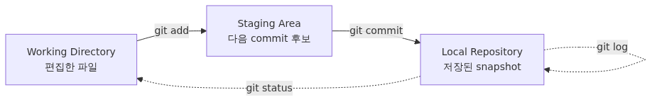

# 첫 commit 만들기 - init, status, add, commit

Git은 첫 commit을 직접 만들어 보는 순간부터 추상적인 개념에서 손에 잡히는 도구로 바뀝니다. 빈 폴더에서 시작해 변경을 staging에 올리고 snapshot으로 저장하는 과정을 한 번 끝까지 따라가면 이후 명령도 훨씬 덜 낯설어집니다.

이 글은 Git/GitHub 101 시리즈의 두 번째 글입니다. 여기서는 `git init`부터 첫 `git commit`까지의 흐름을 손으로 따라가며 Git의 세 영역이 실제로 어떻게 움직이는지 확인합니다.

## 이 글에서 다룰 문제

> 첫 commit은 working directory의 변경을 staging area에 모은 뒤 repository에 한 장의 스냅샷으로 저장하는 과정이며, `add`와 `commit`이 나뉘어 있는 이유도 바로 이 두 단계가 다르기 때문입니다.

- `git init`은 현재 디렉터리에 정확히 무엇을 만들까요?
- `git status`는 파일 상태를 어떤 말로 보여 줄까요?
- `git add`는 단순히 "파일을 추가한다"는 뜻일까요, 아니면 더 정확한 의미가 있을까요?
- `git commit -m`을 실행하면 어떤 snapshot이 저장될까요?
- 수정 → add → commit 사이클을 한 번 돌리고 나면 무엇이 달라질까요?

## 왜 중요한가

Git 입문에서 가장 어려운 부분은 명령 이름이 아닙니다. 지금 내 변경이 어느 영역에 있는지, 즉 working directory인지 staging area인지 repository인지 머릿속에 그리는 일입니다.

첫 commit을 손으로 만들어 보면 이 그림이 빠르게 선명해집니다. 단순히 파일을 만들었을 때와 `git add`까지 했을 때 `git status`가 어떻게 달라지는지, commit 직후 상태가 왜 깨끗해지는지, `.git/` 디렉터리가 저장소의 출발점이라는 점까지 한 번에 체감할 수 있습니다.

이 한 사이클을 직접 경험하고 나면 이후의 `git diff`, `git log`, `git restore`, `git switch`도 어느 영역을 건드리는 명령인지 예측하기 쉬워집니다.

## 핵심 그림



*Mental Model*

세 동사가 함께 움직입니다.

- **edit**: 에디터에서 파일을 만들거나 수정합니다.
- **`add`**: 다음 commit에 포함할 변경으로 올립니다.
- **`commit`**: staging에 모인 내용을 하나의 snapshot으로 저장합니다.

`git status`는 이 흐름 전체에서 현재 위치를 알려 주는 안내판입니다. 헷갈릴 때 가장 먼저 보는 명령이 되는 이유가 여기에 있습니다.

## 핵심 개념

- **Working Directory**: 디스크 위에 보이는 현재 파일입니다.
- **Staging Area (Index)**: 다음 commit 후보 목록입니다.
- **`git init`**: 현재 폴더에 `.git/`을 만들어 Git 저장소로 바꿉니다.
- **Untracked / Modified / Staged**: `git status`가 보여 주는 대표 상태입니다.
- **Commit message**: 변경 의도를 한 줄로 요약한 기록입니다.
- **`HEAD`**: 현재 branch의 가장 최근 commit을 가리키는 이름입니다.

## 전후 비교

Git 없이 메모 파일을 관리하면 보통 이런 식이 됩니다.

```text
$ ls
notes_v1.txt
notes_v2.txt
notes_v2_FINAL.txt
```

- 최신 파일이 무엇인지 파일명으로 추측해야 합니다.
- 두 버전의 차이는 별도 비교 도구를 열어야 알 수 있습니다.
- 왜 바꿨는지는 파일명 어디에도 남지 않습니다.

Git을 쓰면 기록이 이런 모양으로 남습니다.

```text
$ git log --oneline
9b8c3e2 Add intro paragraph to notes
4f1a2c0 Initial commit
```

최신은 `HEAD`가 가리키고, 차이는 `git diff`로 확인하며, 변경 의도는 commit message에 남습니다.

## 단계별 실습

### 1. 빈 디렉터리에서 시작

```text
$ mkdir my-first-repo
$ cd my-first-repo
$ ls -A
```

아무것도 보이지 않으면 정말 빈 디렉터리입니다.

### 2. `git init`으로 저장소 만들기

```text
$ git init
Initialized empty Git repository in /Users/me/my-first-repo/.git/
```

`.git/`이 생기면 이 폴더는 Git 저장소가 됩니다.

```text
$ ls -A
.git
```

### 3. 첫 파일을 만들고 status 확인

```text
$ echo "# My First Repo" > README.md
$ git status
On branch main

No commits yet

Untracked files:
  (use "git add <file>..." to include in what will be committed)
        README.md

nothing added to commit but untracked files present (use "git add" to track)
```

`README.md`는 아직 Git이 모르는 파일이므로 `Untracked`입니다.

### 4. `git add`로 staging에 올리기

```text
$ git add README.md
$ git status
On branch main

No commits yet

Changes to be committed:
  (use "git rm --cached <file>..." to unstage)
        new file:   README.md
```

상태가 `Untracked`에서 `Changes to be committed`로 이동했습니다. 이것이 staging입니다.

### 5. `git commit -m`으로 snapshot 저장

```text
$ git commit -m "Initial commit"
[main (root-commit) 4f1a2c0] Initial commit
 1 file changed, 1 insertion(+)
 create mode 100644 README.md
```

첫 commit에는 `root-commit`이라는 표시가 붙습니다. 부모 commit이 없기 때문입니다.

```text
$ git status
On branch main
nothing to commit, working tree clean
```

### 6. 한 번 더 같은 사이클 돌리기

```text
$ echo "" >> README.md
$ echo "Some notes." >> README.md
$ git status
On branch main
Changes not staged for commit:
  (use "git add <file>..." to update what will be committed)
  (use "git restore <file>..." to discard changes in working directory)
        modified:   README.md

no changes added to commit (use "git add" and/or "git commit -a")
```

이번에는 새 파일이 아니라 추적 중인 파일을 수정했으므로 `modified`로 보입니다.

```text
$ git add README.md
$ git commit -m "Add intro paragraph to notes"
[main 9b8c3e2] Add intro paragraph to notes
 1 file changed, 2 insertions(+)
```

```text
$ git log --oneline
9b8c3e2 Add intro paragraph to notes
4f1a2c0 Initial commit
```

## 자주 하는 실수

- 홈 디렉터리에서 `git init`을 실행해 전체 홈 폴더를 저장소로 만들어 버리는 경우가 있습니다.
- `git add` 없이 `git commit`부터 시도하면 staging이 비어 있어 저장할 것이 없다는 메시지를 보게 됩니다.
- `git add .`로 의도하지 않은 파일까지 올리는 일도 흔합니다.
- 빈 commit message를 넣거나 `.git/` 내부 파일을 손으로 건드리는 것도 피해야 합니다.
- 이미 추적 중인 파일을 수정하고 `add`를 빼먹은 채 commit하려다 일부만 저장하는 실수도 자주 나옵니다.

## 실무에서는 이렇게 본다

새 프로젝트를 시작할 때도, 작은 기능을 쪼개 기록할 때도 결국 흐름은 같습니다. 편집하고, 상태를 확인하고, staging으로 올리고, 의도가 분명한 commit으로 저장합니다. 이 기본기가 있어야 나중에 리뷰와 되돌리기, 충돌 해결도 쉬워집니다.

특히 `git status`를 자주 보는 습관은 실무에서 매우 중요합니다. 변경을 한 뒤 무엇이 staging에 올라가 있고 무엇이 아직 작업 중인지 읽는 능력이 곧 사고를 줄여 줍니다.

## 체크리스트

- [ ] `git init`이 만든 `.git/` 디렉터리를 확인했습니다.
- [ ] `Untracked`, `modified`, `Changes to be committed` 상태를 각각 봤습니다.
- [ ] `git add` 전후로 `git status`가 어떻게 바뀌는지 설명할 수 있습니다.
- [ ] `git commit -m "..."`으로 commit을 만들고 `git log --oneline`으로 확인했습니다.
- [ ] commit 후 `git status`가 `working tree clean`으로 돌아오는 것을 확인했습니다.
- [ ] `root-commit`이 무엇을 뜻하는지 설명할 수 있습니다.

## 연습 문제

1. 빈 디렉터리에서 `git init`을 실행하고 `.git/` 안에 무엇이 생겼는지 확인해 보세요.
2. `README.md`를 만들고 `git status`에서 `Untracked` 상태를 본 뒤 `git add` 후 상태를 비교해 보세요.
3. 첫 commit 뒤 `README.md`에 한 줄을 더 추가하고 다시 commit한 다음 `git log --oneline`이 두 줄로 늘었는지 확인해 보세요.
4. `git commit -m ""`을 시도해 Git이 어떤 메시지를 출력하는지 읽어 보세요.
5. 새 파일 두 개를 만들고 하나만 `git add`한 뒤 commit해 보세요. 다른 파일이 어떤 상태로 남는지 `git status`로 확인해 보세요.

## 정리와 다음 글

`git init`은 현재 폴더를 저장소로 바꾸고, `git status`는 각 변경이 어느 영역에 있는지 알려 주며, `git add`와 `git commit`은 그 변경을 snapshot으로 저장합니다. 첫 commit을 직접 한 번 만들어 보면 이후 명령이 왜 그런 모양인지 설명이 붙습니다.

다음 글에서는 `git status`를 더 자세히 읽고 `git diff`, `git log`로 변경 내용을 해석하는 법을 다룹니다.

<!-- toc:begin -->
## 시리즈 목차

- [Git이란 무엇인가? 버전 관리의 시작](./01-what-is-git.md)
- **첫 commit 만들기 - init, status, add, commit (현재 글)**
- 변경 사항 확인하기: status, diff, log (예정)
- branch 이해하기: 분기와 전환 (예정)
- merge와 conflict 해결하기 (예정)
- GitHub repository 만들기와 remote, push, pull (예정)
- Pull Request로 협업하기 (예정)
- Issue와 Project로 일감 관리하기 (예정)
- 좋은 commit message 쓰기 (예정)
- 실전 Git workflow 만들기 (예정)
<!-- toc:end -->

## 참고 자료

- [Pro Git — Recording Changes to the Repository](https://git-scm.com/book/en/v2/Git-Basics-Recording-Changes-to-the-Repository) — working directory에서 staging, commit으로 넘어가는 첫 저장 흐름을 가장 직접적으로 설명합니다.
- [git-init manual](https://git-scm.com/docs/git-init) — `git init`이 저장소를 어떻게 만들고 어떤 옵션을 갖는지 확인할 수 있습니다.
- [git-status manual](https://git-scm.com/docs/git-status) — `Untracked`, `modified`, `Changes to be committed` 같은 상태 문구의 기준 문서입니다.
- [git-add manual](https://git-scm.com/docs/git-add) — `git add`가 단순 추가가 아니라 staging을 채우는 동작임을 정확히 짚어 줍니다.
- [git-commit manual](https://git-scm.com/docs/git-commit) — `git commit -m`과 첫 snapshot 저장 규칙을 공식 문법으로 확인할 수 있습니다.
- [git-log manual](https://git-scm.com/docs/git-log) — 실습 마지막의 `git log --oneline`으로 첫 두 commit을 확인하는 단계와 연결됩니다.
Tags: git-init, git-status, git-add, git-commit, staging-area, first-repository
