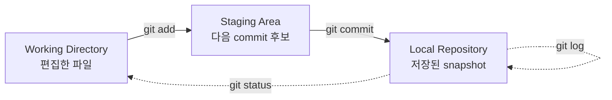

# 첫 commit 만들기 - init, status, add, commit

## 이 글에서 배울 것

- `git init`으로 빈 저장소를 만드는 방법
- `git status`로 현재 상태를 읽는 방법
- `git add`로 변경을 staging에 올리는 의미
- `git commit -m`으로 첫 snapshot을 남기는 방법
- 한 사이클(편집 → add → commit)을 한 번에 따라가 보기

## 왜 중요한가

Git의 대부분의 명령은 "지금 변경이 어느 영역에 있는가"를 전제로 동작합니다. 그래서 처음 배울 때 어려운 부분은 명령 이름이 아니라 영역을 머릿속에 그리는 일입니다.

첫 commit을 직접 만들어 보면 이 그림이 단숨에 또렷해집니다.

- "수정만 했을 때"와 "`add`까지 한 후"의 status가 어떻게 다른지
- commit이 만들어진 뒤에는 status가 어떻게 깨끗해지는지
- `.git/` 폴더 안에 무엇이 남는지

이 사이클을 한 번 따라가면, 이후 등장하는 `git diff`, `git log`, `git restore`, `git switch` 같은 명령이 어디에 작용하는지를 자연스럽게 추측할 수 있습니다.

## Mental Model

한 사이클을 그림으로 표현하면 다음과 같습니다.



세 가지 동사를 함께 기억합니다.

- **편집(edit)**: 에디터로 파일을 만들거나 고치는 일. Git은 아직 모릅니다.
- **`add`**: "이 변경을 다음 commit에 포함하겠다"고 Git에 알려 주는 일.
- **`commit`**: staging에 모인 변경을 하나의 snapshot으로 저장하는 일.

`git status`는 어느 단계에 있든 "지금 무엇이 어디에 있는지"를 알려 주는 안내자입니다. 헷갈릴 때 가장 먼저 치는 명령입니다.

## 핵심 개념

- **Working Directory**: 디스크 위에 보이는 파일들. 에디터로 수정하면 이 영역이 바뀝니다.
- **Staging Area (Index)**: 다음 commit에 포함할 변경의 목록. `git add`로 채우고, `git commit`이 비워 갑니다.
- **`git init`**: 현재 디렉터리에 `.git/` 폴더를 만들어 Git 저장소로 만드는 명령. 한 번만 실행합니다.
- **Untracked / Modified / Staged**: status에서 볼 수 있는 세 가지 상태. Git이 모르는 파일, Git이 알지만 변경된 파일, 그리고 commit 후보로 올라간 변경입니다.
- **Commit message**: 변경의 의도를 한 줄로 요약하는 메시지. 나중에 `git log`로 읽을 때 작성자에게 가장 큰 도움이 됩니다.
- **`HEAD`**: 현재 branch가 가리키는 가장 최근 commit을 가리키는 별명.

## Before-After

같은 작업을 zip 백업과 Git으로 비교해 봅니다.

**Before (zip 백업)**

```text
$ ls
notes_v1.txt
notes_v2.txt
notes_v2_FINAL.txt
```

- 어떤 파일이 최신인지 파일명만 보고 추측해야 합니다.
- 두 시점의 차이는 따로 비교 도구를 띄워야 보입니다.
- 작업한 의도(왜 바꿨는지)가 어디에도 적혀 있지 않습니다.

**After (Git)**

```text
$ git log --oneline
9b8c3e2 Add intro paragraph to notes
4f1a2c0 Initial commit
```

- 최신은 `HEAD`가 가리킵니다. 파일명 추측이 사라집니다.
- 두 commit 사이의 차이는 `git diff 9b8c3e2 4f1a2c0`로 한 번에 보입니다.
- 변경의 의도가 commit message에 한 줄씩 남습니다.

## 단계별 실습

다음 명령을 셸에서 차례대로 실행해 봅니다. `$`로 시작하는 줄은 입력, 그 아래 줄은 출력입니다.

### 1. 빈 디렉터리에서 시작

```text
$ mkdir my-first-repo
$ cd my-first-repo
$ ls -A
```

`ls -A`가 아무것도 출력하지 않으면 빈 디렉터리입니다.

### 2. `git init`으로 저장소 만들기

```text
$ git init
Initialized empty Git repository in /Users/me/my-first-repo/.git/
```

`.git/` 폴더가 만들어지면 그 디렉터리는 Git 저장소가 됩니다. 한 번만 실행하면 됩니다.

```text
$ ls -A
.git
```

### 3. 첫 파일 만들고 status 확인

```text
$ echo "# My First Repo" > README.md
$ git status
On branch main

No commits yet

Untracked files:
  (use "git add <file>..." to include in what will be committed)
        README.md

nothing added to commit but untracked files present (use "git add" to track)
```

새로 만든 `README.md`는 아직 Git이 추적하지 않는 파일(`Untracked`)입니다. status는 다음 단계로 무엇을 해야 할지(`use "git add" to track`)까지 친절히 알려 줍니다.

### 4. `git add`로 staging에 올리기

```text
$ git add README.md
$ git status
On branch main

No commits yet

Changes to be committed:
  (use "git rm --cached <file>..." to unstage)
        new file:   README.md
```

상태가 `Untracked`에서 `Changes to be committed`로 바뀌었습니다. 이 상태가 staging입니다.

### 5. `git commit -m`으로 snapshot 저장

```text
$ git commit -m "Initial commit"
[main (root-commit) 4f1a2c0] Initial commit
 1 file changed, 1 insertion(+)
 create mode 100644 README.md
```

첫 commit은 `root-commit`이라는 이름이 붙습니다. 이제 `git status`는 다시 깨끗해집니다.

```text
$ git status
On branch main
nothing to commit, working tree clean
```

### 6. 한 번 더 사이클 돌려 보기

```text
$ echo "" >> README.md
$ echo "Some notes." >> README.md
$ git status
On branch main
Changes not staged for commit:
  (use "git add <file>..." to update what will be committed)
  (use "git restore <file>..." to discard changes in working directory)
        modified:   README.md

no changes added to commit (use "git add" and/or "git commit -a")
```

이번에는 `Untracked`가 아닌 `modified` 상태입니다. Git이 추적 중인 파일이 바뀌었기 때문입니다.

```text
$ git add README.md
$ git commit -m "Add intro paragraph to notes"
[main 9b8c3e2] Add intro paragraph to notes
 1 file changed, 2 insertions(+)
```

`git log --oneline`으로 결과를 확인합니다.

```text
$ git log --oneline
9b8c3e2 Add intro paragraph to notes
4f1a2c0 Initial commit
```

## 자주 하는 실수

- **`git init`을 홈 디렉터리(`~`)에서 실행** — 홈 전체가 저장소가 되어 status가 매우 무거워집니다. 프로젝트 디렉터리 안에서만 실행합니다.
- **`add` 없이 `commit`을 시도** — staging이 비어 있으면 "nothing to commit"이 출력됩니다. 변경을 저장하려면 `add`가 먼저입니다.
- **`git add .`로 의도하지 않은 파일까지 올리기** — 빌드 산출물이나 비밀번호 파일이 함께 들어갈 수 있습니다. 의심스러우면 파일 이름을 명시하거나 `.gitignore`를 먼저 작성합니다.
- **commit message를 비워 두기** — `git commit -m ""`은 거부됩니다. 한 줄이라도 변경의 의도를 적습니다.
- **`.git/` 폴더를 손으로 수정** — 내부 구조를 직접 건드리면 저장소가 깨질 수 있습니다. 명령으로만 변경합니다.
- **이미 commit된 파일을 수정한 뒤 `add`를 잊고 commit** — 수정만 한 상태에서는 commit이 비어 있다는 메시지가 나오거나, 의도하지 않은 변경만 들어갑니다. status로 확인하는 습관이 안전합니다.

## 실무

실제 작업에서는 이 사이클이 다음과 같이 등장합니다.

- **새 프로젝트 시작**: `git init` → README/`.gitignore` 추가 → 첫 commit. 보통 이 첫 commit을 "Initial commit"으로 짧게 남깁니다.
- **기능 단위 commit**: 한 commit에 한 가지 의도만 담습니다. "로그인 폼 추가"와 "리팩터링"을 섞지 않습니다. 나중에 되돌리거나 리뷰할 때 큰 차이가 납니다.
- **status를 자주 본다**: 작업 중간중간 `git status`를 부담 없이 칩니다. "지금 어디에 무엇이 있는지" 머릿속 그림과 실제 상태를 맞추는 일이 가장 큰 시간 절약입니다.
- **commit 단위가 작을수록 협업이 쉽다**: 큰 변경을 한 번에 commit하면 PR 리뷰가 어렵고, 충돌도 크게 발생합니다. 작은 단위로 자주 commit하는 편이 안전합니다.

## 체크리스트

- [ ] `git init`이 만든 `.git/` 폴더를 직접 확인했습니다.
- [ ] `Untracked`, `modified`, `Changes to be committed` 상태를 status에서 각각 봤습니다.
- [ ] `git add` 전후로 status가 어떻게 바뀌는지 설명할 수 있습니다.
- [ ] `git commit -m "..."`으로 commit을 만들고 `git log --oneline`으로 확인했습니다.
- [ ] commit 후 status가 `working tree clean`으로 돌아오는 것을 봤습니다.
- [ ] `root-commit`이 무엇을 뜻하는지 한 문장으로 설명할 수 있습니다.

## 연습 문제

1. 빈 디렉터리에서 `git init`을 실행한 뒤, `.git/` 폴더 안에 어떤 파일·디렉터리가 있는지 한 단계만 들여다보세요.
2. README.md를 만들어 `Untracked` 상태에서 status를 확인하고, `add` 후 다시 한 번 status를 비교해 보세요.
3. 첫 commit 이후 README.md를 한 줄 추가하고 commit하세요. `git log --oneline`이 두 줄로 보이는 것을 확인합니다.
4. commit message를 빈 문자열로 시도해 보고(`git commit -m ""`), 어떤 메시지가 나오는지 적어 보세요.
5. 새 파일을 두 개 만든 뒤 하나만 `git add`하고 commit하면, 나머지 파일은 어떤 상태로 남는지 status로 확인해 보세요.

## 정리·다음 글

- `git init`은 디렉터리에 `.git/` 폴더를 만들어 Git 저장소로 바꿉니다.
- `git status`는 변경이 Working Directory, Staging, Repository 중 어디에 있는지 알려 주는 안내자입니다.
- `git add`는 변경을 staging에 올리고, `git commit`은 staging의 내용을 snapshot으로 저장합니다.
- 한 사이클(편집 → add → commit)을 손으로 따라가 보면 이후 명령들이 자연스럽게 이해됩니다.

다음 글에서는 `git status`의 출력을 더 자세히 읽고, `git diff`와 `git log`로 변경 내역을 살펴보는 방법을 다룹니다.

<!-- toc:begin -->
## Series TOC

- [What is Git? - 분산 버전 관리의 기초](./01-what-is-git.md)
- **첫 commit 만들기 - init, status, add, commit (현재 글)**
- status, diff, log로 변경 내역 읽기 (예정)
- branch 기초 - 만들고 옮기고 합치기 (예정)
- merge와 conflict 해결하기 (예정)
- GitHub 저장소와 remote 연결 (예정)
- Pull Request로 협업하기 (예정)
- Issue와 Project로 일감 관리 (예정)
- 좋은 commit message 쓰기 (예정)
- 실무 워크플로 한눈에 보기 (예정)
<!-- toc:end -->

## 참고 자료

- Git 공식 문서: <https://git-scm.com/doc>
- Pro Git Book - "Recording Changes to the Repository": <https://git-scm.com/book/en/v2/Git-Basics-Recording-Changes-to-the-Repository>
- `git help init`, `git help status`, `git help add`, `git help commit`

Tags: git-init, git-status, git-add, git-commit, staging-area, first-repository
