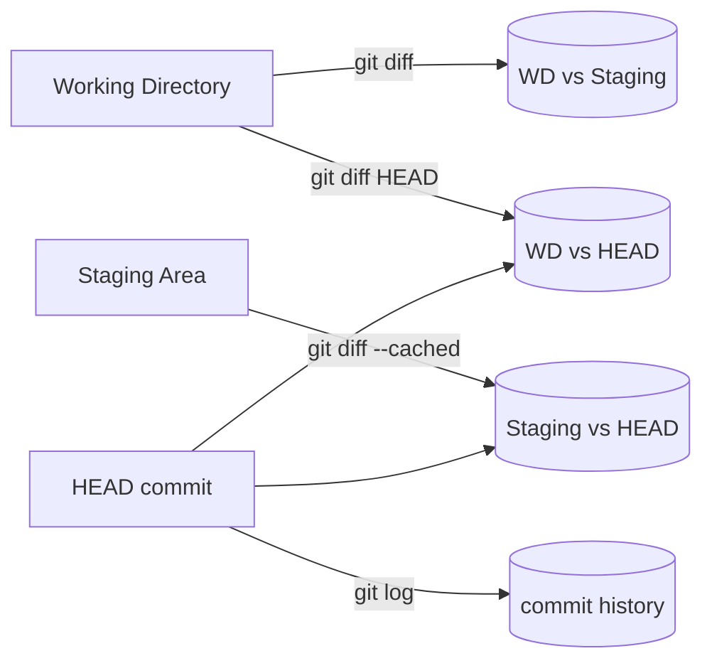

# 변경 사항 확인하기 - status, diff, log로 읽기

## 이 글에서 배울 것

- `git status`의 출력을 한 줄씩 정확히 읽는 방법
- `git status -s`로 짧은 형식을 빠르게 훑는 방법
- `git diff`, `git diff --cached`, `git diff HEAD`가 각각 어느 영역의 변경을 보여 주는지
- 두 commit 사이의 변경을 `git diff <a> <b>`로 비교하는 방법
- `git log`의 자주 쓰는 옵션(`--oneline`, `--graph`, `--stat`, `--patch`)을 한자리에서 익히는 방법

## 왜 중요한가

지난 글에서 첫 commit까지 한 사이클을 돌려 봤습니다. 이제부터는 "변경이 어디에 있는지"뿐 아니라 "변경의 내용이 정확히 무엇인지"를 읽을 수 있어야 협업이 시작됩니다.

세 명령은 역할이 다릅니다.

- `git status`: **어느 영역에** 변경이 있는지 보여 줍니다.
- `git diff`: 그 변경의 **내용**(어느 줄이 어떻게 바뀌었는지)을 보여 줍니다.
- `git log`: 이미 commit된 변경들의 **순서와 의도**를 보여 줍니다.

세 명령을 함께 쓰면 commit 직전에 "내가 만들 commit이 정확히 무엇인지"를 자기 점검할 수 있습니다. 이 습관이 좋은 commit message와 좋은 PR로 이어집니다.

## Mental Model

각 명령이 보는 영역을 그림으로 정리해 봅니다.



기억할 한 줄 규칙은 다음과 같습니다.

- `git diff`는 기본적으로 **아직 staging에 올라가지 않은 변경**(WD vs Staging)을 보여 줍니다.
- `--cached`(또는 동일한 의미의 `--staged`)를 붙이면 **이미 staging에 올라간 변경**(Staging vs HEAD)을 보여 줍니다.
- `HEAD`를 붙이면 두 영역을 합친 **commit과의 전체 차이**(WD vs HEAD)를 보여 줍니다.

## 핵심 개념

- **`git status` 긴 형식**: `On branch`, `Your branch is ...`, `Changes to be committed`, `Changes not staged for commit`, `Untracked files` 같은 섹션을 사람이 읽기 쉽게 풀어서 보여 줍니다.
- **`git status -s`(short)**: 두 문자 코드로 한 줄씩 요약합니다. 왼쪽 문자가 staging, 오른쪽 문자가 working directory의 상태입니다.
- **`git diff`**: 기본은 WD vs Staging. 한 줄씩 `+`(추가), `-`(삭제)로 표시합니다.
- **`git diff --cached`**: Staging vs HEAD. "지금 commit하면 들어갈 변경"입니다.
- **`git diff HEAD`**: WD vs HEAD. staging 여부와 무관하게 "마지막 commit과 비교한 전체 변경"입니다.
- **`git log`**: HEAD부터 거슬러 올라가며 commit을 출력합니다. 옵션으로 출력 모양과 정보량을 조절합니다.
- **`--oneline`**: commit당 한 줄(짧은 hash + 제목).
- **`--graph`**: 분기 모양을 ASCII 그래프로 함께 보여 줍니다(branch가 늘어나면 진가가 드러납니다).
- **`--stat`**: 어떤 파일이 몇 줄 바뀌었는지 요약합니다.
- **`-p`(또는 `--patch`)**: 각 commit의 실제 diff까지 함께 보여 줍니다.

## Before-After

같은 "방금 무엇이 바뀌었지?"라는 질문을 두 가지 도구로 답해 봅니다.

**Before (에디터의 Undo 히스토리)**

```text
- 방금 누른 Ctrl+Z 횟수만큼 거슬러 올라가야 함
- 다른 파일에서 무엇이 바뀌었는지는 보이지 않음
- 어제 작업한 변경은 이미 사라졌을 가능성
```

**After (Git의 status/diff/log)**

```text
$ git status -s
 M README.md
?? draft.md

$ git diff README.md
diff --git a/README.md b/README.md
index 6e85ca6..b7f5a1e 100644
--- a/README.md
+++ b/README.md
@@ -1,3 +1,4 @@
 # My First Repo

 Some notes.
+Author: me
```

- 어떤 파일이, 어느 영역에 있는지(`status -s`)
- 정확히 어느 줄이 추가됐는지(`diff`)
- 마지막 commit 이후 누적된 흐름(`log`)이 한자리에서 보입니다.

## 단계별 실습

지난 글에서 만든 `my-first-repo`를 그대로 사용합니다. `git log --oneline`으로 두 commit이 보이는 상태에서 시작합니다.

```text
$ git log --oneline
9b8c3e2 Add intro paragraph to notes
4f1a2c0 Initial commit
```

### 1. status를 두 가지 형식으로 읽기

먼저 README를 한 줄 수정하고 새 파일을 하나 만듭니다.

```text
$ echo "Author: me" >> README.md
$ echo "draft" > draft.md
```

긴 형식은 영역과 다음 명령을 함께 알려 줍니다.

```text
$ git status
On branch main
Changes not staged for commit:
  (use "git add <file>..." to update what will be committed)
  (use "git restore <file>..." to discard changes in working directory)
        modified:   README.md

Untracked files:
  (use "git add <file>..." to include in what will be committed)
        draft.md

no changes added to commit (use "git add" and/or "git commit -a")
```

같은 상황을 짧은 형식으로 보면 한 화면에 들어옵니다.

```text
$ git status -s
 M README.md
?? draft.md
```

두 문자 코드를 읽는 법은 다음과 같습니다.

- 왼쪽 문자: **staging** 상태(`M`=modified, `A`=added, `D`=deleted, 공백=변화 없음)
- 오른쪽 문자: **working directory** 상태(같은 글자, `?`는 untracked)
- `??`는 양쪽 모두 모르는 상태, 즉 새 파일입니다.

### 2. `git diff`로 staging되지 않은 변경 보기

`README.md`만 staging 없이 수정한 상태입니다.

```text
$ git diff
diff --git a/README.md b/README.md
index 6e85ca6..b7f5a1e 100644
--- a/README.md
+++ b/README.md
@@ -1,3 +1,4 @@
 # My First Repo

 Some notes.
+Author: me
```

읽는 순서는 위에서부터입니다.

- `diff --git a/README.md b/README.md`: 비교 대상 파일.
- `index 6e85ca6..b7f5a1e 100644`: blob hash 변화와 파일 권한.
- `--- a/...` / `+++ b/...`: 비교 양쪽의 별명. `a`가 staging(또는 HEAD), `b`가 working directory.
- `@@ -1,3 +1,4 @@`: hunk 헤더. "원본의 1번째 줄부터 3줄, 새 버전의 1번째 줄부터 4줄"을 의미합니다.
- `+`로 시작하는 줄이 새로 들어온 줄, `-`가 사라진 줄, 공백으로 시작하는 줄은 문맥(context)입니다.

### 3. `git diff --cached`로 staging된 변경 보기

`git add`로 README를 올린 뒤 같은 명령을 비교합니다.

```text
$ git add README.md
$ git diff
$ git diff --cached
diff --git a/README.md b/README.md
index 6e85ca6..b7f5a1e 100644
--- a/README.md
+++ b/README.md
@@ -1,3 +1,4 @@
 # My First Repo

 Some notes.
+Author: me
```

`git diff` 출력은 비어 있습니다(이미 staging에 올라갔기 때문). `--cached`를 붙이면 "지금 commit하면 들어갈 내용"이 보입니다. commit 직전에 한 번 실행해 보는 습관이 안전합니다.

이 시점의 `git status` 긴 형식도 함께 봐 두면 staging 영역의 안내 문구가 눈에 들어옵니다.

```text
$ git status
On branch main
Changes to be committed:
  (use "git restore --staged <file>..." to unstage)
        modified:   README.md

Untracked files:
  (use "git add <file>..." to include in what will be committed)
        draft.md

```

`Changes to be committed:` 아래의 `(use "git restore --staged <file>..." to unstage)`는 "이 변경을 다시 working directory 쪽으로 돌려놓고 싶다면 어떤 명령을 쓰는지"까지 알려 주는 안내입니다.

### 4. `git diff HEAD`로 두 영역을 합쳐 보기

`draft.md`는 아직 untracked, README는 이미 staging됐다고 합시다. 이 상태에서 `git diff HEAD`는 두 영역을 합쳐 "마지막 commit과의 전체 차이"를 보여 줍니다.

```text
$ git diff HEAD
diff --git a/README.md b/README.md
index 6e85ca6..b7f5a1e 100644
--- a/README.md
+++ b/README.md
@@ -1,3 +1,4 @@
 # My First Repo

 Some notes.
+Author: me
```

`draft.md`는 `git diff HEAD`에 잡히지 않습니다. `git diff`가 보여 주는 것은 **추적 중인 파일의 변경**이기 때문입니다. untracked 파일을 함께 보고 싶다면 `git status`나 `git add -N draft.md`(intent-to-add)를 거쳐야 합니다.

### 5. 두 commit 사이의 변경을 비교하기

특정 두 commit의 차이를 보려면 hash를 인자로 줍니다.

```text
$ git diff 4f1a2c0 9b8c3e2
diff --git a/README.md b/README.md
index a1b2c3d..6e85ca6 100644
--- a/README.md
+++ b/README.md
@@ -1 +1,3 @@
 # My First Repo
+
+Some notes.
```

순서는 "옛것 → 새것"입니다. 순서를 바꾸면 `+`와 `-`가 뒤집혀 보입니다. 하나의 commit이 바꾼 내용만 보고 싶다면 `git show <hash>`가 더 짧습니다.

### 6. `git log`를 모양 좋게 출력하기

먼저 staging된 README를 commit한 뒤 결과를 다양한 형식으로 살펴봅니다.

```text
$ git commit -m "Add author line to README"
[main e7d2c1a] Add author line to README
 1 file changed, 1 insertion(+)
```

이제 `git log`를 다양한 옵션으로 비교합니다.

```text
$ git log --oneline
e7d2c1a Add author line to README
9b8c3e2 Add intro paragraph to notes
4f1a2c0 Initial commit
```

```text
$ git log --oneline --graph
* e7d2c1a Add author line to README
* 9b8c3e2 Add intro paragraph to notes
* 4f1a2c0 Initial commit
```

지금은 분기가 없어서 그래프가 직선이지만, branch가 합쳐지기 시작하면 갈래 모양이 한눈에 들어옵니다.

```text
$ git log --stat
commit e7d2c1a4b9f0c5d2e1a8b7c6d5e4f3a2b1c0d9e8
Author: Me <me@example.com>
Date:   Mon May 4 10:30:00 2026 +0900

    Add author line to README

 README.md | 1 +
 1 file changed, 1 insertion(+)
```

`--stat`은 어떤 파일이 몇 줄 바뀌었는지 요약합니다. PR 설명을 쓸 때 자주 참고합니다.

```text
$ git log -p -1
commit e7d2c1a4b9f0c5d2e1a8b7c6d5e4f3a2b1c0d9e8
Author: Me <me@example.com>
Date:   Mon May 4 10:30:00 2026 +0900

    Add author line to README

diff --git a/README.md b/README.md
index 6e85ca6..b7f5a1e 100644
--- a/README.md
+++ b/README.md
@@ -1,3 +1,4 @@
 # My First Repo

 Some notes.
+Author: me
```

`-p`(혹은 `--patch`)는 각 commit의 diff까지 펼쳐 줍니다. `-1`은 가장 최근 한 개만 보여 달라는 뜻입니다.

## 자주 하는 실수

- **`git diff`가 비어 있다고 변경이 없다고 착각하기** — 이미 `git add`된 변경은 `git diff`에 안 잡힙니다. `git diff --cached`나 `git diff HEAD`로 확인합니다.
- **`git diff <a> <b>`의 인자 순서를 헷갈리기** — `<a>`가 옛것, `<b>`가 새것입니다. 순서를 바꾸면 `+/-`가 뒤집혀 보입니다.
- **`git log`만 보고 변경 내용을 짐작하기** — 제목이 두루뭉술하면 `--stat`이나 `-p`로 확인하는 편이 안전합니다.
- **`git status -s`의 두 문자를 한 글자로 읽기** — 왼쪽이 staging, 오른쪽이 working directory입니다. `MM`은 "staging된 변경 위에 또 수정"이라는 다른 상태입니다.
- **untracked 파일이 `git diff`에 안 보인다고 사라졌다고 생각** — `git status`나 `git add -N`을 함께 사용하면 보입니다.
- **`git log` 결과를 화살표 키로 빠져나오지 못함** — pager(`less`)가 열린 상태입니다. `q`를 누르면 종료됩니다.

## 실무

- **commit 직전 자가 점검**: `git status -s`로 영역을 보고, `git diff --cached`로 들어갈 내용을 한 번 더 읽습니다. 의도하지 않은 줄이 섞여 있으면 `git restore --staged <file>`로 빼냅니다.
- **PR 설명 초안 쓰기**: `git log --oneline origin/main..HEAD`로 PR에 들어갈 commit 목록을 한눈에 보고, `git log -p origin/main..HEAD`로 변경 내용을 검토합니다.
- **버그 추적**: 어느 commit에서 문제가 생겼는지 의심될 때 `git log -p <file>`로 파일 변경사를 따라가거나, 더 본격적으로는 `git bisect`를 사용합니다(시리즈 후반에 다룹니다).
- **alias로 손에 익히기**: `git config --global alias.lg "log --oneline --graph --decorate"` 같은 alias를 한두 개 등록하면 손가락이 기억합니다.
- **출력 색**: 대부분의 환경에서 기본으로 색이 켜져 있지만, 꺼져 있다면 `git config --global color.ui auto`로 켭니다.

## 체크리스트

- [ ] `git status` 긴 형식과 `-s` 짧은 형식의 출력을 둘 다 읽어 봤습니다.
- [ ] `git diff`, `git diff --cached`, `git diff HEAD`가 각각 어느 영역을 보여 주는지 한 문장씩 설명할 수 있습니다.
- [ ] hunk 헤더 `@@ -1,3 +1,4 @@`이 무엇을 뜻하는지 설명할 수 있습니다.
- [ ] `git log --oneline`, `--graph`, `--stat`, `-p`의 차이를 직접 출력으로 확인했습니다.
- [ ] `git diff <a> <b>`에서 인자 순서가 어떤 의미인지 설명할 수 있습니다.
- [ ] pager에서 `q`로 빠져나올 수 있다는 것을 손가락으로 기억하고 있습니다.

## 연습 문제

1. `README.md`의 한 줄을 수정하고 `git diff`와 `git diff --cached`의 출력을 각각 캡처해 비교해 보세요.
2. `git add`로 staging한 뒤 `git diff`가 비어 있다는 사실을 직접 확인하고, `git diff HEAD`로는 여전히 보인다는 것도 확인하세요.
3. 첫 commit과 두 번째 commit의 차이를 `git diff 4f1a2c0 9b8c3e2`(직접 만든 hash로 대체)로 출력해 보고, 같은 정보를 `git show 9b8c3e2`로도 확인해 보세요.
4. `git log --oneline --graph --stat`을 한 번에 실행해 보고, 각 옵션이 어떤 줄을 담당하는지 한 줄씩 적어 보세요.
5. 아무 파일이나 새로 만들고 `git status -s`의 `??` 표시를 본 다음, `git add` 후 표시가 어떻게 바뀌는지 비교해 보세요.

## 정리·다음 글

- `git status`는 어느 영역에 변경이 있는지, `git diff`는 그 내용이 무엇인지, `git log`는 이미 저장된 history가 어떤 모양인지 알려 줍니다.
- `git diff`는 기본이 WD vs Staging이고, `--cached`는 Staging vs HEAD, `HEAD`를 붙이면 두 영역을 합친 비교입니다.
- `git log`는 옵션 조합으로 같은 history를 다양한 깊이로 보여 줍니다. `--oneline --graph`는 빠른 훑어보기, `--stat`과 `-p`는 정밀 검토에 좋습니다.
- commit 직전에 `status -s` → `diff --cached` 순으로 한 번씩 보는 습관이 가장 큰 시간 절약입니다.

다음 글에서는 branch를 만들고, 다른 작업과 분기해서 진행하는 방법을 다룹니다. 같은 폴더에서 두 가지 작업을 안전하게 분리해 두는 방법입니다.

<!-- toc:begin -->
## Series TOC

- [What is Git? - 분산 버전 관리의 기초](./01-what-is-git.md)
- [첫 commit 만들기 - init, status, add, commit](./02-first-commit.md)
- **변경 사항 확인하기 - status, diff, log로 읽기 (현재 글)**
- [branch 기초 - 만들고 옮기고 비교하기](./04-branch-basics.md)
- [merge와 conflict 해결하기 - 두 줄기를 다시 합치기](./05-merge-and-conflict.md)
- GitHub 저장소와 remote 연결 (예정)
- Pull Request로 협업하기 (예정)
- Issue와 Project로 일감 관리 (예정)
- 좋은 commit message 쓰기 (예정)
- 실무 워크플로 한눈에 보기 (예정)
<!-- toc:end -->

## 참고 자료

- Git 공식 문서: <https://git-scm.com/doc>
- Pro Git Book - "Viewing the Commit History": <https://git-scm.com/book/en/v2/Git-Basics-Viewing-the-Commit-History>
- `git help status`, `git help diff`, `git help log`

Tags: git-status, git-diff, git-log, change-history, working-tree-vs-index, log-formatting
