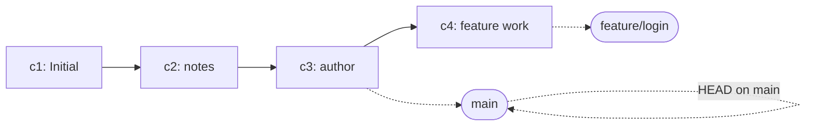

# branch 기초 - 만들고 옮기고 비교하기

## 이 글에서 배울 것

- branch가 무엇이고 왜 필요한지(파일 복사가 아닙니다)
- `git branch`로 branch 목록을 보고 새로 만드는 방법
- `git switch`로 다른 branch로 옮기는 방법(`git checkout`과의 관계)
- `HEAD`가 branch와 어떻게 함께 움직이는지
- 두 branch의 차이를 `git log`와 `git diff`로 비교하는 방법

## 왜 중요한가

작업이 하나가 아닐 때부터 Git의 진짜 가치가 나옵니다. 같은 폴더에서 "로그인 기능"과 "버그 수정"을 동시에 진행해야 한다면 zip 백업이나 폴더 복사로는 금세 한계가 옵니다.

branch는 같은 저장소 안에 **여러 작업 줄기**를 두는 방법입니다. 각 줄기는 독립적으로 commit이 쌓이고, 필요할 때 합칠 수 있습니다.

- 실험적인 변경을 main에 영향 없이 시도해 볼 수 있습니다.
- 리뷰가 끝날 때까지 기능 작업을 따로 보관할 수 있습니다.
- 협업에서는 사람마다 자기 branch에서 작업하다가 PR로 합칩니다.

이 글에서는 합치기(merge) 전 단계, 즉 branch를 **만들고 옮기고 비교하는 데까지**만 다룹니다. merge와 conflict는 다음 글에서 이어집니다.

## Mental Model

branch는 commit을 가리키는 **포인터**입니다. 새 commit이 만들어지면 현재 branch 포인터가 한 칸 앞으로 이동합니다.



핵심 두 가지를 함께 기억합니다.

- **branch 자체는 무겁지 않습니다.** commit을 가리키는 41바이트 정도의 파일(`.git/refs/heads/<name>`)일 뿐입니다.
- **`HEAD`는 "지금 어느 branch에 있는가"를 가리키는 두 번째 포인터입니다.** branch를 옮기면 `HEAD`도 함께 옮겨집니다.

이 그림을 한 번 머릿속에 넣어 두면, "branch를 만들었는데 디스크가 안 늘었다", "switch했더니 파일들이 바뀌었다" 같은 현상이 자연스럽게 설명됩니다.

## 핵심 개념

- **branch**: 특정 commit을 가리키는 이동 가능한 포인터. 새 commit이 만들어지면 그 commit으로 한 칸 이동합니다.
- **`main`**: 관습적으로 기본 branch. 예전에는 `master`라는 이름을 더 많이 썼습니다.
- **`HEAD`**: "지금 작업 중인 branch"를 가리키는 특별한 포인터. 보통은 branch 이름을 가리키고, 그 branch가 가리키는 commit이 곧 현재 commit입니다.
- **`git branch`**: branch 목록을 보거나 새 branch를 만드는 명령. 인자가 없으면 목록을, 이름을 주면 그 이름으로 새 branch를 만듭니다.
- **`git switch`**: 다른 branch로 옮기는 최신 명령(Git 2.23부터). `-c`로 만들면서 옮길 수도 있습니다.
- **`git checkout`**: 옛 명령. branch 전환과 파일 복원을 한 명령에 묶어 두어 헷갈렸기 때문에, Git 2.23부터 `switch`(branch 이동)와 `restore`(파일 복원)로 분리됐습니다. 둘 다 여전히 동작합니다.
- **fast-forward 가능 여부**: 두 branch가 같은 줄기 위에 있으면 단순히 포인터를 앞으로 옮기는 것만으로 합칠 수 있습니다. 갈라져 있으면 merge commit이 필요합니다(다음 글 주제).

## Before-After

같은 "두 가지 작업을 동시에"를 두 가지 방식으로 비교해 봅니다.

**Before (폴더 복사)**

```text
$ cp -r project project-feature-login
$ cp -r project project-bugfix
```

- 폴더가 통째로 복제되어 디스크가 부풀어 오릅니다.
- 어느 폴더가 최신인지, 어느 변경이 어디에 있는지 사람이 기억해야 합니다.
- 한쪽 변경을 다른 쪽으로 옮길 표준 방법이 없습니다.

**After (Git branch)**

```text
$ git branch
* main

$ git switch -c feature/login
Switched to a new branch 'feature/login'

$ git branch
* feature/login
  main
```

- 같은 폴더에서 두 줄기를 오갑니다. 디스크는 `.git/refs/heads/`의 작은 파일이 늘어날 뿐입니다.
- 어느 branch에 있는지는 `*` 표시로 보입니다.
- 변경을 합치는 표준 방법(merge, rebase)이 준비돼 있습니다.

## 단계별 실습

지난 글에서 만든 `my-first-repo`를 그대로 사용합니다. `git log --oneline`이 세 commit을 보여 주는 상태에서 시작합니다.

```text
$ git log --oneline
e7d2c1a Add author line to README
9b8c3e2 Add intro paragraph to notes
4f1a2c0 Initial commit
```

### 1. 현재 branch 확인

```text
$ git branch
* main
```

`*` 표시가 현재 branch입니다. `main` 하나만 있는 상태입니다.

`git status`의 첫 줄에서도 같은 정보를 볼 수 있습니다.

```text
$ git status
On branch main
nothing to commit, working tree clean
```

### 2. 새 branch 만들기

이름을 주면 `main`이 가리키는 commit과 같은 곳을 가리키는 새 branch가 생깁니다.

```text
$ git branch feature/login
$ git branch
  feature/login
* main
```

`*`는 아직 `main`에 있습니다. branch를 **만든다고 해서 자동으로 옮겨가지는 않습니다.**

### 3. branch 옮기기

`git switch`로 옮깁니다.

```text
$ git switch feature/login
Switched to branch 'feature/login'
$ git branch
* feature/login
  main
```

만들기와 옮기기를 한 번에 하려면 `-c`를 씁니다.

```text
$ git switch -c feature/signup
Switched to a new branch 'feature/signup'
```

옛 명령으로는 다음과 같습니다(둘 다 동작합니다).

```text
$ git checkout feature/login           # 이동
$ git checkout -b feature/signup       # 만들면서 이동
```

### 4. branch별 commit 만들기

`feature/login`에서 새 파일을 하나 commit해 봅니다.

```text
$ git switch feature/login
$ echo "login form" > login.md
$ git add login.md
$ git commit -m "Add login form draft"
[feature/login a2b3c4d] Add login form draft
 1 file changed, 1 insertion(+)
 create mode 100644 login.md
```

이제 `git log --oneline`은 네 commit을 보여 줍니다.

```text
$ git log --oneline
a2b3c4d Add login form draft
e7d2c1a Add author line to README
9b8c3e2 Add intro paragraph to notes
4f1a2c0 Initial commit
```

`main`으로 돌아가 보면 새 파일이 사라집니다(정확히는 main에는 그 파일이 없습니다).

```text
$ git switch main
Switched to branch 'main'
$ ls
README.md  notes.md
$ git log --oneline
e7d2c1a Add author line to README
9b8c3e2 Add intro paragraph to notes
4f1a2c0 Initial commit
```

`login.md`가 사라진 것이 아니라, **`main` branch에는 그 commit 자체가 없는 상태**입니다. 다시 `feature/login`으로 가면 파일이 돌아옵니다.

### 5. 두 branch 비교

`feature/login`이 `main`보다 어떤 commit을 더 가졌는지 봅니다.

```text
$ git log --oneline main..feature/login
a2b3c4d Add login form draft
```

`A..B`는 "B에는 있지만 A에는 없는 commit"을 의미합니다. 양방향으로 비교하려면 `...`을 씁니다.

```text
$ git log --oneline --graph --decorate --all
* a2b3c4d (feature/login) Add login form draft
* e7d2c1a (HEAD -> main, feature/signup) Add author line to README
* 9b8c3e2 Add intro paragraph to notes
* 4f1a2c0 Initial commit
```

`--all`은 다른 branch에 있는 commit까지 묶어서, `--graph`는 갈래 모양을, `--decorate`는 `(HEAD -> main, feature/signup)`이나 `(feature/login)` 같은 branch 이름 라벨을 함께 보여 줍니다.

파일 단위 차이는 `git diff`로 봅니다.

```text
$ git diff main feature/login
diff --git a/login.md b/login.md
new file mode 100644
index 0000000..2c4e0d2
--- /dev/null
+++ b/login.md
@@ -0,0 +1 @@
+login form
```

`/dev/null`이 `a/` 자리에 오는 것은 "main에는 이 파일이 없었다"는 뜻입니다.

### 6. branch 이름 바꾸기와 삭제

step 3에서 만들어 둔 `feature/signup`은 아직 commit을 하나도 더하지 않아 main과 같은 자리에 있습니다. 여기에 작은 commit을 하나 얹어 둔 다음, 이름을 바꾸고, 삭제까지 따라가 봅니다.

```text
$ git switch feature/signup
Switched to branch 'feature/signup'
$ echo "signup form" > signup.md
$ git add signup.md
$ git commit -m "Add signup form draft"
[feature/signup f1e2d3c] Add signup form draft
 1 file changed, 1 insertion(+)
 create mode 100644 signup.md
$ git switch main
Switched to branch 'main'
```

이름을 바꿉니다.

```text
$ git branch -m feature/signup feature/sign-up
```

이미 합쳤거나 더 이상 필요 없는 branch는 삭제합니다. 아직 합치지 않았다면 Git이 안전을 위해 한 번 거부합니다.

```text
$ git branch -d feature/sign-up
error: The branch 'feature/sign-up' is not fully merged.
If you are sure you want to delete it, run 'git branch -D feature/sign-up'.
```

정말 버려도 되는 작업이면 대문자 `-D`로 강제 삭제합니다. 실수가 잦은 옵션이므로 한 번 더 생각하고 누릅니다.

```text
$ git branch -D feature/sign-up
Deleted branch feature/sign-up (was f1e2d3c).
```

## 자주 하는 실수

- **`git branch <name>`만 하고 옮긴 줄 알기** — branch가 만들어지지만 `HEAD`는 그대로입니다. 이어서 `git switch <name>`을 실행해야 옮겨집니다(또는 처음부터 `git switch -c <name>`).
- **수정 중에 다른 branch로 switch** — 변경이 충돌하지 않으면 그대로 따라옵니다. 충돌하면 Git이 거부합니다. 옮기기 전에 `git status`로 영역을 한 번 확인하는 편이 안전합니다.
- **`git checkout <branch>`와 `git checkout -- <file>`을 헷갈림** — 옛 `checkout`은 두 가지 일을 했습니다. 새 환경에서는 branch는 `switch`, 파일 복원은 `restore`로 나누면 헷갈림이 줄어듭니다.
- **branch 이름에 공백·한글·대문자 혼용** — 협업에서 문제 소지가 있습니다. 보통 소문자 + `-` 또는 `/`로 짓습니다(예: `feature/login`, `bugfix/null-check`).
- **합치지도 않은 branch를 `-D`로 삭제** — 그 branch에서만 한 commit은 다른 곳에서 참조하지 않으면 회수가 어렵습니다. 가능하면 `-d`(소문자)로 시도하고, 거부 메시지를 본 뒤에 결정합니다.
- **`HEAD`를 commit hash에 직접 붙이고 잊어버림(detached HEAD)** — `git checkout <hash>`나 `git switch --detach <hash>`로 commit을 직접 가리키면 어느 branch에도 속하지 않은 상태가 됩니다. 잠깐 살펴볼 때만 쓰고, 변경을 남기려면 `git switch -c <name>`으로 새 branch를 만듭니다.

## 실무

- **기능 단위로 branch를 만든다**: `feature/<요약>`, `bugfix/<요약>` 같은 접두사를 약속해 두면 한눈에 의도가 보입니다.
- **수명이 짧을수록 좋다**: branch가 오래 살수록 main과 멀어져 합칠 때 충돌이 커집니다. 기능 단위로 작게 잘라 하루나 며칠 내로 닫는 흐름이 안전합니다.
- **switch 전에 status를 본다**: 다른 branch로 옮기기 전에 `git status -s`를 한 번 봐서 staging/working에 떠 있는 변경을 확인합니다. 임시로 다른 곳을 다녀와야 하면 `git stash`(다음 시리즈에서 다룹니다)를 활용합니다.
- **`git log --graph --all`을 alias로**: `git config --global alias.lga "log --oneline --graph --decorate --all"`처럼 짧게 만들어 두면 branch 모양을 자주 들여다봅니다.
- **이름은 자주 다듬는다**: 처음 만든 이름이 어색하면 `git branch -m`으로 가볍게 바꿉니다. 이름이 좋으면 PR 제목과 commit 흐름이 같이 정돈됩니다.

## 체크리스트

- [ ] `git branch`로 현재 branch 목록과 `*` 표시를 확인했습니다.
- [ ] `git switch -c`로 새 branch를 만들면서 옮기는 흐름을 손으로 따라갔습니다.
- [ ] 두 branch에서 각각 다른 commit을 만들고 `git log --oneline --graph --decorate --all`로 모양을 봤습니다.
- [ ] `main..feature/login` 표기가 무엇을 뜻하는지 한 문장으로 설명할 수 있습니다.
- [ ] `git switch`와 `git checkout`이 어떻게 다르고 왜 분리됐는지 한 문장으로 설명할 수 있습니다.
- [ ] `-d`와 `-D`의 차이를 알고, 어느 쪽을 먼저 시도해야 하는지 안내할 수 있습니다.

## 연습 문제

1. `feature/notes`라는 branch를 `git branch`로만 만들고, `git status`와 `git branch`로 자신이 여전히 `main`에 있다는 것을 확인하세요.
2. `git switch -c feature/notes-2`로 만들면서 옮긴 뒤, `notes.md` 파일을 만들어 commit하세요. 그런 다음 `main`으로 돌아가 파일이 보이지 않는 것을 확인합니다.
3. `git log --oneline --graph --decorate --all`로 두 branch가 같은 commit에서 갈라진 모습을 캡처하세요.
4. `git diff main feature/notes-2`로 두 branch의 파일 차이를 출력하고, `/dev/null`이 어느 쪽에 등장하는지 한 줄로 설명해 보세요.
5. `git branch -d feature/notes-2`를 시도해 거부 메시지를 본 뒤, `git branch -D feature/notes-2`로 강제 삭제하면 어떤 메시지가 나오는지 적어 보세요.

## 정리·다음 글

- branch는 commit을 가리키는 가벼운 포인터이고, `HEAD`는 "지금 어느 branch에 있는가"를 가리키는 두 번째 포인터입니다.
- `git branch <name>`은 만들기만, `git switch <name>`은 옮기기만, `git switch -c <name>`은 둘을 한 번에 합니다.
- 두 branch의 차이는 `git log A..B`로 commit 목록을, `git diff A B`로 파일 내용을 봅니다.
- `git log --oneline --graph --decorate --all`은 갈래 모양과 branch 라벨을 한눈에 보여 주는 가장 자주 쓰는 조합입니다.

다음 글에서는 갈라진 두 branch를 다시 합치는 `git merge`를 다루고, 자주 마주치는 conflict를 손으로 풀어 봅니다.

<!-- toc:begin -->
## Series TOC

- [What is Git? - 분산 버전 관리의 기초](./01-what-is-git.md)
- [첫 commit 만들기 - init, status, add, commit](./02-first-commit.md)
- [변경 사항 확인하기 - status, diff, log로 읽기](./03-status-diff-log.md)
- **branch 기초 - 만들고 옮기고 비교하기 (현재 글)**
- merge와 conflict 해결하기 (예정)
- GitHub 저장소와 remote 연결 (예정)
- Pull Request로 협업하기 (예정)
- Issue와 Project로 일감 관리 (예정)
- 좋은 commit message 쓰기 (예정)
- 실무 워크플로 한눈에 보기 (예정)
<!-- toc:end -->

## 참고 자료

- Git 공식 문서: <https://git-scm.com/doc>
- Pro Git Book - "Branches in a Nutshell": <https://git-scm.com/book/en/v2/Git-Branching-Branches-in-a-Nutshell>
- `git help branch`, `git help switch`, `git help checkout`

Tags: git-branch, git-switch, git-checkout, HEAD, parallel-development, feature-branch
