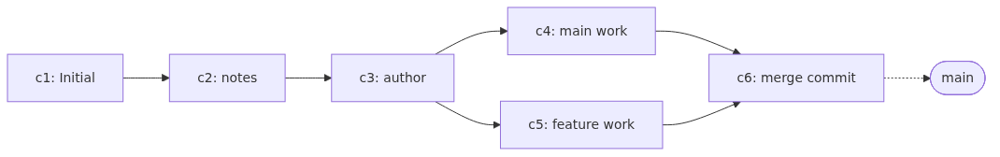

# merge와 conflict 해결하기 - 두 줄기를 다시 합치기

## 이 글에서 배울 것

- `git merge`가 정확히 어떤 일을 하는지(fast-forward와 three-way의 차이)
- merge commit이 왜 부모를 두 개 가지는지
- conflict marker(`<<<<<<<`, `=======`, `>>>>>>>`)를 읽고 푸는 방법
- conflict 도중에 `git status`가 무엇을 알려 주는지
- `git merge --abort`로 안전하게 되돌리는 방법

## 이 글에서 답할 질문

- fast-forward merge와 three-way merge는 각각 어떤 상황에서 일어나는가?
- merge commit이 부모를 두 개 가지는 이유는 무엇인가?
- `<<<<<<<`, `=======`, `>>>>>>>` conflict marker는 어느 쪽이 어느 branch의 내용인가?
- conflict 도중 `git status`는 평소와 다르게 어떤 정보를 알려 주는가?
- `git merge --abort`는 어느 시점까지의 작업을 안전하게 되돌려 주는가?

## 왜 중요한가

이전 글까지 우리는 branch를 만들고 옮겨 가며 작업을 분리했습니다. 그런데 작업이 끝나면 결국 **다시 합쳐야** 합니다. PR을 머지할 때, 동료 변경을 내 branch로 가져올 때, 장시간 작업한 기능을 main으로 올릴 때 모두 merge가 일어납니다.

merge가 익숙해지지 않으면 두 가지 함정에 빠지기 쉽습니다.

- 첫째, "merge commit이 왜 또 생기지?"라는 의문에 답하지 못한 채 history가 지저분해집니다.
- 둘째, conflict가 발생했을 때 무엇을 어떻게 고쳐야 할지 몰라 commit을 강제로 되돌리거나 폴더를 통째로 백업해 두고 다시 시작합니다.

이 글의 목표는 두 가지를 분명히 하는 것입니다. 어떤 상황에서 어떤 종류의 merge가 일어나는지 그림으로 이해하고, conflict가 났을 때 침착하게 풀거나 안전하게 취소할 수 있는 손 감각을 만드는 것입니다.

## Mental Model

merge는 "두 commit을 하나로 합치는 새 commit"을 만드는 작업입니다. 두 commit이 같은 줄기 위에 있으면 새 commit 없이 포인터만 옮기면 끝납니다(fast-forward). 갈라진 줄기 위에 있으면 두 부모를 가지는 새 merge commit이 생깁니다(three-way).


핵심은 다음 세 가지입니다.

- **fast-forward**: 합칠 대상 branch가 현재 branch의 직계 후손이면, Git은 새 commit을 만들지 않고 포인터만 앞으로 옮깁니다.
- **three-way merge**: 두 branch가 공통 조상에서 갈라져 각자 commit이 쌓였으면, Git은 공통 조상과 양쪽의 최신 commit, 이렇게 세 지점을 비교해 새 merge commit을 만듭니다. 이 commit은 부모를 두 개 가집니다.
- **conflict**: 같은 파일의 같은 줄을 양쪽에서 다르게 바꾸면 Git은 자동으로 정할 수 없으니 사람이 결정해 달라며 conflict marker를 남깁니다.

## 핵심 개념

- **`git merge <branch>`**: 현재 branch에 `<branch>`의 변경을 합칩니다. fast-forward가 가능하면 그렇게 하고, 아니면 three-way merge commit을 만듭니다.
- **fast-forward**: 새 commit 없이 branch 포인터만 앞으로 이동. history가 한 줄로 깔끔하지만, 어떤 commit이 어느 기능에 속했는지가 흐려질 수 있습니다.
- **`--no-ff`**: fast-forward가 가능하더라도 일부러 merge commit을 만들도록 강제합니다. PR 단위 흐름을 history에 남기고 싶을 때 자주 씁니다.
- **three-way merge**: 공통 조상(merge base)과 양쪽 끝 commit을 비교해 변경을 합칩니다. 기본 전략은 `ort`입니다.
- **conflict**: 같은 위치의 변경이 충돌해 자동으로 합칠 수 없을 때 발생. Git은 충돌 영역에 marker를 끼워 넣고 멈춥니다.
- **conflict marker**: `<<<<<<< HEAD` ... `=======` ... `>>>>>>> <branch>` 블록. `HEAD` 쪽이 현재 branch, `>>>>>>>` 쪽이 합치려던 branch의 내용입니다.
- **`git merge --abort`**: 진행 중인 merge를 취소하고 merge 시작 전 상태로 되돌립니다. 풀기가 어려워 보이면 일단 abort하고 다시 접근하는 편이 안전합니다.

## Before-After

같은 "기능 branch를 main으로 합치기"를 두 가지 방식으로 비교합니다.

**Before (수동 복사)**

```text
$ cp feature/login.md main/login.md
$ # 같은 파일이 두 곳에 다르게 있으면 어느 쪽이 정답인지 사람이 기억해야 함
```

- 무엇이 합쳐졌는지 history에 남지 않습니다.
- 같은 파일을 양쪽에서 동시에 고쳤을 때 알 길이 없습니다.
- 되돌릴 표준 방법이 없습니다.

**After (`git merge`)**

```text
$ git switch main
$ git merge feature/login
Updating e7d2c1a..a2b3c4d
Fast-forward
 login.md | 1 +
 1 file changed, 1 insertion(+)
 create mode 100644 login.md
```

- 합친 결과가 commit으로 history에 남습니다(fast-forward이면 포인터 이동, three-way이면 merge commit).
- 충돌이 있으면 Git이 멈추고 marker로 알려 줍니다.
- `git merge --abort`로 깔끔하게 되돌릴 수 있습니다.

## 단계별 실습

이전 글에서 이어서, `my-first-repo`를 그대로 사용합니다. 시작 상태는 다음과 같습니다.

- `main` → `e7d2c1a` (Add author line to README)
- `feature/login` → `a2b3c4d` (Add login form draft)
- 파일: `README.md`, `notes.md`(main), `README.md`, `notes.md`, `login.md`(feature/login)

### 1. 현재 상태 확인

```text
$ git switch main
Switched to branch 'main'
$ git log --oneline --graph --decorate --all
* a2b3c4d (feature/login) Add login form draft
* e7d2c1a (HEAD -> main) Add author line to README
* 9b8c3e2 Add intro paragraph to notes
* 4f1a2c0 Initial commit
```

`feature/login`이 `main`보다 commit 하나 앞서 있는, 한 줄로 이어진 모양입니다. 이 상태에서 main으로 합치면 fast-forward가 일어납니다.

### 2. fast-forward merge

```text
$ git merge feature/login
Updating e7d2c1a..a2b3c4d
Fast-forward
 login.md | 1 +
 1 file changed, 1 insertion(+)
 create mode 100644 login.md
```

`Updating <old>..<new>`와 `Fast-forward`가 핵심 단서입니다. **새 merge commit은 만들어지지 않았고**, `main` 포인터만 `a2b3c4d`로 한 칸 앞으로 옮겨졌습니다.

```text
$ git log --oneline --graph --decorate --all
* a2b3c4d (HEAD -> main, feature/login) Add login form draft
* e7d2c1a Add author line to README
* 9b8c3e2 Add intro paragraph to notes
* 4f1a2c0 Initial commit
```

이제 두 branch가 같은 commit을 가리킵니다. 합쳤으니 `feature/login`은 안전하게 지울 수 있습니다.

```text
$ git branch -d feature/login
Deleted branch feature/login (was a2b3c4d).
```

> PR 단위 흐름을 history에 남기고 싶다면 `git merge --no-ff feature/login`처럼 `--no-ff`를 붙여 일부러 merge commit을 만들 수 있습니다. 다음 단계에서 자연스럽게 merge commit을 보게 됩니다.

### 3. 분기 만들기

이제 일부러 갈라진 history를 만듭니다. 새 branch에서 commit을 하나 만들고, main에서도 다른 commit을 하나 만듭니다.

```text
$ git switch -c feature/header
Switched to a new branch 'feature/header'
$ echo "# My Project" > header.md
$ git add header.md
$ git commit -m "Add project header"
[feature/header d4e5f6a] Add project header
 1 file changed, 1 insertion(+)
 create mode 100644 header.md
```

main으로 돌아가 별개의 commit을 추가합니다.

```text
$ git switch main
Switched to branch 'main'
$ echo "Released on 2026-05-04." >> notes.md
$ git add notes.md
$ git commit -m "Append release note"
[main c1a8e9f] Append release note
 1 file changed, 1 insertion(+)
```

이 시점에서 두 branch는 `a2b3c4d`라는 공통 조상에서 갈라져 각자 한 commit씩 가집니다.

```text
$ git log --oneline --graph --decorate --all
* c1a8e9f (HEAD -> main) Append release note
| * d4e5f6a (feature/header) Add project header
|/
* a2b3c4d Add login form draft
* e7d2c1a Add author line to README
* 9b8c3e2 Add intro paragraph to notes
* 4f1a2c0 Initial commit
```

`|/` 모양이 갈라졌다 다시 모이는 지점을 표시합니다.

### 4. three-way merge (충돌 없는 경우)

main에서 `feature/header`를 합칩니다. 두 branch가 다른 파일을 건드렸으므로 충돌은 없지만, 갈라져 있으므로 fast-forward는 불가능합니다.

```text
$ git merge feature/header
Merge made by the 'ort' strategy.
 header.md | 1 +
 1 file changed, 1 insertion(+)
 create mode 100644 header.md
```

`Merge made by the 'ort' strategy.`는 three-way merge가 일어났다는 뜻입니다. 새 merge commit이 하나 만들어졌고, 이 commit은 부모를 둘 가집니다.

```text
$ git log --oneline --graph --decorate --all
*   b5d4c6e (HEAD -> main) Merge branch 'feature/header'
|\
| * d4e5f6a (feature/header) Add project header
* | c1a8e9f Append release note
|/
* a2b3c4d Add login form draft
* e7d2c1a Add author line to README
* 9b8c3e2 Add intro paragraph to notes
* 4f1a2c0 Initial commit
```

merge commit `b5d4c6e`는 `c1a8e9f`(main 쪽)와 `d4e5f6a`(feature/header 쪽)를 부모로 가집니다. `git show b5d4c6e`로 확인하면 `Merge: c1a8e9f d4e5f6a` 줄이 보입니다.

```text
$ git branch -d feature/header
Deleted branch feature/header (was d4e5f6a).
```

### 5. conflict 만들기

이번에는 같은 파일의 같은 줄을 양쪽에서 다르게 바꿔 충돌을 일으킵니다.

```text
$ git switch -c feature/header-emoji
Switched to a new branch 'feature/header-emoji'
$ printf "## My Project\n" > header.md
$ git add header.md
$ git commit -m "Use h2 for project header"
[feature/header-emoji a7b8c9d] Use h2 for project header
 1 file changed, 1 insertion(+), 1 deletion(-)
```

main으로 돌아가 같은 줄을 다르게 고칩니다.

```text
$ git switch main
Switched to branch 'main'
$ printf "# Awesome Project\n" > header.md
$ git add header.md
$ git commit -m "Rename project header"
[main e2f3a4b] Rename project header
 1 file changed, 1 insertion(+), 1 deletion(-)
```

이제 합치면 충돌이 납니다.

```text
$ git merge feature/header-emoji
Auto-merging header.md
CONFLICT (content): Merge conflict in header.md
Automatic merge failed; fix conflicts and then commit the result.
```

`CONFLICT (content)`라는 문구가 핵심입니다. Git은 멈추고 다음 지시를 기다립니다.

### 6. conflict 해결

`git status`가 지금 무슨 일이 벌어졌는지 자세히 알려 줍니다.

```text
$ git status
On branch main
You have unmerged paths.
  (fix conflicts and run "git commit")
  (use "git merge --abort" to abort the merge)

Unmerged paths:
  (use "git add <file>..." to mark resolution)
	both modified:   header.md

no changes added to commit (use "git add" and/or "git commit -a")
```

`both modified`는 양쪽에서 같은 파일을 수정했다는 뜻입니다. 파일을 열어 보면 marker가 들어 있습니다.

```text
<<<<<<< HEAD
# Awesome Project
=======
## My Project
>>>>>>> feature/header-emoji
```

읽는 법은 단순합니다.

- `<<<<<<< HEAD`부터 `=======`까지가 **현재 branch(main)의 내용**입니다.
- `=======`부터 `>>>>>>> feature/header-emoji`까지가 **합치려던 branch의 내용**입니다.

원하는 형태로 직접 고치고 marker 세 줄을 모두 지웁니다. 예를 들어 main 쪽 이름을 유지하되 h2로 바꾸기로 결정했다면 파일을 다음과 같이 만듭니다.

```text
## Awesome Project
```

resolve가 끝났음을 Git에 알리고 commit으로 마무리합니다.

```text
$ git add header.md
$ git status
On branch main
All conflicts fixed but you are still merging.
  (use "git commit" to conclude merge)

Changes to be committed:
	modified:   header.md

$ git commit
[main f3a4b5c] Merge branch 'feature/header-emoji'
```

`git commit`만 실행하면 Git이 기본 merge 메시지(`Merge branch '<name>'`)로 commit을 만듭니다. `git log --oneline --graph --decorate --all`로 확인하면 새 merge commit이 두 줄기를 다시 잇고 있는 것을 볼 수 있습니다.

### 7. `--abort`로 되돌리기

해결이 어려워 보이거나, 더 큰 단위로 다시 접근하고 싶다면 merge를 통째로 취소할 수 있습니다. 일부러 새 충돌 상황을 만들어 시연합니다.

```text
$ git switch -c feature/header-bold
Switched to a new branch 'feature/header-bold'
$ printf "**Awesome Project**\n" > header.md
$ git add header.md
$ git commit -m "Bold the header"
[feature/header-bold 9d8e7f6] Bold the header
 1 file changed, 1 insertion(+), 1 deletion(-)
$ git switch main
Switched to branch 'main'
$ printf "### Awesome Project\n" > header.md
$ git add header.md
$ git commit -m "Demote header to h3"
[main 1c2d3e4] Demote header to h3
 1 file changed, 1 insertion(+), 1 deletion(-)
$ git merge feature/header-bold
Auto-merging header.md
CONFLICT (content): Merge conflict in header.md
Automatic merge failed; fix conflicts and then commit the result.
```

이 상태에서 abort하면 merge 시작 전으로 깔끔하게 돌아갑니다.

```text
$ git merge --abort
$ git status
On branch main
nothing to commit, working tree clean
```

`header.md`는 merge 직전 상태(`### Awesome Project`)로 복구됩니다. abort는 conflict 도중에만 의미가 있고, 이미 commit한 merge를 되돌리려면 다른 도구(`git reset`, `git revert`)가 필요합니다. 이 부분은 시리즈 후반의 워크플로 글에서 다시 다룹니다.

## 자주 하는 실수

- **fast-forward와 merge commit을 같은 것으로 생각하기** — fast-forward는 포인터만 옮기는 일이고, three-way merge는 새 commit을 만드는 일입니다. log 모양이 한 줄인지 갈래가 있는지로 구분이 됩니다.
- **conflict marker를 일부 남긴 채 commit** — `<<<<<<<`, `=======`, `>>>>>>>` 중 하나라도 파일에 남아 있으면 코드가 깨집니다. resolve 후에는 marker가 모두 사라졌는지 한 번 더 확인합니다.
- **`git add` 없이 `git commit`만 누르기** — conflict 해결은 "파일 수정 → `git add` → `git commit`" 순서입니다. add를 빼먹으면 Git이 아직 unmerged 상태로 보고 commit을 거부합니다.
- **혼란스러울 때 폴더를 지우고 다시 clone** — abort 한 줄이면 정리됩니다. 새 clone은 stash나 untracked 파일을 잃기 쉽습니다.
- **`--no-ff`를 무조건 쓰거나 무조건 피하기** — 팀 규칙에 따라 PR 단위 history를 남기려면 `--no-ff`, 깔끔한 한 줄 history를 선호하면 fast-forward가 자연스럽습니다. 정답은 팀 합의에 있습니다.
- **merge 도중에 다른 branch로 switch** — Git이 거부하거나 더 복잡한 상태를 만듭니다. merge는 commit 또는 abort로 마무리한 다음 이동합니다.

## 실무

- **merge 전에 최신 main을 받아 둔다**: 동료가 먼저 merge한 변경 위에서 시작해야 충돌 가능성과 review 분량이 줄어듭니다(원격 동기화는 다음 글의 `git pull` 주제로 이어집니다).
- **충돌 영역을 좁게 만든다**: 같은 함수, 같은 줄을 동시에 손대지 않도록 작업 단위를 잘게 쪼개고, 포맷터/린터 변경을 별도 commit으로 분리합니다.
- **resolve 후에는 빌드와 테스트를 돌린다**: marker는 사라졌어도 의미가 깨질 수 있습니다. commit 전에 최소한 빌드라도 한 번 통과시키는 습관을 들입니다.
- **`git mergetool` 또는 IDE 도구를 활용한다**: VS Code, IntelliJ, Vim의 `:diffsplit` 같은 도구는 양쪽 변경과 base를 한 화면에서 보여 줍니다. 큰 충돌일수록 도구의 도움이 큽니다.
- **PR에서는 `--no-ff` 흐름이 흔하다**: GitHub의 "Create a merge commit" 옵션이 정확히 `--no-ff`에 해당합니다. 어떤 PR이 언제 들어왔는지 history에서 한눈에 보입니다.

## 체크리스트

- [ ] fast-forward가 일어나는 조건과 그때 화면에 무엇이 출력되는지 설명할 수 있습니다.
- [ ] three-way merge가 만든 merge commit이 부모를 둘 가지는 이유를 한 문장으로 말할 수 있습니다.
- [ ] conflict marker 세 줄(`<<<<<<<`, `=======`, `>>>>>>>`)을 손으로 적고 어느 쪽이 어느 branch인지 가리킬 수 있습니다.
- [ ] conflict 해결 순서(파일 수정 → `git add` → `git commit`)를 설명할 수 있습니다.
- [ ] `git merge --abort`가 언제 가능한지(merge 도중인지 commit 후인지) 구분할 수 있습니다.
- [ ] `git log --oneline --graph --decorate --all` 출력을 보고 fast-forward와 three-way merge를 구분할 수 있습니다.

## 연습 문제

1. 새 branch `feature/footer`를 만들어 `footer.md` 파일을 commit한 뒤, main으로 돌아와 `git merge feature/footer`를 실행하세요. 화면에 `Fast-forward`가 출력되는지 확인하고, `git log --oneline --graph --decorate --all`로 history가 한 줄로 이어진 모양을 캡처하세요.
2. main과 새 branch에서 서로 다른 파일을 각각 commit한 뒤 merge해 보세요. `Merge made by the 'ort' strategy.` 메시지가 나오면 성공입니다. `git log`에서 merge commit의 부모가 둘인 것을 `git show <hash>`로 확인하세요.
3. 같은 파일의 같은 줄을 양쪽에서 다르게 고친 뒤 merge해 충돌을 일으키세요. `git status`의 `both modified` 줄과 파일 안의 marker를 캡처하고, 한 가지 방향으로 직접 resolve해 commit까지 마무리하세요.
4. 같은 충돌 상황을 한 번 더 만들고, 이번에는 `git merge --abort`로 취소하세요. `git status`가 `nothing to commit, working tree clean`을 출력하는지, 파일이 merge 시작 전 내용으로 돌아왔는지 확인하세요.
5. `git merge --no-ff feature/footer-2`처럼 fast-forward 가능한 상황에 `--no-ff`를 붙여 보세요. history 모양이 어떻게 달라지는지 `--graph` 출력으로 비교해 설명하세요.

## 정리·다음 글

- merge에는 두 종류가 있습니다. 같은 줄기 위면 fast-forward(포인터 이동), 갈라져 있으면 three-way merge(부모 두 개짜리 새 commit).
- 같은 위치를 양쪽에서 다르게 바꾸면 conflict가 나고, Git은 marker를 끼워 넣고 멈춥니다. 사람이 결정해 수정하고 `git add` + `git commit`으로 마무리합니다.
- 풀기 어려우면 `git merge --abort`로 시작 전 상태로 돌아갑니다. 진행 중인 merge에 한해 동작합니다.
- `git log --oneline --graph --decorate --all`은 fast-forward와 three-way merge의 차이를 그림으로 보여 주는 가장 자주 쓰는 도구입니다.

다음 글에서는 지금까지 로컬에서만 다룬 저장소를 GitHub 원격과 연결합니다. `git remote`, `git push`, `git pull`이 어떻게 맞물리는지 손으로 따라가며 익힙니다.

<!-- toc:begin -->
## Series TOC

- [What is Git? - 분산 버전 관리의 기초](./01-what-is-git.md)
- [첫 commit 만들기 - init, status, add, commit](./02-first-commit.md)
- [변경 사항 확인하기 - status, diff, log로 읽기](./03-status-diff-log.md)
- [branch 기초 - 만들고 옮기고 비교하기](./04-branch-basics.md)
- **merge와 conflict 해결하기 - 두 줄기를 다시 합치기 (현재 글)**
- [GitHub repository 만들기와 remote, push, pull](./06-github-repository.md)
- Pull Request로 협업하기 (예정)
- Issue와 Project로 일감 관리 (예정)
- 좋은 commit message 쓰기 (예정)
- 실무 워크플로 한눈에 보기 (예정)
<!-- toc:end -->

## 참고 자료

- Git 공식 문서: <https://git-scm.com/doc>
- Pro Git Book - "Basic Branching and Merging": <https://git-scm.com/book/en/v2/Git-Branching-Basic-Branching-and-Merging>
- `git help merge`, `git help mergetool`

Tags: git-merge, fast-forward, three-way-merge, merge-conflict, merge-abort, conflict-markers
